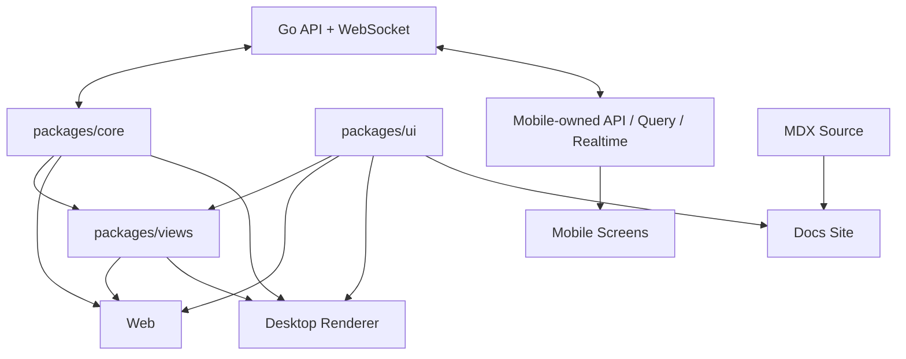

# 跨平台矩阵

活跃贡献者：Naiyuan Qing、Jiayuan Zhang、Bohan Jiang

## 职责

本页用于判断一个应用层改动应该共享、镜像还是保持平台独立。核心原则是：

- Web 与 Desktop 共享产品语义、headless 逻辑、UI primitive 和业务视图；
- Mobile 共享产品语义与少量类型/纯函数，但独立实现 React Native UI、API、Query、store 和 realtime；
- Docs Site 是内容发布应用，不参与登录后的业务 cache；
- Go API 和 WebSocket 是所有产品客户端的权威服务端边界。

依赖版本以 [pnpm-workspace.yaml](../../pnpm-workspace.yaml) 的 catalog 和各应用 `package.json` 为准，不应从某一客户端推断其他客户端。

## 入口

| 平台 | 根入口 | 路由入口 | Provider / shell |
| --- | --- | --- | --- |
| Web | [apps/web/app/layout.tsx](../../apps/web/app/layout.tsx) | Next App Router `apps/web/app/` | [WebProviders](../../apps/web/components/web-providers.tsx) |
| Desktop | [apps/desktop/src/main/index.ts](../../apps/desktop/src/main/index.ts) | [renderer routes.tsx](../../apps/desktop/src/renderer/src/routes.tsx) | [renderer App.tsx](../../apps/desktop/src/renderer/src/App.tsx) |
| Mobile | [apps/mobile/app/_layout.tsx](../../apps/mobile/app/_layout.tsx) | Expo Router `apps/mobile/app/` | [workspace layout](../../apps/mobile/app/%28app%29/%5Bworkspace%5D/_layout.tsx) |
| Docs | [apps/docs/app/[lang]/layout.tsx](../../apps/docs/app/%5Blang%5D/layout.tsx) | Next `[lang]` + catch-all | Fumadocs `DocsLayout` |

## 架构与数据流

### 技术与运行边界

| 维度 | Web | Desktop | Mobile | Docs Site |
| --- | --- | --- | --- | --- |
| Runtime | Browser / Next server | Electron Main + sandboxed preload + renderer | Hermes / React Native | Browser / Next server |
| Framework | Next 16 | Electron 44 + electron-vite 5 | Expo 57 + RN 0.86.3 | Next 16 + Fumadocs |
| Router | Next App Router | 单一 React Router memory router，投影 active tab session | Expo Router Stack + Tabs | `[lang]` + `[...slug]` |
| URL 模型 | `/{workspaceSlug}/...` 可分享 URL | 同形 session URL，但无浏览器地址栏 | `/{workspace}/...` deep-linkable native routes | `/docs[/<lang>]/...` |
| 发布单位 | Web deployment | macOS/Linux/Windows installer | Mobile 独立版本/原生构建 | Docs deployment |

### 共享、状态与数据

| 维度 | Web | Desktop | Mobile | Docs Site |
| --- | --- | --- | --- | --- |
| `packages/core` | 完整使用 | 完整使用 | 仅类型和纯函数；部分纯 schema | 可按声明依赖使用，无业务会话 |
| `packages/ui` | 完整使用 | 完整使用 | 不使用，Mobile 自有 UI | 使用 token / primitive |
| `packages/views` | 共享业务页 | 共享业务页 | 禁止导入 | 不作为产品页面运行时 |
| Server state | 共享 TanStack Query 层 | 共享 TanStack Query 层 | Mobile-owned QueryClient 和 key | Fumadocs source，无产品 Query cache |
| Client state | `packages/core` Zustand | 共享 store + Desktop tab/overlay store | Mobile-local Zustand | theme/locale UI state |
| API client | [packages/core/api/client.ts](../../packages/core/api/client.ts) | 同 Web，token mode | [apps/mobile/data/api.ts](../../apps/mobile/data/api.ts) | 无产品 API client |
| Auth | HttpOnly cookie；旧 token 会话兼容 | Bearer token，经 deep link 登录并同步 daemon | Bearer token + SecureStore | 公开读取 |
| Workspace identity | URL slug → shared singleton | active session slug → shared singleton | route slug → Mobile workspace store | 不适用 |

### Realtime 与导航

| 维度 | Web | Desktop | Mobile |
| --- | --- | --- | --- |
| WebSocket owner | [shared WSProvider](../../packages/core/realtime/provider.tsx) | 同 Web | [Mobile RealtimeProvider](../../apps/mobile/data/realtime/realtime-provider.tsx) |
| 事件消费 | 集中的 `useRealtimeSync` | 集中的 `useRealtimeSync` | per-feature hooks |
| 更新策略 | 可 patch，投影不确定时 invalidate | 同 Web | 蜂窝网络优先 patch，定向 reconnect invalidate |
| 共享导航接口 | Next adapter | tab-session adapter | 不使用 `packages/views` navigation |
| 跨 workspace | router push 到完整 URL | adapter 调用 `switchWorkspace` | Expo route + membership layout |
| 前置流程 | 普通 auth routes | `WindowOverlay`，不是 tab route | Stack routes |

共享导航协议定义在 [packages/views/navigation/context.tsx](../../packages/views/navigation/context.tsx)。Web adapter 在 [apps/web/platform/navigation.tsx](../../apps/web/platform/navigation.tsx)，Desktop adapter 在 [apps/desktop/src/renderer/src/platform/navigation.tsx](../../apps/desktop/src/renderer/src/platform/navigation.tsx)。Mobile 没有共享业务视图，因此直接使用 Expo Router。

## 关键目录与路由

| 要修改的能力 | 首选位置 | 平台 wiring |
| --- | --- | --- |
| API schema、共享 Query/mutation | `packages/core/<domain>/` | Web/Desktop 自动消费；Mobile 镜像需要的部分 |
| Web/Desktop 业务页面 | `packages/views/<domain>/` | Web route + Desktop route |
| 通用 Web/Desktop primitive | `packages/ui/` | 两端消费相同 export |
| Next params、metadata、proxy | `apps/web/app/`、`apps/web/platform/` | 仅 Web |
| Electron IPC、daemon、updater | `apps/desktop/src/main/` + `preload/` + `shared/` | 仅 Desktop |
| Desktop tab/session | [tab-store.ts](../../apps/desktop/src/renderer/src/stores/tab-store.ts) + [tab-coordinator.ts](../../apps/desktop/src/renderer/src/platform/tab-coordinator.ts) | 仅 Desktop |
| Native screen / sheet | `apps/mobile/app/` + `components/` | 仅 Mobile |
| Mobile Query/realtime | `apps/mobile/data/` | 仅 Mobile，语义镜像 Web |
| 文档正文与导航 | `apps/docs/content/docs/` + `meta*.json` | Docs Site |

Web 的工作区路由表可从 [apps/web/app/[workspaceSlug]/(dashboard)](../../apps/web/app/%5BworkspaceSlug%5D/%28dashboard%29/layout.tsx) 的 layout 和各 `page.tsx` 追踪；Desktop 的集中路由表在 [routes.tsx](../../apps/desktop/src/renderer/src/routes.tsx)；Mobile 的 native screen options 集中在 [workspace layout](../../apps/mobile/app/%28app%29/%5Bworkspace%5D/_layout.tsx)。

## 修改指南

### 增加一个跨平台功能

1. 从服务端 endpoint、事件 payload 和产品语义开始，确定 counts、permissions、enum fallback、identity 与导航结果。
2. 在 `packages/core` 增加/修改 schema、Query、mutation 和 cache updater；API JSON 必须 `parseWithFallback`。
3. 在 `packages/views` 实现 Web/Desktop 共用业务页面，导航只调用 `useNavigation()` / `AppLink`。
4. 在 Web 增加 App Router wiring，在 Desktop 增加 workspace session route；如果是 Desktop 前置流程，改为 `WindowOverlay`。
5. Mobile 先执行 [apps/mobile/CLAUDE.md](../../apps/mobile/CLAUDE.md) 预检，再按相同语义独立实现 API、Query、realtime 和原生 UI。
6. 用户可见行为变化时同步 Docs Site 对应语言内容。

### 必须一致的产品规则

- 同一 filter 和分页/去重规则下，Web、Desktop、Mobile 显示相同 count；
- permission、状态 enum 和 transition 不由各端凭感觉重写；
- workspace-scoped Query key 含 workspace id，API 请求携带 workspace slug；
- 服务端 enum switch 有 unknown/default fallback；
- 创建、删除、确认和导航流等待服务端；只对可预测、易回滚、留在当前页面的字段更新做 optimistic patch；
- WebSocket 只更新 Query cache，不把服务端实体镜像到 Zustand。

### 允许不同的地方

- Mobile 使用 native Stack、tab、formSheet、Alert 和 ActionSheet；
- Desktop 使用多标签 session、独立窗口、native notification 和 daemon；
- Web 使用真实 URL、browser tab、RSC 与同源 cookie；
- Docs Site 可以独立升级 Next/Fumadocs，只要共享 token contract 不破坏。

## 测试与验证

| 改动 | 最小验证 |
| --- | --- |
| Web wiring | `pnpm -C apps/web test && pnpm -C apps/web typecheck` |
| Desktop wiring | `pnpm -C apps/desktop test && pnpm -C apps/desktop typecheck` |
| Mobile | `pnpm -C apps/mobile test && pnpm -C apps/mobile typecheck && pnpm -C apps/mobile lint` |
| Docs | `pnpm -C apps/docs test && pnpm -C apps/docs typecheck` |
| 共享 core/views | 对应 workspace test/typecheck，再运行受影响应用测试 |
| 浏览器端到端 | `pnpm exec playwright test` |

根级 `pnpm typecheck/test/lint/build` 覆盖 Web、Desktop、Docs 和共享包，但按 [package.json](../../package.json) 明确排除 Mobile。跨客户端 realtime 变更还需要至少两个客户端互相修改同一实体，检查 patch、reconnect 和 cache side effect。

## 相关页面

- [应用层总览](index.md)
- [Web 应用](web.md)
- [Desktop 应用](desktop.md)
- [Mobile 应用](mobile.md)
- [Docs Site](docs-site.md)
- [系统架构](../overview/architecture.md)
- [模式与约定](../how-to-contribute/patterns-and-conventions.md)
