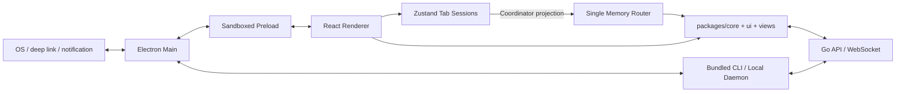

# Desktop 应用

活跃贡献者：Naiyuan Qing、Jiayuan Zhang、Bohan Jiang

## 职责

`apps/desktop` 是 Electron 客户端。它复用 Web 的 headless 业务能力和绝大多数业务视图，同时增加浏览器不能提供的能力：

- 主窗口、独立任务窗口、持久化窗口尺寸和原生导航手势；
- 工作区隔离的多标签 session、固定标签和每标签虚拟历史；
- `multica://` deep link、系统通知、dock/taskbar unread badge；
- bundled Multica CLI、本地 daemon 的安装、认证、启动、恢复、日志和 runtime 探测；
- 自动更新、文件下载、目录选择和受控外链；
- Desktop 专属 runtime、daemon 与 update 设置。

当前关键版本是 Electron `^39.2.6`、electron-vite `^5.0.0`、React Router `^7.6.0`，见 [apps/desktop/package.json](../../apps/desktop/package.json)。

## 入口

Desktop 有三个进程边界：

| 边界 | 入口 | 责任 |
| --- | --- | --- |
| Main process | [src/main/index.ts](../../apps/desktop/src/main/index.ts) | Electron 生命周期、窗口、IPC、deep link、通知、daemon、updater |
| Preload | [src/preload/index.ts](../../apps/desktop/src/preload/index.ts) | 通过 `contextBridge` 暴露经约束的 `desktopAPI`、`daemonAPI`、`updater` |
| Renderer | [src/renderer/src/main.tsx](../../apps/desktop/src/renderer/src/main.tsx) | React root、字体、主题首帧、crash boundary |

Renderer 的应用装配在 [src/renderer/src/App.tsx](../../apps/desktop/src/renderer/src/App.tsx)。它从 preload 同步读取 runtime config、版本、OS、locale 和窗口类型，再初始化共享 `CoreProvider`。Main process 在 app ready 后创建窗口，并装配 auto updater、daemon manager 和本地目录 IPC。

## 架构与数据流



### Main 与 preload

[src/main/index.ts](../../apps/desktop/src/main/index.ts) 注册 single-instance lock 和 `multica` protocol，创建主窗口与独立任务窗口，并校验 renderer 发来的 route context、issue-window 请求、通知 payload 和 auth-session identity。外链和下载都由 Main 审计后交给 OS。

[src/main/renderer-web-preferences.ts](../../apps/desktop/src/main/renderer-web-preferences.ts) 固定 renderer 安全基线：`sandbox: true`、默认 context isolation、无 Node integration；当前因 `file://`/CORS 协调仍显式设置 `webSecurity: false`，这是已记录的安全债务，不应在业务代码中扩散。Preload bundle 由 [electron.vite.config.ts](../../apps/desktop/electron.vite.config.ts) 打包为 sandbox 可加载的单文件，并只向页面暴露命名 API。

[src/main/daemon-manager.ts](../../apps/desktop/src/main/daemon-manager.ts) 管理 Desktop-owned CLI profile、token 同步、daemon lifecycle、health polling、版本切换与恢复策略。Renderer 不直接 spawn 进程，而是调用 preload 暴露的 `daemonAPI`。

### Renderer、标签页与共享视图

[src/renderer/src/App.tsx](../../apps/desktop/src/renderer/src/App.tsx) 根据 auth、runtime config 和 workspace list 决定显示登录、恢复页、主 shell 或独立任务窗口。工作区前置流程不会进入标签路由，而由 `WindowOverlay` 覆盖整个窗口。

标签模型以 [stores/tab-store.ts](../../apps/desktop/src/renderer/src/stores/tab-store.ts) 为事实来源。每个 workspace slug 拥有独立 tab group；tab 保存 URL、pathname 级去重 identity、虚拟 back/forward history 和 scroll/view memento。应用只有一个 memory router，[platform/tab-coordinator.ts](../../apps/desktop/src/renderer/src/platform/tab-coordinator.ts) 把 active session URL 投影到 router，并把任何绕过 coordinator 的 router 变更视为协议错误。实际 host 在 [components/tab-content.tsx](../../apps/desktop/src/renderer/src/components/tab-content.tsx)。

[platform/navigation.tsx](../../apps/desktop/src/renderer/src/platform/navigation.tsx) 把共享 `NavigationAdapter` 操作转换成 tab-store 操作，处理跨工作区切换、固定 tab 打开新 tab 和 transition overlay。工作区 route layout 在 [components/workspace-route-layout.tsx](../../apps/desktop/src/renderer/src/components/workspace-route-layout.tsx) 中解析 slug、设置 API workspace singleton，并自动删除无效的持久化 tab group。

## 关键目录与路由

| 位置 | 作用 |
| --- | --- |
| [src/renderer/src/routes.tsx](../../apps/desktop/src/renderer/src/routes.tsx) | 所有 workspace session routes |
| `/:workspaceSlug/issues`、`projects`、`inbox`、`chat` | 共享核心业务页面 |
| `/:workspaceSlug/agents`、`runtimes`、`skills`、`settings` | Desktop 配置和运行时页面 |
| `/:workspaceSlug/rooms`、`office`、`twins`、`wiki` | 下游业务页面 |
| [components/desktop-layout.tsx](../../apps/desktop/src/renderer/src/components/desktop-layout.tsx) | 原生 toolbar、sidebar、tab bar、canvas 和通知桥 |
| [components/window-overlay.tsx](../../apps/desktop/src/renderer/src/components/window-overlay.tsx) | onboarding、创建 workspace、邀请等前置流程 |
| [stores/window-overlay-store.ts](../../apps/desktop/src/renderer/src/stores/window-overlay-store.ts) | transition overlay 的唯一类型表 |
| [src/shared](../../apps/desktop/src/shared/runtime-config.ts) | Main/preload/renderer 之间的可验证协议类型 |
| [electron-builder.yml](../../apps/desktop/electron-builder.yml) | macOS、Linux、Windows 打包、protocol 和发布资源 |

`/workspaces/new`、`/onboarding`、`/invitations`、`/invite/:id` 在共享导航语义中仍是路径，但 Desktop adapter 会拦截它们并打开 `WindowOverlay`；它们不能加入 `apps/desktop/src/renderer/src/routes.tsx`。普通工作区页面才是 session route。

## 修改指南

1. **先选正确进程。** OS、窗口、下载、spawn、updater 和 daemon 生命周期属于 Main；最小 IPC facade 属于 preload；React UI 和 route wiring 属于 renderer。
2. **不要让 renderer 直接访问 Node/Electron。** 新原生能力先在 Main 实现并验证输入，再在 preload 暴露窄 API，最后由 renderer 调用。
3. **共享产品页面优先放 `packages/views`。** `apps/desktop/src/renderer/src/routes.tsx` 只装配 route param 和 Desktop slot；仅 daemon/runtime/native 差异留在 `apps/desktop`。
4. **所有导航先改 tab session，不直接调用 router。** `tab-store` 是事实来源，`tab-coordinator` 是唯一 router writer；跨 workspace 必须经过 navigation adapter。
5. **区分 session route 与 transition flow。** 前置 workspace 流程扩展 `WindowOverlay` union 和渲染分支，不新增不可见 URL tab。
6. **全窗口页面保留原生拖拽区。** 共享前置视图应把 `DragStrip` 作为首个 flex child；顶部交互元素要使用 `WebkitAppRegion: "no-drag"`。
7. **更改 IPC 时同步协议和测试。** Main、preload、`src/shared`、`apps/desktop/src/renderer/src/env.d.ts` 以及对应测试必须保持一致。

## 测试与验证

[apps/desktop/vitest.config.ts](../../apps/desktop/vitest.config.ts) 使用 jsdom，覆盖 Main 中可纯测的 helper、共享协议、renderer wiring、tab store 和组件。`typecheck` 分别检查 Node 和 renderer 两个 tsconfig。

```bash
pnpm -C apps/desktop test
pnpm -C apps/desktop typecheck
pnpm -C apps/desktop lint
pnpm -C apps/desktop build
```

需要检查打包物时使用 `pnpm -C apps/desktop package`；跨平台产物由 `package:all` 组织，但真实签名、notarization 和发布环境需要对应凭据。涉及 daemon 时优先使用测试 fake CLI，默认测试不得解析或运行用户机器上已登录的 agent CLI。

## 相关页面

- [应用层总览](index.md)
- [Web 应用](web.md)
- [跨平台矩阵](cross-platform-matrix.md)
- [系统架构](../overview/architecture.md)
- [本地开发](../overview/getting-started.md)
- [模式与约定](../how-to-contribute/patterns-and-conventions.md)
