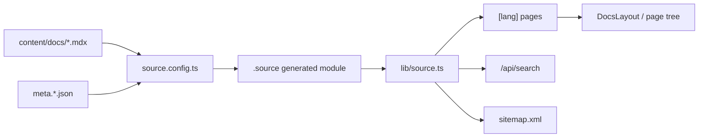

# Docs Site

活跃贡献者：Naiyuan Qing、Bohan Jiang、Jiayuan Zhang

## 职责

`apps/docs` 是部署在 `/docs` base path 下的 Fumadocs 文档站。它负责：

- 从 `content/docs/*.mdx` 生成产品、运维和开发文档；
- 提供 English、简体中文、한국어、日本語 四种语言；
- 为每页生成 sidebar tree、TOC、metadata、canonical 和 `hreflang`；
- 提供 Orama 服务端搜索，并为中文和日文自定义 tokenizer；
- 输出多语言 sitemap；
- 复用 Multica 的语义 token、skin 和部分 UI primitive。

Docs Site 当前使用 Next.js `^15.5.16`、Fumadocs Core/UI `^15.5.2` 和 Fumadocs MDX `^12.0.3`，与使用 Next 16 的 Web 应用不是同一个 Next 版本，见 [apps/docs/package.json](../../apps/docs/package.json)。

## 入口

[apps/docs/app/[lang]/layout.tsx](../../apps/docs/app/%5Blang%5D/layout.tsx) 是文档页面根 layout。它装配字体、`SkinProvider`、Fumadocs `RootProvider`、locale 列表、搜索 endpoint、`DocsLayout`、sidebar footer 和页面树。

构建时 [apps/docs/source.config.ts](../../apps/docs/source.config.ts) 将 `content/docs` 声明为 Fumadocs MDX source；生成模块由 [apps/docs/lib/source.ts](../../apps/docs/lib/source.ts) 载入。`basePath: "/docs"` 和旧中文 URL redirects 定义在 [apps/docs/next.config.mjs](../../apps/docs/next.config.mjs)。

公开 URL 与内部 App Router 的关系：

- English 默认语言隐藏前缀：`/docs`、`/docs/agents`；
- 其他语言保留前缀：`/docs/zh/agents`、`/docs/ko/agents`、`/docs/ja/agents`；
- 内部 `[lang]` route 总是存在；[middleware.ts](../../apps/docs/middleware.ts) 将无 locale 的路径 rewrite 到 `en`，并把显式 `/en/...` redirect 到 canonical 无前缀 URL。

## 架构与数据流



[app/[lang]/page.tsx](../../apps/docs/app/%5Blang%5D/page.tsx) 渲染各语言首页；[app/[lang]/[...slug]/page.tsx](../../apps/docs/app/%5Blang%5D/%5B...slug%5D/page.tsx) 渲染普通 MDX 页面。两者都通过 `source.getPage(slug, lang)` 获取编译后的 body、TOC 和 frontmatter，并用 `DocsLocaleProvider` 保持站内链接的 locale。

[app/api/search/route.ts](../../apps/docs/app/api/search/route.ts) 基于同一 source 建立搜索。中文按 Han code point 切分、日文按 kana/Kanji code point 切分，同时保留 Latin/digit runs；Korean 当前使用 English tokenizer 配置。[app/sitemap.ts](../../apps/docs/app/sitemap.ts) 按 canonical slug 合并语言变体，仅声明 source 中存在的页面。

## 关键目录与路由

| 路由或位置 | 作用 |
| --- | --- |
| [content/docs/index.mdx](../../apps/docs/content/docs/index.mdx) | English 首页 |
| [content/docs/index.zh.mdx](../../apps/docs/content/docs/index.zh.mdx) | 中文首页 |
| [content/docs/meta.json](../../apps/docs/content/docs/meta.json) | English sidebar 顺序 |
| [content/docs/meta.zh.json](../../apps/docs/content/docs/meta.zh.json) | 中文 sidebar 顺序 |
| [content/docs/developers/conventions.zh.mdx](../../apps/docs/content/docs/developers/conventions.zh.mdx) | 中文产品术语与写作约定 |
| [app/[lang]/layout.tsx](../../apps/docs/app/%5Blang%5D/layout.tsx) | 文档 shell、主题和 i18n |
| [app/[lang]/[...slug]/page.tsx](../../apps/docs/app/%5Blang%5D/%5B...slug%5D/page.tsx) | 动态文档页 |
| [app/api/search/route.ts](../../apps/docs/app/api/search/route.ts) | `/docs/api/search` |
| [app/sitemap.ts](../../apps/docs/app/sitemap.ts) | `/docs/sitemap.xml` |
| [lib/i18n.ts](../../apps/docs/lib/i18n.ts) | `en/zh/ko/ja` 和 dot parser |
| [lib/translations.ts](../../apps/docs/lib/translations.ts) | Fumadocs UI chrome 和首页 TSX copy |
| [components/locale-link.tsx](../../apps/docs/components/locale-link.tsx) | locale-aware 站内链接 |
| [components/mermaid.tsx](../../apps/docs/components/mermaid.tsx) | 文档 Mermaid 渲染 |

文件命名使用 Fumadocs dot parser：默认语言是 `page.mdx`，翻译是 `page.zh.mdx`、`page.ko.mdx`、`page.ja.mdx`；目录 metadata 同理使用 `meta.<lang>.json`。

## 修改指南

1. **内容修改从 MDX 开始。** 修改页面正文时编辑 `apps/docs/content/docs/` 下对应语言文件；导航顺序或分组同时更新相应 `meta*.json`。
2. **中文术语遵守 conventions。** Issue 译作“任务”，task 保留英文，Agent/Workspace/Runtime 分别使用“智能体/工作区/运行时”；技术名称保持英文。
3. **翻译文件保持相同 canonical slug。** 不要为翻译发明不同文件路径；locale 由文件后缀表达。
4. **新增 TSX chrome 时补齐四语言 copy。** MDX 正文不应搬进 `apps/docs/lib/translations.ts`；该文件只存搜索、TOC、语言选择等 UI 字符串及首页 TSX copy。
5. **站内链接使用 locale-aware 组件。** 普通 MDX anchor 已映射为 `LocaleLink`；新增自定义组件时也要保留当前语言。
6. **新增页面后检查 metadata 与 SEO。** `docsAlternates` 只把真实存在的本地化 MDX 声明成 `hreflang`；不要生成不存在翻译的 URL。
7. **不要假定 Web 的 Next 配置可直接复制。** Docs 使用 Next 15 和独立 `basePath` middleware，Web 使用 Next 16 proxy 并可反向代理 `/docs`。
8. **共享样式只消费语义 token。** Docs layout 复用 `@multica/ui` 的 skin/token；文档特有 composition 留在 `apps/docs/components`。

## 测试与验证

[apps/docs/vitest.config.ts](../../apps/docs/vitest.config.ts) 使用 Node 环境，重点测试 locale route、static params、canonical/alternate 和站内链接。代表性测试包括 [lib/site.test.ts](../../apps/docs/lib/site.test.ts) 与 [lib/static-params.test.ts](../../apps/docs/lib/static-params.test.ts)。

```bash
pnpm -C apps/docs test
pnpm -C apps/docs typecheck
pnpm -C apps/docs build
```

`postinstall`、`typecheck` 和 `build` 依赖 Fumadocs 生成的 `.source`；根 [turbo.json](../../turbo.json) 通过单独 `mdx` task 避免并发生成竞态。新增/重命名 MDX 后至少检查 English 和一个翻译 URL、sidebar、搜索、canonical 与 `/docs/sitemap.xml`。

## 相关页面

- [应用层总览](index.md)
- [Web 应用](web.md)
- [跨平台矩阵](cross-platform-matrix.md)
- [系统架构](../overview/architecture.md)
- [模式与约定](../how-to-contribute/patterns-and-conventions.md)
