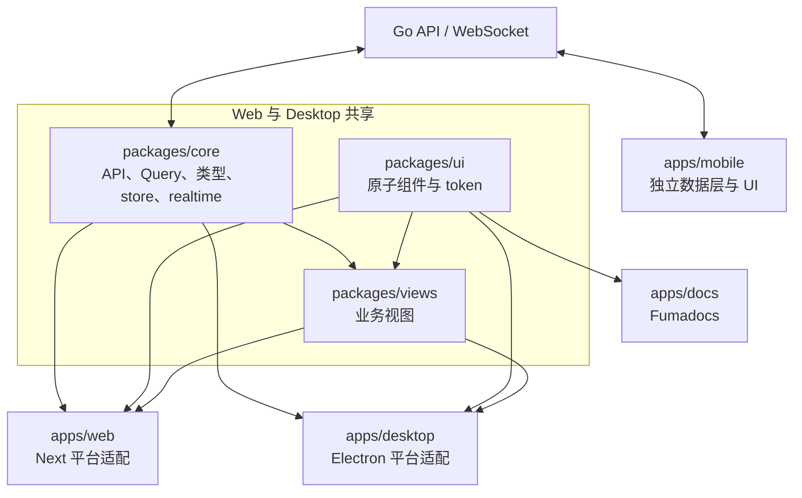

# 应用层总览

活跃贡献者：Naiyuan Qing、Jiayuan Zhang、Bohan Jiang

## 职责

Multica 的应用层由四个可独立运行的 workspace 组成。Web 与 Desktop 面向完整的团队协作场景并共享业务实现；Mobile 面向 iOS 原生交互，保持产品语义一致但独立实现数据层和 UI；Docs Site 发布多语言产品与开发文档。四者都通过 Go API 获取权威业务数据，应用层不直接访问 PostgreSQL。

| 应用 | 主要职责 | 当前技术栈 |
| --- | --- | --- |
| [Web](web.md) | 公开站点、登录/上手引导、工作区产品界面、集成绑定回跳 | Next.js 16、React、App Router |
| [Desktop](desktop.md) | Web/Desktop 共享产品界面、原生窗口/通知/更新、本地 daemon 管理 | Electron 44、electron-vite、React Router |
| [Mobile](mobile.md) | iOS 优先的收件箱、任务、聊天、项目、Room、Wiki 和设置客户端 | Expo SDK 57、React Native、Expo Router |
| [Docs Site](docs-site.md) | `/docs` 下的多语言文档、搜索、SEO metadata 和 sitemap | Next.js 16、Fumadocs |

具体版本和脚本以各应用的 `package.json` 为准：[apps/web/package.json](../../apps/web/package.json)、[apps/desktop/package.json](../../apps/desktop/package.json)、[apps/mobile/package.json](../../apps/mobile/package.json)、[apps/docs/package.json](../../apps/docs/package.json)。

## 入口

| 应用 | 运行入口 | 开发命令 |
| --- | --- | --- |
| Web | [apps/web/app/layout.tsx](../../apps/web/app/layout.tsx) | `pnpm dev:web` |
| Desktop main | [apps/desktop/src/main/index.ts](../../apps/desktop/src/main/index.ts) | `pnpm dev:desktop` |
| Desktop renderer | [apps/desktop/src/renderer/src/main.tsx](../../apps/desktop/src/renderer/src/main.tsx) | 随 Electron 一同启动 |
| Mobile | [apps/mobile/app/_layout.tsx](../../apps/mobile/app/_layout.tsx) | `pnpm dev:mobile` 或 `pnpm ios:mobile` |
| Docs Site | [apps/docs/app/[lang]/layout.tsx](../../apps/docs/app/%5Blang%5D/layout.tsx) | `pnpm dev:docs` |

根脚本由 [package.json](../../package.json) 和 [turbo.json](../../turbo.json) 组织。`pnpm build`、`pnpm typecheck`、`pnpm lint`、`pnpm test` 明确排除了 `@multica/mobile`，所以 Mobile 必须单独验证。

## 架构与数据流



Web 和 Desktop 都在 [packages/core/platform/core-provider.tsx](../../packages/core/platform/core-provider.tsx) 中装配 API、认证、TanStack Query、i18n 与 WebSocket，并通过各自的 navigation adapter 把共享视图接到平台路由。Mobile 只导入 `@multica/core` 的类型和纯函数，自有 API client、Query key、Zustand store 与 realtime updater。完整差异见[跨平台矩阵](cross-platform-matrix.md)。

## 关键目录与路由

| 位置 | 含义 |
| --- | --- |
| [apps/web/app/layout.tsx](../../apps/web/app/layout.tsx) | Web 全局 provider、字体、主题和 runtime URL |
| [apps/web/app/[workspaceSlug]/layout.tsx](../../apps/web/app/%5BworkspaceSlug%5D/layout.tsx) | Web 工作区身份、访问和 onboarding gate |
| [apps/desktop/src/main/index.ts](../../apps/desktop/src/main/index.ts) | Electron 生命周期、窗口、IPC 和 deep link |
| [apps/desktop/src/renderer/src/routes.tsx](../../apps/desktop/src/renderer/src/routes.tsx) | Desktop 工作区 session routes |
| [apps/mobile/app/(app)/[workspace]/_layout.tsx](../../apps/mobile/app/%28app%29/%5Bworkspace%5D/_layout.tsx) | Mobile 工作区 Stack 和全局订阅 |
| [apps/docs/content/docs/meta.zh.json](../../apps/docs/content/docs/meta.zh.json) | 中文文档导航顺序 |
| [packages/core/package.json](../../packages/core/package.json) | 共享 headless 能力的公开 exports |
| [packages/views/package.json](../../packages/views/package.json) | Web/Desktop 共享业务视图的公开 exports |
| [packages/ui/package.json](../../packages/ui/package.json) | 通用 UI 原子和样式 exports |

## 修改指南

1. **先判断行为是否跨 Web/Desktop。** 共享查询、mutation、schema、store 和纯逻辑放入 `packages/core/`；共享业务页面放入 `packages/views/`；原子组件放入 `packages/ui/`。
2. **平台路由与能力留在应用内。** Next.js API 只进 `apps/web/platform/` 或 Web route；Electron IPC、窗口和 React Router 只进 `apps/desktop/`；Expo/RN 代码只进 `apps/mobile/`。
3. **以路由作为工作区身份来源。** Web 的 `[workspaceSlug]`、Desktop 的 session URL、Mobile 的 `[workspace]` 先解析 slug，再为 API header 和 cache namespace 镜像 id/slug。
4. **服务端状态进入 TanStack Query。** Zustand 只保存筛选、草稿、标签页、overlay、偏好等客户端状态。
5. **修改 Mobile 前执行其强制预检。** 先读 [apps/mobile/CLAUDE.md](../../apps/mobile/CLAUDE.md)，核对 Web/Desktop 语义、提出原生交互方案，并取得明确的执行指令。
6. **不要假设各应用依赖版本相同。** Web 和 Docs 当前都是 Next 16，但构建配置独立；Mobile 固定自己的 React/React Native/Expo 版本。

## 测试与验证

按改动范围选择最窄命令：

```bash
pnpm -C apps/web test
pnpm -C apps/desktop test
pnpm -C apps/mobile test
pnpm -C apps/docs test
```

Web/Desktop/Docs 和共享包可再运行：

```bash
pnpm typecheck
pnpm lint
pnpm test
pnpm build
```

涉及跨应用用户流程时运行 `pnpm exec playwright test`；Mobile 不在根级 Turbo 检查内，应额外运行 `pnpm -C apps/mobile typecheck` 和 `pnpm -C apps/mobile lint`。

## 相关页面

- [Web 应用](web.md)
- [Desktop 应用](desktop.md)
- [Mobile 应用](mobile.md)
- [Docs Site](docs-site.md)
- [跨平台矩阵](cross-platform-matrix.md)
- [系统架构](../overview/architecture.md)
- [模式与约定](../how-to-contribute/patterns-and-conventions.md)
