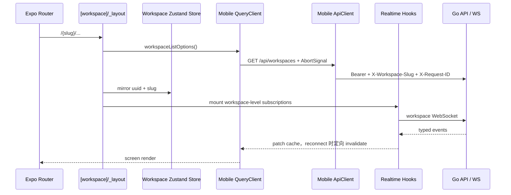

# Mobile 应用

活跃贡献者：oldwinter、Naiyuan Qing、Bohan Jiang

## 职责

`apps/mobile` 是 iOS 优先的原生客户端，覆盖登录、workspace 选择、收件箱、我的任务、工作区任务、聊天、项目、Room、Agent、Pin、Wiki 和账户设置。它与 Web/Desktop 保持 counts、permissions、enum transitions 和 data identity 一致，但不共享 Web 组件、store、Query key 或 realtime updater。

Mobile 的运行时边界是 Expo/React Native：入口由 `expo-router/entry` 提供，当前实际依赖见 [apps/mobile/package.json](../../apps/mobile/package.json)。环境和 bundle identifier 由 [apps/mobile/app.config.ts](../../apps/mobile/app.config.ts) 按 development、staging、production 分流。

### 当前技术栈

版本以 [apps/mobile/package.json](../../apps/mobile/package.json) 为准：

| 项目 | 主版本 | Manifest 声明 |
| --- | --- | --- |
| Expo SDK | 57 | `expo ~57.0.19` |
| Expo Router | 57 | `expo-router ~57.0.18` |
| React Native | 0.86.3 | `react-native 0.86.3` |
| React | 19.2 | `react 19.2.3` |
| NativeWind / Tailwind | 4 / 3.4 | `nativewind ^4.2.6` / `tailwindcss ^3.4.19` |

[apps/mobile/CLAUDE.md](../../apps/mobile/CLAUDE.md) 记录同一组主版本和 Mobile 开发规则。升级任一基础包时，同步更新 manifest、该 baseline 和本页。

## 入口

[apps/mobile/app/_layout.tsx](../../apps/mobile/app/_layout.tsx) 是根 layout，装配：

- Gesture Handler、Safe Area 与 keyboard provider；
- Mobile-owned `QueryClientProvider`；
- React Navigation theme 和 Multica skin；
- auth 初始化与全局 401 清理；
- Expo Router 根 Stack；
- markdown lightbox、StatusBar 和 portal host。

[apps/mobile/app/index.tsx](../../apps/mobile/app/index.tsx) 是启动重定向：未登录进入 `/login`，已登录但没有已恢复 slug 进入 `/select-workspace`，否则进入 `/{slug}/inbox`。Auth-required gate 位于 [app/(app)/_layout.tsx](../../apps/mobile/app/%28app%29/_layout.tsx)，workspace membership gate 位于 [app/(app)/[workspace]/_layout.tsx](../../apps/mobile/app/%28app%29/%5Bworkspace%5D/_layout.tsx)。

## 架构与数据流



### 认证与 API

[apps/mobile/data/auth-store.ts](../../apps/mobile/data/auth-store.ts) 使用 Zustand 管理当前用户，token 保存在 `expo-secure-store`。它只在 401 时清除持久 token；网络错误和 5xx 不会把用户永久登出。根 layout 会在 API singleton 上注册幂等 `onUnauthorized`，统一清 auth、workspace 和 Query cache。

[apps/mobile/data/api.ts](../../apps/mobile/data/api.ts) 是独立的 Bearer-token client。每个请求带 `X-Client-*`、`X-Request-ID` 和当前 `X-Workspace-Slug`，并使用手写 `AbortController` 合并 caller signal 与 30 秒 hard timeout。被 UI 消费的响应通过 Zod 和 `parseWithFallback`；Mobile 不发送 web cookie、CSRF header 或 `credentials: include`。

[apps/mobile/data/query-client.ts](../../apps/mobile/data/query-client.ts) 把 `AppState` 接到 TanStack `focusManager`，把 NetInfo 接到 `onlineManager`。所有 read query 都应把 TanStack Query 提供的 `signal` 继续传给 API；[workspace query](../../apps/mobile/data/queries/workspaces.ts) 是最小范例。

### Realtime

[apps/mobile/data/realtime/realtime-provider.tsx](../../apps/mobile/data/realtime/realtime-provider.tsx) 在 workspace layout 内创建单一 `WSClient`，后台时 pause、回前台时 resume/force reconnect，网络从 offline 变 online 时强制重连。列表级 hooks 在 workspace layout 的 `RealtimeSubscriptions` 中常驻；单记录 hook 挂到对应 screen 并在离开时清理，例如 [use-issue-realtime.ts](../../apps/mobile/data/realtime/use-issue-realtime.ts)。

Mobile 优先用完整 payload 直接 patch cache；payload 不足、投影不确定或 reconnect 时才 invalidate。Updater 绑定 Mobile 自己的 key factory 和 cache shape，不能导入 Web 的 `packages/core/*/ws-updaters.ts`。

## 关键目录与路由

| 路由或位置 | 作用 |
| --- | --- |
| [app/(auth)/login.tsx](../../apps/mobile/app/%28auth%29/login.tsx) | 邮箱登录 |
| [app/(app)/select-workspace.tsx](../../apps/mobile/app/%28app%29/select-workspace.tsx) | 登录后的 workspace 选择 |
| [app/(app)/[workspace]/(tabs)/_layout.tsx](../../apps/mobile/app/%28app%29/%5Bworkspace%5D/%28tabs%29/_layout.tsx) | Inbox、My Issues、Chat 和 More 底部 tabs |
| [app/(app)/[workspace]/issue/[id].tsx](../../apps/mobile/app/%28app%29/%5Bworkspace%5D/issue/%5Bid%5D.tsx) | 任务详情和单记录 realtime |
| `issue/[id]/picker/*`、`project/[id]/picker/*` | 原生 `formSheet` 属性选择器 |
| `new-issue-picker/*`、`new-project-picker/*` | modal 草稿流程的 sheet routes |
| `more/issues`、`more/projects`、`more/rooms`、`more/agents` | More 菜单后的次级列表 |
| `wiki/[id]`、`wiki/[id]/edit`、`wiki/[id]/proposal/*` | Wiki 浏览、编辑与提案审查 |
| [data/queries](../../apps/mobile/data/queries/issue-keys.ts) | Mobile-owned Query key 和 query options |
| [data/mutations](../../apps/mobile/data/mutations/issues.ts) | Mobile-owned mutation 和 optimistic update |
| [components](../../apps/mobile/components/ui/button.tsx) | RN primitive 与 domain UI |
| [lib/use-ws-subscriptions.ts](../../apps/mobile/lib/use-ws-subscriptions.ts) | per-feature subscription 生命周期 helper |

长列表、搜索、表单和键盘内容使用 Expo Router `presentation: "formSheet"`；短确认优先 `Alert.alert`，短 one-of-N 优先 `ActionSheetIOS`。共享 `SHEET_OPTIONS` 和 route 注册集中在 workspace layout。

## 修改指南

1. **先完成强制预检。** 按 [apps/mobile/CLAUDE.md](../../apps/mobile/CLAUDE.md) 阅读 `packages/views/<feature>` 和 `packages/core/<feature>` 的真实实现，列出 counts、permissions、enums、cache side effects 与 navigation parity；向用户说明原生交互方案并等待明确的“开始/执行”指令。
2. **保持产品语义，不复制桌面 UI。** 同一个用户和 filter 下可见数量、权限、状态机和 id/slug 必须一致；容器和手势可以按 iOS 习惯不同。
3. **遵循 `iOS native > RNR > discuss`。** 先复用已有 Mobile pattern，再用系统 API，再用 react-native-reusables；没有合适方案时先讨论，不静默手写新 primitive。
4. **新 endpoint 使用 `fetchValidated` / `fetchValidatedWith`。** Query method 接收 signal，`queryFn` 转发 signal；workspace key 包含 `wsId`。
5. **Realtime mirror 设计而非 import 实现。** Updater 放在被修改 cache 所属 feature，hook 订阅它关心的事件；列表订阅在 workspace layout，record 订阅在 screen。
6. **草稿和 view state 才进 Zustand。** API 实体属于 TanStack Query；workspace store 只是 route identity 的同步镜像。
7. **新增 source 子目录后检查 git ignore。** 根 `.gitignore` 的通用 `data/` 等规则可能吞掉 Mobile 源码。
8. **iOS 构建必须走 wrapper。** [scripts/ios-run.sh](../../apps/mobile/scripts/ios-run.sh) 每次先 `expo prebuild -p ios --no-install`，确保 `apps/mobile/app.config.ts` 的 bundle id、图标和 permission 重写到生成的 `ios/`。

## 测试与验证

[apps/mobile/vitest.config.ts](../../apps/mobile/vitest.config.ts) 只运行 Node 环境的纯 helper 与 headless data tests，不伪装 DOM/RN renderer。`test` 还会执行 `scripts/ios-run.test.sh`。

```bash
pnpm -C apps/mobile test
pnpm -C apps/mobile typecheck
pnpm -C apps/mobile lint
```

根级 `pnpm test/typecheck/lint/build` 排除了 Mobile，不能替代以上命令。原生流程还应在 Simulator 或真机运行对应 `pnpm ios:mobile*` 命令；新增 realtime 行为要从第二个客户端修改同一记录，确认 Mobile 在约 500ms 内更新且不依赖 pull-to-refresh。

## 相关页面

- [应用层总览](index.md)
- [跨平台矩阵](cross-platform-matrix.md)
- [Web 应用](web.md)
- [Desktop 应用](desktop.md)
- [系统架构](../overview/architecture.md)
- [本地开发](../overview/getting-started.md)
- [模式与约定](../how-to-contribute/patterns-and-conventions.md)
