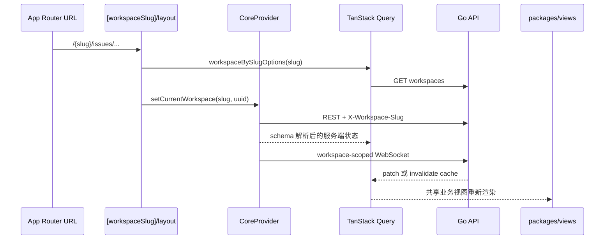

# Web 应用

活跃贡献者：Naiyuan Qing、Jiayuan Zhang、Bohan Jiang

## 职责

`apps/web` 是浏览器产品和公开网站。它同时承载：

- 公开 landing、about、download、use case 与 changelog；
- 邮箱验证码、Google OAuth、邀请和 onboarding；
- `/{workspaceSlug}/...` 下的完整工作区界面；
- Slack、Lark、DingTalk、WeCom、Telegram 的绑定回跳；
- `/personal-wiki` 个人 Wiki；
- `/api`、`/ws`、`/docs` 等到独立后端或 Docs Site 的同源代理。

当前依赖是 Next.js `^16.2.5`、React catalog 和 Fumadocs MDX；开发与构建显式使用 webpack，以规避当前 Fumadocs MDX loader 与 Next 16 Turbopack 的不兼容，见 [apps/web/package.json](../../apps/web/package.json) 和 [apps/web/next.config.ts](../../apps/web/next.config.ts)。

## 入口

全局入口是 [apps/web/app/layout.tsx](../../apps/web/app/layout.tsx)。它完成字体和 HTML metadata、主题首帧脚本、`ThemeProvider`、toast，并把服务端解析出的 locale、API URL 和 WebSocket URL传给 [apps/web/components/web-providers.tsx](../../apps/web/components/web-providers.tsx)。

`WebProviders` 的装配顺序是：

1. [CoreProvider](../../packages/core/platform/core-provider.tsx) 初始化 API client、auth store、TanStack Query、i18n 和 WebSocket；
2. `AppearanceSyncBridge` 同步账户外观偏好；
3. [WebNavigationProvider](../../apps/web/platform/navigation.tsx) 把 Next router 适配成共享 `NavigationAdapter`；
4. Web scroll restoration 包裹实际 route tree。

[apps/web/proxy.ts](../../apps/web/proxy.ts) 是 Next 16 的请求级 `proxy`：处理 runtime rewrite、旧的无 workspace 前缀 URL、根路径跳转和 locale header。构建期/开发期 rewrite 还定义在 [apps/web/next.config.ts](../../apps/web/next.config.ts)。

## 架构与数据流



[apps/web/app/[workspaceSlug]/layout.tsx](../../apps/web/app/%5BworkspaceSlug%5D/layout.tsx) 是工作区边界。它等待 auth 和 workspace list，执行 onboarding gate，把 URL slug 解析为 workspace UUID，并调用 `setCurrentWorkspace`。只有完成解析后才渲染子页面，因此下游 `useWorkspaceId()` 可以依赖上下文已就绪。无法访问的首次 URL 显示 `NoAccessPage`；已经打开过而后被删除/移除的工作区则等待正在进行的导航，避免闪烁错误页。

产品 route 通常是很薄的平台 wiring。例如 [issues/page.tsx](../../apps/web/app/%5BworkspaceSlug%5D/%28dashboard%29/issues/page.tsx) 只处理 URL 同步和 error boundary，然后渲染 `@multica/views` 的 `IssuesPage`；[issues/[id]/page.tsx](../../apps/web/app/%5BworkspaceSlug%5D/%28dashboard%29/issues/%5Bid%5D/page.tsx) 只把 route id 交给共享详情视图。服务端状态、schema 和 realtime 主要来自 `packages/core`，业务 JSX 主要来自 `packages/views`。

Web 默认采用 cookie auth。为旧会话保留的 `multica_token` 会让当前会话暂时运行在 token 模式；这段迁移逻辑集中在 [apps/web/components/web-providers.tsx](../../apps/web/components/web-providers.tsx)。登录和 OAuth callback 分别位于 [login/page.tsx](../../apps/web/app/%28auth%29/login/page.tsx) 与 [auth/callback/page.tsx](../../apps/web/app/auth/callback/page.tsx)，其中也包含向 Desktop 的 `multica://auth/callback` token handoff。

## 关键目录与路由

| 路由或位置 | 作用 |
| --- | --- |
| [apps/web/app/(landing)/layout.tsx](../../apps/web/app/%28landing%29/layout.tsx) | 公开营销站 shell 和 landing locale |
| [apps/web/app/(auth)/login/page.tsx](../../apps/web/app/%28auth%29/login/page.tsx) | 登录、CLI callback、Desktop handoff |
| [apps/web/app/(auth)/onboarding/page.tsx](../../apps/web/app/%28auth%29/onboarding/page.tsx) | 首次使用流程 |
| [apps/web/app/[workspaceSlug]/(dashboard)/layout.tsx](../../apps/web/app/%5BworkspaceSlug%5D/%28dashboard%29/layout.tsx) | 共享 Dashboard shell、搜索、通知和浮动聊天 |
| `/{slug}/issues`、`projects`、`inbox`、`chat` | 日常协作主路由 |
| `/{slug}/agents`、`runtimes`、`skills`、`squads` | 智能体和执行配置 |
| `/{slug}/rooms`、`twins`、`office`、`wiki` | Room、Twin、Office 与团队 Wiki |
| [apps/web/app/personal-wiki/layout.tsx](../../apps/web/app/personal-wiki/layout.tsx) | 不依赖 workspace URL 的个人 Wiki auth gate |
| [apps/web/platform/navigation.tsx](../../apps/web/platform/navigation.tsx) | Next router 到共享导航协议 |
| [apps/web/config/runtime-urls.ts](../../apps/web/config/runtime-urls.ts) | API、WS、Docs runtime URL 解析 |
| [apps/web/features/landing](../../apps/web/features/landing/components/multica-landing.tsx) | Web 专属 landing 实现 |

## 修改指南

1. **共享业务行为不要写进 route。** Query、mutation、schema、cache updater 放到 `packages/core/<domain>/`；页面和业务组件放到 `packages/views/<domain>/`。Web route 只负责 params、search params、metadata、redirect 和平台 slot。
2. **Next.js API 只能留在 Web 平台层。** 共享视图通过 [NavigationAdapter](../../packages/views/navigation/context.tsx) 导航，不得导入 `next/navigation` 或 `next/link`。
3. **新增工作区页面时保留 slug 前缀。** 使用 `/{workspaceSlug}/{section}`，并让页面处于 workspace layout 之下；新的全局根路由还要检查 reserved slug 生成链。
4. **修改 auth 或 rewrite 时同时检查 proxy 与 config。** 请求时动态环境走 `apps/web/proxy.ts`，开发/构建 rewrite 走 `apps/web/next.config.ts`；不要只改其中一侧。
5. **API 响应必须先过 schema。** 网络 JSON 由 `packages/core/api/schema.ts` 的 `parseWithFallback` 和 Zod schema 防御 Desktop/后端版本漂移，页面不直接断言类型。
6. **只在 Web 特有时新增 `apps/web` 组件。** 与 Desktop 相同的产品 UI 应抽到 `packages/views`。

## 测试与验证

[apps/web/vitest.config.ts](../../apps/web/vitest.config.ts) 使用 jsdom，并加载 `apps/web/test/setup.ts`。平台测试应覆盖 proxy、cookies、redirect、search params 和 navigation adapter；共享组件行为应留在 `packages/views` 测试。

```bash
pnpm -C apps/web test
pnpm -C apps/web typecheck
pnpm -C apps/web lint
pnpm -C apps/web build
```

修改共享视图时同时运行对应 `packages/core` / `packages/views` 测试；修改完整浏览器流程时运行 `pnpm exec playwright test`。本地启动默认端口由 `FRONTEND_PORT` 决定，脚本回退到 3000。

## 相关页面

- [应用层总览](index.md)
- [Desktop 应用](desktop.md)
- [跨平台矩阵](cross-platform-matrix.md)
- [系统架构](../overview/architecture.md)
- [模式与约定](../how-to-contribute/patterns-and-conventions.md)
