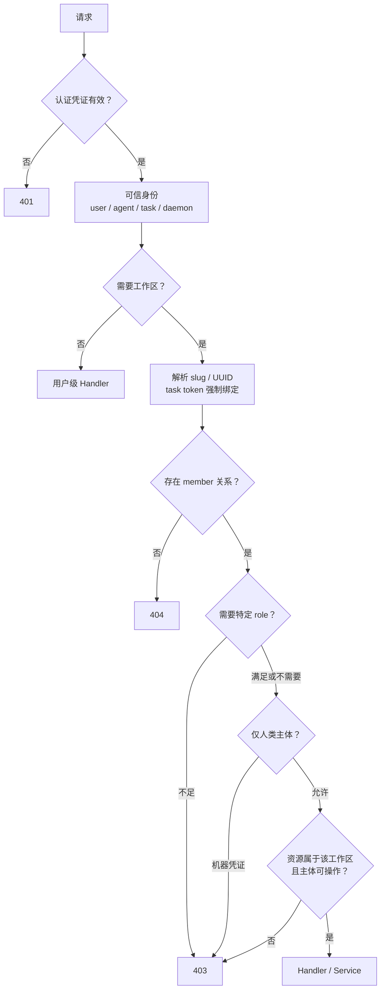
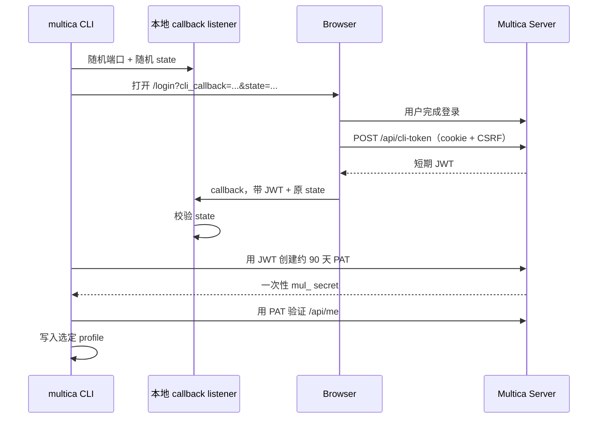

# 认证与授权

活跃贡献者：Bohan Jiang、Multica Eve、Jiayuan Zhang

Multica 把"谁在调用"、"调用哪个工作区"、"是否是成员"、"角色是否足够"和"这个主体能否操作该资源"分成连续门禁。通过 JWT 或 PAT 只完成第一步，不自动获得任何工作区权限。

核心实现：

- [`server/internal/middleware/auth.go`](https://github.com/oldwinter/multica/blob/685cf788777e24724b0d82ffe88c56459341fb2a/server/internal/middleware/auth.go)：用户 API 的 JWT、PAT、task token。
- [`server/internal/middleware/daemon_auth.go`](https://github.com/oldwinter/multica/blob/685cf788777e24724b0d82ffe88c56459341fb2a/server/internal/middleware/daemon_auth.go)：守护进程 API。
- [`server/internal/middleware/workspace.go`](https://github.com/oldwinter/multica/blob/685cf788777e24724b0d82ffe88c56459341fb2a/server/internal/middleware/workspace.go)：工作区成员与角色。
- [`server/internal/handler/auth.go`](https://github.com/oldwinter/multica/blob/685cf788777e24724b0d82ffe88c56459341fb2a/server/internal/handler/auth.go)：验证码、Google OAuth、JWT/cookie、CLI handoff。
- [`server/internal/handler/personal_access_token.go`](https://github.com/oldwinter/multica/blob/685cf788777e24724b0d82ffe88c56459341fb2a/server/internal/handler/personal_access_token.go)：个人访问令牌生命周期。

## 门禁模型



404 用于隐藏调用者不属于的工作区；403 用于身份已知但角色或主体类别不足的情况。具体资源可根据现有 API 契约返回 404 或 403，新增路径应和同域保持一致。

## 凭证类型

| 凭证 | 前缀/载体 | 验证位置 | 解析后的身份 | 主要用途 |
| --- | --- | --- | --- | --- |
| 浏览器 session | `multica_auth` HttpOnly cookie 中的 JWT | `Auth` | 用户 | Web 登录 |
| JWT bearer | `Authorization: Bearer <jwt>` | `Auth` / `DaemonAuth` | 用户 | CLI handoff、兼容客户端 |
| 用户 PAT | `mul_` | 本地 hash + DB/cache | 用户 | CLI、自动化、守护进程兼容 |
| Cloud Node PAT | `mcn_` | Multica Cloud Fleet + 本地用户存在性 | 用户 owner，标记 `cloud_pat` | 云端节点 |
| task token | `mat_` | 本地 hash + task token 记录 | owner 用户 + agent + task + 工作区，标记 `task_token` | 智能体执行期间 |
| daemon token | `mdt_` | 本地 hash + DB/cache | daemon ID + 单一工作区 | `/api/daemon` |
| plugin token | `mpi_` / `mpc_` | Plugin bearer 中间件 | 插件 installation/context | Public Plugin API `/v1` |

本地持久化的 PAT、task token 和 daemon token 只以 hash 参与数据库查找；需要展示的明文 secret 只应在创建/轮换响应中返回一次。日志、错误、测试快照和分析事件都不能包含完整 token。

## 用户认证

### token 来源优先级

普通 `Auth` 中间件按以下顺序取凭证：

1. `Authorization: Bearer ...`
2. `multica_auth` cookie

如果请求带 bearer，就不会退回 cookie。只有 cookie 来源的状态变更请求需要 CSRF 校验；bearer 请求不依赖浏览器 cookie，因此不走同一 CSRF 机制。

认证开始时，中间件先删除调用者提供的 `X-Actor-Source`，之后只由已验证的机器凭证分支重新写入。`X-User-ID`、`X-Agent-ID`、`X-Task-ID` 和 task token 的 `X-Workspace-ID` 同样应视为服务端内部 stamp，不能当作公开凭证。

### 邮箱验证码

公开 endpoint：

```text
POST /auth/send-code
POST /auth/verify-code
```

发送与校验分别有限速。校验成功后服务端查找/创建用户、签发 JWT，并设置认证 cookie 和 CSRF cookie。返回体还可服务非 cookie 客户端，但调用方不能自己构造用户 ID。

### Google OAuth

`POST /auth/google` 接收授权 code 与 redirect URI，服务端向 Google 完成交换并验证身份，再按已验证邮箱查找/创建用户、签发同一套 session。不要接受客户端直接提交的 Google profile 作为认证事实。

登录实现和失败分支见 [`server/internal/handler/auth.go`](https://github.com/oldwinter/multica/blob/685cf788777e24724b0d82ffe88c56459341fb2a/server/internal/handler/auth.go)；cookie/CSRF helper 位于 [`server/internal/auth/`](https://github.com/oldwinter/multica/tree/685cf788777e24724b0d82ffe88c56459341fb2a/server/internal/auth)。

## JWT 与 cookie

JWT 使用 HMAC 签名，`sub` 是用户 UUID，可包含邮箱 claim。中间件必须检查算法类型、签名、有效期和非空 `sub`，再写入可信身份。

浏览器 cookie 认证的安全边界包括：

- auth cookie 为 HttpOnly，脚本不能读取。
- 状态变更请求需要匹配 CSRF token。
- logout 清理认证/CSRF cookie。
- SameSite 和 Secure 策略由部署 URL/环境 helper 统一决定，不要在单个 Handler 自行设置平行 cookie。

公开 OAuth callback 经常没有 session cookie，因此它们依赖签名 state 或提供方签名。不能为了"修复 callback 401"而把 callback 身份改为信任 query/header。

## 个人访问令牌

认证后的用户可管理 `/api/tokens`：

- `GET /api/tokens/`：列出元数据，不返回 secret/hash。
- `POST /api/tokens/`：创建 `mul_` PAT；明文只在这次响应出现。
- `POST /api/tokens/current/renew`：轮换当前 PAT。
- 删除/撤销 endpoint：使 token 失效并清理 cache。

安全属性：

1. 随机 secret 带 `mul_` 前缀，数据库存 hash。
2. 可配置过期时间；cache TTL 会截断到剩余有效期，不能让已过期 token 因 cache 命中继续使用。
3. cache miss 时更新 `last_used_at`；cache hit 跳过数据库查找和该写入，因此 `last_used_at` 最多按 cache TTL 粒度刷新。
4. 续期/撤销必须失效相应 cache；使用 Redis 时多个 API 节点共享/协调失效语义。
5. UI/CLI 必须提示用户在创建时保存 secret，之后无法再次读取。

实现与测试见 [`server/internal/handler/personal_access_token.go`](https://github.com/oldwinter/multica/blob/685cf788777e24724b0d82ffe88c56459341fb2a/server/internal/handler/personal_access_token.go)、[`server/internal/handler/personal_access_token_test.go`](https://github.com/oldwinter/multica/blob/685cf788777e24724b0d82ffe88c56459341fb2a/server/internal/handler/personal_access_token_test.go) 和 [`server/internal/auth/pat_cache.go`](https://github.com/oldwinter/multica/blob/685cf788777e24724b0d82ffe88c56459341fb2a/server/internal/auth/pat_cache.go)。

## CLI 浏览器登录

CLI 登录不是把浏览器 cookie复制到磁盘：



本地 callback 的 state 防止其他页面向监听端口注入凭证。跨机器/SSH 场景可显式配置 callback host，并按 CLI 提示建立隧道。配置文件最终保存 PAT，不保存浏览器 cookie 或验证码。

实现见 [`server/cmd/multica/cmd_login.go`](https://github.com/oldwinter/multica/blob/685cf788777e24724b0d82ffe88c56459341fb2a/server/cmd/multica/cmd_login.go) 和 [`server/cmd/multica/cmd_auth_test.go`](https://github.com/oldwinter/multica/blob/685cf788777e24724b0d82ffe88c56459341fb2a/server/cmd/multica/cmd_auth_test.go)。

## task token 与 actor

服务在 task claim 时签发 `mat_` token，并把它交给守护进程启动的智能体进程。token 记录绑定：

- owner `user_id`
- `agent_id`
- `task_id`
- `workspace_id`

普通 `Auth` 验证后覆盖请求中的 `X-User-ID`、`X-Agent-ID`、`X-Task-ID`、`X-Workspace-ID`，并设置：

```text
X-Actor-Source: task_token
```

这提供两个不变量：

1. 智能体可在授权范围内以 owner 身份创建评论、更新任务等，归因仍可解析为 agent。
2. 客户端不能删除/伪造 agent/task header，也不能通过另一个 slug、query 或 URL 参数跨工作区。

工作区中间件在通用解析和 URL 参数路径上都会再次比较 token 绑定，作为纵深防御。

## Cloud Node PAT

`mcn_` 不查询本地 `personal_access_tokens`：

1. 配置了 Cloud verifier 时，向 Multica Cloud Fleet 校验 token 状态和 owner 绑定。
2. 再确认 owner UUID 对应本地真实用户。
3. 成功后写入 `X-User-ID` 和 `X-Actor-Source: cloud_pat`。
4. verifier 未配置时返回 401，不能退回 JWT/本地 PAT 分支。
5. Cloud 明确拒绝返回 401；Cloud 暂时不可用或响应异常返回 503，告诉调用方可重试而不是丢弃凭证。

`mcn_` 是机器凭证，因此和 task token 一样不能调用人类专属的账号/账单操作。

## 守护进程认证

`/api/daemon` 使用 `DaemonAuth`，只从 bearer header 取 token，不读浏览器 cookie。优先分支：

1. `mdt_` daemon token
2. `mcn_` Cloud Node PAT
3. `mul_` 用户 PAT 兼容
4. JWT 兼容

`mdt_` 解析出 daemon ID 和唯一工作区并放入 context；具体 Handler 还会验证 runtime、task、agent 或 workspace 是否属于这个 daemon 可以访问的范围。用户 PAT/JWT fallback 解析出用户后，则按用户成员关系检查目标工作区。

daemon token 有过期时间，数据库只存 hash，cache TTL 同样受过期时间限制。当前 task claim 路径会为 Remote MCP 签发短期 `mdt_`，工作区撤销流程会删除相应 token 并使 cache 失效；新增签发或撤销路径必须保持同样语义。实现见 [`server/internal/middleware/daemon_auth.go`](https://github.com/oldwinter/multica/blob/685cf788777e24724b0d82ffe88c56459341fb2a/server/internal/middleware/daemon_auth.go)、[`server/internal/handler/daemon.go`](https://github.com/oldwinter/multica/blob/685cf788777e24724b0d82ffe88c56459341fb2a/server/internal/handler/daemon.go) 和 [`server/internal/handler/workspace_revoke.go`](https://github.com/oldwinter/multica/blob/685cf788777e24724b0d82ffe88c56459341fb2a/server/internal/handler/workspace_revoke.go)。

## 工作区成员和角色

认证成功后：

1. 从 URL、slug header/query 或 UUID header/query 选择工作区。
2. 用 `(user_id, workspace_id)` 查询 `member`。
3. 把 member 和规范化工作区 UUID 注入 context。
4. 角色路由检查 `member.Role`。

角色 schema 值保持小写英文：

- `owner`
- `admin`
- `member`

`RequireWorkspaceMember` 允许三个角色；`RequireWorkspaceRole(..., "owner", "admin")` 用于管理动作；仅 owner 的不可逆操作需要更窄检查。前端隐藏按钮只是体验优化，服务端门禁才是授权事实。

## 人类专属门禁

[`server/internal/handler/actor_guards.go`](https://github.com/oldwinter/multica/blob/685cf788777e24724b0d82ffe88c56459341fb2a/server/internal/handler/actor_guards.go) 的 `RequireHumanActor` 明确拒绝：

- `X-Actor-Source: task_token`
- `X-Actor-Source: cloud_pat`

普通 JWT 和 `mul_` PAT 被视为人类等价凭证。该门禁用于账单、订阅、敏感个人 Wiki 写入等必须由人类明确发起的操作，不应全局启用，因为智能体操作任务、评论和聊天是产品能力。

每新增一种机器凭证，都必须：

1. 在认证分支写入新的、服务端控制的 actor source。
2. 同时评审 `RequireHumanActor` 是否应拒绝它。
3. 覆盖伪造入站 header、未知 actor source 和敏感 endpoint 测试。

## WebSocket 与插件认证

- 用户 `/ws` 有独立握手认证、来源检查、PAT 解析和工作区成员检查。修改普通 `Auth` 不会自动更新它。
- daemon WebSocket 位于 `/api/daemon/ws`，先通过 `DaemonAuth`。
- `/v1` Public Plugin API 只接受插件 token，不接受 JWT cookie。
- `/api/plugin-bridge/v1` 接受登录 session，但工作区从 plugin installation 推导，并再次检查当前用户成员关系。

跨传输修改凭证时，必须同时审查 HTTP、用户 WebSocket、daemon WebSocket/RPC 和 plugin bridge。

## 安全修改认证

1. 明确新凭证代表人、智能体、daemon、安装还是 capability，不要只定义 token 格式。
2. 明文只在签发/轮换一次性返回；持久化 hash，日志统一脱敏。
3. 校验签名/随机性、过期、撤销和主体存在性。
4. 定义 cache key、TTL 上限和跨节点失效。
5. 删除调用者伪造的内部身份 header，再写服务端 stamp。
6. 工作区型凭证必须绑定作用域，并在 URL/header 两条路径都防止重协商。
7. 评审 `RequireHumanActor` 和资源级 actor 归因。
8. 明确暂时不可用返回 503，凭证无效返回 401，权限不足返回 403。
9. 覆盖 secret 不回显、过期、撤销、cache hit/miss、跨工作区、伪造 header 和并发轮换。

## 测试

```bash
cd server

# 中间件
go test ./internal/middleware -run 'TestAuth|TestDaemonAuth|TestWorkspace' -count=1

# 登录、PAT、daemon token 和 actor guard
go test ./internal/handler -run 'Test.*(Auth|PersonalAccessToken|DaemonToken|HumanActor)' -count=1

# CLI callback
go test ./cmd/multica -run 'Test.*Auth|Test.*Login' -count=1

cd ..
make test
```

重点测试文件：

- [`server/internal/middleware/auth_test.go`](https://github.com/oldwinter/multica/blob/685cf788777e24724b0d82ffe88c56459341fb2a/server/internal/middleware/auth_test.go)
- [`server/internal/middleware/daemon_auth_test.go`](https://github.com/oldwinter/multica/blob/685cf788777e24724b0d82ffe88c56459341fb2a/server/internal/middleware/daemon_auth_test.go)
- [`server/internal/handler/personal_access_token_test.go`](https://github.com/oldwinter/multica/blob/685cf788777e24724b0d82ffe88c56459341fb2a/server/internal/handler/personal_access_token_test.go)
- [`server/internal/handler/actor_guards_test.go`](https://github.com/oldwinter/multica/blob/685cf788777e24724b0d82ffe88c56459341fb2a/server/internal/handler/actor_guards_test.go)

## 相关页面

- [HTTP API 与中间件](http-api-and-middleware.md)
- [安全模型](../security/index.md)
