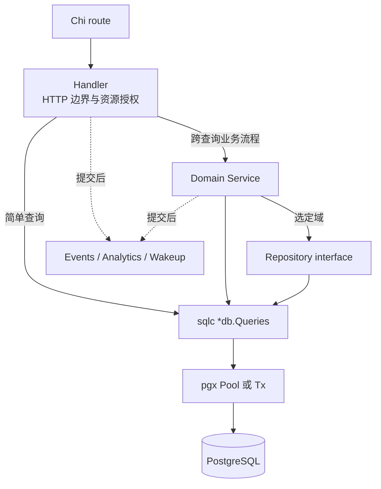
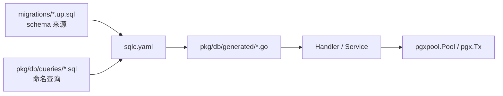

# 数据库与 sqlc

活跃贡献者：Bohan Jiang、Multica Eve、Jiayuan Zhang

Multica 使用 PostgreSQL、pgx v5 和 sqlc。业务 SQL 是手写的，Go 类型与方法由 sqlc 生成；这让查询保持可审查，同时避免手写扫描和参数绑定样板。配置入口是 [`server/sqlc.yaml`](https://github.com/oldwinter/multica/blob/685cf788777e24724b0d82ffe88c56459341fb2a/server/sqlc.yaml)，SQL 位于 [`server/pkg/db/queries/`](https://github.com/oldwinter/multica/tree/685cf788777e24724b0d82ffe88c56459341fb2a/server/pkg/db/queries)，生成结果位于 [`server/pkg/db/generated/`](https://github.com/oldwinter/multica/tree/685cf788777e24724b0d82ffe88c56459341fb2a/server/pkg/db/generated)。

## 分层不是固定四层



代码库的真实约定是：

- **Handler** 负责 HTTP 解码、UUID/分页校验、工作区与资源级授权、状态码和 JSON。
- **Service** 负责需要多个查询、锁、事务、事件和其他领域副作用的流程。
- **sqlc queries** 是主要数据访问边界；简单 CRUD 由 Handler 直接调用是正常做法。
- **Repository** 只在确实需要深接口、替换实现或独立测试的域中使用。task-run review 是现有例子，见 [`server/internal/service/task_run_review_repository.go`](https://github.com/oldwinter/multica/blob/685cf788777e24724b0d82ffe88c56459341fb2a/server/internal/service/task_run_review_repository.go)。

不要为了形式统一给每张表增加 repository，也不要让 Handler 跨越多个相互依赖的写操作而不建立明确事务。

## sqlc 数据流



一条真实的工作区限定查询由 sqlc 注释命名：

```sql
-- name: GetIssueInWorkspace :one
SELECT *
FROM issue
WHERE id = $1
  AND workspace_id = $2;
```

常用返回模式：

- `:one`：单行；无结果通常返回 `pgx.ErrNoRows`。
- `:many`：切片。
- `:exec`：只返回 error。
- `:execrows`：返回影响行数，适合检测乐观锁或条件写入是否命中。

任务查询集中在 [`server/pkg/db/queries/issue.sql`](https://github.com/oldwinter/multica/blob/685cf788777e24724b0d82ffe88c56459341fb2a/server/pkg/db/queries/issue.sql)；调用时以生成参数结构为准。

## `Queries` 与事务

服务启动时通常通过 `db.New(pool)` 创建 `*db.Queries`。生成的 `DBTX` 接口同时由连接池和 `pgx.Tx` 实现；`queries.WithTx(tx)` 返回绑定该事务的查询对象。实现见 [`server/pkg/db/generated/db.go`](https://github.com/oldwinter/multica/blob/685cf788777e24724b0d82ffe88c56459341fb2a/server/pkg/db/generated/db.go)。

典型模式：

```go
tx, err := pool.Begin(ctx)
if err != nil {
    return err
}
defer tx.Rollback(ctx)

qtx := queries.WithTx(tx)

// 所有必须原子提交的读取、锁和写入都使用 qtx。
// ...

if err := tx.Commit(ctx); err != nil {
    return err
}

// 事件、分析上报、网络调用等放在提交后。
return nil
```

`Rollback` 在成功 `Commit` 后返回的错误可忽略，因此可安全放在 `defer` 中。不要在事务中混用原始 `queries` 和 `qtx`；前者可能从连接池获得另一条连接，破坏原子性和锁语义。

## 代表性 service 编排

[`server/internal/service/issue.go`](https://github.com/oldwinter/multica/blob/685cf788777e24724b0d82ffe88c56459341fb2a/server/internal/service/issue.go) 展示了 service 边界应承担的内容：

1. 校验输入和工作区规则。
2. 开始事务。
3. 加载或锁定相关行。
4. 通过 `queries.WithTx(tx)` 执行多个 sqlc 操作。
5. 提交。
6. 提交后发布事件、记录分析并按需要触发 task。

判断是否需要 service，可问三个问题：

- 两个以上写操作是否必须一起成功或失败？
- 是否要在写入前加行锁/ advisory lock，或根据当前状态做领域判断？
- 是否要确保外部副作用只在数据库提交后发生？

任一答案为"是"时，应优先复用或扩展现有 service，而不是在 Handler 堆叠独立查询。

## 工作区隔离

工作区是数据库访问的首要边界：

- 每个工作区查询都应显式接收并过滤 `workspace_id`。
- 只按资源 UUID 查询再依赖"UUID 很难猜"不是授权。
- 更新和删除最好同时匹配资源 ID 与 `workspace_id`。
- 关联查询的所有分支都要保持工作区一致，尤其是 `OR`、CTE、批量 ID 和间接 owner 路径。
- Handler 从工作区中间件 context 获取已经验证的 UUID；资源自身反查工作区的用户级 endpoint 仍要检查成员关系。

代码评审时，先从 SQL 的 `WHERE workspace_id = ...` 开始，再检查 Handler 的成员门禁。两者缺一不可。

## ID、可空值和时间

sqlc 配置把 PostgreSQL 类型映射到 pgx 类型。实践中常见：

- UUID：`pgtype.UUID`
- 可空时间：`pgtype.Timestamptz`
- JSON：`[]byte`、`json.RawMessage` 或配置后的类型
- 数据库枚举/文本状态：生成类型或 `string`

边界字符串到 UUID 的转换必须处理错误。Handler 中用 `parseUUIDOrBadRequest`；service/其他包用 `util.ParseUUID` 并检查 error；可信 sqlc 回环可用现有的 `util.UUIDToString` 或 Handler 内的 `parseUUID` 模式。

对可空值，不要只看零值；检查 pgx 类型的 `Valid`。写 SQL 时明确 `NULL` 与空字符串的业务差异。

## 并发与一致性工具

数据层常用以下机制：

- `SELECT ... FOR UPDATE`：锁定将被判断/修改的行。
- 条件 `UPDATE ... WHERE status = ...`：把状态机前置条件放进单条 SQL。
- `:execrows` / `RETURNING`：判断竞争下谁实际获得状态转换。
- advisory lock：协调跨行、批处理或 migration 全局工作。
- keyset pagination：大型删除/扫描按不可变 ID 前进，避免 offset 漂移和重复排序。
- 单个事务：在无外键设计下原子完成关系校验、子记录清理与父记录写入。

工作区删除是复杂示例：应用持有写栅栏，按 owner keyset 分页清理 task，再按固定自底向上顺序删除其他数据。SQL 见 [`server/pkg/db/queries/workspace_delete.sql`](https://github.com/oldwinter/multica/blob/685cf788777e24724b0d82ffe88c56459341fb2a/server/pkg/db/queries/workspace_delete.sql)。这也说明"不新增外键"不等于"可以忽略关系"。

## 无外键策略

当前规则禁止新增：

- `FOREIGN KEY`
- `REFERENCES`
- `ON DELETE CASCADE`
- `ON UPDATE CASCADE`

关系校验和清理由应用显式完成。需要原子性时，父操作与依赖清理必须使用同一事务。

仓库历史 schema 仍包含旧外键，一些删除代码暂时把它们当兼容安全网。因此正确表述是"新设计与迁移不新增外键，并逐步由应用拥有关系"，不是"数据库从来没有外键"。迁移 216 的 VCS 表是当前策略示例，见 [`server/migrations/216_vcs_integration.up.sql`](https://github.com/oldwinter/multica/blob/685cf788777e24724b0d82ffe88c56459341fb2a/server/migrations/216_vcs_integration.up.sql)。

为无外键关系新增表时，设计必须同时回答：

1. 创建/更新时怎样验证目标存在且属于同一工作区？
2. 父记录删除时，哪些 join/child 记录先删除或置空？
3. 这个清理是否必须和父删除原子提交？
4. 清理路径需要哪些索引才能避免全表扫描？
5. 工作区删除总计划是否覆盖新表？
6. 并发创建子记录时，什么锁或条件写入阻止 orphan？

## 新增或修改查询

1. 在对应 `server/pkg/db/queries/<domain>.sql` 中增加命名查询，优先复用同域文件。
2. 参数必须包含工作区边界；命名参数可用 `sqlc.arg(...)` / `sqlc.narg(...)` 消除歧义。
3. 对状态竞争使用条件写入，并返回足够信息让调用方辨别"不存在"与"前置条件不满足"。
4. 运行 `make sqlc`。
5. 只修改手写 SQL 和调用方，不手改 `pkg/db/generated`。
6. 检查生成 diff：参数顺序、nullable 类型、返回结构和 query 名是否符合预期。
7. 更新 Handler/service，并明确事务内使用 `qtx`。
8. 添加数据库测试，覆盖跨工作区、无结果、并发/状态前置条件和删除清理。

如果表结构也变化，先按 [数据库迁移](migrations.md) 创建新的 up/down 文件，再运行 sqlc。不要修改已经发布的 migration 来让本地生成通过。

## 查询性能

写查询时同时考虑索引和数据规模：

- 用 `EXPLAIN (ANALYZE, BUFFERS)` 验证真实 fixture/生产相似数据上的计划。
- `LIMIT` 只限制输出，不保证前面的扫描或排序有界。
- `OR` 跨多条关系路径可能让 planner 放弃索引；工作区 task 删除因此按单 owner key 分页。
- keyset cursor 必须使用不可变列；可变自然键会让并发重命名后的记录逃过扫描。
- `FOR UPDATE` 除了互斥，还会在 `READ COMMITTED` 下等待后重新检查 `WHERE`。
- 查询需要的新索引必须通过独立的 concurrent-index migration 添加。

连接池压力可从服务每 15 秒记录的 `empty_acquire_delta`、`canceled_acquire_delta` 和平均 acquire 时间判断。不要先把池耗尽误判为单条 SQL 慢；实现见 [`server/cmd/server/dbstats.go`](https://github.com/oldwinter/multica/blob/685cf788777e24724b0d82ffe88c56459341fb2a/server/cmd/server/dbstats.go)。

## 测试与生成检查

```bash
# 重新生成并查看 diff
make sqlc
git diff -- server/pkg/db/generated

# service 的窄测试
cd server
go test ./internal/service -run 'TestIssue|TestTaskRunReview' -count=1

# Handler + 数据库路径
go test ./internal/handler -run 'TestIssue' -count=1

# 完整 Go 测试
cd ..
make test
```

测试参考：

- [`server/internal/service/task_run_review_repository_test.go`](https://github.com/oldwinter/multica/blob/685cf788777e24724b0d82ffe88c56459341fb2a/server/internal/service/task_run_review_repository_test.go)
- [`server/internal/service/issue.go`](https://github.com/oldwinter/multica/blob/685cf788777e24724b0d82ffe88c56459341fb2a/server/internal/service/issue.go)
- [`server/internal/testutil/`](https://github.com/oldwinter/multica/tree/685cf788777e24724b0d82ffe88c56459341fb2a/server/internal/testutil)

运行测试不能替代查看生成 diff和 SQL 执行计划；三者分别验证类型连接、业务行为和规模下性能。
