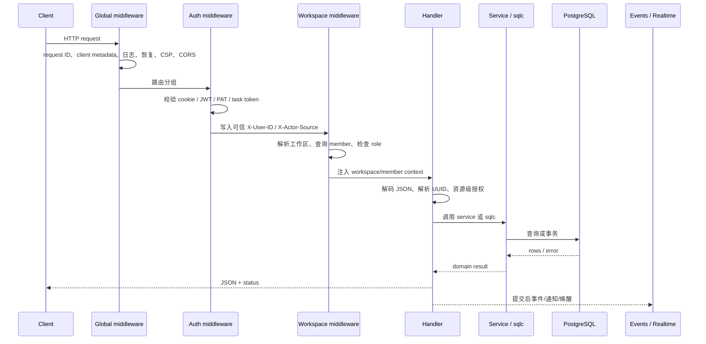
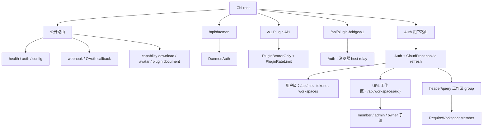

# HTTP API 与中间件

活跃贡献者：Bohan Jiang、Multica Eve、Jiayuan Zhang

HTTP 服务使用 Chi。路由、依赖装配和全局中间件集中在 [`server/cmd/server/router.go`](https://github.com/oldwinter/multica/blob/685cf788777e24724b0d82ffe88c56459341fb2a/server/cmd/server/router.go)；HTTP 边界实现位于 [`server/internal/handler/`](https://github.com/oldwinter/multica/tree/685cf788777e24724b0d82ffe88c56459341fb2a/server/internal/handler)，跨路由中间件位于 [`server/internal/middleware/`](https://github.com/oldwinter/multica/tree/685cf788777e24724b0d82ffe88c56459341fb2a/server/internal/middleware)。

## 一次请求怎样通过服务



认证和工作区中间件只覆盖通用门禁。Handler 仍要验证"这个资源是否属于当前工作区"、"调用者是否能管理目标智能体"等资源级规则。

## 全局中间件顺序

`NewRouterWithOptions` 按以下顺序注册：

1. `chi/middleware.RequestID`
2. `middleware.ClientMetadata`
3. `middleware.RequestLogger`
4. 可选的 HTTP metrics
5. `chi/middleware.Recoverer`
6. `PluginSurfaceHostBoundary`
7. `ContentSecurityPolicy`
8. CORS

Chi 中先注册的 `Use` 包在外层。顺序有实际含义：

- 请求 ID 在日志和错误路径之前生成，并通过 `X-Request-ID` 暴露给浏览器。
- Client metadata 先规范化 `X-Client-*`，日志才能记录可信字段。
- `Recoverer` 把 panic 转为 500，但不代替业务错误处理。
- Plugin surface host 边界和 CSP 在认证之前工作，避免错误页面绕过安全响应头。
- 新增浏览器自定义请求 header 时，必须同步 `corsAllowedHeaders`；否则预检会在请求到达 Handler 前失败。
- 新增浏览器需要读取的响应 header 时，必须同步 `corsExposedHeaders`。

当前允许的关键自定义 header 包括 `Authorization`、`Idempotency-Key`、`If-Match`、`X-Workspace-ID`、`X-Workspace-Slug`、`X-CSRF-Token`、`X-Client-*`、`X-Agent-ID` 和 `X-Task-ID`。CORS 允许凭证，来源由 `CORS_ALLOWED_ORIGINS` 或 `FRONTEND_ORIGIN` 配置；默认来源只用于本地开发。

## 路由拓扑



### 公开路由

公开不等于不验证。每类路由使用自己的凭证：

- `/auth/send-code`、`/auth/verify-code`、`/auth/google` 使用登录材料并按 IP 限速。
- `/api/webhooks/github`、`/api/webhooks/vcs/{connectionId}`、`/api/webhooks/stripe` 在 Handler 内验证提供方签名。
- `/api/webhooks/autopilots/{token}` 把 URL token 当作 capability，并从 trigger 记录推导工作区。
- OAuth callback 从签名且有时效的 state 恢复身份或工作区，不能接受客户端 header 作为事实。
- 附件、头像和插件文档的公开 URL 带绑定资源的签名/capability。
- `/health/realtime` 在配置指标 token 后要求 bearer；未配置时只允许回环来源。

### 用户级路由

最外层 `middleware.Auth` 接受受支持的 session/JWT/PAT，并把可信身份写入请求。`/api/me`、`/api/tokens`、工作区列表和邀请处理不要求当前工作区。

`GET /api/attachments/{id}/download` 也是用户级路由：Handler 先按 attachment 找到工作区，再检查成员关系。这样原生 ``、视频或下载请求不必携带工作区 header。

### URL 工作区路由

`/api/workspaces/{id}/...` 使用 UUID 路径参数：

- 成员组：`RequireWorkspaceMemberFromURL`
- `owner` / `admin` 组：`RequireWorkspaceRoleFromURL(..., "owner", "admin")`
- 少数仅 `owner` 的动作在更窄的组或 Handler 内检查

如果调用者使用 task token，URL 中的工作区还必须等于 token 绑定的工作区。

### header/query 工作区路由

任务、智能体、项目、标签、评论等主业务 API 位于 `RequireWorkspaceMember` 组。中间件解析工作区、加载 `member`，并把两者写入 context。`RequireWorkspaceRole` 在此基础上限制 `owner` / `admin`。

实现见 [`server/internal/middleware/workspace.go`](https://github.com/oldwinter/multica/blob/685cf788777e24724b0d82ffe88c56459341fb2a/server/internal/middleware/workspace.go)。

## 工作区选择规则

### 常规工作区路由

`RequireWorkspaceMember` 的解析优先级是：

1. task token 绑定；服务端认证层写入的 `X-Workspace-ID` 是权威值。
2. `?workspace_slug=...`
3. `X-Workspace-Slug: ...`
4. `?workspace_id=...`
5. `X-Workspace-ID: ...`

slug 会先查询 `workspace` 并转为 UUID。未提供选择器返回 400；slug 不存在返回 404；没有成员关系也返回 404，以免泄漏工作区存在性；角色不足返回 403。

### Handler 级解析

少数不在工作区中间件组内、但仍要解析工作区的 endpoint 使用 `ResolveWorkspaceIDFromRequest`，例如上传入口。它先检查已注入 context，然后按 header slug、query slug、header ID、query ID 的顺序解析。

这两个优先级并不完全相同。因此：

- 浏览器常规调用只发送一个 `X-Workspace-Slug`，不要同时发送互相冲突的 query/header 值。
- CLI/守护进程兼容路径可以使用 UUID。
- 新 Handler 应优先进入 `RequireWorkspaceMember` 路由组并从 context 取 UUID，不应各自发明解析规则。
- task token 永远覆盖客户端提供的所有选择器。

### 示例

```bash
# 推荐：按不可变 slug 选择工作区
curl \
  -H "Authorization: Bearer mul_REDACTED" \
  -H "X-Workspace-Slug: acme" \
  "https://multica.example/api/issues?limit=50"

# CLI/守护进程兼容：按 UUID 选择工作区
curl \
  -H "Authorization: Bearer mul_REDACTED" \
  -H "X-Workspace-ID: 8fb2f0a1-2f1f-4d60-98b0-8c07131be7aa" \
  "https://multica.example/api/agents"

# URL 工作区路由；仍要通过成员检查
curl \
  -H "Authorization: Bearer mul_REDACTED" \
  "https://multica.example/api/workspaces/8fb2f0a1-2f1f-4d60-98b0-8c07131be7aa/vcs/connections"
```

`X-Workspace-ID` 不能授权访问任何工作区；它只决定中间件接下来验证哪条 `member` 关系。

## 身份 header 的信任边界

`X-User-ID`、`X-Actor-Source` 等内部 header 是服务端各层之间的传递机制，不是公共认证协议。认证中间件会删除调用者伪造的值，再根据已验证凭证重新写入：

- `X-User-ID`：当前用户。
- `X-Actor-Source`：人类/session、PAT、task token 等来源。
- `X-Workspace-ID`：task token 情况下由 token 记录强制绑定。

Handler 可以读取这些服务端 stamp，但不要让公开路由直接信任同名入站 header。人类专属路由还需使用 [`RequireHumanActor`](https://github.com/oldwinter/multica/blob/685cf788777e24724b0d82ffe88c56459341fb2a/server/internal/handler/actor_guards.go)。

## Handler 的职责

一个 Handler 通常按以下顺序工作：

1. 读取 `chi.URLParam`、query 和 JSON body。
2. 校验内容类型、必填字段、枚举和长度。
3. 按来源解析 UUID。
4. 从 context 读取工作区/成员，或通过目标资源反查工作区。
5. 执行资源级权限检查。
6. 调用 service 或 sqlc。
7. 把 `pgx.ErrNoRows`、冲突和领域错误映射为稳定 HTTP 状态。
8. 只在事务提交后发布事件或触发外部副作用。

UUID 规则是硬约束：

- 可能是 UUID 或人类编号的资源路径参数，先用 `loadIssueForUser`、`loadAgentForUser` 等 loader 解析，写操作使用返回实体的 `ID`。
- 纯 UUID 边界输入使用 `parseUUIDOrBadRequest`，`ok=false` 立即返回。
- sqlc 返回值和 fixture 等可信 UUID 回环才使用 panic 版 `parseUUID`。
- Handler 外使用 `util.ParseUUID` 并检查 error。

共享响应工具、UUID helper 与主要资源 loader 都可从 [`server/internal/handler/handler.go`](https://github.com/oldwinter/multica/blob/685cf788777e24724b0d82ffe88c56459341fb2a/server/internal/handler/handler.go) 开始查找。

## WebSocket 入口

后端有两个不同的实时入口：

- `GET /ws`：用户实时连接。它独立解析用户凭证、工作区 slug/成员关系，并使用与 HTTP 相同的允许来源和可信代理配置。
- `GET /api/daemon/ws`：位于 `DaemonAuth` 组，面向守护进程。task claim 还可通过 daemon RPC frame 走与 HTTP 相同的 Handler。

不要假设给 HTTP endpoint 加中间件会自动覆盖 WebSocket 握手或 frame。修改鉴权、来源检查或协议时，要同时查看 [`server/internal/realtime/`](https://github.com/oldwinter/multica/tree/685cf788777e24724b0d82ffe88c56459341fb2a/server/internal/realtime)、[`server/internal/daemonws/`](https://github.com/oldwinter/multica/tree/685cf788777e24724b0d82ffe88c56459341fb2a/server/internal/daemonws) 和路由装配。

## Public Plugin API v1

`/v1` 与内部 `/api` 有意分离：

- 只接受 `mpi_` / `mpc_` 插件 bearer token。
- 不接受浏览器 session cookie。
- 使用单独速率限制。
- 对未知路径和不允许的方法返回 v1 契约规定的错误。
- 新增字段必须保持向后兼容；移除/改名需要新版本。

沙箱插件 surface 不直接持有用户凭证。iframe 通过 `MessagePort` 请求 host，host 再带登录 session 和 `X-Multica-Plugin-Installation` 调用 `/api/plugin-bridge/v1`。服务端从 installation 推导工作区并检查成员关系，不能信任 iframe 自报工作区。

契约说明和路径常量见 [`server/pkg/publicapi/v1/README.md`](https://github.com/oldwinter/multica/blob/685cf788777e24724b0d82ffe88c56459341fb2a/server/pkg/publicapi/v1/README.md) 与 [`server/pkg/publicapi/v1/routes.go`](https://github.com/oldwinter/multica/blob/685cf788777e24724b0d82ffe88c56459341fb2a/server/pkg/publicapi/v1/routes.go)。

## 安全新增 endpoint

1. **选信任域。** 公开回调、用户级、URL 工作区、header 工作区、daemon 或 Plugin v1，不能只按 URL 美观决定。
2. **注册最窄门禁。** 先 `Auth`，再成员/角色，必要时再加 `RequireHumanActor`。
3. **确定资源归属。** 查询必须限定 `workspace_id`；若路由无法带工作区，就从资源反查并检查成员关系。
4. **校验边界。** 使用现有 JSON、UUID、分页和错误 helper。
5. **设计重试。** 创建/外部写操作考虑 `Idempotency-Key`、重复 webhook 或网络重试。
6. **维护 CORS。** 浏览器发送/读取新 header 时更新 allow/expose 列表和测试。
7. **更新客户端边界。** 同步 `packages/core` API 方法、Zod schema、畸形响应测试；Mobile 有独立 API 层。
8. **覆盖拒绝路径。** 至少测试未认证、无成员关系、角色不足、跨工作区资源和畸形 UUID。
9. **检查其他传输。** daemon WebSocket RPC、realtime 或插件 bridge 是否也需要同样变化。

## 测试

```bash
# 路由与中间件
cd server
go test ./cmd/server ./internal/middleware

# 一个 Handler 包内测试
go test ./internal/handler -run 'TestIssue|TestWorkspace' -count=1

# 全部 Go 测试
cd ..
make test
```

重点参考：

- [`server/internal/middleware/auth_test.go`](https://github.com/oldwinter/multica/blob/685cf788777e24724b0d82ffe88c56459341fb2a/server/internal/middleware/auth_test.go)
- [`server/internal/middleware/workspace_test.go`](https://github.com/oldwinter/multica/blob/685cf788777e24724b0d82ffe88c56459341fb2a/server/internal/middleware/workspace_test.go)
- [`server/cmd/server/rooms_human_actor_router_test.go`](https://github.com/oldwinter/multica/blob/685cf788777e24724b0d82ffe88c56459341fb2a/server/cmd/server/rooms_human_actor_router_test.go)
- [`server/internal/testutil/`](https://github.com/oldwinter/multica/tree/685cf788777e24724b0d82ffe88c56459341fb2a/server/internal/testutil)

新增 DB-backed Handler 测试时，优先用 `dbfx` fixture 和 `testutil.Call(h, req).Want(status).JSON(&out)`，让测试本身保留产品规则断言。

## 相关页面

- [后端与 API](index.md)
- [认证与授权](authentication-and-authorization.md)
