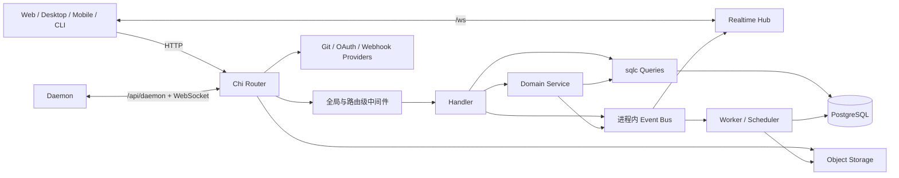

# 后端与 API

活跃贡献者：Bohan Jiang、Multica Eve、Jiayuan Zhang

Multica 后端是一个 Go 服务：Chi 负责 HTTP 路由，pgx/sqlc 访问 PostgreSQL，事件总线与 WebSocket 向客户端和守护进程推送变化，后台 worker 处理 task、通知、自动化和集成工作。进程装配入口是 [`server/cmd/server/main.go`](https://github.com/oldwinter/multica/blob/685cf788777e24724b0d82ffe88c56459341fb2a/server/cmd/server/main.go)，完整路由表位于 [`server/cmd/server/router.go`](https://github.com/oldwinter/multica/blob/685cf788777e24724b0d82ffe88c56459341fb2a/server/cmd/server/router.go)。

## 本节导航

| 页面 | 回答的问题 |
| --- | --- |
| [HTTP API 与中间件](http-api-and-middleware.md) | 请求怎样进入 Chi、路由怎样分组、工作区怎样解析、何时加新 endpoint |
| [数据库与 sqlc](database-and-sqlc.md) | Handler、service、SQL 和生成代码怎样配合，事务边界放在哪里 |
| [数据库迁移](migrations.md) | 迁移 runner 为什么不包事务，怎样安全建索引和演进无外键关系 |
| [认证与授权](authentication-and-authorization.md) | JWT、PAT、task token、守护进程 token、工作区角色怎样组合 |
| [存储与 VCS](storage-and-vcs.md) | 附件怎样上传/下载，Forgejo、Gitea、GitLab 怎样接入和处理 webhook |

## 运行时全景



这张图表示常见路径，不表示所有 Handler 都必须经过 service。当前代码采用混合分层：

- 简单 CRUD 可以由 Handler 直接调用 `*db.Queries`。
- 包含校验、锁、多个 SQL 操作、事件或外部副作用的流程通常进入 `internal/service/`。
- 只有少数域使用显式 repository 接口；不要为保持图形对称而给每个表增加 repository。
- HTTP 响应成功之后发生的事件、分析上报和任务唤醒，不应被误写进数据库事务。

代表性实现可对照 [`server/internal/handler/handler.go`](https://github.com/oldwinter/multica/blob/685cf788777e24724b0d82ffe88c56459341fb2a/server/internal/handler/handler.go)、[`server/internal/service/issue.go`](https://github.com/oldwinter/multica/blob/685cf788777e24724b0d82ffe88c56459341fb2a/server/internal/service/issue.go) 和 [`server/pkg/db/generated/db.go`](https://github.com/oldwinter/multica/blob/685cf788777e24724b0d82ffe88c56459341fb2a/server/pkg/db/generated/db.go)。

## 进程启动与关闭

`main` 的重要顺序是：

1. 加载并校验配置，建立 pgx 连接池。
2. 创建 sqlc queries、事件总线、实时 Hub、Redis 客户端和守护进程 WebSocket Hub。
3. 调用 `NewRouterWithOptions`，把共享依赖装配进 Handler 和 service。
4. 启动事件监听器、后台 worker、调度器、租约监督器和统计采样。
5. 启动 HTTP listener。
6. 收到进程信号后，停止接收新请求，再按依赖顺序停止 scheduler、worker、Hub、Redis 和数据库连接池。

连接池不是 pgx 默认值。服务默认 `MaxConns=25`、`MinConns=5`，环境变量 `DATABASE_MAX_CONNS` / `DATABASE_MIN_CONNS` 优先于 `DATABASE_URL` 中的 `pool_*` 参数；有效配置会在启动时记录。细节见 [`server/cmd/server/dbstats.go`](https://github.com/oldwinter/multica/blob/685cf788777e24724b0d82ffe88c56459341fb2a/server/cmd/server/dbstats.go)。

## 目录地图

```text
server/
├── cmd/
│   ├── server/       # API 进程、路由、健康检查、后台组件装配
│   ├── migrate/      # 生产迁移命令
│   └── multica/      # CLI 命令，包括浏览器登录
├── internal/
│   ├── handler/      # HTTP 边界：解析、响应、资源级授权
│   ├── middleware/   # 身份、工作区、速率、日志、安全响应头
│   ├── service/      # 跨查询编排、事务、领域副作用
│   ├── auth/         # PAT/daemon token cache、云端 PAT 校验
│   ├── storage/      # 本地与 S3 对象存储
│   ├── integrations/ # VCS、GitHub、OAuth 和其他外部集成
│   ├── realtime/     # 用户 WebSocket
│   └── daemonws/     # 守护进程 WebSocket
├── pkg/db/
│   ├── queries/      # sqlc 的手写 SQL
│   └── generated/    # sqlc 生成代码，不手改
├── migrations/       # 有序的 PostgreSQL up/down 迁移
└── sqlc.yaml         # schema、query 和代码生成配置
```

## HTTP 表面

后端不是只有一套统一认证的 `/api`：

| 表面 | 主要凭证 | 例子 |
| --- | --- | --- |
| 存活与就绪 | 无；部分指标另有令牌/回环限制 | `/health`、`/readyz` |
| 登录与公开回调 | 验证码、OAuth state、webhook 签名或 capability | `/auth/*`、`/api/webhooks/*` |
| 用户 API | JWT cookie、JWT bearer、`mul_` PAT、受支持时的 `mcn_` PAT | `/api/me`、`/api/issues` |
| 工作区 URL API | 用户身份 + URL 中工作区 + 成员/角色检查 | `/api/workspaces/{id}/...` |
| 工作区 header API | 用户身份 + slug/UUID + 成员检查 | `/api/issues`、`/api/agents` |
| 守护进程 API | `mdt_` daemon token，部分请求可用有效用户 token | `/api/daemon/...` |
| Plugin Public API v1 | 仅插件 bearer token | `/v1/...` |
| 附件/头像 capability URL | URL 中短期签名 | `/api/attachments/{id}/signed-download` |

Public API v1 是版本化契约，错误格式、未知路径和允许的方法都有独立约束；修改前先读 [`server/pkg/publicapi/v1/README.md`](https://github.com/oldwinter/multica/blob/685cf788777e24724b0d82ffe88c56459341fb2a/server/pkg/publicapi/v1/README.md)。

## 后端不变量

修改代码时先保护这些事实：

1. **先认证，再选工作区，再验证成员关系。** `X-Workspace-ID` 只是选择器，不是权限证明。
2. **每个工作区查询都必须按 `workspace_id` 限定。** 资源 ID 全局唯一也不能替代成员检查。
3. **task token 绑定一个工作区。** 客户端提供的 slug、ID 或 URL 参数不能扩大它的作用域。
4. **人类专属操作必须显式加 `RequireHumanActor`。** 仅有正常用户身份不等于允许自动化执行高风险操作。
5. **新数据库关系不使用外键和级联动作。** 关系检查与依赖清理由应用负责；需要原子性时放进同一事务。
6. **所有新索引都并发创建。** 每个 `CREATE [UNIQUE] INDEX CONCURRENTLY` 独占一个迁移文件。
7. **生成代码不可手改。** SQL 变化后执行 `make sqlc`。
8. **对象存储和数据库是两个系统。** 上传/删除必须考虑其中一个成功、另一个失败的恢复路径。
9. **外部 webhook 不信任 Multica 工作区 header。** 工作区必须从已验证的 trigger、connection 或签名 state 推导。
10. **API 客户端可能落后于服务端。** endpoint 变化还要同步前端 Zod schema 与畸形响应测试。

## 健康检查

- `GET /health` 只证明当前进程存活，并返回 PID、commit 和启动时间。
- `GET /readyz` 与 `GET /healthz` 检查数据库连通性，并核对当前二进制内嵌的每一个迁移名是否出现在 `schema_migrations`。
- 就绪检查按 3 秒缓存，数据库检查超时为 2 秒。
- 迁移账本完整只证明 runner 记录了所有版本；条件迁移可能未执行 SQL，就绪检查也不会逐个检查物理表/索引。

实现与覆盖用例见 [`server/cmd/server/health.go`](https://github.com/oldwinter/multica/blob/685cf788777e24724b0d82ffe88c56459341fb2a/server/cmd/server/health.go) 和 [`server/cmd/server/health_test.go`](https://github.com/oldwinter/multica/blob/685cf788777e24724b0d82ffe88c56459341fb2a/server/cmd/server/health_test.go)。

## 常用开发流程

```bash
# 启动当前 checkout 的隔离开发环境
make up

# 只启动 Go 服务
make server

# 运行 Go 测试
make test

# 修改 pkg/db/queries 或 sqlc schema 后
make sqlc

# 完整检查
make check
```

需要数据库的 Handler 测试应使用 `server/internal/testutil` 的 fixture 和 `testutil.Call`，不要再手写插入/清理样板或 `httptest.NewRecorder` 四件套。先运行最窄的包和测试名，再根据风险扩大到 `make test`。

## 推荐阅读顺序

1. 从 [`main.go`](https://github.com/oldwinter/multica/blob/685cf788777e24724b0d82ffe88c56459341fb2a/server/cmd/server/main.go) 看进程组合。
2. 从 [`router.go`](https://github.com/oldwinter/multica/blob/685cf788777e24724b0d82ffe88c56459341fb2a/server/cmd/server/router.go) 找到路由和中间件。
3. 进入对应的 `internal/handler/<domain>.go`，确认边界校验与资源授权。
4. 若 Handler 调用 service，继续读 `internal/service/<domain>.go` 的事务和副作用。
5. 从 `pkg/db/queries/<domain>.sql` 回到数据模型和 sqlc 生成方法。
6. 数据结构变化最后对照 [数据库迁移](migrations.md) 的约束，不要从修改旧 migration 开始。
