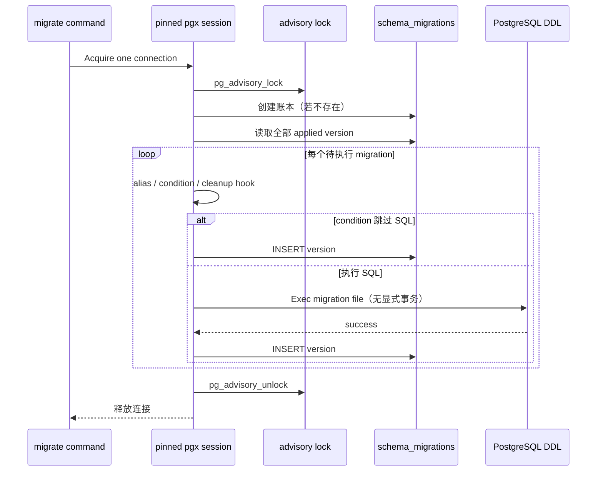

# 数据库迁移

活跃贡献者：Bohan Jiang、Multica Eve、Jiayuan Zhang

生产迁移由 [`server/cmd/migrate/main.go`](https://github.com/oldwinter/multica/blob/685cf788777e24724b0d82ffe88c56459341fb2a/server/cmd/migrate/main.go) 执行，SQL 文件嵌入和版本枚举位于 [`server/internal/migrations/migrations.go`](https://github.com/oldwinter/multica/blob/685cf788777e24724b0d82ffe88c56459341fb2a/server/internal/migrations/migrations.go)。迁移不是通用库的默认行为：为了支持 PostgreSQL `CREATE INDEX CONCURRENTLY`，runner 有意不把每个文件包进事务。

## 文件和账本

迁移文件成对存在：

```text
server/migrations/
├── NNN_descriptive_name.up.sql
└── NNN_descriptive_name.down.sql
```

账本表 `schema_migrations` 以**完整迁移名**为版本键，而不只记录数字前缀。数字前缀主要提供排序和人类分组；仓库历史中可能出现相同前缀的多个迁移，所以不能假设 `NNN` 全局唯一。

已发布迁移的文件名和内容都属于部署历史：

- 不要重命名已经发布的迁移。
- 不要通过编辑旧 SQL 修复生产 schema；新增后续迁移。
- 不要重新使用旧名字表达另一项变更。
- 合并上游/下游历史时保留双方已经发布的 identity，并使用 runner 中明确的 alias 兼容已存在账本。

完整操作说明见 [`server/cmd/migrate/README.md`](https://github.com/oldwinter/multica/blob/685cf788777e24724b0d82ffe88c56459341fb2a/server/cmd/migrate/README.md)。

## runner 执行模型



关键点：

1. **锁是 session 级。** runner 固定一条 pgx 连接，获取 PostgreSQL advisory lock，避免多个部署实例同时迁移。
2. **文件不包在显式事务中。** 这是 concurrent index 的必要条件。
3. **SQL 执行和账本 INSERT 不是同一事务。** SQL 成功后进程若在记账前退出，重试会再次执行该文件。
4. **条件跳过仍会记账。** 账本证明版本顺序被处理，不证明 SQL 一定运行。
5. **每个 concurrent index 文件必须是单条语句。** PostgreSQL 不允许在事务或 multi-command string 中执行 `CREATE INDEX CONCURRENTLY`。

## 为什么所有索引都并发创建

普通 `CREATE INDEX` 会长时间阻塞目标表写入。规则要求所有新索引，包括新表上的索引和唯一索引，都使用：

```sql
CREATE INDEX CONCURRENTLY index_name
ON table_name (workspace_id, created_at);
```

或：

```sql
CREATE UNIQUE INDEX CONCURRENTLY index_name
ON table_name (workspace_id, natural_key);
```

并且这一语句独占一个 `.up.sql` 文件。建表、加列、回填和建索引因此通常拆成多个 migration。对应 down migration 通常使用 `DROP INDEX CONCURRENTLY IF EXISTS ...`，也保持单语句。

错误示例：

```sql
CREATE TABLE example (...);
CREATE INDEX CONCURRENTLY idx_example_workspace ON example (workspace_id);
```

即使两个命令写在同一个文件里，PostgreSQL 也会把它视为 multi-command string，concurrent index 失败。

lint 约束见 [`server/internal/migrations/migrations_lint_test.go`](https://github.com/oldwinter/multica/blob/685cf788777e24724b0d82ffe88c56459341fb2a/server/internal/migrations/migrations_lint_test.go)。

## 失败、重试与无效索引

`CREATE INDEX CONCURRENTLY` 可能失败并留下同名但 `indisvalid=false` 的索引。此时简单重试 `CREATE ... IF NOT EXISTS` 会看到名字已存在而跳过，schema 仍不可用。

runner 为已知 concurrent-index migration 维护**显式 cleanup hook**：

1. 重试前查找同名无效索引。
2. 只删除确认无效的目标索引。
3. 再执行创建语句。

新增 concurrent-index migration 时，必须在 runner 的 cleanup registry 中注册其准确索引名，并添加重试测试。不要写一个"删除所有无效索引"的宽泛清理器；那会越过当前 migration 的所有权边界。

实现与测试：

- [`server/cmd/migrate/main.go`](https://github.com/oldwinter/multica/blob/685cf788777e24724b0d82ffe88c56459341fb2a/server/cmd/migrate/main.go)
- [`server/cmd/migrate/migrate_invalid_index_test.go`](https://github.com/oldwinter/multica/blob/685cf788777e24724b0d82ffe88c56459341fb2a/server/cmd/migrate/migrate_invalid_index_test.go)
- [`server/cmd/migrate/migrate_concurrent_test.go`](https://github.com/oldwinter/multica/blob/685cf788777e24724b0d82ffe88c56459341fb2a/server/cmd/migrate/migrate_concurrent_test.go)
- [`server/cmd/migrate/migrate_mul5999_index_retry_test.go`](https://github.com/oldwinter/multica/blob/685cf788777e24724b0d82ffe88c56459341fb2a/server/cmd/migrate/migrate_mul5999_index_retry_test.go)

由于 SQL 和记账分离，非索引 DDL 同样要考虑"已执行但未记账"重试。可用 `IF EXISTS`、`IF NOT EXISTS`、条件更新或可重复执行的过程设计，不能默认 runner 会回滚。

## 条件迁移

runner 的 condition 用于部署差异：只有目标对象存在/满足条件时才执行 SQL。但无论 SQL 是否跳过，该 migration 都会写入账本。

后果是：

- 后续 migration 不能仅凭账本断言对象存在。
- 接触条件对象的后续 DDL 应使用 `IF EXISTS` / `IF NOT EXISTS` 或等价防御。
- 如果对象缺失会破坏运行时，introducing change 必须记录恢复步骤，不能把 readiness 当修复器。
- 回滚也要能处理"up 被记录但 SQL 从未执行"的情况。

服务就绪检查会确认当前二进制要求的**每个完整 migration 名**都已记录，从而发现较早的漏项；但它不会检查条件 SQL 是否执行，也不会修复表、列或索引。实现见 [`server/cmd/server/health.go`](https://github.com/oldwinter/multica/blob/685cf788777e24724b0d82ffe88c56459341fb2a/server/cmd/server/health.go)。

## 版本 alias

版本 alias 只用于兼容已经存在于真实数据库中的历史迁移名。例如同一已发布变更在分支合并前有两个文件名，runner 可以把旧账本名视为新 identity 已应用。

使用原则：

- alias 必须明确、一对一且有历史依据。
- 不用于掩盖缺失 migration。
- 不用于让不同 SQL 共享一个 identity。
- 添加 alias 时，测试"旧账本升级后不重放"和"全新数据库仍执行 canonical migration"。

参考 [`server/cmd/migrate/migrate_version_alias_test.go`](https://github.com/oldwinter/multica/blob/685cf788777e24724b0d82ffe88c56459341fb2a/server/cmd/migrate/migrate_version_alias_test.go)。

## 无外键关系的迁移

新 migration 不得添加 `FOREIGN KEY`、`REFERENCES` 或级联动作。迁移只定义物理结构；应用层必须拥有：

- 创建/更新时的关系与同工作区校验。
- 父记录删除前的依赖清理。
- 工作区删除时的全域清理。
- 防止并发写入产生 orphan 的锁或条件。
- 清理路径需要的索引。

[`server/migrations/216_vcs_integration.up.sql`](https://github.com/oldwinter/multica/blob/685cf788777e24724b0d82ffe88c56459341fb2a/server/migrations/216_vcs_integration.up.sql) 是无外键表组示例；[`server/pkg/db/queries/vcs.sql`](https://github.com/oldwinter/multica/blob/685cf788777e24724b0d82ffe88c56459341fb2a/server/pkg/db/queries/vcs.sql) 显式删除关联记录。

历史 migration 中仍有旧 `REFERENCES`。不要把现状误写为"整个 schema 没有外键"，也不要因为旧表有外键而在新表延续该模式。旧外键在逐步迁移期间最多是兼容安全网，应用清理计划才是新行为的事实来源。

## 安全创建 schema 变更

### 加表或加列

1. 选择新的描述性完整文件名，同时创建 up/down。
2. up 中只放适合该执行模型的 DDL；考虑 SQL 成功但未记账后的重试。
3. 大表加列先使用无锁/短锁的 expand 形式；回填和强约束分阶段进行。
4. 不新增外键。
5. 表内索引拆到独立 concurrent-index migration。
6. 更新 `pkg/db/queries` 并运行 `make sqlc`。
7. 把新表加入父对象删除、工作区删除和测试 fixture 清理路径。

### 加索引

1. 先用生产相似查询计划确认列顺序、partial predicate 和 include 列。
2. up 文件只含一条 `CREATE [UNIQUE] INDEX CONCURRENTLY`。
3. down 文件只含匹配的 `DROP INDEX CONCURRENTLY IF EXISTS`。
4. 在 migration runner 注册无效索引 cleanup。
5. 添加 lint、失败重试和实际 query plan 相关测试。

### 删除或改名

使用 expand/contract：

1. 先添加新对象，让新旧代码可共存。
2. 部署读写新对象的代码并完成回填。
3. 观察旧客户端/worker 不再依赖旧对象。
4. 用后续 migration 删除旧对象。

不要把多版本服务部署所需的兼容窗口压缩到一个不可逆 migration。

## 执行命令

```bash
# 应用所有待执行 migration
make migrate-up

# 回滚 runner 支持的最近 migration
make migrate-down

# 等价的直接命令
cd server
go run ./cmd/migrate up
go run ./cmd/migrate down
```

`make start`、`make setup` 和 `make test` 会先执行 up migration。`make db-reset` 会删除并重建当前本地环境的数据库，只应用于明确隔离的本地 DB；日常验证新 migration 不需要先 reset。

## 验证清单

```bash
# migration runner 与静态约束
cd server
go test ./cmd/migrate ./internal/migrations -count=1

# 生成 sqlc
cd ..
make sqlc
git diff -- server/pkg/db/generated

# 全部 Go 测试
make test
```

评审 migration 时逐项确认：

- up/down 是否成对且 identity 未复用。
- 是否错误修改了已发布文件。
- 是否新增外键或 cascade。
- 每个索引是否 concurrent、单文件单语句。
- concurrent index 是否注册无效索引 cleanup。
- SQL 是否能处理"已执行、未记账"重试。
- 条件跳过后，下游 DDL 和 down 是否仍安全。
- 应用删除计划和工作区 teardown 是否覆盖新关系。
- sqlc 生成 diff 是否提交且无人手改。
- readiness 所需完整版本是否能被 `AllVersions` 枚举。

## 相关页面

- [数据库与 sqlc](database-and-sqlc.md)
- [迁移与上游同步](../background/migrations-and-upstream-sync.md)
