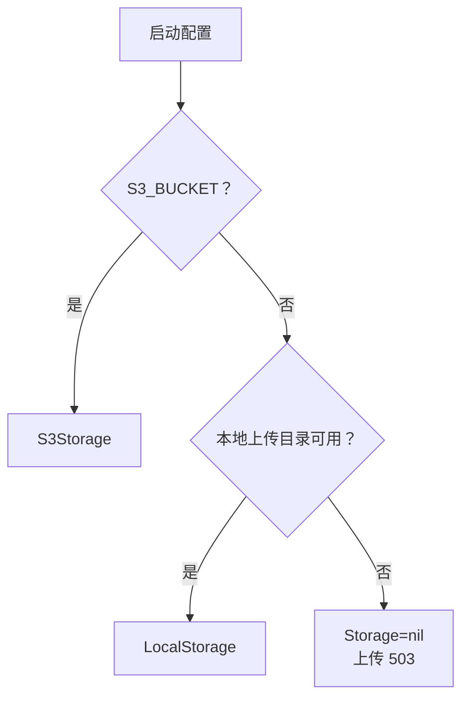
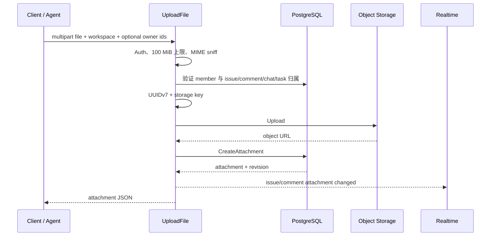
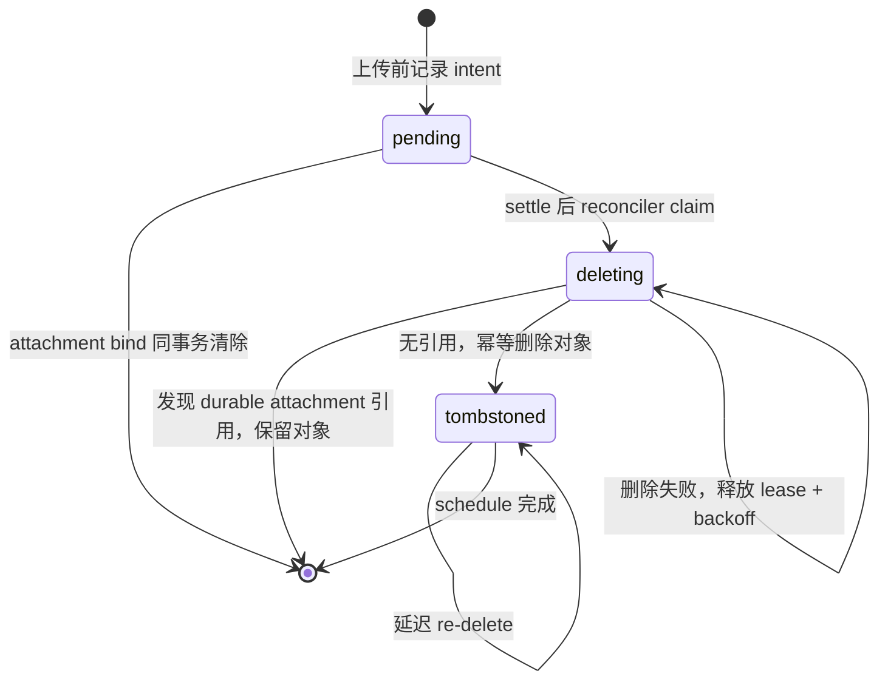
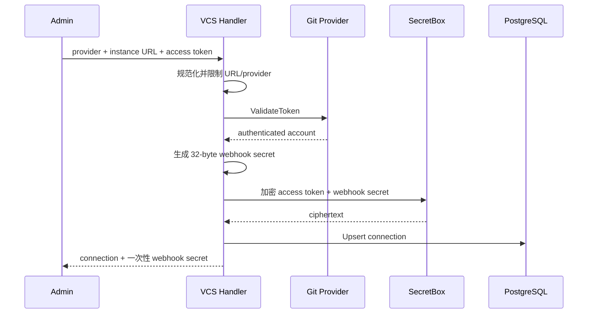
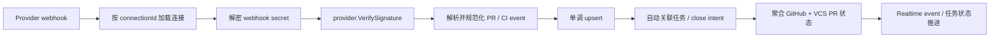

# 存储、附件与 VCS

活跃贡献者：Bohan Jiang、Multica Eve、Jiayuan Zhang

本页覆盖两个外部系统边界：

- 对象存储与附件元数据：S3 兼容后端或本地文件系统。
- token 型 Git 提供方：Forgejo、Gitea、GitLab。

两者共同的工程难点是：数据库与外部系统不能形成单一原子事务。代码必须明确处理"一边成功、另一边失败"、重试、幂等和清理。

## 存储后端

通用接口定义在 [`server/internal/storage/storage.go`](https://github.com/oldwinter/multica/blob/685cf788777e24724b0d82ffe88c56459341fb2a/server/internal/storage/storage.go)，实现包括：

- [`server/internal/storage/s3.go`](https://github.com/oldwinter/multica/blob/685cf788777e24724b0d82ffe88c56459341fb2a/server/internal/storage/s3.go)：AWS S3 与兼容 endpoint。
- [`server/internal/storage/local.go`](https://github.com/oldwinter/multica/blob/685cf788777e24724b0d82ffe88c56459341fb2a/server/internal/storage/local.go)：本地文件系统。

服务启动时按顺序选择：

1. `S3_BUCKET` 已配置时创建 S3 backend。
2. 否则尝试本地 backend。
3. 两者都不可用时 `Storage=nil`，上传返回 503。



S3 支持：

- 默认 AWS credential chain，也可使用环境 credential。
- 自定义 `AWS_ENDPOINT_URL`，适配 MinIO、R2、B2、Wasabi 等。
- endpoint 模式下默认 path-style，可由 `S3_USE_PATH_STYLE` 调整。
- `S3_CDN_DOMAIN` 作为返回对象 URL 的优先域名。
- 私有对象的 presigned GET。

本地存储把临时文件完整写入并同步后再原子 rename 到目标路径，避免读者看到部分内容。路径必须经过 key 规范化，不能允许 `..` 或绝对路径逃出上传根目录。原子性测试见 [`server/internal/storage/local_atomic_test.go`](https://github.com/oldwinter/multica/blob/685cf788777e24724b0d82ffe88c56459341fb2a/server/internal/storage/local_atomic_test.go)。

## Storage 接口能力

基础 `Storage` 提供上传、读取、删除、URL 与 key 转换，并要求：

- `ObjectURL`：上传前按配置确定未来 URL，供跨系统 ledger 使用。
- `DeleteObject`：返回删除错误，供 reconciler 持久化重试，而不是只记录日志。

下载签名不是每个 backend 的硬要求，而是可选 capability：`Presigner` 生成带 TTL 的 GET URL，`DownloadPresigner` 还能指定 `Content-Disposition`，区分内联预览和强制下载。调用方应通过接口断言使用可选能力，并提供 proxy fallback；不要把 S3 类型判断散落到 Handler。

## 附件上传

入口是认证用户路由 `POST /api/upload-file`，实现见 [`server/internal/handler/file.go`](https://github.com/oldwinter/multica/blob/685cf788777e24724b0d82ffe88c56459341fb2a/server/internal/handler/file.go)。



### 约束

- 整个 multipart body 通过 `MaxBytesReader` 限制为 100 MiB。
- Handler 读取前 512 字节进行 `http.DetectContentType`，并对 SVG、CSS、JavaScript、JSON、WASM 等已知 sniff 误判使用扩展名修正。
- 不信任客户端提交的 content type。
- UUIDv7 同时作为 attachment ID 和对象文件名主体；只保留原扩展名。
- 工作区 key 形如 `workspaces/{workspaceUUID}/{uuidv7}.{ext}`；无工作区的头像等用户上传使用 `users/{userUUID}/...`。
- 有工作区时先验证成员关系，再上传。
- `issue_id`、`comment_id`、`chat_session_id` 必须属于同一工作区。
- `task_id` 只允许 `mat_` task token；表单 task 必须等于 token 绑定 task、agent 必须一致，且 task 必须关联聊天会话。

示例：

```bash
curl -X POST \
  -H "Authorization: Bearer mul_REDACTED" \
  -H "X-Workspace-Slug: acme" \
  -F "file=@./design.png" \
  -F "issue_id=90e8bf3e-e927-4edf-84ec-b61d325aec2f" \
  https://multica.example/api/upload-file
```

### 两系统失败窗口

普通附件路径先上传对象，再创建数据库 attachment。如果对象上传成功但 DB 写入失败，当前 Handler 会记录错误，并返回可用对象链接和空 attachment ID，而不是删除刚上传的对象。

这意味着：

- 客户端不能把空 ID 当作可管理 attachment。
- 运维上可能出现无 DB 元数据对象。
- 修改此行为时不能简单反转顺序；"先插 DB 再上传"只会把问题变成悬空 DB row。
- 需要可靠收敛的新异步上传流，应采用 intent ledger/reconciler，而不是假设对象存储与 PostgreSQL 可以一起提交。

## 附件元数据与授权

`attachment` 记录保存：

- 工作区和上传者类型/ID。
- 原文件名、服务端识别 MIME、字节数、对象 URL。
- 可选 issue、comment、chat session、chat message、task 关联。
- revision 信息，用于实时更新。

读取和写入必须同时限定 attachment ID 与工作区。主要路由：

| 路由 | 门禁 | 行为 |
| --- | --- | --- |
| `GET /api/issues/{id}/attachments` | Auth + 工作区 member + issue loader | 列出任务附件 |
| `GET /api/attachments/{id}` | Auth + 工作区 member | 元数据与临时下载 URL |
| `DELETE /api/attachments/{id}` | Auth + 工作区 member +资源检查 | 删除记录和对象 |
| `GET /api/attachments/{id}/download` | Auth；Handler 从 attachment 反查工作区 | redirect/presign/proxy |
| `GET /api/attachments/{id}/signed-download` | URL capability | 原生资源加载 |

下载 endpoint 之所以不全部要求工作区 header，是因为 ``、视频、Electron 原生下载和 mobile webview 通常无法附加 `X-Workspace-Slug`。这不表示下载跳过授权：认证版本从 attachment 反查工作区并查成员；公开版本要求短期且绑定单个 attachment 的 HMAC capability。

## 下载 URL 模式

附件响应中的 URL 含义不同：

- `url`：对象存储原始 URL。私有部署中可能无法匿名访问。
- `download_url`：当前响应可使用的下载/预览 URL，可能短期有效，不能持久化。
- `attachment_download_url`：强制下载 disposition 的临时 URL，只在单附件响应按能力提供。
- `markdown_url`：可长期写入评论/聊天 Markdown 的稳定地址，绝不携带会过期的签名。

解析模式包括：

1. **CloudFront**：服务端 signer 为对象 URL 签名，默认 TTL 30 分钟。
2. **Presign**：S3 backend 生成短期 GET URL。
3. **Proxy**：Go 服务读取对象并带安全响应头返回。
4. **Auto**：按 CloudFront、presigner 和部署配置选择。

带 `stable_attachment_urls` 客户端 capability 的列表请求可让 `download_url` 返回稳定 `/api/attachments/{id}/download`，减少列表里大量重复签名。单附件 endpoint 再把稳定 URL 兑换为适合原生媒体元素的临时 URL。

持久化 Markdown 时只使用 `markdown_url`。若 storage URL 是无签名的持久公开 CDN URL，可直接使用；CloudFront 私有签名、S3 presign、无公开域的本地/S3 都使用 `MULTICA_PUBLIC_URL` 下的稳定 attachment endpoint。

## 预览与响应头

代理预览对文本内容设 2 MiB 内存上限；更大文本返回 413，让客户端转为下载。HTML、SVG、PDF 等主动内容必须带隔离/下载相关安全 header，避免同源脚本执行或 frame 能力升级。

本地 `/uploads/*` 也通过 Handler 服务，而不是裸 `http.FileServer`，确保和 attachment 下载使用相同预览响应头。头像是另一条 capability 路由：签名覆盖 storage key，只允许图像和 avatar 类对象。实现见 [`server/internal/handler/avatar.go`](https://github.com/oldwinter/multica/blob/685cf788777e24724b0d82ffe88c56459341fb2a/server/internal/handler/avatar.go)。

## Channel media intent ledger

聊天渠道接收媒体时，下载来源、对象上传和 attachment 绑定跨越网络、对象存储与数据库。为收敛失败，系统在上传前写 `channel_media_pending_object`：



不变量：

1. intent 必须在 PUT 前持久化。
2. attachment bind 与清除 pending row 在同一数据库事务。
3. reconciler 先把 row 从 `pending` claim 为 `deleting`，再检查引用；claim 后新 bind 不能复活该 key。
4. 对象删除在数据库事务外执行，并受独立超时控制，不能持有连接/行锁等待存储网络。
5. 每次状态更新都比较 lease token；过期 worker 不能覆盖新 owner。
6. 删除成功后仍保留 tombstone 并按 15 分钟、1 小时、6 小时、24 小时扩大的计划重复删除，处理已放弃 PUT 在 DELETE 后才落盘的情况。
7. 每次 re-delete 前重查引用；保留被持久 attachment 引用的对象优先于回收 orphan。
8. settle、lease、backoff 时间由 PostgreSQL `now()` 计算，避免多副本时钟漂移。

reconciler 代码与测试：

- [`server/internal/service/channel_media_reconciler.go`](https://github.com/oldwinter/multica/blob/685cf788777e24724b0d82ffe88c56459341fb2a/server/internal/service/channel_media_reconciler.go)
- [`server/internal/service/channel_media_reconciler_test.go`](https://github.com/oldwinter/multica/blob/685cf788777e24724b0d82ffe88c56459341fb2a/server/internal/service/channel_media_reconciler_test.go)
- [`server/internal/service/issue_channel_media_test.go`](https://github.com/oldwinter/multica/blob/685cf788777e24724b0d82ffe88c56459341fb2a/server/internal/service/issue_channel_media_test.go)

工作区删除不会直接丢掉这份跨系统账本，而是把 row 推到 `deleting`，由 reconciler 幂等清理对象后删除 ledger。

## 安全修改存储

1. 保持 `Storage` 基础接口小，把 presign、错误可见删除等作为明确 capability。
2. key 必须由服务端生成并限定工作区/用户前缀；不要接受客户端完整路径。
3. 在对象 I/O 前完成成员、资源归属和 task 绑定检查。
4. 不信任 MIME、文件名或 URL；响应时转义 filename 并设置安全 disposition。
5. 区分临时 URL 与持久 URL；签名 URL 不写入 Markdown/数据库长期内容。
6. 跨 DB/对象写入先画出每个失败窗口，再选择补偿删除、intent ledger 或 reconciler。
7. 删除必须幂等；后台重试要有 lease、退避、超时和指标。
8. 新 backend 覆盖 `KeyFromURL`、自定义 endpoint、URL 编码、原子写、范围读取和路径穿越测试。

## VCS 集成边界

`internal/integrations/vcs` 只处理 token 型提供方：

- Forgejo
- Gitea
- GitLab

GitHub 不使用这套 adapter。GitHub App installation、签名和 check suite 模型不同，保留在独立 Handler 中。

抽象定义在 [`server/internal/integrations/vcs/vcs.go`](https://github.com/oldwinter/multica/blob/685cf788777e24724b0d82ffe88c56459341fb2a/server/internal/integrations/vcs/vcs.go)，提供方实现是 [`server/internal/integrations/vcs/forgejo.go`](https://github.com/oldwinter/multica/blob/685cf788777e24724b0d82ffe88c56459341fb2a/server/internal/integrations/vcs/forgejo.go) 和 [`server/internal/integrations/vcs/gitlab.go`](https://github.com/oldwinter/multica/blob/685cf788777e24724b0d82ffe88c56459341fb2a/server/internal/integrations/vcs/gitlab.go)。Gitea 与 Forgejo wire format 相同，复用同类 adapter。

## 配置与连接

VCS 有两个部署门禁：

1. 产品/部署是否启用该集成。
2. 服务端 secretbox 加密 key 是否配置。

关闭时列表返回 `available=false`，webhook 对外表现为 404；启用但缺少加密能力时，管理操作不能继续。不要在没有持久加密 key 时降级为明文 token。

工作区路由：

| 动作 | 权限 |
| --- | --- |
| 列出 connection | 任意 member；响应包含 `can_manage`，不含 secret |
| connect/reconnect | `owner` 或 `admin` |
| rotate webhook secret | `owner` 或 `admin` |
| delete connection | `owner` 或 `admin` |

connect 流程：



重连同一工作区/instance URL 会原地更新 provider、账号、token 和 webhook secret。访问 token 永不返回；webhook secret 只在 connect/rotate 响应返回一次，用户需把它配置到 Git 提供方。

实现见 [`server/internal/handler/vcs.go`](https://github.com/oldwinter/multica/blob/685cf788777e24724b0d82ffe88c56459341fb2a/server/internal/handler/vcs.go)。

## 提供方 adapter

每个 `Provider` 只实现真正不同的部分：

- `Kind`
- 从 header 分类事件
- 验证 webhook 签名
- 解析 PR/MR payload
- 解析 commit status/pipeline payload
- 调用 provider API 验证 access token 并返回账号

Forgejo/Gitea 使用 `X-Gitea-Signature` 的 HMAC-SHA256；GitLab 使用常量时间比较 `X-Gitlab-Token`。解析后统一为：

```text
PullRequestEvent
  state: open | closed | merged | draft

CIStatusEvent
  state: passed | failed | pending
```

GitLab merge request 和 Forgejo/Gitea pull request 进入同一共享镜像逻辑。未知事件返回 202 但不处理，避免提供方不断把未建模事件标记为失败。

## webhook 数据流

公开入口是 `POST /api/webhooks/vcs/{connectionId}`：



工作区、provider 和 secret 都从 connection 记录得到；不能使用 webhook 请求带来的 `X-Workspace-*`。

PR 镜像会从标题、正文和分支提取任务编号，区分普通引用与 close-intent。终态事件到达后冻结 close intent，避免旧的 open/redelivery 改写语义。一个任务可同时关联 GitHub 和 token 型 VCS PR，因此自动完成判断聚合两套表：没有 open/draft PR，且至少一个 merged close-intent 才推进。

CI 镜像按 `(connection, sha, context)` 保存规范化状态，并只聚合当前 PR head SHA。

## 乱序与重复投递

webhook 必须假设至少一次、乱序投递：

- PR unique key 是 `(connection_id, repo_owner, repo_name, pr_number)`。
- PR mutable 字段只有 incoming `pr_updated_at >= persisted pr_updated_at` 时更新。
- commit status unique key 是 `(connection_id, sha, context)`，同样按 provider event timestamp 单调更新。
- payload 没有时间时才使用 ingestion time。
- shared Handler 在写 link metadata 前再比较已持久 PR 时间，防止旧事件重写 `reference_only` / `close_intent`。
- upsert、link 和状态推进都要可重复执行。

SQL 见 [`server/pkg/db/queries/vcs.sql`](https://github.com/oldwinter/multica/blob/685cf788777e24724b0d82ffe88c56459341fb2a/server/pkg/db/queries/vcs.sql)，共享 webhook 逻辑见 [`server/internal/handler/vcs_webhook.go`](https://github.com/oldwinter/multica/blob/685cf788777e24724b0d82ffe88c56459341fb2a/server/internal/handler/vcs_webhook.go)。

## VCS 无外键清理

VCS 表不依赖 cascade。删除 connection 时，一条受工作区限制的 CTE 按顺序删除：

1. `issue_vcs_pull_request`
2. `vcs_commit_status`
3. `vcs_pull_request`
4. `vcs_connection`

目标 CTE 同时匹配 connection ID 和 `workspace_id`，传错工作区只能 no-op，不能清理另一租户。整个语句原子提交。

新增 VCS 子表时必须同步：

- connection 删除查询。
- 工作区总删除计划。
- 必要索引。
- 测试 fixture 清理。

schema 来源见 [`server/migrations/216_vcs_integration.up.sql`](https://github.com/oldwinter/multica/blob/685cf788777e24724b0d82ffe88c56459341fb2a/server/migrations/216_vcs_integration.up.sql)。

## 新增或修改 VCS provider

1. 只有认证/事件模型确实可归一化时才加入 `vcs.Provider`；GitHub 级别的差异应保留独立集成。
2. 定义稳定 `Kind`，实现 token 验证、签名、事件分类和两个解析器。
3. 使用原始 body 验证签名，再解析 JSON。
4. 明确部署允许连接的网络范围；私有实例支持不能无意扩大为不受控的网络探测。复用现有 URL 规范化与 HTTP client，并限制 redirect 和请求时长。
5. 将 provider 状态映射到既有规范值，不让 provider 私有状态泄漏进共享 SQL。
6. 提供真实 payload fixture，覆盖签名错误、畸形 JSON、未知事件、PR 终态和 CI 乱序。
7. 验证 reconnect、secret rotate、一次性 secret 响应和无外键删除。
8. 如果增加可变字段，把 monotonic guard 扩展到该字段，不要只更新 Go struct。

## 测试

```bash
cd server

# 对象存储和附件
go test ./internal/storage -count=1
go test ./internal/handler -run 'Test.*(File|Attachment|Avatar)' -count=1
go test ./internal/service -run 'Test.*ChannelMedia' -count=1

# VCS adapter、管理 API 和 webhook
go test ./internal/integrations/vcs -count=1
go test ./internal/handler -run 'Test.*VCS' -count=1

cd ..
make test
```

重点测试：

- [`server/internal/handler/file_test.go`](https://github.com/oldwinter/multica/blob/685cf788777e24724b0d82ffe88c56459341fb2a/server/internal/handler/file_test.go)
- [`server/internal/storage/s3_test.go`](https://github.com/oldwinter/multica/blob/685cf788777e24724b0d82ffe88c56459341fb2a/server/internal/storage/s3_test.go)
- [`server/internal/storage/local_test.go`](https://github.com/oldwinter/multica/blob/685cf788777e24724b0d82ffe88c56459341fb2a/server/internal/storage/local_test.go)
- [`server/internal/integrations/vcs/vcs_test.go`](https://github.com/oldwinter/multica/blob/685cf788777e24724b0d82ffe88c56459341fb2a/server/internal/integrations/vcs/vcs_test.go)
- [`server/internal/handler/vcs_test.go`](https://github.com/oldwinter/multica/blob/685cf788777e24724b0d82ffe88c56459341fb2a/server/internal/handler/vcs_test.go)
- [`server/internal/handler/vcs_webhook_test.go`](https://github.com/oldwinter/multica/blob/685cf788777e24724b0d82ffe88c56459341fb2a/server/internal/handler/vcs_webhook_test.go)

## 相关页面

- [后端与 API](index.md)
- [OAuth 回调与 Webhook](../integrations/oauth-and-webhooks.md)
