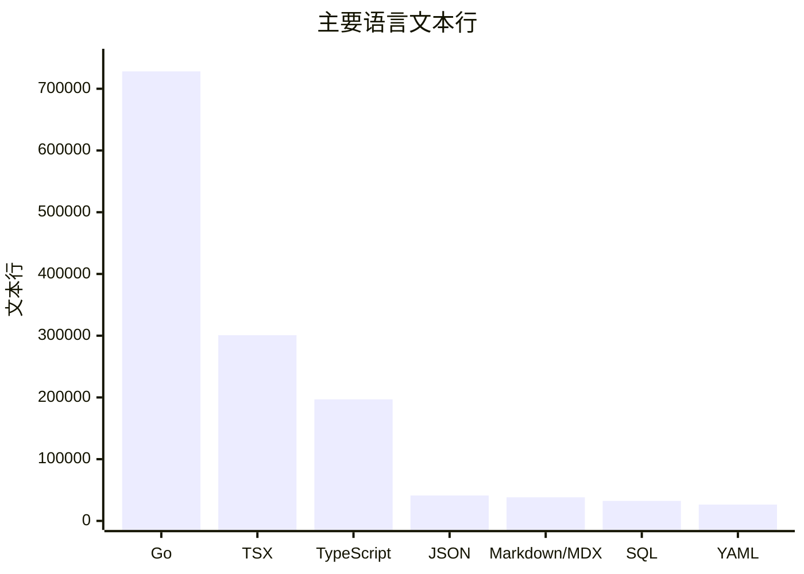

# 代码库数据

本页是 Multica 默认分支在固定提交上的可复现代码库快照，不把工作区未提交文件、其他分支或生成中的 Wiki 算入结果。

| 字段 | 值 |
| --- | --- |
| 快照提交 | `685cf788777e24724b0d82ffe88c56459341fb2a` |
| 提交时间 | 2026-08-31 20:24:08 UTC |
| 收集日期 | 2026-09-01 |
| 跟踪文件 | 6,408 |
| 可统计文本文件 | 6,297 |
| 文本行 | 1,383,587 |
| 默认分支可达提交 | 5,315（622 merge，4,693 non-merge） |
| 可达 tag | 145 |
| 去重 author name | 306 |

这里的“行”来自 `git grep -I -c '^' <snapshot> --`：排除 Git 判定为二进制的文件，包含测试、生成代码、迁移、配置和文档，不等于手写有效代码量。

## 语言分布



| 语言 | 文件 | 文本行 | 主要承载内容 |
| --- | ---: | ---: | --- |
| Go | 1,820 | 728,121 | API、service、sqlc 输出、CLI、Daemon 与测试 |
| TSX | 1,217 | 300,895 | Web/Desktop 共享视图、应用 wiring、Mobile UI |
| TypeScript | 1,322 | 196,944 | API schema、Query、store、平台适配与工具 |
| JSON / JSONC | 174 | 41,160 | manifest、locale、配置与生成数据 |
| Markdown / MDX | 270 | 38,300 | 产品/开发文档、Skill 与计划 |
| SQL | 1,333 | 32,391 | 634 个迁移身份和 65 个 sqlc query 文件 |
| YAML | 25 | 26,442 | CI、部署和工具配置 |
| JavaScript 家族 | 48 | 7,633 | 构建脚本与配置 |
| Shell | 25 | 5,206 | 开发、发布和检查脚本 |
| CSS | 20 | 3,309 | 语义 token 与全局样式 |

Go 占文本行约一半，原因是后端、CLI、Daemon 和大量 DB-backed 测试都在同一模块。TSX 与 TypeScript 合计 497,839 行，占全部文本行 36.0%，体现 Web/Desktop 共享界面和独立 Mobile 客户端的体量。

## 测试占比

按 `_test.go`、`.test.*`、`.spec.*` 文件名统计：

| 指标 | 数值 |
| --- | ---: |
| 测试文件 | 1,836（全部文件的 28.7%） |
| 测试文本行 | 558,646（全部文本行的 40.4%） |
| Go 测试文件 | 1,030 |
| TypeScript/TSX 测试文件 | 808 |
| Playwright E2E 文件 | 24，约 6,706 行 |

56.1% 的测试文件是 Go 测试。高测试行数来自 handler/service 的 DB-backed 合同、Agent CLI adapter 矩阵、共享前端状态/组件测试，以及跨平台 E2E。文件名统计不会捕获嵌在非标准文件名中的测试，也不会证明覆盖率。

## 代码分区

| 分区 | 文件 | 文本行 | 平均 blob 字节 |
| --- | ---: | ---: | ---: |
| `server/` | 3,190 | 766,154 | 9,152 |
| `packages/` | 2,023 | 440,873 | 8,064 |
| `apps/` | 997 | 122,249 | 11,977 |
| `scripts/` | 35 | 8,902 | 9,243 |
| `e2e/` | 24 | 6,706 | 10,883 |
| `docs/` | 34 | 3,624 | 17,453 |

四个应用中，Mobile 为 345 个文件 / 43,232 行，Docs 为 282 / 27,514，Web 为 191 / 26,760，Desktop 为 179 / 24,743。Web 与 Desktop 的业务体量主要不在 app 目录，而在共享包。

共享包的集中度尤其明显：

| 包 | 文件 | 文本行 | 公开声明近似值 |
| --- | ---: | ---: | ---: |
| `packages/views` | 1,365 | 336,976 | 1,790 |
| `packages/core` | 554 | 90,357 | 2,609 |
| `packages/ui` | 91 | 12,918 | 145 |
| `packages/plugin-sdk` | 6 | 473 | 21 |

“公开声明近似值”统计以 `export` 或 `module.exports` 开头的源码行，用于观察 API 表面积，不是 AST 级符号数；re-export、重载和多符号语句会产生偏差。`packages/views` 占共享包文本行的 76.4%，说明复杂度主要集中在可跨 Web/Desktop 复用的业务视图。

## 复杂度近似

仓库没有单一工具给出可跨 Go 与 TypeScript 比较的复杂度分数，因此本页使用三组透明代理：

1. **大源文件。** 最大的手写/生成混合源文件包括 `server/internal/daemon/daemon.go`（9,430 行）、`server/pkg/db/generated/agent.sql.go`（8,706）、`server/internal/service/task.go`（7,685）和 `packages/core/api/client.ts`（5,831）。生成输出与测试不能直接等同于重构优先级。
2. **模块依赖深度。** workspace 的最长稳定内部链是 `apps/web|desktop -> packages/views -> packages/core|ui`，即两个内部依赖边；Mobile 只复用 `@multica/core` 类型/纯函数。服务端 handler/service 再向 `server/pkg` 依赖，领域深链通过接口和小包边界控制。
3. **文件平均尺寸与公开表面积。** 上表的平均 blob 字节和公开声明近似值用于发现“大而宽”的区域；实际修改仍应结合职责、测试和 Git 热点判断。

更具体的已知债务见[清理机会](cleanup-opportunities.md)，包依赖方向见[共享层](packages/index.md)。

## 迁移与配置

| 指标 | 数值 |
| --- | ---: |
| migration 文件 | 1,268 |
| migration 身份 | 634 |
| sqlc query 文件 | 65 |
| 配置/自动化文件 | 74 |

每个迁移身份通常有 `.up.sql` 和 `.down.sql`。索引迁移必须保持单语句 `CREATE [UNIQUE] INDEX CONCURRENTLY`；完整文件名是生产账本身份，不能被重写。74 个配置/自动化文件使用保守口径，覆盖根 manifest、`*.config.*`、Dockerfile、`.github/workflows/` 和 `deploy/`，不把所有 JSON/Markdown 都算作配置。

## 最近 90 天活动

窗口为 2026-06-03 至快照日 2026-09-01，提交数包含 merge：

| 月份 | 默认分支提交 |
| --- | ---: |
| 2026-06（从 3 日起） | 411 |
| 2026-07 | 634 |
| 2026-08 | 839 |
| 2026-09（截至 1 日） | 6 |

该窗口共 1,890 个提交。用 non-merge `--numstat --no-renames` 聚合的主要 churn 区域如下：

| 路径 | 新增 | 删除 | 变动行 |
| --- | ---: | ---: | ---: |
| `server/internal` | 462,131 | 70,893 | 533,024 |
| `packages/views` | 299,881 | 77,927 | 377,808 |
| `server/pkg` | 144,258 | 21,203 | 165,461 |
| `packages/core` | 76,538 | 9,733 | 86,271 |
| `server/cmd` | 45,399 | 4,496 | 49,895 |
| `apps/docs` | 23,604 | 16,774 | 40,378 |
| `apps/desktop` | 17,705 | 4,942 | 22,647 |
| `apps/web` | 15,301 | 3,159 | 18,460 |
| `apps/mobile` | 15,915 | 2,303 | 18,218 |

churn 包含 sqlc 输出、locale、manifest 和大规模迁移，因此它表示“历史触碰量”，不是缺陷率或团队绩效。热点与架构相符：后端任务/Daemon 链、共享业务视图和 Core API 是近期变化中心。

## 自动化归因下界

默认分支中：

- 3 个提交的 author name 具有平台明确的 `[bot]` 后缀；
- 3,153 个提交含明确命名模型或 agent 的 `Co-authored-by` trailer；
- 两者并集为 **3,156 / 5,315，即 59.4%**。

这是严格的提交元数据下界，只识别可复现的 bot、model 或 agent 标记。没有 trailer 的辅助不会被计入；反过来，trailer 只能证明署名，不能证明改动比例、自治程度或代码质量。本页不展示个人提交排行，当前领域维护关系见[维护者](maintainers.md)。

## 复现命令

```bash
SNAPSHOT=685cf788777e24724b0d82ffe88c56459341fb2a

git ls-tree -r --name-only "$SNAPSHOT" | wc -l
git grep -I -c '^' "$SNAPSHOT" -- |
  awk -F: '{ files += 1; lines += $NF }
             END { print files, lines }'
git rev-list --count "$SNAPSHOT"
git rev-list --merges --count "$SNAPSHOT"
git tag --merged "$SNAPSHOT" | wc -l
git log --use-mailmap --format='%aN' "$SNAPSHOT" | sort -u | wc -l
```

语言、测试、热点和归因结果由同一快照的 path/commit 聚合得到。完整脚本逻辑分别是：按扩展名汇总 `git grep` 行数，按测试后缀筛选路径，按 90 天 `git log --numstat` 汇总前两级目录，并按 commit 去重明确 trailer。

## 相关页面

- [项目沿革](project-history/index.md)
- [项目故事](lore.md)
- [仓库地图](reference/repository-map.md)
- [测试地图](reference/test-map.md)
- [维护者](maintainers.md)
