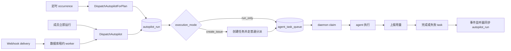

# 自动化

活跃贡献者：Bohan Jiang、Naiyuan Qing、Jiayuan Zhang

自动化把一组可复用的运行说明、执行目标和触发方式绑定在一起。它不是绕过任务系统的第二套执行器：无论从“立即运行”、定时计划还是 Webhook 进入，最终都要建立 `autopilot_run`，并落到普通任务或 `agent_task_queue` 上。

本文先说明产品模型和一次运行的生命周期；触发条件见[规则与触发器](./rules-and-triggers.md)，通用租约机制见[调度器与后台任务](./scheduler-and-background-jobs.md)，成本与责任人见[用量与归因](./usage-and-attribution.md)。

## 数据模型

核心对象有三层：

| 对象 | 作用 | 重要字段 |
| --- | --- | --- |
| `autopilot` | 可编辑的自动化定义 | 标题、运行说明、项目、`assignee_type`、`assignee_id`、`execution_mode`、状态 |
| `autopilot_trigger` | 一条独立的触发配置 | `kind`、cron、时区、Webhook token、事件过滤器、`enabled`、当前责任发布者 |
| `autopilot_run` | 一次实际或被跳过的执行 | 来源、状态、触发器、计划时间、任务/`task`、失败原因和触发载荷 |

`assignee_type` 可以是 `agent` 或 `squad`。分配给小队时，系统在触发时解析当前小队负责人，由负责人实际执行。`project_id` 对两种输出模式都有效：`run_only` 没有任务可继承项目上下文，因此更依赖这个绑定来选择仓库、本地目录和 worktree。

自动化状态是 `active`、`paused`、`archived`；运行状态是：

- `issue_created`：`create_issue` 已建立任务。
- `running`：对应的 `task` 正在运行。
- `completed`：终态成功。
- `failed`：执行失败且没有仍在活动的后继重试。
- `skipped`：准入检查判断“不应入队”，例如运行时离线、目标不可调用或额度已满。

前端类型定义见 [`packages/core/types/autopilot.ts`](https://github.com/oldwinter/multica/blob/685cf788777e24724b0d82ffe88c56459341fb2a/packages/core/types/autopilot.ts)，数据库读写见 [`server/pkg/db/queries/autopilot.sql`](https://github.com/oldwinter/multica/blob/685cf788777e24724b0d82ffe88c56459341fb2a/server/pkg/db/queries/autopilot.sql)。

## 从触发到 daemon



服务入口在 [`server/internal/service/autopilot.go`](https://github.com/oldwinter/multica/blob/685cf788777e24724b0d82ffe88c56459341fb2a/server/internal/service/autopilot.go)：

1. 读取自动化和触发器，确认其仍可运行。
2. 执行目标、权限、运行时和额度准入。
3. 创建或复用 `autopilot_run`。
4. 根据输出模式创建任务或直接写队列。
5. 提交后调用 `NotifyTaskEnqueued`，使 daemon 的空队列缓存失效并发出唤醒提示。
6. 任务/`task` 到达终态后，由 [`server/cmd/server/autopilot_listeners.go`](https://github.com/oldwinter/multica/blob/685cf788777e24724b0d82ffe88c56459341fb2a/server/cmd/server/autopilot_listeners.go) 把结果同步回运行记录。

“唤醒”只是降低延迟的提示，PostgreSQL 队列才是事实来源；提示丢失不会丢任务。

## 两种输出模式

### `create_issue`

系统先创建一个带自动化来源信息的任务，再复用普通任务分派逻辑。它提供持久、可见的审计轨迹，也允许订阅者跟进。

若目标已绑定运行时，但运行时只是暂时离线，系统仍可创建任务和排队的 `task`，等运行时恢复后再领取。若目标已归档、无法解析或不具备必要权限，则运行仍会被跳过。

普通任务的失败重试规则适用于这种模式。事件监听器只有在没有活动后继任务时才把自动化运行标成失败，避免父尝试刚失败、重试已入队时过早结束运行。

### `run_only`

系统不创建任务，直接写 `agent_task_queue`，运行记录通过 `task_id` 关联执行日志。

这一模式在入队前要求实际执行 agent 当前可运行；离线、未绑定运行时、归档或不可调用通常都会产生 `skipped`，而不是堆积注定失败的队列项。它不走普通任务的自动重试；定时和 Webhook 来源各自只在**分派阶段**由外层耐久机制重试，task 已开始后的 agent 执行失败不会因此自动再跑一次。

直接队列写入和归因字段的 SQL 位于 [`server/pkg/db/queries/autopilot.sql`](https://github.com/oldwinter/multica/blob/685cf788777e24724b0d82ffe88c56459341fb2a/server/pkg/db/queries/autopilot.sql)。

## 准入与权限

自动化的“可见”“可编辑”“可执行目标”是不同问题：

- 创建者、工作区 owner/admin 和被显式授权的协作者可以获得写权限；访问列表只有创建者和 owner/admin 可管理。
- 私有 agent 或小队负责人仍要通过调用权限检查；把某人记为责任人不会赋予调用权限。
- 对小队的检查和队列写入都针对触发时解析出的当前负责人，避免负责人变更后仍把任务发给旧 agent。
- 调度与实际写队列之间可能发生状态变化，因此分派函数会再次检查目标，属于“准入 + 写入前复核”。
- `skipped` 表示工作未开始，不计入失败率；机器可读的 `reason_code` 供前端稳定展示。

HTTP 接口和授权检查集中在 [`server/internal/handler/autopilot.go`](https://github.com/oldwinter/multica/blob/685cf788777e24724b0d82ffe88c56459341fb2a/server/internal/handler/autopilot.go)。前端列表、编辑器和详情页分别见：

- [`packages/views/autopilots/components/autopilots-page.tsx`](https://github.com/oldwinter/multica/blob/685cf788777e24724b0d82ffe88c56459341fb2a/packages/views/autopilots/components/autopilots-page.tsx)
- [`packages/views/autopilots/components/autopilot-dialog.tsx`](https://github.com/oldwinter/multica/blob/685cf788777e24724b0d82ffe88c56459341fb2a/packages/views/autopilots/components/autopilot-dialog.tsx)
- [`packages/views/autopilots/components/autopilot-detail-page.tsx`](https://github.com/oldwinter/multica/blob/685cf788777e24724b0d82ffe88c56459341fb2a/packages/views/autopilots/components/autopilot-detail-page.tsx)

## 幂等与故障恢复

自动化不是严格的“处理函数只执行一次”，而是用多层键把重复副作用压缩成同一个业务结果：

| 层 | 幂等键或保护 |
| --- | --- |
| 定时 occurrence | 调度执行键 `(job_name, scope_kind, scope_id, plan_time)` |
| 定时分派 | `autopilot_run(trigger_id, planned_at)` 唯一约束 |
| Webhook 收件 | `(trigger_id, dedupe_key)` |
| Webhook 分派 | 每个 `webhook_delivery_id` 最多关联一个运行 |
| 手动/额度准入 | 请求幂等键关联 quota reservation 和运行 |
| 普通任务队列 | 待处理任务唯一约束、原子 claim 和 compare-and-swap 更新 |

因此，进程可能在“副作用已完成、终态尚未写回”的窗口崩溃。重试者会先查已有运行、任务或 delivery，再修复缺失链接或完成状态，而不是盲目创建第二份工作。实现可从 `DispatchAutopilotForPlan`、`DispatchAutopilotForWebhookDelivery` 和运行修复函数开始阅读：[`server/internal/service/autopilot.go`](https://github.com/oldwinter/multica/blob/685cf788777e24724b0d82ffe88c56459341fb2a/server/internal/service/autopilot.go)。

## 运行额度

自动化运行额度由 entitlement 的 `GateAutopilotRuns` 控制，不是普通前端功能旗标。策略有：

- `off`：不访问 quota 表，适合没有 Cloud entitlement 的自托管部署。
- `observe`：记录“本来会阻止”的判断，但不拒绝运行。
- `enforce`：达到区间上限后拒绝新运行。

准入在一个事务中锁定额度区间、创建 reservation、增加 `reserved_count` 并关联 `autopilot_run`。成功运行消费 reservation；失败或跳过释放 reservation。相同幂等键会复用已有 reservation 和运行。

来源不同，用户可见结果也不同：

- 手动触发超限返回 HTTP 429。
- 定时触发记录 `skipped`。
- Webhook delivery 记录 `ignored`，避免外部系统无限重试一个商业策略拒绝。

每分钟运行的 reconciler 修复“事务已提交、正常结算尚未发生”的崩溃窗口；reservation 的终态转换使用 compare-and-swap，多副本同时扫描不会重复增减计数。实现见：

- [`server/internal/service/autopilot_quota.go`](https://github.com/oldwinter/multica/blob/685cf788777e24724b0d82ffe88c56459341fb2a/server/internal/service/autopilot_quota.go)
- [`server/cmd/server/autopilot_quota_reconciler.go`](https://github.com/oldwinter/multica/blob/685cf788777e24724b0d82ffe88c56459341fb2a/server/cmd/server/autopilot_quota_reconciler.go)

## 失败率自动暂停

后台监视器默认每天检查最近 7 天；一个自动化至少有 50 次运行且失败率达到 90% 时，系统尝试把它从 `active` 改为 `paused` 并通知用户。默认启动延迟为 1 分钟。

多节点都可以扫描，但条件更新只匹配仍为 `active` 的行，因此只有一个节点能真正暂停并发送对应事件。`AUTOPILOT_FAIL_MONITOR_INTERVAL=0` 可关闭监视器；lookback、最少运行数、失败比例和启动延迟也有环境变量覆盖。实现见 [`server/cmd/server/autopilot_failure_monitor.go`](https://github.com/oldwinter/multica/blob/685cf788777e24724b0d82ffe88c56459341fb2a/server/cmd/server/autopilot_failure_monitor.go)。

这不是自动化产品的总开关。当前实现中，自动化 CRUD、手动运行和定时分派本身没有普通 `feature flag`；运行额度是 entitlement gate，失败监视器是独立运维开关。

## 如何修改

按变化所属的契约选择入口：

| 要修改的行为 | 首选入口 | 同步检查 |
| --- | --- | --- |
| 自动化/运行 API | [`server/internal/handler/autopilot.go`](https://github.com/oldwinter/multica/blob/685cf788777e24724b0d82ffe88c56459341fb2a/server/internal/handler/autopilot.go) | 路由、响应 schema、前端 API 解析 |
| 分派、准入、模式差异 | [`server/internal/service/autopilot.go`](https://github.com/oldwinter/multica/blob/685cf788777e24724b0d82ffe88c56459341fb2a/server/internal/service/autopilot.go) | 定时/Webhook 幂等、事件监听器、额度结算 |
| 表结构和唯一约束 | [`server/pkg/db/queries/autopilot.sql`](https://github.com/oldwinter/multica/blob/685cf788777e24724b0d82ffe88c56459341fb2a/server/pkg/db/queries/autopilot.sql) 与 `server/migrations/` | `make sqlc`、旧数据和崩溃窗口 |
| 客户端缓存和 mutation | [`packages/core/autopilots/queries.ts`](https://github.com/oldwinter/multica/blob/685cf788777e24724b0d82ffe88c56459341fb2a/packages/core/autopilots/queries.ts)、[`mutations.ts`](https://github.com/oldwinter/multica/blob/685cf788777e24724b0d82ffe88c56459341fb2a/packages/core/autopilots/mutations.ts) | query key 必须含 `wsId`，网络响应走 schema |
| 创建/编辑体验 | [`packages/views/autopilots/components/autopilot-dialog.tsx`](https://github.com/oldwinter/multica/blob/685cf788777e24724b0d82ffe88c56459341fb2a/packages/views/autopilots/components/autopilot-dialog.tsx) | schedule 预览、部分成功、Web/Desktop 共用 |

不要在调用点补一个平行的“简化分派器”。所有来源应汇入同一个 service 契约，否则准入、额度、归因和队列唤醒很容易漂移。

## 如何测试

后端优先运行定向测试：

```bash
cd server
go test ./internal/service -run 'TestAutopilot' -count=1
go test ./internal/handler -run 'Test(Autopilot|Webhook)' -count=1
go test ./cmd/server -run 'TestAutopilot' -count=1
```

关键测试文件包括：

- [`server/internal/service/autopilot_test.go`](https://github.com/oldwinter/multica/blob/685cf788777e24724b0d82ffe88c56459341fb2a/server/internal/service/autopilot_test.go)
- [`server/internal/service/autopilot_quota_test.go`](https://github.com/oldwinter/multica/blob/685cf788777e24724b0d82ffe88c56459341fb2a/server/internal/service/autopilot_quota_test.go)
- [`server/internal/handler/autopilot_permissions_test.go`](https://github.com/oldwinter/multica/blob/685cf788777e24724b0d82ffe88c56459341fb2a/server/internal/handler/autopilot_permissions_test.go)
- [`server/internal/handler/autopilot_webhook_test.go`](https://github.com/oldwinter/multica/blob/685cf788777e24724b0d82ffe88c56459341fb2a/server/internal/handler/autopilot_webhook_test.go)
- [`server/cmd/server/autopilot_failure_monitor_test.go`](https://github.com/oldwinter/multica/blob/685cf788777e24724b0d82ffe88c56459341fb2a/server/cmd/server/autopilot_failure_monitor_test.go)

前端变化运行对应 Vitest 文件，例如：

```bash
pnpm exec vitest run \
  packages/views/autopilots/components/autopilot-dialog.schedule.test.tsx \
  packages/views/autopilots/components/schedule-editor/schedule-editor.test.tsx
```

涉及可靠性时，至少覆盖：重复请求、两个并发 server、在创建运行后崩溃、在任务入队后崩溃、租约过期后重领、离线运行时、私有 agent、小队负责人变更和额度 reservation 恢复。
