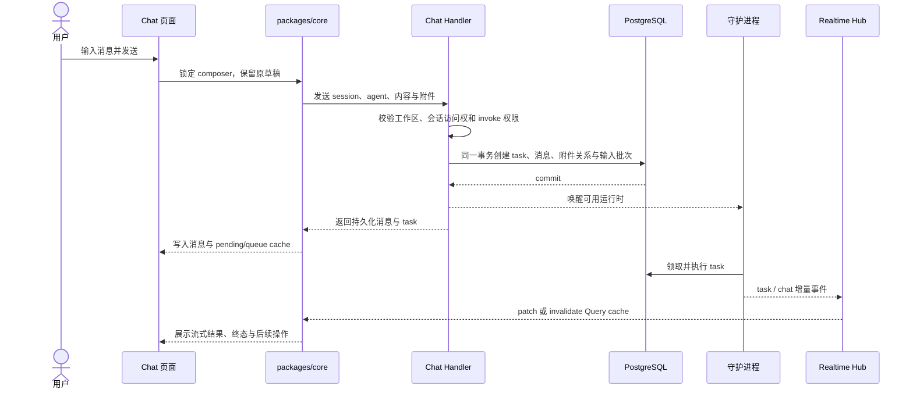
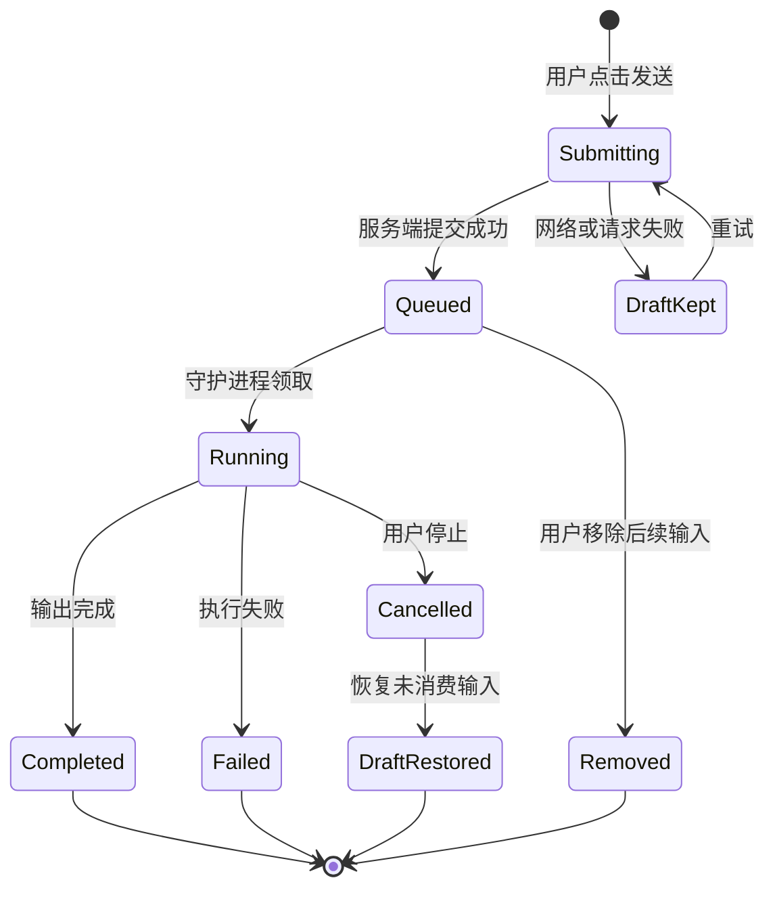

# Chat 与执行会话

活跃贡献者：Bohan Jiang、Naiyuan Qing、Jiayuan Zhang

Chat 是人与单个智能体持续协作的入口。它不是一个只保存文本的聊天框：一条用户消息会创建一个可被守护进程领取的 `task`，执行输出再回写为消息，并通过 WebSocket 同步到所有客户端。会话负责组织历史，`task` 负责一次执行，两者不要混为一谈。

## 一次发送经过哪些层



事务提交与唤醒守护进程是两个边界。数据库提交成功后，消息和执行请求已经是事实；运行时暂时离线只会让 `task` 等待，不应撤销已提交的聊天记录。

## 领域对象与持久化

| 对象 | 作用 | 关键关系 |
| --- | --- | --- |
| `chat_session` | 保存会话标题、状态、智能体、工作区和最近活动时间 | 一个会话有多条消息；可关联项目和固定智能体 |
| `chat_message` | 保存用户输入、智能体输出、失败信息、耗时和 quick actions | 用户输入通过 task/input ownership 字段与执行绑定 |
| `agent_task_queue` | 一次实际执行及其排队、领取、运行和终态 | `chat_session_id` 把执行归入会话 |
| `attachment` | 消息附件与 task 输入 | 发送事务内建立消息/task 归属 |
| `chat_draft_restore` | 跨设备、跨重连保存取消后待恢复的输入 | 以 task 为幂等边界，客户端确认应用后不再重复恢复 |

基础表从 [`server/migrations/033_chat.up.sql`](https://github.com/oldwinter/multica/blob/685cf788777e24724b0d82ffe88c56459341fb2a/server/migrations/033_chat.up.sql) 开始演进；当前查询契约集中在 [`server/pkg/db/queries/chat.sql`](https://github.com/oldwinter/multica/blob/685cf788777e24724b0d82ffe88c56459341fb2a/server/pkg/db/queries/chat.sql)。不要根据早期迁移推断当前完整 schema，应同时检查后续 `chat_*` 与 `agent_task_queue_*` 迁移。

## 会话、消息与 task 的状态边界

### 会话

会话状态只有两个稳定值：

- `active`：可继续发送、进入未读统计和常规列表。
- `archived`：保留历史，但不再接受常规发送；归档时会处理仍在运行的会话 task。

恢复归档会话与创建新会话不是同一动作。删除则会移除服务端资源，并通过实时事件让其他客户端清理列表、详情和当前选择。

### 发送队列

同一会话不会把多条输入当作互不相关的并发执行。前端和服务端共同表达：

1. **当前 head**：正在执行或即将执行的输入。
2. **follow-up queue**：等待当前 head 结束的 FIFO 输入。
3. **提交中输入**：HTTP 未确认前仍留在 composer 中，输入框锁定并显示提交状态；共享 Web/Desktop 不会先伪造一条已发送消息。

队列支持置顶、编辑、移除和清空；停止当前执行与移除后续输入是不同操作。`prioritize` 只改变尚未执行输入的次序，不应重写已经开始的 task。



这张图只描述 Chat 用户可观察的主路径；`agent_task_queue` 还有调度、租约和守护进程内部状态，修改 task 生命周期时应以 [`server/internal/service/task.go`](https://github.com/oldwinter/multica/blob/685cf788777e24724b0d82ffe88c56459341fb2a/server/internal/service/task.go) 为准。

## 发送事务与权限

发送入口在 [`server/internal/handler/chat.go`](https://github.com/oldwinter/multica/blob/685cf788777e24724b0d82ffe88c56459341fb2a/server/internal/handler/chat.go)。核心不变量是：

- 请求必须来自当前工作区成员，所有查询都限定 `workspace_id`。
- 会话必须属于当前用户可访问的范围；私有智能体不能因知道 session ID 而被绕过。
- 读取会话的权限不等于调用智能体的权限。每次发送都会重新检查 invoke permission，防止会话创建后权限已被撤销。
- 会话、智能体、运行时和附件的工作区归属必须一致。
- 创建 task、用户消息、附件归属和输入批次在同一数据库事务中完成。
- 只有事务提交后才唤醒守护进程和发布后续事件。

因此，新增发送字段时不能只改 `chat_message`：还要判断它是否属于 task 输入快照、附件所有权、守护进程 prompt 或实时 payload。

## 取消与草稿恢复

停止执行后，尚未被模型消费的用户输入不能静默消失。当前实现有两条互补路径：

- **同步响应**：取消接口可返回 `cancelled_chat_message`，当前客户端立即把内容放回输入框。
- **持久化恢复**：服务端写入 `chat_draft_restore`，其他设备或取消响应丢失的客户端可在重连后恢复。

客户端维护已应用 ledger 和本地待恢复队列，确保同一 task 的草稿只恢复一次。恢复逻辑不能简单地在每个 WebSocket 回调里 `setDraft`，否则会覆盖用户已经输入的新内容。共享实现见 [`packages/views/chat/components/use-chat-draft-restore.ts`](https://github.com/oldwinter/multica/blob/685cf788777e24724b0d82ffe88c56459341fb2a/packages/views/chat/components/use-chat-draft-restore.ts) 与 [`packages/core/chat/store.ts`](https://github.com/oldwinter/multica/blob/685cf788777e24724b0d82ffe88c56459341fb2a/packages/core/chat/store.ts)。

## 实时同步与状态所有权

常见事件包括：

- `chat:message`：合并新消息或增量结果。
- `chat:done`：结束当前流式/运行态并刷新终态。
- `chat:quick_actions`：为已完成输出补充建议操作。
- session 更新、删除、已读事件：更新会话列表、详情与未读计数。
- task 生命周期事件：推进 pending、排队、运行、失败或取消展示。

共享客户端遵循两条规则：

1. 会话、消息和 task 是服务端状态，由 TanStack Query cache 持有；确定的事件按 ID 合并，不确定的投影失效重取。
2. 草稿、当前本地选择和 pending 请求是客户端状态，可进入 Zustand；WebSocket 不得把服务端消息镜像进 store。

消息合并和去重集中在 [`packages/core/chat/message-cache.ts`](https://github.com/oldwinter/multica/blob/685cf788777e24724b0d82ffe88c56459341fb2a/packages/core/chat/message-cache.ts)，pending 队列推导在 [`packages/core/chat/pending.ts`](https://github.com/oldwinter/multica/blob/685cf788777e24724b0d82ffe88c56459341fb2a/packages/core/chat/pending.ts)，查询和 mutation 分别在 [`queries.ts`](https://github.com/oldwinter/multica/blob/685cf788777e24724b0d82ffe88c56459341fb2a/packages/core/chat/queries.ts) 与 [`mutations.ts`](https://github.com/oldwinter/multica/blob/685cf788777e24724b0d82ffe88c56459341fb2a/packages/core/chat/mutations.ts)。

## 客户端实现差异

| 能力 | Web / Desktop | Mobile |
| --- | --- | --- |
| 页面实现 | 共用 [`ChatPage`](https://github.com/oldwinter/multica/blob/685cf788777e24724b0d82ffe88c56459341fb2a/packages/views/chat/chat-page.tsx) 和 controller/component | 在 `apps/mobile` 独立实现 |
| 会话列表与详情 | 双栏布局、floating chat、共享窗口组件 | tab 页面与独立 session picker |
| 发送模型 | 共享 controller 采用 await-then-render；确认后进入 `packages/core` pending queue | 手写 optimistic/pending 发送和独立 Query |
| 实时同步 | 共享 core realtime/cache updater | 独立的 [`apps/mobile/data/realtime/chat-ws-updaters.ts`](https://github.com/oldwinter/multica/blob/685cf788777e24724b0d82ffe88c56459341fb2a/apps/mobile/data/realtime/chat-ws-updaters.ts) |
| 草稿 | 共享 Zustand store，按会话隔离 | Mobile 自有 draft store |
| 功能面 | queue 管理、quick actions、floating chat 等完整能力 | 保持核心会话/发送语义，部分桌面增强能力未暴露 |

Web 接线位于 [`apps/web/.../chat/page.tsx`](https://github.com/oldwinter/multica/blob/685cf788777e24724b0d82ffe88c56459341fb2a/apps/web/app/%5BworkspaceSlug%5D/%28dashboard%29/chat/page.tsx)，Desktop 在 [`apps/desktop/src/renderer/src/routes.tsx`](https://github.com/oldwinter/multica/blob/685cf788777e24724b0d82ffe88c56459341fb2a/apps/desktop/src/renderer/src/routes.tsx) 挂载同一个共享页面。Mobile 入口是 [`apps/mobile/app/(app)/[workspace]/(tabs)/chat.tsx`](https://github.com/oldwinter/multica/blob/685cf788777e24724b0d82ffe88c56459341fb2a/apps/mobile/app/%28app%29/%5Bworkspace%5D/%28tabs%29/chat.tsx)。

## API 操作面

以下是 [`server/cmd/server/router.go`](https://github.com/oldwinter/multica/blob/685cf788777e24724b0d82ffe88c56459341fb2a/server/cmd/server/router.go) 注册的用户侧主路径；均位于 `/api` 下并经过用户身份与工作区中间件：

| 方法与路径 | 行为 |
| --- | --- |
| `GET/POST /chat/sessions` | 列表 / 创建 session |
| `GET/PATCH/DELETE /chat/sessions/{sessionId}` | 读取 / 更新 / 删除 session |
| `PATCH /chat/sessions/{sessionId}/pin` | 固定或取消固定 |
| `PATCH /chat/sessions/{sessionId}/archive` | 归档或恢复 |
| `GET/POST /chat/sessions/{sessionId}/messages` | 拉取历史 / 发送消息 |
| `GET /chat/sessions/{sessionId}/messages/page` | 游标分页历史 |
| `GET /chat/sessions/{sessionId}/pending-task` | 读取 head 与 follow-up queue |
| `POST /chat/sessions/{sessionId}/queued-tasks/{taskId}/prioritize` | 把后续输入提前 |
| `DELETE /chat/sessions/{sessionId}/queued-tasks` | 清空后续输入 |
| `POST /tasks/{taskId}/cancel` | 停止 head；带 queued 参数时用于编辑/移除尚未执行输入 |
| `GET /chat/sessions/{sessionId}/draft-restores` | 列出取消恢复记录 |
| `DELETE /chat/sessions/{sessionId}/draft-restores/{restoreId}` | 幂等消费一条恢复记录 |
| `POST /chat/sessions/{sessionId}/read` | 标记已读 |

quick actions 重新生成使用 `POST /chat/sessions/{sessionId}/quick-actions/regenerate`。

新增 endpoint 时同时更新 API schema、Query key、mutation、WebSocket cache updater 和畸形响应测试；不能只让 Web 页面直接调用 `api.*`。

## 修改入口

| 变更 | 首选入口 |
| --- | --- |
| 权限、事务、HTTP 响应 | [`server/internal/handler/chat.go`](https://github.com/oldwinter/multica/blob/685cf788777e24724b0d82ffe88c56459341fb2a/server/internal/handler/chat.go) |
| task 创建、取消与终态 | [`server/internal/service/task.go`](https://github.com/oldwinter/multica/blob/685cf788777e24724b0d82ffe88c56459341fb2a/server/internal/service/task.go) |
| SQL 与持久化 | [`server/pkg/db/queries/chat.sql`](https://github.com/oldwinter/multica/blob/685cf788777e24724b0d82ffe88c56459341fb2a/server/pkg/db/queries/chat.sql) + 新迁移 |
| 类型、解析、Query/mutation | [`packages/core/chat/`](https://github.com/oldwinter/multica/tree/685cf788777e24724b0d82ffe88c56459341fb2a/packages/core/chat) |
| Web/Desktop 业务 UI | [`packages/views/chat/`](https://github.com/oldwinter/multica/tree/685cf788777e24724b0d82ffe88c56459341fb2a/packages/views/chat) |
| Mobile 数据与 UI | [`apps/mobile/data/queries/chat.ts`](https://github.com/oldwinter/multica/blob/685cf788777e24724b0d82ffe88c56459341fb2a/apps/mobile/data/queries/chat.ts)、[`apps/mobile/components/chat/`](https://github.com/oldwinter/multica/tree/685cf788777e24724b0d82ffe88c56459341fb2a/apps/mobile/components/chat) |

## 测试入口

- 后端 API 与权限：[`server/internal/handler/chat_test.go`](https://github.com/oldwinter/multica/blob/685cf788777e24724b0d82ffe88c56459341fb2a/server/internal/handler/chat_test.go)、[`server/internal/handler/chat_pending_tasks_test.go`](https://github.com/oldwinter/multica/blob/685cf788777e24724b0d82ffe88c56459341fb2a/server/internal/handler/chat_pending_tasks_test.go)。
- 取消恢复与竞态：[`server/internal/handler/chat_draft_restore_test.go`](https://github.com/oldwinter/multica/blob/685cf788777e24724b0d82ffe88c56459341fb2a/server/internal/handler/chat_draft_restore_test.go)、[`server/internal/handler/chat_draft_restore_race_test.go`](https://github.com/oldwinter/multica/blob/685cf788777e24724b0d82ffe88c56459341fb2a/server/internal/handler/chat_draft_restore_race_test.go)。
- 消息 ownership 与附件：[`server/internal/handler/chat_input_ownership_test.go`](https://github.com/oldwinter/multica/blob/685cf788777e24724b0d82ffe88c56459341fb2a/server/internal/handler/chat_input_ownership_test.go)、[`server/internal/handler/chat_attachment_reply_test.go`](https://github.com/oldwinter/multica/blob/685cf788777e24724b0d82ffe88c56459341fb2a/server/internal/handler/chat_attachment_reply_test.go)。
- 共享页面与队列：[`packages/views/chat/chat-page.test.tsx`](https://github.com/oldwinter/multica/blob/685cf788777e24724b0d82ffe88c56459341fb2a/packages/views/chat/chat-page.test.tsx)、[`packages/views/chat/components/chat-queue.test.tsx`](https://github.com/oldwinter/multica/blob/685cf788777e24724b0d82ffe88c56459341fb2a/packages/views/chat/components/chat-queue.test.tsx)。
- Mobile schema 与实时更新：[`apps/mobile/data/chat-schema.test.ts`](https://github.com/oldwinter/multica/blob/685cf788777e24724b0d82ffe88c56459341fb2a/apps/mobile/data/chat-schema.test.ts)、[`apps/mobile/data/realtime/chat-ws-updaters.test.ts`](https://github.com/oldwinter/multica/blob/685cf788777e24724b0d82ffe88c56459341fb2a/apps/mobile/data/realtime/chat-ws-updaters.test.ts)。

定向运行示例：

```bash
(cd server && go test ./internal/handler -run 'Test.*Chat' -count=1)
pnpm --filter @multica/views exec vitest run chat
pnpm --filter @multica/mobile exec vitest run data/chat-schema.test.ts data/realtime/chat-ws-updaters.test.ts
```

文档变更本身不要求启动守护进程。

## 相关页面

- [收件箱与通知](inbox-and-notifications.md)
- [task 生命周期](../systems/agent-task-lifecycle.md)
