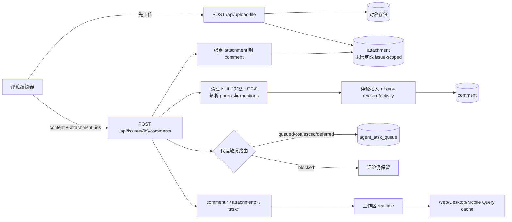

# 评论、附件、搜索与固定项

活跃贡献者：Bohan Jiang、Naiyuan Qing、Jiayuan Zhang

本页覆盖四个相互连接的能力：

1. 评论和 reaction 形成任务讨论线程，并可触发代理执行；
2. 附件先上传为独立对象，再绑定到任务、评论、聊天或执行上下文；
3. 全局搜索在客户端聚合任务与项目搜索结果；
4. 固定项只保存用户的引用和顺序，显示内容仍来自实体缓存。

## 1. 总体数据流



关键原则是“评论持久化”和“代理是否成功排队”分离：一个触发被阻止不能回滚用户已经提交的评论。

## 2. 评论与线程

### 2.1 线程模型

`comment.parent_id` 指向用户实际回复的直接父评论，因此支持任意深度的 reply-to-reply，而不是只有 root/reply 两层。需要线程级行为时，服务端通过递归查询解析 root。

每条评论可包含：

- Markdown 源文本；
- `comment`、`progress_update`、`status_change`、`system` 等类型；
- 作者 `actor_type/actor_id`；
- `parent_id` 直接父级；
- `revision` 和更新时间；
- `resolved_at`、resolver；
- `source_task_id`/触发来源和 quick-action attribution；
- reactions 和附件。

通用创建 API 只允许客户端写 `comment` 或 `progress_update`。`status_change`、`system` 等服务端语义不能由普通客户端伪造。

Markdown 按源文本持久化。创建时清理 NUL 和非法 UTF-8；XSS 防护发生在编辑器/renderer 层，不应把数据库中的源文本预先转换为已渲染 HTML。

实现：

- [评论处理器](https://github.com/oldwinter/multica/blob/685cf788777e24724b0d82ffe88c56459341fb2a/server/internal/handler/comment.go)
- [评论 SQL](https://github.com/oldwinter/multica/blob/685cf788777e24724b0d82ffe88c56459341fb2a/server/pkg/db/queries/comment.sql)
- [共享类型](https://github.com/oldwinter/multica/blob/685cf788777e24724b0d82ffe88c56459341fb2a/packages/core/types/comment.ts)
- [Web/Desktop 评论卡](https://github.com/oldwinter/multica/blob/685cf788777e24724b0d82ffe88c56459341fb2a/packages/views/issues/components/comment-card.tsx)
- [Web/Desktop composer](https://github.com/oldwinter/multica/blob/685cf788777e24724b0d82ffe88c56459341fb2a/packages/views/issues/components/comment-input.tsx)

### 2.2 列表投影与边界

`GET /api/issues/{id}/comments` 的默认响应是按时间正序排列的最新窗口。可选模式用于长讨论和代理上下文：

| 参数 | 语义 | 组合限制 |
| --- | --- | --- |
| `since=<RFC3339>` | 增量读取严格晚于时间点的评论 | 可与 `roots_only`、thread/recent 组合；不能与 `fold` |
| `roots_only=true` | 只返回 root，并附 `reply_count`、`last_activity_at` | 不与 thread/recent/tail/cursor/fold 组合 |
| `summary=true` | 每条内容裁到 200 runes，并返回 `content_truncated` | 可与所有读取模式组合 |
| `fold=true` | resolved 线程只留 root + 结论，或 root | 只用于完整线程；不与 since/tail/roots_only 组合 |
| `thread=<comment UUID>` | 解析该评论所属 root，返回整条线程 | 与 `recent` 互斥 |
| `tail=N` | `thread` 下只取最近 N 个回复，始终保留 root | 必须带 `thread`；`N=0` 只返回 root |
| `recent=N` | 返回最近活跃的 N 个完整线程 | 活跃度为整棵子树 `MAX(created_at)` |
| `before` + `before_id` | 复合游标 | 两者必须同时出现；用于 recent 或 thread+tail |

游标响应放在 `X-Multica-Next-Before` 与 `X-Multica-Next-Before-Id` header，保持旧客户端依赖的 JSON 数组形状。

防御性上限：

- 基础评论窗口最多 2,000 行；
- 补全窗口外祖先、兄弟和后代的额外总预算为 2,000；
- 向上/向下递归深度上限 64；
- `summary=true` 以 Unicode rune 计数裁到 200，避免截断 CJK 字符。

最新窗口可能包含“旧 root 的新回复”。服务端会在预算内恢复完整线程；无法证明完整时，保守地把受影响线程整组丢弃并设置截断 header，而不是返回会误导折叠/解决状态的残缺树。

### 2.3 创建与代理触发

创建评论时：

1. 加载路径中的任务并校验工作区。
2. 若有 `parent_id`，确认父评论属于同一任务和工作区。
3. 评论插入与任务的 `revision`、`last_activity_at` 推进在同一 SQL 写入中完成。
4. 绑定选定附件。
5. 如果新回复落在已解决线程中，自动重新打开该线程。
6. 计算触发目标并逐个返回 outcome。
7. 发布 `comment:created` 和后续执行事件。

代理来源可包括：

- 当前任务分配的 agent；
- 显式 `@agent`；
- 显式 `@squad`，实际路由到 leader 并携带小队上下文；
- 父评论作者；
- 同一讨论的会话延续。

`/note` 是明确的“只记录、不触发代理”指令，必须抑制所有来源，而不只是隐藏 mention chip。

预览 `/comments/trigger-preview` 与提交共享内容规范化、mention 解析和路由判定。每个显式目标的结果是：

- `queued`：创建新执行；
- `coalesced`：原子合并进同 head 的 queued 执行；
- `deferred`：登记到活动执行，完成后重放；
- `blocked`：权限、runtime 或其他门禁阻止。

blocked 的 reason 使用枚举安全代码，不能把私有代理是否存在等敏感信息写进自由文本。

评论触发的代理 `task` 只能回复其 trigger comment 或被 coalesce 进同一运行的 comment 集合；不能在该任务下任意另开顶层评论。这个约束防止恢复会话携带旧 parent 后跨线程错投。

### 2.4 编辑、删除与冲突

编辑支持 `expected_revision` 和 `content_base`：

- 无冲突时，在事务中更新内容并原子替换附件集合。
- 旧 revision 时返回可比较的冲突信息，不静默 last-write-wins。
- 内容变化后，取消由旧内容规划但尚未正确执行的 tasks，并按幸存输入重新计算触发。
- 附件变化、评论变化和任务 revision 的事件顺序必须让客户端先接纳完整 owner 快照。

删除：

- 只有评论作者或工作区 `owner`/`admin` 可编辑、删除。
- 删除时清理其附件对象，取消受影响的计划执行，并对仍存活的批次输入重新触发。
- SQL 写入带 `workspace_id` 作为防御性租户条件。

### 2.5 解决状态

线程中的任意一条评论都可以成为 resolution：

- 一个线程最多有一条 `resolved_at` 非空的评论；
- 设置新 resolution 时，在事务中清除同线程其他 resolution；
- 重复 resolve/unresolve 是幂等操作；
- root 已解决时，fold 只保留 root；
- reply 是 resolution 时，fold 保留 root 和该结论 reply；
- 在 resolved 线程新增回复会自动 reopen。

> **已知 Mobile 镜像漂移：** 当前服务端和 Web/Desktop 允许 reply 成为 resolution；部分 Mobile 代码注释和渲染仍把“resolved”只从 root 推导。修改评论或 Mobile 时，应以服务端语义为准并补齐 reply-resolution parity，不能反向把服务端降级为 root-only。

### 2.6 Reactions

评论 reaction 和任务 reaction 使用独立端点/表，但遵循同一规则：

- `(owner, actor, emoji)` 唯一；
- add/remove 幂等；
- 只有真实集合变化才推进 owner revision；
- 发布粒度化 added/removed 事件；
- reaction 通知发给评论/任务作者，并排除 actor 自己。

## 3. 附件

### 3.1 上传与绑定

`POST /api/upload-file` 使用 multipart：

- 请求体上限 100 MB；
- 有工作区上下文时先校验成员身份和 issue/comment/chat/task owner；
- 读取文件头进行 MIME sniff，并对 SVG、CSS、JS、WASM 等常见误判用扩展名修正；
- 对象上传成功后创建 `attachment` 行；
- 普通评论 composer 通常先上传为 issue-scoped、尚未绑定 comment 的对象，再在创建评论时提交 attachment IDs；
- 评论编辑用 `ReplaceCommentAttachments` 原子替换集合。

附件 owner 可是任务、评论、chat session/message、`task`，或不可变 source context。一个客户端不能仅凭已知 UUID 把文件注入其他私有 chat 或其他代理执行。

### 3.2 URL 契约

[`Attachment`](https://github.com/oldwinter/multica/blob/685cf788777e24724b0d82ffe88c56459341fb2a/packages/core/types/attachment.ts) 暴露多种 URL，持久化规则不同：

| 字段 | 用途 | 能否写入 Markdown |
| --- | --- | --- |
| `markdown_url` | 部署策略生成的长期引用 | **可以，且应优先使用** |
| `download_url` | 当前请求可加载/预览的 URL | 不可以，可能短期签名 |
| `attachment_download_url` | 强制下载 intent 的短期 capability/签名 URL | 不可以 |
| `url` | 存储层对象引用 | 客户端不要自行推断公开性 |

把 presigned/CloudFront URL 存入 Markdown 会在过期后留下永久坏链，因此 renderer 每次打开附件时应重新读取元数据获得新 URL。

### 3.3 下载和预览安全

下载有三种后端模式：CloudFront 签名、对象存储 presign、服务器 proxy。

- `GET /api/attachments/{id}/download` 位于认证但非工作区 header 路由中。处理器先按 ID 找附件，再从行中解析 workspace 并校验成员。
- 非成员与不存在统一返回 `404`，避免附件 ID oracle。
- 原生下载或跨 origin 资源无法带 session/workspace header 时，可使用由认证元数据端点签发的 `signed-download` capability。
- capability 有效期约 60 秒，并绑定单一 attachment 和 load/download intent；不能扩展成目录级 token。
- proxy 模式支持 HTTP Range：可 seek 存储使用 `http.ServeContent`，流式后端支持单 range、`206`/`416` 和 `Content-Range`。
- 文本预览 `GET /api/attachments/{id}/content` 只允许白名单类型/文件名，最多 2 MB，响应为 `text/plain`、`Cache-Control: no-store`、`nosniff` 并带限制性 CSP。
- 图片、音视频和 PDF 通常使用新鲜的 download URL 预览，不走文本 endpoint。

实现：

- [上传、下载、预览与删除](https://github.com/oldwinter/multica/blob/685cf788777e24724b0d82ffe88c56459341fb2a/server/internal/handler/file.go)
- [短期 capability](https://github.com/oldwinter/multica/blob/685cf788777e24724b0d82ffe88c56459341fb2a/server/internal/handler/attachment_capability.go)
- [附件 SQL](https://github.com/oldwinter/multica/blob/685cf788777e24724b0d82ffe88c56459341fb2a/server/pkg/db/queries/attachment.sql)
- [共享附件 renderer](https://github.com/oldwinter/multica/blob/685cf788777e24724b0d82ffe88c56459341fb2a/packages/views/editor/attachment.tsx)
- [附件预览](https://github.com/oldwinter/multica/blob/685cf788777e24724b0d82ffe88c56459341fb2a/packages/views/editor/attachment-preview-modal.tsx)

### 3.4 删除

- 用户入口只允许 member uploader 或工作区 `owner`/`admin` 删除。
- source-context 附件是历史快照，在此入口表现为 `404` 且不可变；它们随对应上下文/任务/工作区清理。
- 删除数据库 owner 关系后推进任务或评论 revision，发布相应更新，再删除对象存储内容。
- 对象删除失败不能通过假装数据库仍有关联来恢复；批量清理路径使用 durable intent/reconciler 处理不确定结果。

### 3.5 Web/Desktop 与 Mobile

Web/Desktop：

- composer 负责上传队列、草稿恢复和 attachment IDs；
- Markdown 内联附件与独立附件卡共享 renderer，并去重重复展示；
- 预览时解析新 URL，下载按钮使用强制下载 intent。

Mobile 独立实现：

- [内联评论 composer](https://github.com/oldwinter/multica/blob/685cf788777e24724b0d82ffe88c56459341fb2a/apps/mobile/components/issue/inline-comment-composer.tsx)
- [评论附件列表](https://github.com/oldwinter/multica/blob/685cf788777e24724b0d82ffe88c56459341fb2a/apps/mobile/components/issue/comment-attachment-list.tsx)
- [Mobile 评论卡](https://github.com/oldwinter/multica/blob/685cf788777e24724b0d82ffe88c56459341fb2a/apps/mobile/components/issue/comment-card.tsx)

Mobile 同样执行 100 MB 客户端预检和展示去重。它通常把新附件作为结构化 attachment list，而不是把 URL 插入 Markdown，但仍必须渲染 Web 已经写入的内联图片/媒体 Markdown。

## 4. API 汇总

### 4.1 评论与 reaction

| 方法与路径 | 作用 |
| --- | --- |
| `GET /api/issues/{id}/comments` | 列表、thread/recent/summary/fold 等投影 |
| `POST /api/issues/{id}/comments/trigger-preview` | 预览规范化后的代理触发 |
| `POST /api/issues/{id}/comments` | 创建评论、绑定附件并触发代理 |
| `PUT /api/comments/{commentId}` | revision-aware 编辑和附件替换 |
| `DELETE /api/comments/{commentId}` | 删除并协调附件/tasks |
| `POST /api/comments/{commentId}/resolve` | 将该评论设为线程 resolution |
| `DELETE /api/comments/{commentId}/resolve` | 清除 resolution |
| `POST/DELETE /api/comments/{commentId}/reactions` | 添加/移除评论 reaction |
| `POST/DELETE /api/issues/{id}/reactions` | 添加/移除任务 reaction |

### 4.2 附件

| 方法与路径 | 作用 |
| --- | --- |
| `POST /api/upload-file` | multipart 上传并创建 attachment |
| `GET /api/issues/{id}/attachments` | 列出任务相关附件 |
| `GET /api/attachments/{id}` | 当前工作区中的元数据和新鲜 URL |
| `GET /api/attachments/{id}/download` | 认证、自解析工作区的加载/下载 |
| `GET /api/attachments/{id}/signed-download` | capability 认证的原生加载/下载 |
| `GET /api/attachments/{id}/content` | 白名单文本预览 |
| `DELETE /api/attachments/{id}` | uploader 或 owner/admin 删除 |

## 5. 搜索

### 5.1 “全局搜索”的真实边界

没有单一 `/api/search` 和单一 search 表。Web/Desktop/Mobile 将以下两个请求并发聚合：

- `GET /api/issues/search`
- `GET /api/projects/search`

任务搜索覆盖标题、描述、评论内容以及编号/identifier；评论不会作为独立结果出现，而是通过其所属任务命中。项目搜索覆盖标题和描述。

SQL 在 [issue.go](https://github.com/oldwinter/multica/blob/685cf788777e24724b0d82ffe88c56459341fb2a/server/internal/handler/issue.go) 与 [project.go](https://github.com/oldwinter/multica/blob/685cf788777e24724b0d82ffe88c56459341fb2a/server/internal/handler/project.go) 中动态构建；不要寻找不存在的 `search.sql`。所有条件都以 `workspace_id` 开头，搜索词用于参数化的 `LOWER(...) LIKE`，并转义 `%`/`_`，不能拼接用户输入。

### 5.2 排序

任务服务端相关性依次考虑：

1. identifier/编号直接命中；
2. 标题精确、前缀、包含；
3. 多词标题匹配；
4. 描述；
5. 评论内容；
6. 状态文本；
7. 最近更新时间。

`cancelled` 工作会在相关性前被降级，但 identifier 或精确标题直接命中例外。客户端聚合后再做稳定跨类型分区：

1. 非 cancelled 项目；
2. 非 cancelled 任务；
3. cancelled 结果。

这个二次分区不能由 API 返回顺序偶然替代，否则并发请求完成顺序会改变列表。

`include_closed=false` 会排除有效终态 category 的任务，以及 `completed`/`cancelled` 项目；当前 command palette 和 Mobile 搜索传 `include_closed=true`，让用户仍可找历史工作。

默认 `limit=20`，最大 50，使用 offset pagination。匹配 snippet 以 rune 处理，约 120 字符，避免截断 CJK。

### 5.3 性能与超时

搜索依赖 `LOWER(title/description/content)` 的 pg_bigm 或 pg_trgm GIN 索引，以及 `comment.workspace_id` 辅助索引。索引策略见：

- [comment workspace 索引](https://github.com/oldwinter/multica/blob/685cf788777e24724b0d82ffe88c56459341fb2a/server/migrations/135_comment_workspace_index.up.sql)
- [pg_trgm 扩展/策略](https://github.com/oldwinter/multica/blob/685cf788777e24724b0d82ffe88c56459341fb2a/server/migrations/137_search_index_pg_trgm_extension.up.sql)
- [任务标题索引](https://github.com/oldwinter/multica/blob/685cf788777e24724b0d82ffe88c56459341fb2a/server/migrations/138_issue_title_trgm_index.up.sql)
- [任务描述索引](https://github.com/oldwinter/multica/blob/685cf788777e24724b0d82ffe88c56459341fb2a/server/migrations/139_issue_description_trgm_index.up.sql)
- [评论内容索引](https://github.com/oldwinter/multica/blob/685cf788777e24724b0d82ffe88c56459341fb2a/server/migrations/371_comment_content_search_index_strategy.up.sql)
- [项目标题索引](https://github.com/oldwinter/multica/blob/685cf788777e24724b0d82ffe88c56459341fb2a/server/migrations/141_project_title_trgm_index.up.sql)
- [项目描述索引](https://github.com/oldwinter/multica/blob/685cf788777e24724b0d82ffe88c56459341fb2a/server/migrations/142_project_description_trgm_index.up.sql)

每次搜索都通过 [search.go](https://github.com/oldwinter/multica/blob/685cf788777e24724b0d82ffe88c56459341fb2a/server/internal/handler/search.go)：

1. 开一个短生命周期事务；
2. `SET LOCAL transaction_read_only = on`；
3. `SET LOCAL statement_timeout = 3000`；
4. 在事务内 scan 全部结果后提交；
5. PostgreSQL SQLSTATE `57014` 映射为 HTTP `503`。

`SET LOCAL` 很重要：直接修改连接 session timeout 会污染 pool 中后续无关请求。

### 5.4 客户端入口

Web/Desktop command palette 位于 [search-command.tsx](https://github.com/oldwinter/multica/blob/685cf788777e24724b0d82ffe88c56459341fb2a/packages/views/search/search-command.tsx)。除远端任务/项目外，它还搜索本地页面、命令、成员和最近任务。

Mobile 页面位于 [search.tsx](https://github.com/oldwinter/multica/blob/685cf788777e24724b0d82ffe88c56459341fb2a/apps/mobile/app/%28app%29/%5Bworkspace%5D/search.tsx)，有意只展示任务、项目和最近任务。

两端都：

- debounce 300 ms；
- 取消/忽略过期请求；
- 对两个远端结果执行稳定合并；
- 使用 [cancelled-rank.ts](https://github.com/oldwinter/multica/blob/685cf788777e24724b0d82ffe88c56459341fb2a/packages/core/search/cancelled-rank.ts) 的 direct-hit 例外和 cancelled 分区。

## 6. 固定项

### 6.1 数据与权限

`pinned_item` 只保存：

- `workspace_id`、`user_id`；
- `item_type`：`issue`、`project`、`view`；
- `item_id`；
- float `position` 和时间戳。

它故意不复制 title、status、identifier 或 icon。Web/Mobile 从任务、项目或 saved-view Query cache 解析显示内容，所以普通 `issue:updated`/`project:updated` 就能重绘侧边栏。

创建时：

- 验证目标存在于当前工作区；
- 外国用户的 private view 统一返回 `404`；
- 新 pin 追加到当前 `MAX(position)+1`；
- 相同 `(workspace, user, type, item)` 重复创建返回 `409`。

删除和 reorder 只影响当前用户、当前工作区的行。reorder 后发布 realtime invalidation，让同用户其他 tab/设备重新获取。

实现：

- [Pin handler](https://github.com/oldwinter/multica/blob/685cf788777e24724b0d82ffe88c56459341fb2a/server/internal/handler/pin.go)
- [Pin SQL](https://github.com/oldwinter/multica/blob/685cf788777e24724b0d82ffe88c56459341fb2a/server/pkg/db/queries/pinned_item.sql)
- [Core queries](https://github.com/oldwinter/multica/blob/685cf788777e24724b0d82ffe88c56459341fb2a/packages/core/pins/queries.ts)
- [Core mutations](https://github.com/oldwinter/multica/blob/685cf788777e24724b0d82ffe88c56459341fb2a/packages/core/pins/mutations.ts)

### 6.2 兼容与客户端

旧客户端把所有非 issue pin 当成 project pin，并会在 project 404 后自动删除。为防止旧 Desktop 仅因打开侧边栏就破坏 view pin：

- `GET /api/pins` 默认不返回 `item_type=view`；
- 只有客户端显式 `?include=view` 才返回 saved-view pins。

Web/Desktop 的 [app-sidebar.tsx](https://github.com/oldwinter/multica/blob/685cf788777e24724b0d82ffe88c56459341fb2a/packages/views/layout/app-sidebar.tsx) 支持任务、项目、saved view 和拖拽排序。

Mobile 独立的 [pins 页面](https://github.com/oldwinter/multica/blob/685cf788777e24724b0d82ffe88c56459341fb2a/apps/mobile/app/%28app%29/%5Bworkspace%5D/more/pins.tsx) 目前只请求/展示任务和项目，按 position 排序，并对 create/delete 做乐观更新。目标已不可用时保留“不可用”状态供用户手工 unpin，而不是误删未知类型。

### 6.3 API

| 方法与路径 | 作用 |
| --- | --- |
| `GET /api/pins[?include=view]` | 当前用户 pins；view 需 capability opt-in |
| `POST /api/pins` | 验证目标并追加 pin |
| `PUT /api/pins/reorder` | 更新当前用户行的位置 |
| `DELETE /api/pins/{itemType}/{itemId}` | 删除当前用户的指定 pin |

## 7. 关键数据表

| 表 | 作用 |
| --- | --- |
| `comment` | 直接父级线程、Markdown、类型、revision、resolution、source task |
| `comment_reaction` | 评论 reaction 唯一集合 |
| `issue_reaction` | 任务 reaction 唯一集合 |
| `attachment` | owner 引用、uploader、存储 URL、MIME、大小、source context |
| `agent_task_queue` | 评论触发、coalesced inputs、deferred replay |
| `issue` | 评论创建/附件变更推进的 owner revision 与活动时间 |
| `project` | 项目搜索源 |
| `pinned_item` | 每用户、每工作区的引用与顺序 |

这些关系都必须带工作区作用域。新增清理逻辑使用应用事务，不新增数据库级 cascade 作为捷径。

## 8. 修改指南

### 改评论/线程

1. 更新 handler、递归 SQL、Core response schema 和 realtime payload。
2. 保持 direct-parent 身份；不要为了渲染方便把所有 reply 的 parent 改成 root。
3. 读取投影必须继续有总行数、上下文预算和深度界限。
4. resolution 变更同时验证“任意 reply 可解决、每线程最多一个、新回复 reopen”。
5. 更新共享 Web/Desktop renderer，并独立更新 Mobile；特别检查 Mobile root-only 漂移。

### 改代理触发

1. 让 preview 与 create 共用 normalization 和 target routing。
2. 覆盖 assigned、mention agent、mention squad leader、parent author、continuation、`/note`。
3. 保持每目标 outcome 和枚举 reason；blocked 不回滚评论。
4. 验证 comment-triggered task 的 parent allowlist、同 head coalesce 和 active-run deferred replay。
5. 编辑/删除时测试旧计划取消和幸存输入 retrigger。

### 改附件

1. 同步上传边界、owner 校验、数据库写入和对象存储失败处理。
2. 只持久化 `markdown_url`；每次展示重新解析短期 URL。
3. metadata、download、signed capability 和 text preview 各有不同认证边界，不要合并成一个“公开 URL”。
4. server text preview whitelist 与客户端语言/扩展名映射保持同步。
5. 更新 Web/Desktop renderer、草稿/去重和 Mobile 独立上传/展示。

### 改搜索

1. 同时修改动态 SQL、参数转义、ranking tests 和索引策略。
2. 保持工作区谓词、read-only transaction、3 秒 timeout 和 `57014 → 503`。
3. 更新 Core 跨类型 cancelled 分区和 Web/Mobile stale-request 取消。
4. 评论若仍以任务承载，不能在客户端虚构独立 comment result 权限。

### 改固定项

1. 新 item type 先定义访问校验和旧客户端 capability opt-in。
2. 不向 pin 行复制实体显示字段。
3. 更新 realtime invalidation、Web/Desktop resolver 和 Mobile 的有意支持范围。
4. reorder SQL 必须限定 workspace + user，不能仅按 pin UUID。

## 9. 测试与验证

服务端：

```bash
(cd server && go test ./internal/handler -run 'Test(Comment|Reaction|File|Attachment|Search|Pin)' -count=1)
```

共享前端与搜索：

```bash
pnpm exec vitest run \
  packages/views/issues/components/comment-card.test.tsx \
  packages/views/issues/components/comment-composers.test.tsx \
  packages/views/editor/attachment.test.tsx \
  packages/views/editor/attachment-preview-modal.test.tsx \
  packages/views/search/search-command.test.tsx \
  packages/core/search/cancelled-rank.test.ts \
  apps/mobile/lib/search-rows.test.ts
```

至少验证：

- 深层 reply、reply-resolution、reopen 和 fold 投影；
- 2,000 行窗口截断时不返回孤儿回复或残缺 resolved 线程；
- `/note` 不触发，显式 targets 分别出现 queued/coalesced/deferred/blocked；
- 并发编辑返回 revision 冲突，附件替换和 task retrigger 保持原子语义；
- 上传超过 100 MB、跨工作区 owner、source-context 删除、过期 capability 和 Range；
- Markdown 中没有持久化 presigned URL，Web 内容可在 Mobile 渲染；
- identifier 直接命中、CJK snippet、cancelled direct-hit 例外、3 秒 timeout；
- view pin 仅在 opt-in 客户端出现，Mobile 不会误删它，reorder 只改变当前用户。

## 相关页面

- [任务与 task 执行](issues-and-tasks.md)
- [存储、附件与 VCS](../backend/storage-and-vcs.md)
