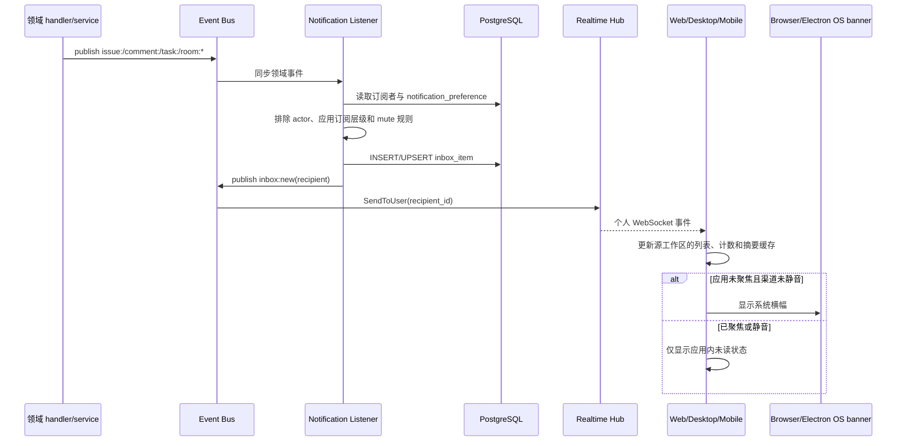

# 收件箱与通知

活跃贡献者：Bohan Jiang、Naiyuan Qing、Jiayuan Zhang

收件箱是持久化的个人事件流；系统通知是其中部分事件的操作系统级展示渠道。领域事件不会直接变成浏览器横幅，而是先经过订阅、偏好、收件人和租户校验，写入 `inbox_item` 后再通过个人 realtime 通道送达。

## 1. 端到端投递链路



关键实现：

- [领域事件到收件箱](https://github.com/oldwinter/multica/blob/685cf788777e24724b0d82ffe88c56459341fb2a/server/cmd/server/notification_listeners.go)
- [个人 realtime 路由](https://github.com/oldwinter/multica/blob/685cf788777e24724b0d82ffe88c56459341fb2a/server/cmd/server/listeners.go)
- [收件箱处理器](https://github.com/oldwinter/multica/blob/685cf788777e24724b0d82ffe88c56459341fb2a/server/internal/handler/inbox.go)
- [通知偏好处理器](https://github.com/oldwinter/multica/blob/685cf788777e24724b0d82ffe88c56459341fb2a/server/internal/handler/notification_preference.go)
- [收件箱 SQL](https://github.com/oldwinter/multica/blob/685cf788777e24724b0d82ffe88c56459341fb2a/server/pkg/db/queries/inbox.sql)
- [偏好 SQL](https://github.com/oldwinter/multica/blob/685cf788777e24724b0d82ffe88c56459341fb2a/server/pkg/db/queries/notification_preference.sql)

### 1.1 收件人选择

通知 listener 根据事件类型选择直接收件人或任务订阅者：

- 负责人、创建者、评论者、被提及者、手动订阅者和委派订阅者来自 `issue_subscriber` 或事件 payload。
- 默认排除事件 actor，避免用户收到自己操作产生的提醒。
- `@all` 只展开工作区成员，不把代理当作个人收件箱用户。
- 部分子任务事件可上浮到父任务订阅者；允许列表和 delegated 层级限制必须集中在 listener 中，不能让每个 handler 自行决定。
- `task:completed` 本身不创建收件箱项，完成通常由任务状态变化表达；`task:failed` 会通知订阅者。
- 偏好是在写 `inbox_item` 前应用。被静音的事件不应先落库再只隐藏 UI。

### 1.2 持久化后再 realtime

`inbox:new` payload 来自已经写入的 `inbox_item`。realtime 层识别这是个人事件并调用 `SendToUser(recipient_id)`；它不会向整个工作区广播。read/archive/batch 事件也使用顶层 `recipient_id` 做个人路由。

因此：

- 数据库是收件箱真值，WebSocket 只是低延迟失效/补丁信号。
- 重连后客户端必须重新查询，而不是依赖内存中收过的事件。
- 任何新个人事件类型都必须加入 personal-event 路由并验证 recipient；缺少 recipient 时应 fail closed，不能退化成工作区广播。

## 2. 展示分组与计数

### 2.1 活跃列表分组

客户端不会简单地“一行数据库记录显示一行”：

1. 丢弃 `archived=true` 的行。
2. 有 `issue_id` 时，以任务为组，只保留最新一行。
3. Room 注意项以 room、cycle、事件类型和 review identity 组成稳定组。
4. 其余项以自身 `id` 成组。
5. 组内最新行如果是后续状态/元数据事件，但较旧行带 `comment_id`，合并时保留最新可用评论锚点。
6. 最终按最新活动时间降序。

Web/Core 的权威实现位于 [inbox queries](https://github.com/oldwinter/multica/blob/685cf788777e24724b0d82ffe88c56459341fb2a/packages/core/inbox/queries.ts)，Mobile 的独立镜像位于 [inbox-display.ts](https://github.com/oldwinter/multica/blob/685cf788777e24724b0d82ffe88c56459341fb2a/apps/mobile/lib/inbox-display.ts)。两者必须保持行为一致。

### 2.2 三种“未读数”不能混用

| 数值 | 来源 | 语义 |
| --- | --- | --- |
| 工作区原始未读数 | `GET /api/inbox/unread-count` / `CountUnreadInbox` | 所有未归档且未读的数据库行数量 |
| 当前列表展示数 | 客户端 dedup 后的行 | 每个任务/Room identity/独立项只显示最新代表 |
| 跨工作区摘要 | `GET /api/inbox/unread-summary` | 服务端按 UI identity 选最新代表，再按工作区聚合 |

原始计数可能大于 UI 行数，这是数据模型允许的结果，不一定是 bug。工作区切换器应使用跨工作区摘要，不能把当前工作区原始 count 复制到其他工作区。

## 3. read、archive 与恢复不变量

### 3.1 read 是单项状态

- `POST /api/inbox/{id}/read` 与 `/unread` 只修改该 `inbox_item`。
- 列表只显示组内最新行，因此用户看到的组是否未读取决于该代表行。
- “全部已读”只作用于当前用户、当前工作区、未归档且未读的行。

### 3.2 archive 是展示组状态

- 对任务通知执行 archive 时，同一用户/工作区、相同 `issue_id` 的所有未归档兄弟行一起归档。
- unarchive 镜像恢复整个任务组，并保留各行原来的 read 状态。
- Room 和没有任务的独立项按其自身 identity/行处理。
- “归档全部已读”依据每个展示组最新代表的 read 状态选择组，然后归档组内所有行。
- “归档已完成”依据任务当前有效 status category，而不是通知创建时的陈旧状态字符串。
- 已归档的任务发生新活动时，新通知会重新激活该任务组；用户无需先手工 unarchive 才能看到新事件。

这组差异是常见回归来源：不要为了“统一”而让 read 也批量修改兄弟行，也不要让 archive 只隐藏当前代表行。

### 3.3 权限和租户边界

- 所有列表、计数和批量操作固定为当前认证用户的 `recipient_type='member'`、`recipient_id=user_id`。
- 单项写入必须同时验证 item、工作区和 recipient，不能允许用户通过 UUID 修改他人的通知。
- 跨工作区 summary 是账户级读取，但仍只聚合当前用户有权看到的工作区。
- 个人 realtime 只发送到该用户的连接；收件箱 payload 不得通过普通 workspace broadcast 泄漏。

## 4. 通知偏好

`notification_preference.preferences` 是一个 JSON map。API 只接受以下 group：

| group | 控制范围 |
| --- | --- |
| `assignments` | 分配、取消分配 |
| `status_changes` | 任务状态变化 |
| `comments` | 普通评论活动 |
| `mentions` | 成员被提及 |
| `updates` | 优先级、日期等任务更新 |
| `agent_activity` | 代理运行失败等活动 |
| `rooms` | Room 生命周期提醒及其横幅 |
| `system_notifications` | OS/browser 横幅渠道；不是收件箱事件类别 |

每个值只能是 `all` 或 `muted`。

写入契约：

- `PATCH /api/notification-preferences` 原子合并请求中提供的 key，避免旧 tab/设备覆盖其他 key。
- `PUT /api/notification-preferences` 保留 replace-all 兼容契约，供旧安装客户端使用。
- 新客户端应优先 PATCH 最小差异，不发送整份可能已陈旧的 map。
- `system_notifications=muted` 只关闭横幅，不清空收件箱。
- 浏览器自身的 Notification permission 是第二道平台门禁；即使服务端偏好为 `all`，浏览器未授权时也只显示应用内收件箱。

Web/Core 与 Mobile 的偏好 mutations 都按工作区串行化写入，并执行：

1. 捕获发起操作时的 workspace ID 和 slug；
2. 乐观 patch 对应 Query cache；
3. 失败时只回滚本 patch 触及的 key；
4. 同一工作区队列中只有最后一次 settle 才做权威 refetch。

如果排队写入在用户切换工作区后读取“当前 slug”，就可能把 A 工作区的设置写到 B；因此 slug 必须随 mutation variables 捕获。

## 5. 系统横幅与深链

系统横幅的单一决策点是 [`handleInboxNew`](https://github.com/oldwinter/multica/blob/685cf788777e24724b0d82ffe88c56459341fb2a/packages/core/realtime/use-realtime-sync.ts)：

1. 用 `item.workspace_id` 更新源工作区的 inbox/unread cache，并失效跨工作区摘要。
2. 若 `document.hasFocus()` 为真，只显示应用内状态，不打扰用户。
3. 从工作区列表解析**源工作区** slug。
4. 用源 workspace ID + slug 读取 `system_notifications`；Room 项还读取 `rooms`。
5. Desktop 调用 preload 注入的 `desktopAPI.showNotification`；Web 没有 bridge 时调用浏览器 Notification API。
6. 点击横幅聚焦应用，并导航到源工作区的 Inbox、任务评论锚点或 Room 目标。

最重要的不变量：源工作区 slug 解析失败时，绝不能回退到当前活动工作区。可以显示无可点击深链的横幅，也不能把“工作区 A 的通知 + 工作区 B 的 slug”拼成错误链接。

相关平台代码：

- [Web Notification API 封装](https://github.com/oldwinter/multica/blob/685cf788777e24724b0d82ffe88c56459341fb2a/packages/core/platform/system-notification.ts)
- [Web 权限设置](https://github.com/oldwinter/multica/blob/685cf788777e24724b0d82ffe88c56459341fb2a/packages/views/settings/components/browser-notification-setting.tsx)
- [Desktop 主进程通知门禁](https://github.com/oldwinter/multica/blob/685cf788777e24724b0d82ffe88c56459341fb2a/apps/desktop/src/main/notification-gate.ts)

## 6. API 与数据表

### 6.1 Inbox API

| 方法与路径 | 作用 |
| --- | --- |
| `GET /api/inbox` | 当前活动收件箱 |
| `GET /api/inbox/archived` | 独立的归档视图 |
| `GET /api/inbox/unread-count` | 当前工作区原始未读行数 |
| `GET /api/inbox/unread-summary` | 当前用户跨工作区的 dedup 摘要 |
| `POST /api/inbox/mark-all-read` | 当前工作区全部已读 |
| `POST /api/inbox/archive-all` | 归档全部活动项 |
| `POST /api/inbox/archive-all-read` | 按组代表行归档已读组 |
| `POST /api/inbox/archive-completed` | 归档已完成任务的通知组 |
| `POST /api/inbox/{id}/read` | 单项标为已读 |
| `POST /api/inbox/{id}/unread` | 单项标为未读 |
| `POST /api/inbox/{id}/archive` | 归档该项所属展示组 |
| `POST /api/inbox/{id}/unarchive` | 恢复该项所属展示组 |

### 6.2 Preference API

| 方法与路径 | 作用 |
| --- | --- |
| `GET /api/notification-preferences` | 当前用户、当前工作区偏好 |
| `PATCH /api/notification-preferences` | 合并指定 key，推荐 |
| `PUT /api/notification-preferences` | 替换整份 map，旧客户端兼容 |

### 6.3 表

| 表 | 关键作用 |
| --- | --- |
| `inbox_item` | recipient、type、title、details、issue/Room identity、details 中的 comment 锚点、read、archived、时间 |
| `notification_preference` | `(workspace_id, user_id)` 唯一偏好 JSON |
| `issue_subscriber` | 任务订阅者、订阅原因和 delegated 层级 |
| `issue` / `issue_status` | 归档已完成组时解析当前终态 |
| `workspace_member` | mention 展开、访问和跨工作区 summary 边界 |

## 7. Web、Desktop 与 Mobile 入口

### Web / Desktop

- [Web Inbox 路由](https://github.com/oldwinter/multica/blob/685cf788777e24724b0d82ffe88c56459341fb2a/apps/web/app/%5BworkspaceSlug%5D/%28dashboard%29/inbox/page.tsx)
- [共享 Inbox 页面](https://github.com/oldwinter/multica/blob/685cf788777e24724b0d82ffe88c56459341fb2a/packages/views/inbox/components/inbox-page.tsx)
- [共享 Inbox 列表](https://github.com/oldwinter/multica/blob/685cf788777e24724b0d82ffe88c56459341fb2a/packages/views/inbox/components/inbox-list.tsx)
- [Core Inbox queries](https://github.com/oldwinter/multica/blob/685cf788777e24724b0d82ffe88c56459341fb2a/packages/core/inbox/queries.ts)
- [Core Inbox mutations](https://github.com/oldwinter/multica/blob/685cf788777e24724b0d82ffe88c56459341fb2a/packages/core/inbox/mutations.ts)
- [通知设置](https://github.com/oldwinter/multica/blob/685cf788777e24724b0d82ffe88c56459341fb2a/packages/views/settings/components/notifications-tab.tsx)
- [全局 realtime 协调器](https://github.com/oldwinter/multica/blob/685cf788777e24724b0d82ffe88c56459341fb2a/packages/core/realtime/use-realtime-sync.ts)

Web 与 Desktop 共享 Inbox 业务组件和 cache 规则；只在横幅渲染、点击桥接和窗口聚焦上分平台。

### Mobile

Mobile 自己维护 schema、queries、mutations、realtime 和 UI：

- [Inbox tab](https://github.com/oldwinter/multica/blob/685cf788777e24724b0d82ffe88c56459341fb2a/apps/mobile/app/%28app%29/%5Bworkspace%5D/%28tabs%29/inbox.tsx)
- [Inbox row](https://github.com/oldwinter/multica/blob/685cf788777e24724b0d82ffe88c56459341fb2a/apps/mobile/components/inbox/inbox-row.tsx)
- [展示去重](https://github.com/oldwinter/multica/blob/685cf788777e24724b0d82ffe88c56459341fb2a/apps/mobile/lib/inbox-display.ts)
- [Inbox queries](https://github.com/oldwinter/multica/blob/685cf788777e24724b0d82ffe88c56459341fb2a/apps/mobile/data/queries/inbox.ts)
- [Inbox mutations](https://github.com/oldwinter/multica/blob/685cf788777e24724b0d82ffe88c56459341fb2a/apps/mobile/data/mutations/inbox.ts)
- [Inbox realtime](https://github.com/oldwinter/multica/blob/685cf788777e24724b0d82ffe88c56459341fb2a/apps/mobile/data/realtime/use-inbox-realtime.ts)
- [通知设置页](https://github.com/oldwinter/multica/blob/685cf788777e24724b0d82ffe88c56459341fb2a/apps/mobile/app/%28app%29/%5Bworkspace%5D/more/settings/notifications.tsx)
- [偏好 mutations](https://github.com/oldwinter/multica/blob/685cf788777e24724b0d82ffe88c56459341fb2a/apps/mobile/data/mutations/notification-preferences.ts)

Mobile 在 iOS 页面转场前同步做乐观 read 更新，避免返回列表时闪回未读；任务组 archive/unarchive 要同步处理兄弟行。它不复用 Web hooks，但去重 identity、计数和偏好并发契约必须等价。

## 8. 修改指南

### 增加通知类型

1. 定义领域事件 payload 和收件人来源。
2. 把类型映射到一个偏好 group；若故意不可配置，在代码中明确说明。
3. 决定是否可从子任务上浮、是否排除 actor、是否需要 comment/Room identity。
4. 先写 `inbox_item`，再发布带 recipient 的个人 realtime 事件。
5. 更新 Core 与 Mobile schema、标题/正文格式、分组 identity 和路由。
6. 验证 mute 时不落库、个人事件不广播、重连查询可恢复。

### 改分组或计数

1. 同时修改 Core dedup、Mobile `inbox-display` 和服务端 unread summary SQL。
2. 明确原始 count 是否仍有产品用途；不要偷偷把 `/unread-count` 改成另一种投影。
3. 保护较旧评论锚点、Room review identity 和无 issue fallback。
4. 覆盖 read 单项与 archive 整组的不同语义。

### 改通知设置或横幅

1. 新 group 同时加入服务端 allowlist、默认展示、Core/Mobile schema 和设置 UI。
2. 使用 PATCH 最小差异；保留 PUT 兼容性，除非完成安装客户端迁移。
3. mutation 必须按工作区串行并捕获源 slug。
4. 横幅的 cache、偏好和 deep link 必须全部使用 `item.workspace_id` 对应的源工作区。

## 9. 测试与验证

```bash
(cd server && go test ./internal/handler -run 'Test(Inbox|NotificationPreference)' -count=1)
pnpm exec vitest run \
  packages/core/inbox/queries.test.ts \
  packages/core/inbox/ws-updaters.test.ts \
  packages/core/notification-preferences/patch.test.ts \
  packages/core/realtime/use-realtime-sync.test.ts \
  packages/core/platform/system-notification.test.ts \
  apps/mobile/lib/inbox-display.test.ts \
  apps/mobile/data/inbox-schema.test.ts
```

变更平台横幅时再运行 Desktop 门禁测试：

```bash
pnpm exec vitest run apps/desktop/src/main/notification-gate.test.ts
```

必须覆盖的场景：

- 同一任务多条事件只显示最新行，但保留评论锚点；
- read 只改单项，archive/unarchive 改整个任务组；
- 新活动使已归档任务重新出现；
- 原始 count、dedup 列表和跨工作区 summary 各自符合定义；
- 静音 group 不创建对应 Inbox 项，`system_notifications` 只控制横幅；
- 在工作区 B 时收到 A 的事件，缓存、偏好和点击路由都仍指向 A；
- 源 slug 无法解析时不回退 B；
- 同一工作区快速连续切换多个偏好时，失败回滚不覆盖后续成功值。

## 相关页面

- [Chat 与执行会话](chat-and-sessions.md)
- [Core 实时同步](../packages/core-realtime.md)
