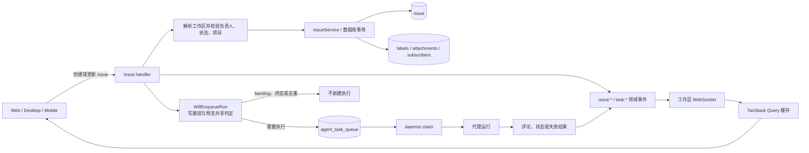
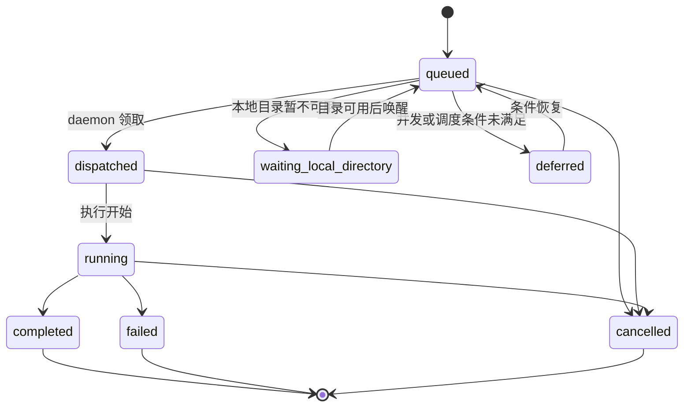

# 任务与 `task` 执行

活跃贡献者：Bohan Jiang、Naiyuan Qing、Jiayuan Zhang

> 本页中的“任务”专指产品实体 `issue`；代码、API 和数据库中的 `task` 指一次代理执行。两者不是同一生命周期，也不应在文档或实现中混用。

## 1. 领域边界

一个 `issue` 是长期存在、可协作编辑的工作记录，包含标题、描述、状态、优先级、项目、父子关系、负责人、标签、附件和修订号。一个 `agent_task_queue` 行则是某个代理的一次执行尝试：它可以由任务创建、负责人变化、状态变化、评论、重跑或其他入口触发，也可以在没有 `issue` 的场景中存在。

| 概念 | 持久化主表 | 身份与生命周期 |
| --- | --- | --- |
| 任务 | `issue` | 工作区内有稳定 UUID、编号和标识符；可反复编辑、评论、归档到终态 |
| 执行 | `agent_task_queue` | 一次排队、领取和运行尝试；同一任务可以有多次执行 |
| 状态目录 | `issue_status` | 自定义 key 映射到一个规范类别，决定筛选和触发语义 |
| 订阅 | `issue_subscriber` | 决定领域事件的收件箱接收者，不等同于负责人 |

核心实现见：

- [API 路由](https://github.com/oldwinter/multica/blob/685cf788777e24724b0d82ffe88c56459341fb2a/server/cmd/server/router.go)
- [任务处理器](https://github.com/oldwinter/multica/blob/685cf788777e24724b0d82ffe88c56459341fb2a/server/internal/handler/issue.go)
- [任务事务服务](https://github.com/oldwinter/multica/blob/685cf788777e24724b0d82ffe88c56459341fb2a/server/internal/service/issue.go)
- [触发判定](https://github.com/oldwinter/multica/blob/685cf788777e24724b0d82ffe88c56459341fb2a/server/internal/service/issue_trigger.go)
- [`task` 队列服务](https://github.com/oldwinter/multica/blob/685cf788777e24724b0d82ffe88c56459341fb2a/server/internal/service/task.go)
- [任务 SQL](https://github.com/oldwinter/multica/blob/685cf788777e24724b0d82ffe88c56459341fb2a/server/pkg/db/queries/issue.sql)
- [`task` SQL](https://github.com/oldwinter/multica/blob/685cf788777e24724b0d82ffe88c56459341fb2a/server/pkg/db/queries/agent.sql)

## 2. 端到端数据流



### 2.1 创建与更新

1. 客户端通过 `X-Workspace-ID` 或工作区 slug 选择租户，路由层先要求工作区成员身份。
2. 处理器解析请求并加载同工作区的状态、项目、父任务和负责人。跨工作区 UUID 不得被写入。
3. 负责人使用二元组 `assignee_type + assignee_id`：
   - `member`：工作区成员；
   - `agent`：代理；
   - `squad`：小队。小队任务由 leader 执行，同时携带小队上下文。
4. 创建服务在事务中协调任务主行、标签、附件和可能的初始执行，避免“任务已创建但关联物未绑定”的半成品。
5. 更新使用 `revision`/`expected_revision` 保护并发编辑；SQL 写入还带 `workspace_id` 条件作为租户隔离的第二道防线。
6. 成功后发布 `issue:created`、`issue:updated`、附件/标签变更等事件；客户端以 Query cache 为服务端状态源。

### 2.2 从任务触发执行

预览端点和真正写入必须复用 `IssueService.WillEnqueueRun`，否则 UI 显示的“将运行”可能与提交结果不同。

常见触发源包括：

- 创建任务时直接分配给 `agent` 或 `squad`；
- 将无代理负责的任务重新分配给代理；
- 把 backlog 类任务推进到可执行的非终态类别；
- `POST /api/issues/{id}/rerun` 显式重跑；
- 评论中的负责人兜底、`@agent`/`@squad` 或会话延续。评论规则详见[评论、附件、搜索与固定项](./comments-attachments-and-search.md)。

重要边界：

- `backlog` 类别不会自动入队。
- 终态类别不会因为普通状态写入自动创建新的执行。
- 待执行去重以任务、代理和输入 head 为依据，避免同一触发被重复排队。
- 状态变化或重新分配不应被理解为“取消所有正在运行的执行”；现有回归测试明确保护 reassignment/no-cancel 和 cancel-status/no-cancel。删除任务才会取消其关联执行并清理依赖。
- 小队负责人不是额外的 `assignee_type`。持久化负责人仍为 `squad`，运行时再解析 leader。

### 2.3 `task` 状态机

当前队列状态包括：

`queued`、`dispatched`、`running`、`waiting_local_directory`、`deferred`、`completed`、`failed`、`cancelled`。



状态迁移由 [`TaskService`](https://github.com/oldwinter/multica/blob/685cf788777e24724b0d82ffe88c56459341fb2a/server/internal/service/task.go) 和 daemon claim/finalize 处理器控制；客户端不能通过改 `issue.status` 伪造执行完成。`issue` 的完成语义和单次 `task` 的成功语义也不能互相替代：一个任务可有失败后重试、多个评论触发或多个历史运行。

## 3. 状态、优先级与位置不变量

### 3.1 状态目录

内置或自定义 status key 最终必须归入且只归入一个规范类别：

| 规范类别 | 典型语义 |
| --- | --- |
| `backlog` | 尚未承诺执行；不自动入队 |
| `todo` | 可开始 |
| `in_progress` | 正在处理 |
| `in_review` | 等待审阅 |
| `done` | 已完成 |
| `blocked` | 受阻但非完成 |
| `cancelled` | 已取消 |

客户端显示应读取工作区 `issue_status` 目录，而不是把自定义 key 当作固定枚举。筛选、触发和“是否关闭”判断使用目录中的类别；API、SQL 和事件仍传递实际 status key。任何成员都可读取目录，只有 `owner`/`admin` 可创建、更新、排序或归档状态，入口见 [issue_status.go](https://github.com/oldwinter/multica/blob/685cf788777e24724b0d82ffe88c56459341fb2a/server/internal/handler/issue_status.go) 和 [issue_status.sql](https://github.com/oldwinter/multica/blob/685cf788777e24724b0d82ffe88c56459341fb2a/server/pkg/db/queries/issue_status.sql)。

### 3.2 优先级

优先级是固定集合：`urgent`、`high`、`medium`、`low`、`none`。不要把它扩展成工作区自定义目录，也不要把展示顺序写成字符串排序。

### 3.3 负责人和权限

- 所有读取和普通写入都必须限定在当前工作区，并经过成员校验。
- `member` 负责人必须仍属于该工作区。
- `agent` 和 `squad` 必须存在于同工作区且未归档。
- 分配代理会产生执行，因此校验使用“可调用”权限，而不仅是“可见”权限。
- 私有代理只能由其 owner 调用；工作区管理员没有隐式越权。代理发起的写入按调用链最初的人类授权者判断。
- 任务状态目录写入需要 `owner`/`admin`，但普通任务编辑不是管理员专属操作。

## 4. API 与数据表

### 4.1 主要 API

所有工作区 API 均要求认证和工作区上下文。完整注册以 [router.go](https://github.com/oldwinter/multica/blob/685cf788777e24724b0d82ffe88c56459341fb2a/server/cmd/server/router.go) 为准。

| 方法与路径 | 作用 | 关键约束 |
| --- | --- | --- |
| `GET /api/issues` | 列表和筛选 | 分页；所有条件都限定工作区 |
| `POST /api/issues/query` | 大型筛选集合的 POST 等价入口 | 避免 URL 过长 |
| `GET /api/issues/{id}` | 按 UUID 或可读标识加载 | 先解析到同工作区实体 |
| `POST /api/issues` | 创建任务 | 可原子绑定标签、附件并触发执行 |
| `POST /api/issues/quick-create` | 快速创建 | 仍执行同样的租户和触发校验 |
| `PUT /api/issues/{id}` | 更新任务 | 支持预期修订；校验负责人、状态和项目 |
| `POST /api/issues/{id}/move` | 调整任务位置/分组 | 服务端维护目标范围内的位置 |
| `DELETE /api/issues/{id}` | 删除任务 | 事务清理依赖并取消关联执行 |
| `POST /api/issues/preview-trigger` | 预览创建/更新是否会运行 | 与写路径共享判定 |
| `POST /api/issues/batch-update` | 批量更新 | 每个任务仍执行作用域和触发规则 |
| `POST /api/issues/batch-delete` | 批量删除 | 不得绕过单项清理语义 |
| `GET /api/issues/{id}/active-task` | 当前活动执行 | 仅是执行投影，不是任务状态 |
| `GET /api/issues/{id}/task-runs` | 历史执行 | 一个任务可返回多行 |
| `POST /api/issues/{id}/tasks/{taskId}/cancel` | 取消指定执行 | 路径中的执行必须属于该任务 |
| `POST /api/issues/{id}/rerun` | 新建重跑 | 重新做运行时权限和去重判定 |
| `GET/POST/PATCH/DELETE /api/issue-statuses…` | 状态目录 | 读为成员级；写为 owner/admin |

### 4.2 关键表

| 表 | 关键列/作用 |
| --- | --- |
| `issue` | `workspace_id`、`number`、`title`、`description`、`status`、`priority`、`assignee_type/id`、`project_id`、`parent_issue_id`、`position`、`revision` |
| `issue_status` | 工作区 status key、名称、规范 `category`、颜色、排序与归档状态 |
| `agent_task_queue` | 一次执行的 agent、issue/source、状态、领取/完成信息、输入 head 和重试上下文 |
| `issue_subscriber` | 收件人、订阅原因和委派层级 |
| `issue_label` | 任务与标签的关联 |
| `attachment` | 可先以任务为 owner，之后绑定评论；详见附件页 |
| `activity` | 审计/时间线投影，不是任务主状态源 |

仓库当前规则禁止新增数据库外键和级联动作。增加关系或删除父实体时，必须在应用事务中显式校验和清理，不能仅靠表设计假设级联。

## 5. Web、Desktop 与 Mobile 入口

### Web / Desktop

- Web 路由壳：
  - [任务列表](https://github.com/oldwinter/multica/blob/685cf788777e24724b0d82ffe88c56459341fb2a/apps/web/app/%5BworkspaceSlug%5D/%28dashboard%29/issues/page.tsx)
  - [任务详情](https://github.com/oldwinter/multica/blob/685cf788777e24724b0d82ffe88c56459341fb2a/apps/web/app/%5BworkspaceSlug%5D/%28dashboard%29/issues/%5Bid%5D/page.tsx)
- Web 与 Desktop 共享：
  - [任务页面](https://github.com/oldwinter/multica/blob/685cf788777e24724b0d82ffe88c56459341fb2a/packages/views/issues/components/issues-page.tsx)
  - [列表/看板/表格 surface](https://github.com/oldwinter/multica/blob/685cf788777e24724b0d82ffe88c56459341fb2a/packages/views/issues/surface/issue-surface.tsx)
  - [任务详情](https://github.com/oldwinter/multica/blob/685cf788777e24724b0d82ffe88c56459341fb2a/packages/views/issues/components/issue-detail.tsx)
  - [执行记录](https://github.com/oldwinter/multica/blob/685cf788777e24724b0d82ffe88c56459341fb2a/packages/views/issues/components/execution-log-section.tsx)
- 服务端状态由 [`packages/core/issues`](https://github.com/oldwinter/multica/tree/685cf788777e24724b0d82ffe88c56459341fb2a/packages/core/issues) 的 Query/Mutation 和 realtime updaters 管理；Views 不直接维护第二份任务数据。

Desktop 复用同一 Views/Core 业务层，只在路由和系统集成层不同。修改共享任务行为时不要在 `apps/web` 与 `apps/desktop` 各写一套。

### Mobile

Mobile 独立实现 UI、queries、mutations 和 realtime，不导入 Web 的 hooks：

- [任务列表](https://github.com/oldwinter/multica/blob/685cf788777e24724b0d82ffe88c56459341fb2a/apps/mobile/app/%28app%29/%5Bworkspace%5D/%28tabs%29/my-issues.tsx)
- [任务详情](https://github.com/oldwinter/multica/blob/685cf788777e24724b0d82ffe88c56459341fb2a/apps/mobile/app/%28app%29/%5Bworkspace%5D/issue/%5Bid%5D.tsx)
- [执行记录](https://github.com/oldwinter/multica/blob/685cf788777e24724b0d82ffe88c56459341fb2a/apps/mobile/app/%28app%29/%5Bworkspace%5D/issue/%5Bid%5D/runs.tsx)
- [Mobile 查询](https://github.com/oldwinter/multica/blob/685cf788777e24724b0d82ffe88c56459341fb2a/apps/mobile/data/queries/issues.ts)
- [Mobile 写入](https://github.com/oldwinter/multica/blob/685cf788777e24724b0d82ffe88c56459341fb2a/apps/mobile/data/mutations/issues.ts)
- [Mobile realtime](https://github.com/oldwinter/multica/blob/685cf788777e24724b0d82ffe88c56459341fb2a/apps/mobile/data/realtime/use-issue-realtime.ts)

“独立”不代表语义可漂移：负责人类型、状态类别、终态判断、触发结果、未读数量和权限必须与服务端/Web 一致。

## 6. 修改指南

### 改任务字段或 API

1. 先更新迁移、SQL 和 sqlc；关系清理由应用事务负责。
2. 更新 handler/service 的请求、响应和作用域校验。
3. 更新 `packages/core` 类型、zod schema 和 API 解析；已安装 Desktop 会连接较新后端，新增字段必须可选并提供安全默认值。
4. 更新共享 Views。
5. 单独更新 Mobile schema、queries、mutations 和页面。
6. 检查 `issue:*` 事件 payload、revision 接纳规则和受影响的 Query keys。

### 改触发或 `task` 状态

1. 把预览和提交的共同规则放在 `IssueService.WillEnqueueRun`/`TaskService`，不要复制到 UI。
2. 明确 backlog、终态、已有 pending task、私有代理、小队 leader、无可用 runtime 和项目资源的结果。
3. 不要用任务状态变化隐式取消运行中的 `task`；若确需更改，必须同时修改取消语义和回归测试。
4. 新增队列状态时同步 daemon claim/finalize、协议事件、Core schema、Web/Desktop 和 Mobile 枚举的 `default` 分支。

### 改状态目录

1. 保持“实际 key → 唯一规范 category”不变量。
2. 更新服务端筛选、搜索关闭态、触发判定和完成统计。
3. 更新 Core 的 `status-behavior` helper，而不是在多个组件散落字符串比较。
4. 验证 Mobile 使用 category 而不是只识别七个旧 key。

## 7. 测试与验证

服务端定向测试：

```bash
(cd server && go test ./internal/handler -run 'Test(Issue|IssueStatus|IssueTrigger|IssueReassign|IssueCancelStatus|Squad.*Trigger|DaemonClaimIssue)' -count=1)
(cd server && go test ./internal/service -run 'Test.*(Issue|Task|Enqueue|Cancel)' -count=1)
```

前端共享行为：

```bash
pnpm exec vitest run \
  packages/core/issues/status-behavior.test.ts \
  packages/core/issues/batch.test.ts \
  packages/core/issues/revision-realtime.test.ts \
  packages/core/issues/ws-updaters.test.ts
```

涉及 UI 或 Mobile 时，再运行相应组件/应用测试，并至少手工验证：

- 自定义 backlog key 不触发执行，推进到 active category 后按预览入队；
- `agent`、`squad`、私有代理和跨工作区 UUID 的权限矩阵；
- 重新分配和 `cancelled` 状态不会误杀已有运行，删除会取消；
- Web/Desktop/Mobile 对同一 status category、负责人和活动执行显示一致；
- 重连后 realtime 事件不会让旧 revision 覆盖新快照。
