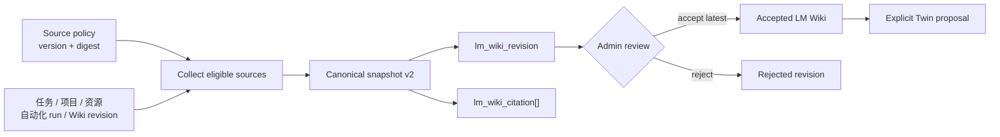
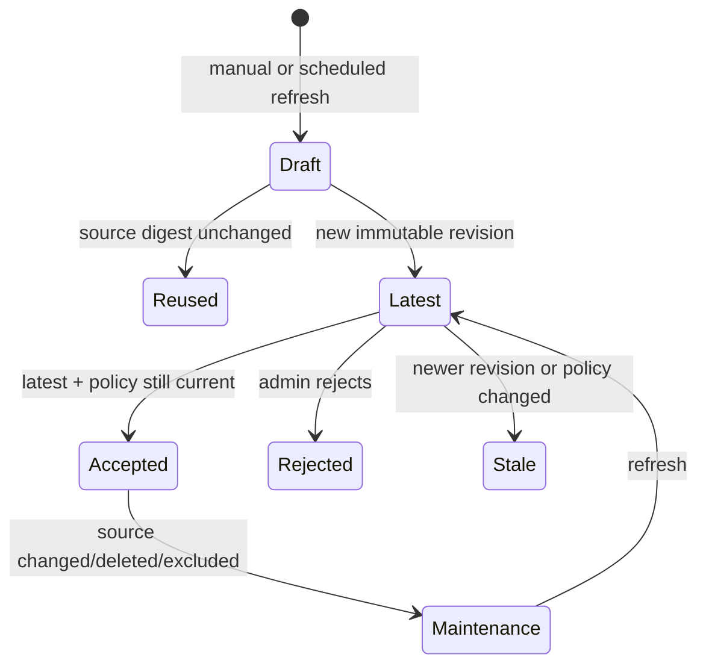

# LM Wiki 与 evidence

活跃贡献者：oldwinter

LM Wiki 把工作区里可共享、可追溯的对象冻结成 canonical knowledge snapshot。它不是 Workspace Wiki 的别名，也不是自动覆盖的“最新摘要”：每个 revision 都绑定 source policy、source digest 和 citation，必须经过管理员人工审核后才能成为 Twin 的上游证据。

## 从业务对象到 canonical snapshot

核心实现分布在 [`server/internal/service/lm_wiki.go`](../../server/internal/service/lm_wiki.go)、[`server/internal/service/lm_wiki_domain.go`](../../server/internal/service/lm_wiki_domain.go)、[`server/internal/service/lm_wiki_sources.go`](../../server/internal/service/lm_wiki_sources.go) 和 [`server/internal/service/lm_wiki_policy.go`](../../server/internal/service/lm_wiki_policy.go)。HTTP 边界在 [`server/internal/handler/lm_wiki.go`](../../server/internal/handler/lm_wiki.go)，sqlc 查询在 [`server/pkg/db/queries/lm_wiki.sql`](../../server/pkg/db/queries/lm_wiki.sql)。

Refresh 在数据库 Repeatable Read 事务中采集来源，并同时持有工作区级锁与 LM Wiki advisory lock，避免两个手动/定时任务为同一时刻写出相互竞争的 revision。它计算 canonical `source_digest`；如果来源与 policy identity 没变，可以复用最新 revision，而不是制造没有语义变化的版本。

## Source policy

Policy 决定哪些来源能进入 snapshot，而不是事后从生成文本里删内容。支持的 source type 为：

| source type | 固定对象 | citation 定位 |
| --- | --- | --- |
| `issue` | 工作区内任务及其可共享状态 | 任务 UUID 与更新时间 |
| `project` | 项目元数据 | 项目 UUID |
| `project_resource` | 项目资源的允许内容 | 资源 UUID 与 locator |
| `autopilot_run` | 自动化执行记录 | run UUID |
| `wiki_page` | 共享 Wiki 的精确 revision | page + immutable revision identity |

`wiki_page` 不是引用 live page。管理员通过 pin endpoint 选择一个具体 `wiki_page_revision`；页面以后更新时，旧 LM Wiki citation 仍指向当时审核过的内容。Personal Wiki 永久排除，因为它的 `workspace_id` 为空且只属于个人；标记为 `local_only` 的资源也永久排除，避免本机路径、私有上下文或守护进程状态进入共享 evidence。

Policy 本身带 version/digest。接受 revision 时会再次比较当前 policy identity；即使 source content 没变，只要 policy 已更新，旧 revision 也会变成 `policy_stale`，不能被签收为当前 canonical knowledge。

## Snapshot 与 citation 模型

基础表由 [`server/migrations/265_lm_wiki_tables.up.sql`](../../server/migrations/265_lm_wiki_tables.up.sql) 引入，知识循环和 Wiki source 支持在 [`server/migrations/414_wiki_knowledge_loop.up.sql`](../../server/migrations/414_wiki_knowledge_loop.up.sql) 中扩展，egress 兼容规则位于 [`server/migrations/455_wiki_evidence_egress_compatibility.up.sql`](../../server/migrations/455_wiki_evidence_egress_compatibility.up.sql)。

| 表 | 主要内容 | 语义 |
| --- | --- | --- |
| `lm_wiki_source_policy` | source 开关、Wiki pin、policy version/digest | 当前采集边界 |
| `lm_wiki_revision` | revision number、schema version、source digest、canonical JSON、trigger kind | 不可变 snapshot |
| `lm_wiki_citation` | ordinal、citation key、source type/id/revision、locator、safe metadata、digest | snapshot 中每条事实的来源 |
| `lm_wiki_review` | `accepted`/`rejected`、reviewer、reason、时间 | 人工决定 |

当前 canonical snapshot schema v2 除业务内容外，还记录：

- `source_digest`，证明输入集合及其可共享投影；
- source policy version 与 digest；
- remote generation 是否参与，供审计与兼容判断；
- 与 `lm_wiki_citation` 对齐的 citation rows；
- source revision/更新时间等 freshness identity。

Citation 的 `safe_metadata` 有大小与对象形状限制。它保存展示和定位所需的最少信息，不是把原始对象或 secret 搬进一个通用 JSONB 出口。

## Refresh 与审核生命周期

1. **触发**：`manual` 由管理员调用；`scheduled` 由 [`server/internal/service/lm_wiki.go`](../../server/internal/service/lm_wiki.go) 的 reconcile/scheduler wiring 每日检查。
2. **采集**：在一致性快照中加载 policy 和 eligible sources，固定 Wiki revision，并为每个 source 生成 citation。
3. **去重**：比较 source digest 与最新 revision。相同时返回已有 revision；不同时写入下一个 revision number。
4. **审核**：只能 accept 当前最新 revision，并要求 policy version/digest 仍与生成时一致。
5. **冲突**：不是最新、policy 已变或 freshness identity 失配时返回 stale conflict，调用者必须刷新后重新审核。
6. **拒绝**：记录 `rejected` review，不改变其他历史 revision。

接受 LM Wiki 不会自动创建或启用 Twin。管理员还需显式生成 Twin proposal、审核 signed version、preview briefing 并设置 binding，详见 [Twin](twin.md)。

## Knowledge readiness 与维护队列

[`server/internal/service/wiki_knowledge_readiness.go`](../../server/internal/service/wiki_knowledge_readiness.go) 把每个被 policy 关注的 Wiki source 分类，供 UI 和 activation gate 使用：

| 状态 | 含义 | 处理 |
| --- | --- | --- |
| `pinned` / current | pin 指向当前可用 revision | 无需动作 |
| newer | 页面已有比 pin 更新的 revision | 审查后重新 pin |
| deleted | page 或 revision 已删除/不可达 | 移除或替换 source |
| excluded | source 因 scope、`local_only` 或 policy 不可用 | 不能进入 snapshot |
| `policy_stale` | accepted revision 的 policy identity 已过期 | refresh 并重新审核 |

`GET /api/wiki/knowledge-readiness` 聚合这些事实；Web/Desktop 的 [`packages/views/wiki/wiki-knowledge-maintenance-queue.tsx`](../../packages/views/wiki/wiki-knowledge-maintenance-queue.tsx) 将待处理项显示成 maintenance queue。这个 readiness 是“知识证据能否继续使用”的事实，不等于 Twin 已激活；完整 activation 链还会检查 signed Twin、preview、binding、attributed run、feedback 和 deposition。

## HTTP API 与权限

所有端点先要求工作区成员。读操作对成员开放；policy、refresh 和 review 要求 `owner` 或 `admin`，并且必须是 human actor。

| 方法与路径 | 用途 | 权限 |
| --- | --- | --- |
| `GET /api/lm-wiki` | 当前 LM Wiki、revision 与 review 概览 | member |
| `GET /api/lm-wiki/source-policy` | 读取 source policy | member |
| `GET /api/lm-wiki/revisions/{revisionId}` | 读取 immutable snapshot/citations | member |
| `PUT /api/lm-wiki/source-policy` | 更新 source policy | human `owner`/`admin` |
| `PUT /api/lm-wiki/source-policy/wiki-pages/{pageId}/revisions/{revisionId}` | pin 精确 Wiki revision | human `owner`/`admin` |
| `POST /api/lm-wiki/refresh` | 手动 reconcile | human `owner`/`admin` |
| `POST /api/lm-wiki/revisions/{revisionId}/accept` | 接受最新且 policy-current revision | human `owner`/`admin` |
| `POST /api/lm-wiki/revisions/{revisionId}/reject` | 拒绝 revision | human `owner`/`admin` |
| `GET /api/wiki/knowledge-readiness` | 读取 Wiki source readiness | member |

`server/cmd/server/router.go` 把管理员中间件放在 mutation group 外层，handler 内的 freshness 检查则防止授权用户接受技术上已经过期的 revision。授权和新鲜度是两道不同的门。

## Web、Desktop 与 Mobile

Web/Desktop 通过 [`packages/views/wiki/lm-wiki-source-policy-panel.tsx`](../../packages/views/wiki/lm-wiki-source-policy-panel.tsx)、[`packages/views/wiki/wiki-knowledge-activation.tsx`](../../packages/views/wiki/wiki-knowledge-activation.tsx) 和 maintenance queue 管理 source policy、pin、refresh 与 review。二者共用 [`packages/core/wiki`](../../packages/core/wiki/) 的 schema、Query 和 mutation。

Mobile 没有复用 Web 组件，但 Wiki data layer 包含 LM Wiki schema、revision pinning、activation 查询和 realtime invalidation；入口集中在 [`apps/mobile/components/wiki/use-wiki-knowledge-activation.ts`](../../apps/mobile/components/wiki/use-wiki-knowledge-activation.ts)、[`apps/mobile/data/queries/wiki.ts`](../../apps/mobile/data/queries/wiki.ts) 与 [`apps/mobile/data/mutations/wiki.ts`](../../apps/mobile/data/mutations/wiki.ts)。手机端能力应以这些实际路由为准，不应假定它拥有 Web 的整套双栏 maintenance UI。

## 扩展与安全规则

- 新 source type 必须定义 canonical projection、stable source identity、digest、citation locator、tenant authorization 和 egress allowlist。
- 任何会变化的 source 都必须 pin 到 revision/generation identity；只存对象 UUID 不足以重放历史 snapshot。
- Policy 变化必须改变 policy digest，并让旧 revision 进入 stale，而不是继续沿用旧 review。
- Scheduler 必须复用手动 refresh 的同一 Service；不要实现第二套采集规则。
- 生成器输出不能成为唯一事实来源。可审核 content、citation rows、source digest 和 policy identity 必须一起落库。
- `personal_wiki`、`local_only`、secret、本机路径和 daemon/profile 信息保持 fail-closed 排除。

## 测试入口

| 测试 | 覆盖重点 |
| --- | --- |
| [`server/internal/service/lm_wiki_test.go`](../../server/internal/service/lm_wiki_test.go) | refresh、digest 去重、事务与 review |
| [`server/internal/service/lm_wiki_domain_test.go`](../../server/internal/service/lm_wiki_domain_test.go) | canonical schema 与 citation |
| [`server/internal/service/lm_wiki_policy_test.go`](../../server/internal/service/lm_wiki_policy_test.go) | policy identity、排除项与 stale |
| [`server/internal/service/lm_wiki_events_test.go`](../../server/internal/service/lm_wiki_events_test.go) | reconcile/event 行为 |
| [`server/internal/service/wiki_knowledge_readiness_test.go`](../../server/internal/service/wiki_knowledge_readiness_test.go) | newer/deleted/excluded/policy-stale 分类 |
| [`server/internal/handler/lm_wiki_test.go`](../../server/internal/handler/lm_wiki_test.go) | API、权限与冲突 |
| [`server/internal/handler/lm_wiki_persistence_test.go`](../../server/internal/handler/lm_wiki_persistence_test.go) | DB 持久化 contract |
| [`packages/views/wiki/lm-wiki-source-policy-panel.test.tsx`](../../packages/views/wiki/lm-wiki-source-policy-panel.test.tsx) | Web/Desktop policy UI |

## 关键源文件

| 文件 | 用途 |
| --- | --- |
| [`server/internal/service/lm_wiki.go`](../../server/internal/service/lm_wiki.go) | refresh、review、调度与事务 |
| [`server/internal/service/lm_wiki_domain.go`](../../server/internal/service/lm_wiki_domain.go) | canonical snapshot schema |
| [`server/internal/service/lm_wiki_sources.go`](../../server/internal/service/lm_wiki_sources.go) | source adapter 与 citation 采集 |
| [`server/internal/service/lm_wiki_policy.go`](../../server/internal/service/lm_wiki_policy.go) | source policy 与 egress |
| [`server/internal/service/wiki_knowledge_readiness.go`](../../server/internal/service/wiki_knowledge_readiness.go) | readiness/maintenance 分类 |
| [`server/internal/handler/lm_wiki.go`](../../server/internal/handler/lm_wiki.go) | LM Wiki HTTP 边界 |
| [`server/pkg/db/queries/lm_wiki.sql`](../../server/pkg/db/queries/lm_wiki.sql) | LM Wiki sqlc repository |
