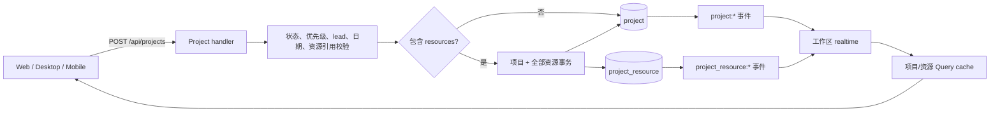
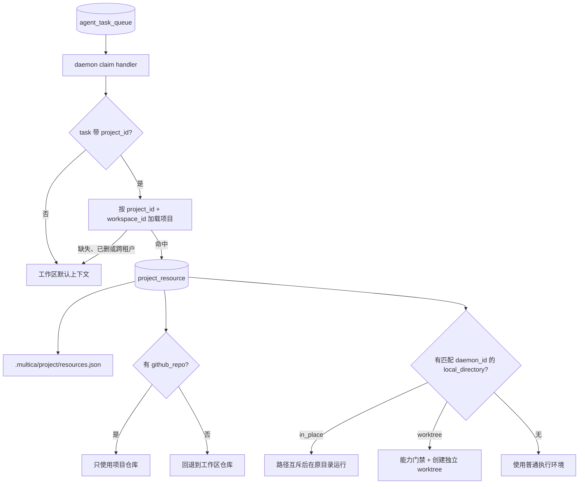

# 项目与资源

活跃贡献者：Bohan Jiang、Naiyuan Qing、Jiayuan Zhang

项目把一组任务、负责人和外部执行上下文组织在一起；项目资源则告诉代理“这个项目可以使用哪些仓库或本地目录”。资源不是项目响应中的嵌套快照，而是独立、可排序的子集合。

## 1. 数据模型

### 1.1 项目

`project` 保存以下长期元数据：

- 标题、描述和图标；
- 生命周期状态：`planned`、`in_progress`、`paused`、`completed`、`cancelled`；
- 优先级：`urgent`、`high`、`medium`、`low`、`none`；
- 多态负责人：`lead_type + lead_id`；
- `start_date`、`due_date`，均为无时区、无时刻的 `YYYY-MM-DD` 日历日期；
- 派生统计 `issue_count`、`done_count`；
- 派生资源计数 `resource_count`。

项目详情响应只返回元数据和计数。需要资源正文的客户端再读取 `/api/projects/{id}/resources`，从而避免父对象和子集合缓存互相覆盖。

### 1.2 项目资源

`project_resource` 的通用结构是：

| 字段 | 语义 |
| --- | --- |
| `project_id` / `workspace_id` | 双重作用域；资源必须属于项目所在工作区 |
| `resource_type` | 当前支持 `github_repo`、`local_directory` |
| `resource_ref` | 按类型解释的 JSONB，不是任意透传 JSON |
| `label` | 通用显示名 |
| `position` | 同一项目中的排序 |
| `created_by` | 创建者；用于审计，不代表只有创建者可读 |

当前合法引用：

```json
{
  "resource_type": "github_repo",
  "resource_ref": {
    "url": "https://github.com/example/repo.git",
    "default_branch_hint": "main",
    "ref": "optional-branch-or-tag"
  }
}
```

```json
{
  "resource_type": "local_directory",
  "resource_ref": {
    "local_path": "/absolute/path/to/repo",
    "daemon_id": "machine-registration-id",
    "label": "optional legacy display name",
    "execution_mode": "in_place"
  }
}
```

实现入口：

- [项目处理器](https://github.com/oldwinter/multica/blob/685cf788777e24724b0d82ffe88c56459341fb2a/server/internal/handler/project.go)
- [项目资源处理器与 claim 上下文](https://github.com/oldwinter/multica/blob/685cf788777e24724b0d82ffe88c56459341fb2a/server/internal/handler/project_resource.go)
- [项目 SQL](https://github.com/oldwinter/multica/blob/685cf788777e24724b0d82ffe88c56459341fb2a/server/pkg/db/queries/project.sql)
- [资源 SQL](https://github.com/oldwinter/multica/blob/685cf788777e24724b0d82ffe88c56459341fb2a/server/pkg/db/queries/project_resource.sql)
- [API 路由](https://github.com/oldwinter/multica/blob/685cf788777e24724b0d82ffe88c56459341fb2a/server/cmd/server/router.go)

## 2. 创建、读取与 realtime 流



### 2.1 原子创建

`POST /api/projects` 可携带 `resources`：

- 没有资源时走简单项目插入。
- 有资源时，项目与所有资源在一个事务中创建；任何资源引用非法或插入失败，整个项目创建回滚。
- 创建响应可以一次性回显刚创建的资源，但这只是 create echo。后续 `GET /api/projects/{id}` 仍只返回项目元数据和 `resource_count`。
- 提交后分别发布 `project:created` 与 `project_resource:created`，不要在事务提交前让客户端观察到未完成对象。

### 2.2 更新与删除

- 普通工作区成员可读取、创建和更新项目，也可管理项目资源。
- 删除项目额外要求 `owner` 或 `admin`。
- 删除流程先锁定项目并在应用事务中清理软关联；不要给新关系增加数据库级级联来代替应用清理。
- 更新日期时，“字段缺失”表示保留旧值，“显式 `null`/空值”表示清除；创建和更新都只接受 `YYYY-MM-DD`。
- `lead_type` 与 `lead_id` 是一个逻辑整体。解析 UUID 后还要验证目标在当前工作区，不能只依赖客户端 picker。

### 2.3 统计

`issue_count` 和 `done_count` 由任务投影计算，不存储为项目自己的可写真值。`done_count` 依据工作区当前状态目录中的终态 category，而不是只比较字面量 `done`。状态目录无法加载时，服务端才回退到规范 key `done`/`cancelled`。

## 3. 资源校验不变量

### 3.1 `github_repo`

- `url` 必填并去除首尾空白。
- 接受 `http(s)://`、`ssh://` 和 `git@host:owner/repo.git` 形式。
- `default_branch_hint`、`ref` 是提示/选择信息，实际 checkout 失败仍由 Git/daemon 返回。
- 项目至少有一个 `github_repo` 时，这组仓库是该项目执行的权威 repo 集合；不要与工作区仓库合并。

### 3.2 `local_directory`

- `local_path` 必须看起来是绝对路径：POSIX `/…`、Windows 盘符路径或 UNC 路径。
- `daemon_id` 必填；相同字符串路径在不同机器上是不同资源。
- 服务端只能做格式校验，目录存在性、是否为 Git working tree 由拥有该文件系统的 daemon 在运行时验证。
- 每个 `(project, daemon_id)` 最多一个 `local_directory`。仅依赖完整 JSON 唯一约束不够，因为同一 daemon 的不同路径或 label 仍会冲突；处理器必须显式扫描并返回 `409`。
- `resource_type` 创建后不可修改；改变类型应删除并重新添加。
- 新增类型必须在 API 边界加入明确校验。不要利用 JSONB 让拼写错误或客户端尚不理解的结构进入数据库。

### 3.3 执行模式

| 模式 | 行为 | 并发/交付 |
| --- | --- | --- |
| `in_place` | 直接在用户目录运行 | daemon 按路径串行；修改落入现有 working tree |
| `worktree` | 每次 `task` 建独立 Git worktree | 同目录可并发；以分支/隔离工作区交付 |

未提供 `execution_mode` 时按 `in_place` 解释，以保持旧资源语义。

选择 `worktree` 时必须同时满足：

1. 保存资源时，该 `daemon_id` 最新上报的 runtime 明确声明 worktree capability；否则返回 `422` 和 `daemon_version_unsupported`。
2. claim 时再次检查能力，防止资源保存后 daemon 降级。
3. daemon 在真实文件系统上确认目标是可建立 worktree 的 Git 仓库。

能力判断使用同一机器最新 `last_seen_at` 的 runtime，而不是“历史上任意一行曾支持”。否则 daemon 降级后，旧 capability 行会产生危险的假阳性。

兼容旧 Desktop 的 rename 流程时，资源 label 可能曾同时存在于顶层 `label` 与 `resource_ref.label`。更新实现会区分“只重命名”和“真正修改执行引用”，防止一次旧客户端重命名意外删除它不认识的新字段。新代码应优先写顶层 `label`，但保留服务器现有的收敛逻辑。

## 4. daemon claim 上下文



`project_id` 是软引用，但软引用不等于可跨租户：

- `resolveClaimProjectContext` 只按任务工作区加载项目和资源。
- 找不到、已删除或属于其他工作区的项目引用降级为“无项目”，继续使用工作区上下文；不得泄漏另一个租户的标题、资源或 repo。
- 数据库读取失败不是“无项目”：claim 必须保留任务等待重投，不能在瞬时错误时静默改用另一套仓库。
- 有项目但没有 `github_repo` 时也使用工作区仓库。
- 有项目且至少一个 `github_repo` 时，项目仓库整体覆盖工作区仓库；混合两套来源会让代理无法判断权威 checkout。
- 资源清单同时进入 claim wire response 和执行环境中的 `.multica/project/resources.json`。

此逻辑由所有 issue、chat、autopilot、quick-create claim 路径共用。新增 claim 入口时必须复用解析器，不能复制一套稍有不同的 fallback。

## 5. API 与数据表

### 5.1 API

| 方法与路径 | 作用 | 权限/注意事项 |
| --- | --- | --- |
| `GET /api/projects` | 列出项目 | 成员；可按 status/priority 过滤 |
| `GET /api/projects/search` | 搜索项目 | 成员；搜索规则见搜索页 |
| `POST /api/projects` | 创建项目，可内嵌 resources | 成员；内嵌资源全有或全无 |
| `GET /api/projects/{id}` | 项目详情与计数 | 成员；不内嵌资源列表 |
| `PUT /api/projects/{id}` | 更新项目 | 成员；日期可显式清空 |
| `DELETE /api/projects/{id}` | 删除项目 | 仅 `owner`/`admin` |
| `GET /api/projects/{id}/resources` | 资源列表 | 成员；按 `position, created_at` |
| `POST /api/projects/{id}/resources` | 添加资源 | 成员；类型、引用、daemon 能力校验 |
| `PUT /api/projects/{id}/resources/{resourceId}` | 修改引用/label/position | 成员；不能改变类型 |
| `DELETE /api/projects/{id}/resources/{resourceId}` | 删除资源 | 成员；资源必须属于路径中的项目和工作区 |

### 5.2 表

| 表 | 用途 |
| --- | --- |
| `project` | 项目元数据和生命周期 |
| `project_resource` | 多态资源引用、排序和创建者 |
| `issue` | `project_id` 软关联；项目统计的数据来源 |
| `workspace` | `repos` JSON 是没有项目 repo 覆盖时的 claim fallback |
| `agent_runtime` | `daemon_id`、`last_seen_at`、版本和 capability |
| `agent_task_queue` | 携带执行的项目引用，并触发 claim 上下文解析 |

所有资源 SQL 都应带项目或工作区约束；只按全局资源 UUID 写入会形成跨租户漏洞。

## 6. Web、Desktop 与 Mobile 入口

### Web / Desktop

- Web 路由：
  - [项目列表](https://github.com/oldwinter/multica/blob/685cf788777e24724b0d82ffe88c56459341fb2a/apps/web/app/%5BworkspaceSlug%5D/%28dashboard%29/projects/page.tsx)
  - [项目详情](https://github.com/oldwinter/multica/blob/685cf788777e24724b0d82ffe88c56459341fb2a/apps/web/app/%5BworkspaceSlug%5D/%28dashboard%29/projects/%5Bid%5D/page.tsx)
- 共享 Views：
  - [项目页面](https://github.com/oldwinter/multica/blob/685cf788777e24724b0d82ffe88c56459341fb2a/packages/views/projects/components/projects-page.tsx)
  - [项目详情](https://github.com/oldwinter/multica/blob/685cf788777e24724b0d82ffe88c56459341fb2a/packages/views/projects/components/project-detail.tsx)
  - [资源管理](https://github.com/oldwinter/multica/blob/685cf788777e24724b0d82ffe88c56459341fb2a/packages/views/projects/components/project-resources-section.tsx)
  - [本地目录模式对话框](https://github.com/oldwinter/multica/blob/685cf788777e24724b0d82ffe88c56459341fb2a/packages/views/projects/components/local-directory-mode-dialog.tsx)
- Core 数据层：
  - [项目 queries](https://github.com/oldwinter/multica/blob/685cf788777e24724b0d82ffe88c56459341fb2a/packages/core/projects/queries.ts)
  - [项目 mutations](https://github.com/oldwinter/multica/blob/685cf788777e24724b0d82ffe88c56459341fb2a/packages/core/projects/mutations.ts)

Web 与 Desktop 共享业务视图。目录选择器、daemon 发现或桌面文件系统能力可以留在 Desktop 平台层，但写给服务器的资源结构和门禁结果必须相同。

### Mobile

Mobile 独立镜像项目与资源：

- [项目列表](https://github.com/oldwinter/multica/blob/685cf788777e24724b0d82ffe88c56459341fb2a/apps/mobile/app/%28app%29/%5Bworkspace%5D/more/projects.tsx)
- [项目详情](https://github.com/oldwinter/multica/blob/685cf788777e24724b0d82ffe88c56459341fb2a/apps/mobile/app/%28app%29/%5Bworkspace%5D/project/%5Bid%5D.tsx)
- [添加资源](https://github.com/oldwinter/multica/blob/685cf788777e24724b0d82ffe88c56459341fb2a/apps/mobile/app/%28app%29/%5Bworkspace%5D/project/%5Bid%5D/add-resource.tsx)
- [项目 queries](https://github.com/oldwinter/multica/blob/685cf788777e24724b0d82ffe88c56459341fb2a/apps/mobile/data/queries/projects.ts)
- [项目 mutations](https://github.com/oldwinter/multica/blob/685cf788777e24724b0d82ffe88c56459341fb2a/apps/mobile/data/mutations/projects.ts)
- [Mobile 资源区](https://github.com/oldwinter/multica/blob/685cf788777e24724b0d82ffe88c56459341fb2a/apps/mobile/components/project/project-resources-section.tsx)

Mobile 无法替用户验证另一台机器的本地路径；它只能提交/展示同一 API 模型，并正确呈现 capability、冲突和 daemon 不在线错误。

## 7. 修改指南

### 增加资源类型

1. 在 `validateAndNormalizeResourceRef` 中加入严格、向后兼容的 JSON 规范化。
2. 定义 daemon claim wire shape 和执行环境消费规则。
3. 更新 Core zod schema、共享 Views renderer/editor。
4. 独立更新 Mobile schema、renderer/editor。
5. 决定它是否改变 repo precedence、工作目录或权限；不要默认照搬 `github_repo`。
6. 添加 handler、claim、跨工作区、未知字段和旧客户端兼容测试。

### 改本地目录/Worktree

1. 保存门禁和 claim 门禁必须同时修改。
2. capability 必须按最新 runtime、指定 `daemon_id` 判断并 fail closed。
3. 不要把远端服务端的路径格式检查写成“文件存在”检查。
4. 验证旧客户端只改 label 时不会重写/丢失 `execution_mode`。
5. 分别覆盖 `in_place` 串行和 `worktree` 并发/分支交付。

### 改项目统计或删除

1. 使用状态目录 category 计算终态。
2. 保持统计为派生投影，不新增可漂移的手工计数真值。
3. 删除关系通过应用事务显式处理，并维持 `owner`/`admin` 门禁。
4. 检查 task/chat 中的软项目引用在删除后仍安全降级。

## 8. 测试与验证

```bash
(cd server && go test ./internal/handler -run 'Test(Project|ProjectResource|ClaimProjectContext|WorktreeClaimGate|IssueUpdateProjectScope)' -count=1)
pnpm exec vitest run \
  packages/views/projects/components/projects-page.test.tsx \
  packages/views/projects/components/project-detail.test.tsx \
  packages/views/projects/components/project-resources-rename.test.tsx \
  packages/views/projects/components/local-directory-mode-dialog.test.tsx
```

手工或集成验证重点：

- 创建项目并内嵌多个资源时，任一非法资源会让项目整体回滚；
- 同一 daemon 第二个本地目录返回 `409`，不同 daemon 可各有一个；
- 不支持 capability 的 daemon 无法保存或领取 `worktree` 资源；
- 有项目 repo 时不混入工作区 repo，无项目 repo 时正确 fallback；
- 跨工作区/已删除 `project_id` 不泄漏项目上下文；
- Web/Desktop/Mobile 对日期清除、resource count、label 和执行模式显示一致。

## 相关页面

- [任务与 task 执行](issues-and-tasks.md)
- [应用层总览](../apps/index.md)
