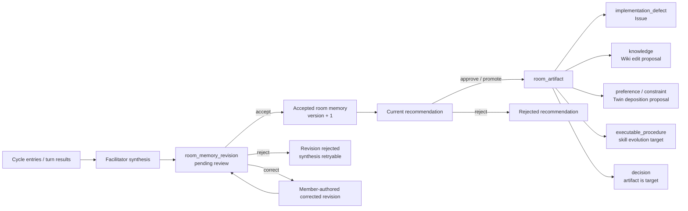
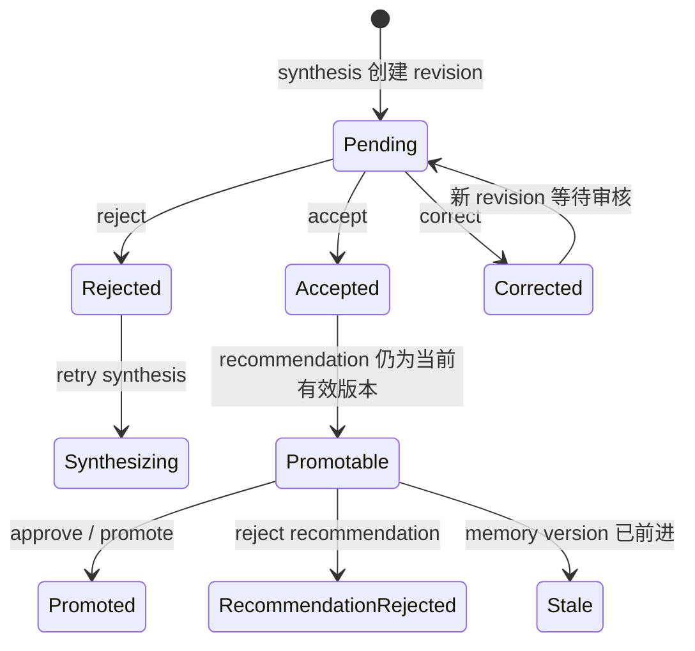
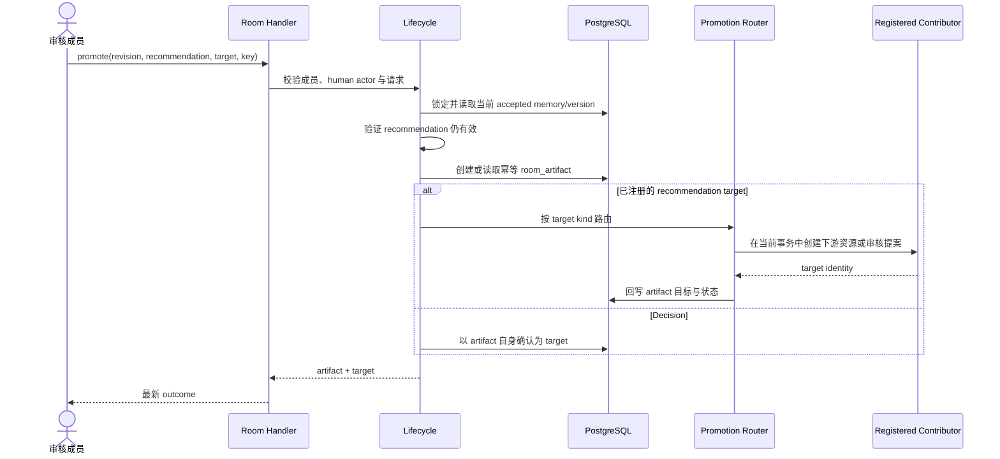

# Room 人工审核与晋升

活跃贡献者：Bohan Jiang、Naiyuan Qing、Jiayuan Zhang

Room 的执行结果不会自动成为团队事实。facilitator 先把 cycle 的 entries 综合为结构化 memory revision；成员再接受、拒绝或修正；只有已接受且仍有效的 recommendation 才能晋升。实现缺陷可创建任务，knowledge 可创建待人工审核的 Wiki 修改提案，decision 以 artifact 本身落地；其他 recommendation kind 进入各自注册的审核流程。这个设计把模型输出、人工判断和下游资源分成可审计的三个阶段。

## 从综合到下游资源



`room_artifact` 是晋升审计记录，不只是下游资源 ID。服务端先建立 artifact，再由 target router/contributor 在同一数据库事务中创建目标并回写 `target_id`；提交后才发布目标事件。这样可以同时保留来源、幂等 key、目标身份和失败边界。

## Synthesis 合同

综合实现位于 [`server/internal/room/synthesis.go`](https://github.com/oldwinter/multica/blob/685cf788777e24724b0d82ffe88c56459341fb2a/server/internal/room/synthesis.go)，持久化位于 [`server/internal/room/synthesis_store.go`](https://github.com/oldwinter/multica/blob/685cf788777e24724b0d82ffe88c56459341fb2a/server/internal/room/synthesis_store.go)。模型输出必须满足严格 schema，而不是任意 Markdown：

- 结论只能引用当前 cycle 中真实存在的 entry ID。
- confidence 和 recommendation kind 必须属于协议允许的值。
- recommendation 需要稳定 key，后续审核和晋升以它定位。
- canonical digest 根据规范化内容生成；服务端校验 digest，防止同一语义因字段顺序或文本包装产生不一致身份。
- 无法解析、引用越界或 digest 不一致都属于 synthesis 失败，不能进入人工审核。

综合通过后创建 `room_memory_revision`，cycle phase 进入 `awaiting_review`。此时 revision 只是候选结论，不能用于表示 Room 已接受的 memory。

## Revision 状态机



### Accept

接受操作会原子地：

1. 确认 revision 仍是当前待审核版本。
2. 更新 Room 的 accepted memory 与 memory version。
3. 标记 revision 已接受。
4. 完成对应 cycle。

### Reject

拒绝标记该 revision 不被采纳，并把综合步骤置为可重试。它不删除原始 entries，也不把 cycle 当作一次全新运行。需要重新执行所有参与者时，应创建新 cycle。

### Correct

修正会创建一个由成员署名的新 revision，保留原 revision 与修正来源；修正版仍处于待审核状态。它不会绕过第二次确认直接写入 accepted memory。

审核编排位于 [`server/internal/room/lifecycle.go`](https://github.com/oldwinter/multica/blob/685cf788777e24724b0d82ffe88c56459341fb2a/server/internal/room/lifecycle.go)，前端状态推导集中在 [`packages/core/rooms/outcome-state.ts`](https://github.com/oldwinter/multica/blob/685cf788777e24724b0d82ffe88c56459341fb2a/packages/core/rooms/outcome-state.ts)。

## 并发、版本与幂等

审核请求携带 `expected_memory_version`。服务端在写入时比较 Room 当前版本：

- 版本相同：允许继续审核。
- 版本已前进：返回 stale/conflict，客户端刷新最新 outcome。
- 同一 idempotency key 重放：返回原操作结果，不重复创建 revision 或推进版本。

这两个机制解决不同问题：版本检查阻止旧页面覆盖新结论，idempotency key 防止网络重试重复提交。客户端遇到冲突时不能盲目用新版本号重放旧内容，必须先向用户展示最新 revision。

相关 schema 演进可从 [`server/migrations/403_room_outcome_lifecycle.up.sql`](https://github.com/oldwinter/multica/blob/685cf788777e24724b0d82ffe88c56459341fb2a/server/migrations/403_room_outcome_lifecycle.up.sql)、[`server/migrations/446_room_lifecycle_idempotency.up.sql`](https://github.com/oldwinter/multica/blob/685cf788777e24724b0d82ffe88c56459341fb2a/server/migrations/446_room_lifecycle_idempotency.up.sql) 和 [`server/migrations/450_room_memory_review_key_index.up.sql`](https://github.com/oldwinter/multica/blob/685cf788777e24724b0d82ffe88c56459341fb2a/server/migrations/450_room_memory_review_key_index.up.sql) 追踪。

## Recommendation 审核

Recommendation 是 accepted memory 中可操作的建议，不等于 artifact。它只有满足以下条件才可审核：

- 来源 revision 已接受。
- recommendation key 仍存在于 Room 当前 accepted memory。
- 请求的 memory version 与当前版本一致。
- 尚未以同一身份完成互斥的 approve/reject 操作。

用户可以：

- **approve/promote**：确认 recommendation 声明的目标类型并进入晋升；不能把客户端任意选择的 kind 当成权威。
- **reject**：记录该 recommendation 不进入下游系统。

审核记录使用独立的 recommendation review 持久化；实现和测试入口见 [`server/migrations/409_room_recommendation_review.up.sql`](https://github.com/oldwinter/multica/blob/685cf788777e24724b0d82ffe88c56459341fb2a/server/migrations/409_room_recommendation_review.up.sql) 与 [`server/internal/room/promotion.go`](https://github.com/oldwinter/multica/blob/685cf788777e24724b0d82ffe88c56459341fb2a/server/internal/room/promotion.go)。

## 晋升来源与目标

晋升支持两类来源，便于兼容早期 Room 数据和当前 outcome 流程：

| 来源 | 身份 |
| --- | --- |
| Legacy | entry/cycle 来源 |
| Outcome | accepted memory revision + recommendation key |

当前流程应优先使用 outcome 来源。服务端必须重新读取 accepted revision 并验证 recommendation，而不是信任客户端提交的标题、正文或任意 entry。

### 目标类型

当前 synthesis 使用闭集 taxonomy；`issue` 与 `wiki` 只作为 legacy alias，分别规范化为 `implementation_defect` 与 `knowledge`：

| recommendation kind | contributor | 目标 |
| --- | --- | --- |
| `implementation_defect` | Issue contributor | 在同一事务中创建工作区任务，回写任务 ID |
| `knowledge` | Wiki proposal contributor | 针对已存在页面和精确 base revision 创建 `pending` edit proposal；**不直接创建或修改 Wiki 页面** |
| `preference` / `constraint` | Twin proposal contributor | 创建带精确 attribution 的 Twin deposition proposal，仍需其自身的人审流程 |
| `executable_procedure` | skill evolution contributor | 创建可审核的 skill evolution 目标 |
| `decision` | 内建 target | `target_id = artifact.id`，artifact 自身就是 Decision |
| `unsupported` | 无 | fail closed，不创建 artifact target |

目标路由集中在 [`server/internal/room/promotion.go`](https://github.com/oldwinter/multica/blob/685cf788777e24724b0d82ffe88c56459341fb2a/server/internal/room/promotion.go)，具体 contributor 装配见 [`server/internal/service/room_artifacts.go`](https://github.com/oldwinter/multica/blob/685cf788777e24724b0d82ffe88c56459341fb2a/server/internal/service/room_artifacts.go) 和 [`server/internal/service/room_reviewable_targets.go`](https://github.com/oldwinter/multica/blob/685cf788777e24724b0d82ffe88c56459341fb2a/server/internal/service/room_reviewable_targets.go)。



artifact、任务或审核提案、recommendation review 在当前实现中共用数据库事务；事件和分析上报在提交后发生。重试必须命中相同幂等 artifact，不得因超时再次创建任务或提案。

## 权限与安全边界

- 所有读取和写入都限定工作区与 Room。
- review/promotion 是人工决策入口，路由要求 human actor；task token 或智能体不能替成员接受自身输出。
- 审核权限不能仅由前端按钮控制，Handler 与 lifecycle 都要验证资源状态。
- 晋升到任务或 Wiki 时，还要遵守目标 contributor 的工作区与创建权限。
- 客户端提交的 recommendation 内容只作定位/显示用途，权威内容来自当前 accepted revision。

审核并不等于 owner/admin 专属管理操作；不要自行增加角色限制。若产品要改变谁能审核，应先定义成员、Room 角色和工作区角色的完整权限矩阵，再修改 Handler 与 UI。

## API 与前端

具体 URL 以 [`server/cmd/server/router.go`](https://github.com/oldwinter/multica/blob/685cf788777e24724b0d82ffe88c56459341fb2a/server/cmd/server/router.go) 为准。所有写路径都要求 human actor：

| 方法与路径 | 关键输入与结果 |
| --- | --- |
| `POST /api/rooms/{id}/cycles/{cycleId}/review` | `accept` / `reject` / `correct`、expected version、idempotency key；返回 revision 与最新 Room |
| `POST /api/rooms/{id}/cycles/{cycleId}/synthesis/retry` | retry key；创建新综合尝试 |
| `POST /api/rooms/{id}/memory-revisions/{revisionId}/recommendations/{key}/review` | 当前只接受 `reject`；返回 recommendation review |
| `POST /api/rooms/{id}/promotions` | legacy entry/cycle 或 revision+recommendation 来源、kind、key；返回 `room_artifact` 与 target |

accepted memory、revision、recommendations 和 reviews 随 `GET /api/rooms/{id}` 的详情返回；usage 使用 `GET /api/rooms/{id}/usage`。approve recommendation 不是独立 review action，而是在 promotion 成功的同一事务中写入 `approved` review。

Web/Desktop 共用 [`packages/views/rooms/room-outcome.tsx`](https://github.com/oldwinter/multica/blob/685cf788777e24724b0d82ffe88c56459341fb2a/packages/views/rooms/room-outcome.tsx) 和 [`packages/views/rooms/promote-room-dialog.tsx`](https://github.com/oldwinter/multica/blob/685cf788777e24724b0d82ffe88c56459341fb2a/packages/views/rooms/promote-room-dialog.tsx)。API 类型、schema 和 mutation 仍由 `packages/core/rooms` 持有。Mobile 使用自己的 Room 数据层和详情 sections；添加审核操作时必须保持 version/idempotency 语义，而不是直接复用 Web 组件。

## 常见错误

- 把 synthesis 成功当成 cycle 已完成；实际还要经过 `awaiting_review`。
- Accept 时只改 revision，不推进 Room accepted memory/version。
- Correct 后直接标记 accepted，绕过人工确认。
- 用旧页面中的 recommendation 文本创建任务，没有重新验证当前 accepted revision。
- 把 retry synthesis 实现成完整 cycle 重跑。
- HTTP 超时后换 key 重建 artifact 和下游资源，破坏幂等。
- Decision 也强行调用外部 contributor；当前 Decision 以 artifact 为目标。
- knowledge 直接改 Wiki 页面；正确行为是创建绑定 base revision 的待审核 edit proposal。

## 修改与测试入口

| 变更 | 源码 |
| --- | --- |
| synthesis schema/digest | [`server/internal/room/synthesis.go`](https://github.com/oldwinter/multica/blob/685cf788777e24724b0d82ffe88c56459341fb2a/server/internal/room/synthesis.go) |
| revision 持久化 | [`server/internal/room/synthesis_store.go`](https://github.com/oldwinter/multica/blob/685cf788777e24724b0d82ffe88c56459341fb2a/server/internal/room/synthesis_store.go) |
| review 生命周期 | [`server/internal/room/lifecycle.go`](https://github.com/oldwinter/multica/blob/685cf788777e24724b0d82ffe88c56459341fb2a/server/internal/room/lifecycle.go) |
| recommendation/promotion | [`server/internal/room/promotion.go`](https://github.com/oldwinter/multica/blob/685cf788777e24724b0d82ffe88c56459341fb2a/server/internal/room/promotion.go) |
| target contributor | [`server/internal/service/room_artifacts.go`](https://github.com/oldwinter/multica/blob/685cf788777e24724b0d82ffe88c56459341fb2a/server/internal/service/room_artifacts.go) |
| 前端状态推导 | [`packages/core/rooms/outcome-state.ts`](https://github.com/oldwinter/multica/blob/685cf788777e24724b0d82ffe88c56459341fb2a/packages/core/rooms/outcome-state.ts) |
| Web/Desktop UI | [`packages/views/rooms/room-outcome.tsx`](https://github.com/oldwinter/multica/blob/685cf788777e24724b0d82ffe88c56459341fb2a/packages/views/rooms/room-outcome.tsx) |

重点测试：

- [`server/internal/handler/room_contract_test.go`](https://github.com/oldwinter/multica/blob/685cf788777e24724b0d82ffe88c56459341fb2a/server/internal/handler/room_contract_test.go)：HTTP/领域合同。
- [`server/internal/service/room_artifacts_test.go`](https://github.com/oldwinter/multica/blob/685cf788777e24724b0d82ffe88c56459341fb2a/server/internal/service/room_artifacts_test.go)：artifact 与 contributor。
- [`server/internal/service/room_reviewable_targets_test.go`](https://github.com/oldwinter/multica/blob/685cf788777e24724b0d82ffe88c56459341fb2a/server/internal/service/room_reviewable_targets_test.go)：目标注册与审核边界。
- [`server/internal/room/target_router_test.go`](https://github.com/oldwinter/multica/blob/685cf788777e24724b0d82ffe88c56459341fb2a/server/internal/room/target_router_test.go)：taxonomy、legacy alias 与 fail-closed 路由。
- [`server/internal/room/synthesis_test.go`](https://github.com/oldwinter/multica/blob/685cf788777e24724b0d82ffe88c56459341fb2a/server/internal/room/synthesis_test.go)：schema、citation、kind 与 canonical key。
- [`server/cmd/migrate/migrate_room_outcome_safety_test.go`](https://github.com/oldwinter/multica/blob/685cf788777e24724b0d82ffe88c56459341fb2a/server/cmd/migrate/migrate_room_outcome_safety_test.go)：迁移安全。
- [`packages/views/rooms/room-outcome.test.tsx`](https://github.com/oldwinter/multica/blob/685cf788777e24724b0d82ffe88c56459341fb2a/packages/views/rooms/room-outcome.test.tsx)：共享审核 UI。
- [`packages/views/rooms/promote-room-dialog.test.tsx`](https://github.com/oldwinter/multica/blob/685cf788777e24724b0d82ffe88c56459341fb2a/packages/views/rooms/promote-room-dialog.test.tsx)：晋升交互。

```bash
(cd server && go test ./internal/handler ./internal/room ./internal/service -run 'Test.*Room' -count=1)
pnpm --filter @multica/views exec vitest run rooms/room-outcome.test.tsx rooms/promote-room-dialog.test.tsx
```

## 相关页面

- [Rooms](rooms.md)
- [Wiki 系统](wiki-system.md)
