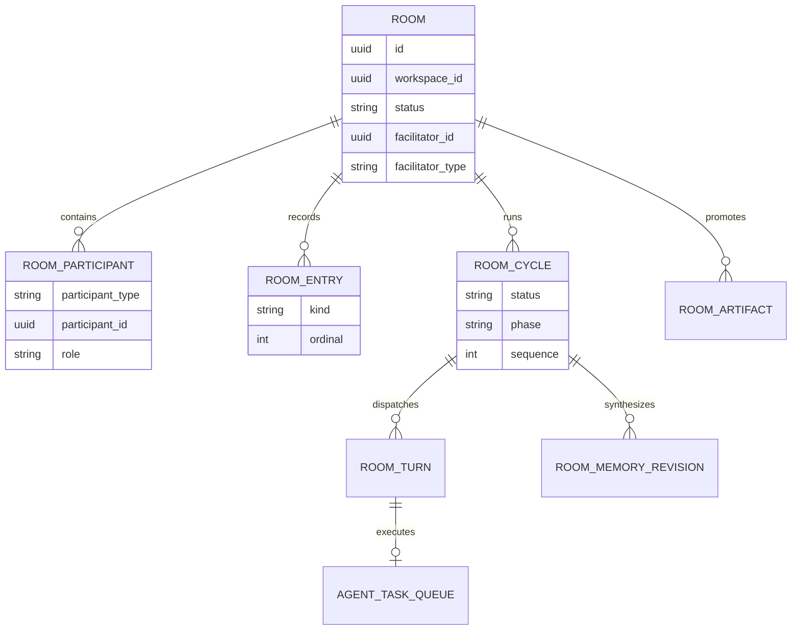
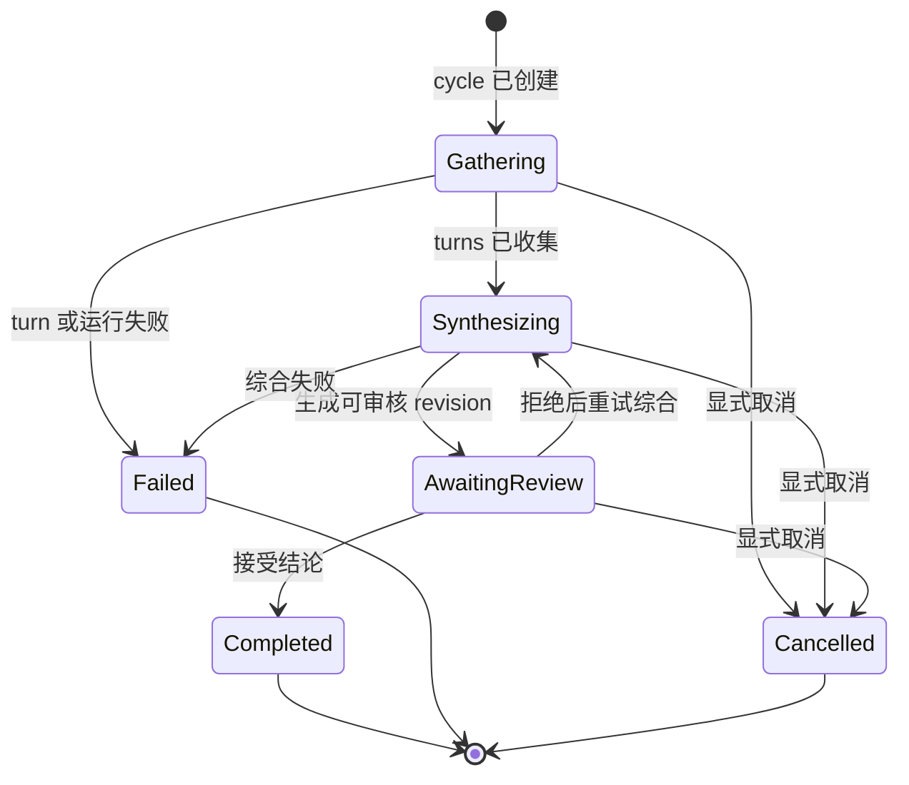
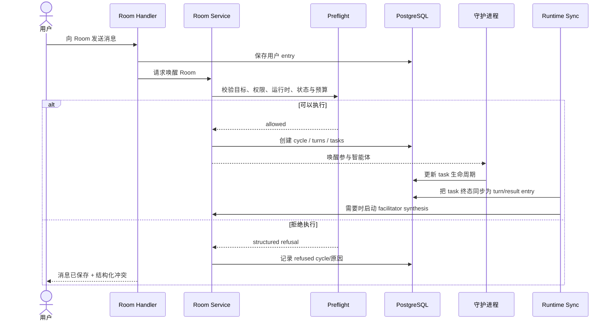

# Rooms：多参与者执行空间

活跃贡献者：Bohan Jiang、Naiyuan Qing、Jiayuan Zhang

Room 把一个目标、多个参与者和多轮执行组织在同一空间内。参与者可以是成员或智能体；facilitator 负责协调，cycle 负责一次可审计的运行，entry 保存讨论与执行结果。Room 与 Chat 的主要区别不是 UI，而是它有明确的参与者集合、cycle、预算、综合结论和人工审核边界。

## 领域结构



图中省略了预算、幂等 key、时间戳和审核字段。表由 [`server/migrations/285_room_tables.up.sql`](https://github.com/oldwinter/multica/blob/685cf788777e24724b0d82ffe88c56459341fb2a/server/migrations/285_room_tables.up.sql) 建立，当前查询定义在 [`server/pkg/db/queries/room.sql`](https://github.com/oldwinter/multica/blob/685cf788777e24724b0d82ffe88c56459341fb2a/server/pkg/db/queries/room.sql)。

## Facilitator 与参与者

创建 Room 时必须在以下两种 facilitator 中二选一：

- **智能体 facilitator**：指定一个可调用的智能体。
- **Squad facilitator**：指定一个 Squad。服务端会展开 leader 和成员，Squad leader 成为 facilitator。

参与者身份与 Room 角色是两个维度：

| 维度 | 值 | 含义 |
| --- | --- | --- |
| `participant_type` | `member` / `agent` | 实际主体是工作区成员还是智能体 |
| `role` | `facilitator` / `participant` / `observer` | 在当前 Room 中的职责 |

服务端而不是客户端负责规范化参与者、去重和确认 facilitator 存在。创建页可以做即时提示，但不能成为唯一校验。

## Room 与 cycle 状态

### Room 状态

| 状态 | 是否接受新执行 | 说明 |
| --- | --- | --- |
| `active` | 是 | 正常接收消息并尝试启动 cycle |
| `paused` | 否 | 保留内容；暂停本身不取消已经存在的 cycle |
| `archived` | 否 | 从活跃工作流移出，保留历史与产物 |

恢复没有独立的 `resume` 领域状态：把 Room 状态重新设为 `active` 即恢复。

### Cycle 状态与 phase

持久化的 cycle 终态/队列状态包括 `refused`、`queued`、`running`、`completed`、`failed`、`cancelled`。V2 工作流还使用 `phase` 表达运行内部阶段：



`refused` 通常表示 preflight 在派发前拒绝本次调用；它不是运行后失败。`queued` / `running` 是 cycle 的执行状态，`gathering` / `synthesizing` / `awaiting_review` 是工作流阶段，不要在 UI 中把两套枚举互相替代。

## 从消息到 cycle



一个容易误解的行为是：**消息可先成功保存，但执行启动失败**。例如 Room 已暂停、已有 active cycle、预算耗尽或运行时离线时，用户内容仍可成为 transcript 事实；响应再携带结构化冲突。客户端不能因为没有启动 task 就回滚已经持久化的 entry。

## Preflight 检查

核心实现见 [`server/internal/room/preflight.go`](https://github.com/oldwinter/multica/blob/685cf788777e24724b0d82ffe88c56459341fb2a/server/internal/room/preflight.go)。检查至少覆盖：

1. 目标智能体是否属于该 Room 的参与者集合。
2. 发起成员是否拥有调用该智能体的权限。
3. 目标是否有在线且健康、具备 Room capability 的运行时/守护进程。
4. 当前是否已经存在 active cycle。
5. Room 是否仍为 `active`。
6. 每日 turn 上限是否可用。
7. cycle/Room cost limit 是否可用。

检查顺序影响用户得到的拒绝原因，也影响是否已经创建 cycle。新增限制时，应返回稳定、可解析的 refusal reason，而不是只拼一段 UI 文案。

## Turn、task 与综合

- 一个 cycle 可为多个智能体创建多个 turn。
- 每个可执行 turn 关联一个 `agent_task_queue` task；Room ID、cycle、turn 和参与者身份必须保持一致。
- task 完成、失败或取消后，由 runtime sync 转换为 Room turn/result entry。
- 单参与者且不需要综合的路径可以直接收束结果。
- 多参与者或 schedule 触发的 cycle 通常由 facilitator 汇总；综合完成后进入人工审核，而不是直接覆盖 Room 的已接受结论。

执行同步在 [`server/internal/room/runtime.go`](https://github.com/oldwinter/multica/blob/685cf788777e24724b0d82ffe88c56459341fb2a/server/internal/room/runtime.go)，生命周期编排在 [`lifecycle.go`](https://github.com/oldwinter/multica/blob/685cf788777e24724b0d82ffe88c56459341fb2a/server/internal/room/lifecycle.go)，综合入口在 [`server/internal/room/synthesis.go`](https://github.com/oldwinter/multica/blob/685cf788777e24724b0d82ffe88c56459341fb2a/server/internal/room/synthesis.go)。

## Pause、取消、重试与再次运行

这些操作经常被误当成同义词：

| 操作 | 影响对象 | 语义 |
| --- | --- | --- |
| Pause | Room | 阻止新的自动执行；不隐式取消当前 cycle |
| Resume | Room | 将状态设回 `active` |
| Cancel cycle | 当前 cycle | 显式终止仍在进行的 turns/tasks |
| Retry synthesis | 综合步骤 | 沿用已有 cycle 与 entries，重新生成综合结果 |
| Run again | 新 cycle | 使用新的 wake/idempotency key 创建完整新运行 |

因此，"暂停后立即停掉所有智能体"需要先显式取消 cycle；只更新 Room 状态不具备这个副作用。完整重跑也不应复用 retry synthesis 接口。

## 预算与使用量

Room 的预算控制在 [`server/internal/room/budget.go`](https://github.com/oldwinter/multica/blob/685cf788777e24724b0d82ffe88c56459341fb2a/server/internal/room/budget.go)。预算既要防止继续派发，也要保留可解释性：

- 每日 turn 数量。
- cycle 或 Room 的费用上限。
- 已定价费用与 `uncosted usage`。
- 因预算被拒绝的原因。

usage 投影还可包含失败次数、被接受的综合、晋升次数、审核延迟和重复运行等。前端应展示服务端给出的权威统计，不应从当前加载的 transcript 分页自行求和。统计缺失和数值为 `0` 也必须区分。

## API 操作面

边界实现集中在 [`server/internal/handler/room.go`](https://github.com/oldwinter/multica/blob/685cf788777e24724b0d82ffe88c56459341fb2a/server/internal/handler/room.go)。[`server/cmd/server/router.go`](https://github.com/oldwinter/multica/blob/685cf788777e24724b0d82ffe88c56459341fb2a/server/cmd/server/router.go) 注册的主路径为：

| 方法与路径 | 行为与额外权限 |
| --- | --- |
| `GET /api/rooms` | 列表 |
| `POST /api/rooms` | 创建；要求 human actor |
| `GET /api/rooms/{id}` | 详情，包含 transcript/cycles/outcome 投影 |
| `GET /api/rooms/{id}/preflight` | 执行前检查；要求 human actor |
| `GET /api/rooms/{id}/usage` | 使用量与价值信号 |
| `POST /api/rooms/{id}/messages` | 保存消息并尝试触发执行；要求 human actor |
| `POST /api/rooms/{id}/wake` | 用新的 idempotency key 唤醒/再次运行；要求 human actor |
| `PUT /api/rooms/{id}/status` | 设置 `active` / `paused` / `archived`；要求 human actor |
| `PUT /api/rooms/{id}/budget` | 更新预算；额外要求 `owner` 或 `admin` |
| `POST /api/rooms/{id}/cycles/{cycleId}/cancel` | 显式取消 cycle；要求 human actor |
| `POST /api/rooms/{id}/cycles/{cycleId}/synthesis/retry` | 只重试综合；要求 human actor |

审核、recommendation 与 promotion 路径详见[Room 人工审核与晋升](room-review-and-promotion.md)。所有操作都受工作区成员关系约束；涉及智能体执行时还要通过资源访问与 invoke permission gate。

## 前端状态与平台差异

共享类型、Zod schema、Query、mutation 与实时事件分别位于：

- [`packages/core/rooms/types.ts`](https://github.com/oldwinter/multica/blob/685cf788777e24724b0d82ffe88c56459341fb2a/packages/core/rooms/types.ts)
- [`packages/core/rooms/schemas.ts`](https://github.com/oldwinter/multica/blob/685cf788777e24724b0d82ffe88c56459341fb2a/packages/core/rooms/schemas.ts)
- [`packages/core/rooms/queries.ts`](https://github.com/oldwinter/multica/blob/685cf788777e24724b0d82ffe88c56459341fb2a/packages/core/rooms/queries.ts)
- [`packages/core/rooms/mutations.ts`](https://github.com/oldwinter/multica/blob/685cf788777e24724b0d82ffe88c56459341fb2a/packages/core/rooms/mutations.ts)
- [`packages/core/rooms/realtime.ts`](https://github.com/oldwinter/multica/blob/685cf788777e24724b0d82ffe88c56459341fb2a/packages/core/rooms/realtime.ts)

| 能力 | Web / Desktop | Mobile |
| --- | --- | --- |
| 列表与详情 | 共用 [`RoomsPage`](https://github.com/oldwinter/multica/blob/685cf788777e24724b0d82ffe88c56459341fb2a/packages/views/rooms/rooms-page.tsx) | 独立列表与详情 |
| 创建与参与者配置 | 共享创建对话框，支持 Agent/Squad facilitator | 保持服务端语义，交互按移动端实现 |
| Transcript/发送 | 共享 transcript、composer 和 inspector | Mobile 独立 composer/sections |
| Budget/usage | 共享预算对话框和 outcome 投影 | 独立 query/schema/selectors |
| Realtime | `packages/core/rooms/realtime.ts` | 独立 [`apps/mobile/data/realtime/room-ws-updaters.ts`](https://github.com/oldwinter/multica/blob/685cf788777e24724b0d82ffe88c56459341fb2a/apps/mobile/data/realtime/room-ws-updaters.ts) |

Web 页面接线见 [`apps/web/.../rooms/page.tsx`](https://github.com/oldwinter/multica/blob/685cf788777e24724b0d82ffe88c56459341fb2a/apps/web/app/%5BworkspaceSlug%5D/%28dashboard%29/rooms/page.tsx)，Desktop 在共享 router 中挂载同一页面；Mobile 入口见 [`more/rooms.tsx`](https://github.com/oldwinter/multica/blob/685cf788777e24724b0d82ffe88c56459341fb2a/apps/mobile/app/%28app%29/%5Bworkspace%5D/more/rooms.tsx)。

### 窄屏与触控布局

Web/Desktop 共用的 Rooms 页面也必须在窄窗口中可操作。当前实现把 `lg` 以下视为堆叠布局：空 Room 集合时列表独占可用高度，不再同时显示一个重复的详情空状态；带失效 Room 深链时仍先保留可操作的列表。列表项、搜索框、新建按钮、对话框关闭按钮、预算和参与者控件在该断点下使用至少 44px 的触控目标，详情页头动作单独换行，避免短屏或平板宽度下挤压标题。实现集中在 [`packages/views/rooms/rooms-page.tsx`](https://github.com/oldwinter/multica/blob/685cf788777e24724b0d82ffe88c56459341fb2a/packages/views/rooms/rooms-page.tsx)、[`packages/views/rooms/room-list.tsx`](https://github.com/oldwinter/multica/blob/685cf788777e24724b0d82ffe88c56459341fb2a/packages/views/rooms/room-list.tsx)、[`packages/views/rooms/room-detail.tsx`](https://github.com/oldwinter/multica/blob/685cf788777e24724b0d82ffe88c56459341fb2a/packages/views/rooms/room-detail.tsx)、[`packages/views/rooms/create-room-dialog.tsx`](https://github.com/oldwinter/multica/blob/685cf788777e24724b0d82ffe88c56459341fb2a/packages/views/rooms/create-room-dialog.tsx) 与 [`packages/views/rooms/room-budget-dialog.tsx`](https://github.com/oldwinter/multica/blob/685cf788777e24724b0d82ffe88c56459341fb2a/packages/views/rooms/room-budget-dialog.tsx)。

这里的 “Mobile” CSS 状态指 Web/Desktop 共享视图的窄屏断点，不是 `apps/mobile` 的 React Native 页面。调整布局时要分别验证空列表、失效深链、已有 Room、短视口对话框和键盘操作，不能只在宽桌面窗口检查。

## 修改入口

| 变更 | 首选入口 |
| --- | --- |
| HTTP、membership、输入解析 | [`server/internal/handler/room.go`](https://github.com/oldwinter/multica/blob/685cf788777e24724b0d82ffe88c56459341fb2a/server/internal/handler/room.go) |
| 创建、唤醒和领域编排 | [`server/internal/room/service.go`](https://github.com/oldwinter/multica/blob/685cf788777e24724b0d82ffe88c56459341fb2a/server/internal/room/service.go) |
| preflight/refusal | [`server/internal/room/preflight.go`](https://github.com/oldwinter/multica/blob/685cf788777e24724b0d82ffe88c56459341fb2a/server/internal/room/preflight.go) |
| task → turn/entry 同步 | [`server/internal/room/runtime.go`](https://github.com/oldwinter/multica/blob/685cf788777e24724b0d82ffe88c56459341fb2a/server/internal/room/runtime.go) |
| SQL/schema | [`server/pkg/db/queries/room.sql`](https://github.com/oldwinter/multica/blob/685cf788777e24724b0d82ffe88c56459341fb2a/server/pkg/db/queries/room.sql) + 新 migration |
| Web/Desktop UI | [`packages/views/rooms/`](https://github.com/oldwinter/multica/tree/685cf788777e24724b0d82ffe88c56459341fb2a/packages/views/rooms) |
| Mobile | [`apps/mobile/data/mutations/rooms.ts`](https://github.com/oldwinter/multica/blob/685cf788777e24724b0d82ffe88c56459341fb2a/apps/mobile/data/mutations/rooms.ts) 与 [`apps/mobile/components/room/`](https://github.com/oldwinter/multica/tree/685cf788777e24724b0d82ffe88c56459341fb2a/apps/mobile/components/room) |

## 测试入口

- 后端领域/API 主合同：[`server/internal/handler/room_test.go`](https://github.com/oldwinter/multica/blob/685cf788777e24724b0d82ffe88c56459341fb2a/server/internal/handler/room_test.go)、[`server/internal/handler/room_contract_test.go`](https://github.com/oldwinter/multica/blob/685cf788777e24724b0d82ffe88c56459341fb2a/server/internal/handler/room_contract_test.go)。
- capability 与 claim：[`server/internal/handler/room_capability_test.go`](https://github.com/oldwinter/multica/blob/685cf788777e24724b0d82ffe88c56459341fb2a/server/internal/handler/room_capability_test.go)、[`server/internal/handler/room_claim_test.go`](https://github.com/oldwinter/multica/blob/685cf788777e24724b0d82ffe88c56459341fb2a/server/internal/handler/room_claim_test.go)。
- HTTP 集成和监听器：[`server/cmd/server/room_http_integration_test.go`](https://github.com/oldwinter/multica/blob/685cf788777e24724b0d82ffe88c56459341fb2a/server/cmd/server/room_http_integration_test.go)、[`server/cmd/server/room_listeners_test.go`](https://github.com/oldwinter/multica/blob/685cf788777e24724b0d82ffe88c56459341fb2a/server/cmd/server/room_listeners_test.go)。
- 共享视图：[`packages/views/rooms/room-list.test.tsx`](https://github.com/oldwinter/multica/blob/685cf788777e24724b0d82ffe88c56459341fb2a/packages/views/rooms/room-list.test.tsx)、[`packages/views/rooms/create-room-dialog.test.tsx`](https://github.com/oldwinter/multica/blob/685cf788777e24724b0d82ffe88c56459341fb2a/packages/views/rooms/create-room-dialog.test.tsx)、[`packages/views/rooms/rooms-page.test.ts`](https://github.com/oldwinter/multica/blob/685cf788777e24724b0d82ffe88c56459341fb2a/packages/views/rooms/rooms-page.test.ts)、[`packages/views/rooms/room-composer.test.tsx`](https://github.com/oldwinter/multica/blob/685cf788777e24724b0d82ffe88c56459341fb2a/packages/views/rooms/room-composer.test.tsx) 与 [`packages/views/rooms/room-transcript.test.tsx`](https://github.com/oldwinter/multica/blob/685cf788777e24724b0d82ffe88c56459341fb2a/packages/views/rooms/room-transcript.test.tsx)。这些测试覆盖列表、创建对话框和页面级触控/失效深链行为；更细的预算与详情回归随后在后续提交中补充。
- Mobile 语义：[`apps/mobile/lib/room-selectors.test.ts`](https://github.com/oldwinter/multica/blob/685cf788777e24724b0d82ffe88c56459341fb2a/apps/mobile/lib/room-selectors.test.ts)、[`apps/mobile/lib/room-interactions.test.ts`](https://github.com/oldwinter/multica/blob/685cf788777e24724b0d82ffe88c56459341fb2a/apps/mobile/lib/room-interactions.test.ts)、[`apps/mobile/data/rooms-schema.test.ts`](https://github.com/oldwinter/multica/blob/685cf788777e24724b0d82ffe88c56459341fb2a/apps/mobile/data/rooms-schema.test.ts)。

```bash
(cd server && go test ./internal/handler -run 'Test.*Room' -count=1)
(cd server && go test ./internal/room/... -count=1)
pnpm --filter @multica/views exec vitest run rooms
```
