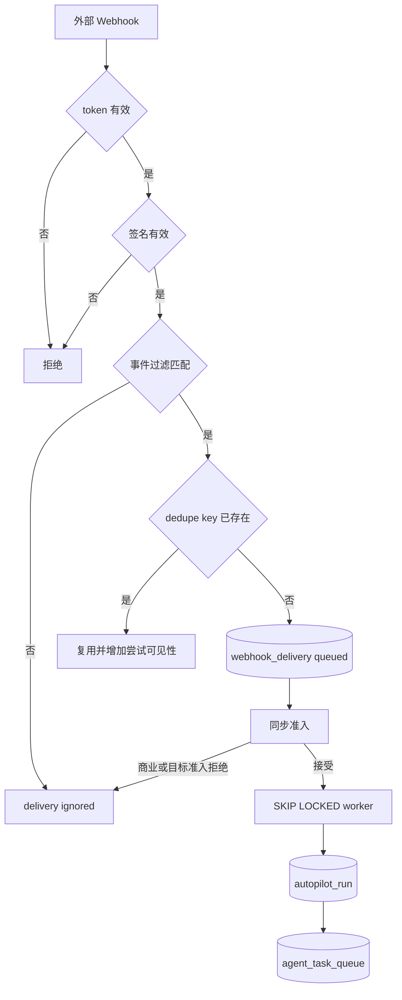
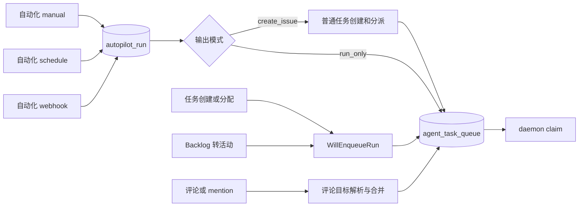

# 规则与触发器

活跃贡献者：Bohan Jiang、Naiyuan Qing、Jiayuan Zhang

在当前实现中，“规则”不是一门独立的条件 DSL。可执行配置由 `autopilot` 保存，触发条件由一个或多个 `autopilot_trigger` 保存；`autopilot_rule_version` 是用于责任归因的不可变发布快照，而不是调度器直接解释的规则程序。

另外，普通任务的创建、分配、状态变化和评论也能触发 agent `task`。这些路径不创建 `autopilot_run`，但最终共用同一个 `agent_task_queue`。

## 自动化规则的发布快照

创建自动化，或对说明、目标、执行模式和触发条件做实质修改时，后端追加一条 `autopilot_rule_version`。旧版本不更新，因此历史 `task.rule_version_id` 始终能指向当时生效的发布者和配置摘要。

每条 trigger 还记录自己的当前责任发布者：

- 创建时是创建者。
- 实质修改该 trigger 后转移给编辑者。
- 修改自动化级配置时，相关 triggers 的责任也会重盖章。
- 编辑另一条 trigger 不会改变本 trigger 的责任人。

这两层主要服务[用量与归因](./usage-and-attribution.md)：定时/Webhook 自主触发没有“当下点击授权的人”，但仍可记录谁对当前有效配置负责。

schema 和查询见：

- [`server/migrations/186_autopilot_rule_version.up.sql`](https://github.com/oldwinter/multica/blob/685cf788777e24724b0d82ffe88c56459341fb2a/server/migrations/186_autopilot_rule_version.up.sql)
- [`server/migrations/189_autopilot_trigger_publisher.up.sql`](https://github.com/oldwinter/multica/blob/685cf788777e24724b0d82ffe88c56459341fb2a/server/migrations/189_autopilot_trigger_publisher.up.sql)
- [`server/pkg/db/queries/autopilot.sql`](https://github.com/oldwinter/multica/blob/685cf788777e24724b0d82ffe88c56459341fb2a/server/pkg/db/queries/autopilot.sql)

## 自动化触发方式

| 来源 | 是否需要 trigger 行 | 入口 | 耐久重试 owner |
| --- | --- | --- | --- |
| `manual` | 否 | 成员点击“立即运行” | HTTP 请求幂等键；没有外层周期重试 |
| `schedule` | 是 | 五字段 cron + IANA 时区 | DB scheduler |
| `webhook` | 是 | token URL，可选 HMAC 和事件过滤 | `webhook_delivery` worker |
| `api` | 遗留 trigger kind | 旧 API 入口 | 兼容路径；UI 标为 deprecated |

前端创建/编辑只提供 schedule 和 Webhook；详情页仍能安全展示旧 `api` trigger。参见 [`packages/core/types/autopilot.ts`](https://github.com/oldwinter/multica/blob/685cf788777e24724b0d82ffe88c56459341fb2a/packages/core/types/autopilot.ts) 和 [`packages/views/autopilots/components/autopilot-detail-page.tsx`](https://github.com/oldwinter/multica/blob/685cf788777e24724b0d82ffe88c56459341fb2a/packages/views/autopilots/components/autopilot-detail-page.tsx)。

## 定时触发

### cron 与时区

schedule 使用五字段 cron。时区保存为 IANA 名称；未设置时后端回退到 UTC。规范 occurrence 总是转换成 UTC `plan_time`，因此夏令时规则由指定时区解释，而数据库唯一键仍可稳定比较。

前端编辑器既支持结构化时间/日期控件，也支持高级 cron。它不在浏览器中猜测后端结果，而是调用 cron preview API 获取下一批 occurrence：

- [`packages/views/autopilots/components/schedule-editor/schedule-editor.tsx`](https://github.com/oldwinter/multica/blob/685cf788777e24724b0d82ffe88c56459341fb2a/packages/views/autopilots/components/schedule-editor/schedule-editor.tsx)
- [`packages/core/autopilots/queries.ts`](https://github.com/oldwinter/multica/blob/685cf788777e24724b0d82ffe88c56459341fb2a/packages/core/autopilots/queries.ts)
- [`server/internal/handler/autopilot.go`](https://github.com/oldwinter/multica/blob/685cf788777e24724b0d82ffe88c56459341fb2a/server/internal/handler/autopilot.go)

保存前会再次由 server 验证。表达式无效是 400；网络失败不能被误画成用户输入错误。

### occurrence 选择

[`server/internal/scheduler/jobs_autopilot.go`](https://github.com/oldwinter/multica/blob/685cf788777e24724b0d82ffe88c56459341fb2a/server/internal/scheduler/jobs_autopilot.go) 为每个启用 trigger 创建独立 scope：

1. 根据数据库时间和 trigger 创建时间/最后计划时间枚举 occurrence。
2. 只查看最多 24 小时窗口。
3. 多个 missed occurrences 折叠为最新一个。
4. 最新 occurrence 若已迟到超过 5 分钟则放弃，不在任意启动时刻补跑。
5. 以规范 UTC occurrence 作为 `planned_at` 分派。

调度执行键避免两个节点同时处理，`autopilot_run(trigger_id, planned_at)` 避免进程在分派后崩溃导致重复任务。重试参数和租约细节见[调度器与后台任务](./scheduler-and-background-jobs.md)。

## Webhook 触发

Webhook 接收器在 [`server/internal/handler/autopilot_webhook.go`](https://github.com/oldwinter/multica/blob/685cf788777e24724b0d82ffe88c56459341fb2a/server/internal/handler/autopilot_webhook.go)：

1. URL 中的高熵 bearer token 解析到 trigger；token 可旋转。
2. 请求体上限为 256 KiB。
3. 若配置签名密钥，验证 GitHub 兼容的 HMAC-SHA256。
4. 规范化 provider、event 和 action，并应用 `event_filters`；空过滤器表示全部接受。
5. 应用 IP 和 trigger 两层限流。
6. 从 provider header/载荷提取 dedupe key。
7. 先持久化 `webhook_delivery`，再进行同步准入；响应不等待 agent 执行。
8. 数据库 worker 领取 delivery 并完成自动化分派。



`(trigger_id, dedupe_key)` 压缩 provider 重投；没有可用 provider ID 时，接收器使用受限的确定性材料生成 key。真正分派再由 `webhook_delivery_id` 唯一约束保护。worker 的 2 分钟 lease、5 次尝试和指数退避见 [`server/internal/handler/webhook_delivery_worker.go`](https://github.com/oldwinter/multica/blob/685cf788777e24724b0d82ffe88c56459341fb2a/server/internal/handler/webhook_delivery_worker.go)。

### 重放

人工重放会创建新的 delivery，并保存 `replayed_from_delivery_id`。重放请求本身有幂等键，所以同一次操作重试不会生成无穷副本；新 delivery 仍完整经过当前准入和分派规则，而不是复制旧运行状态。

## 手动触发

“立即运行”没有 trigger 行。成员身份既用于接口授权，也成为本次运行的 `direct_human` 归因。客户端 mutation 在完成后使运行列表和自动化详情 query 失效：[`packages/core/autopilots/mutations.ts`](https://github.com/oldwinter/multica/blob/685cf788777e24724b0d82ffe88c56459341fb2a/packages/core/autopilots/mutations.ts)。

客户端重试同一个 HTTP 请求时应保留幂等键。若未提供，server 生成仅覆盖本请求的 key；这能保护内部重入，但不能把两个独立点击识别为同一个用户意图。

## 普通任务触发

### 创建、分配和状态变化

普通任务写入是否启动 agent 由统一谓词 `WillEnqueueRun` 决定：[`server/internal/service/issue_trigger.go`](https://github.com/oldwinter/multica/blob/685cf788777e24724b0d82ffe88c56459341fb2a/server/internal/service/issue_trigger.go)。

- 新建或改变 assignee 时，目标是 agent 或 squad；小队解析为当前负责人。
- Backlog 是停车区：分配到 backlog 不启动。
- 已分配任务从 backlog 类别进入活动类别时可以启动。
- 进入 `done` 或 `cancelled` 不启动。
- 自己正在执行的 agent 把同一任务推进状态时会做 self-loop 抑制。
- 状态触发会检查该任务/agent 是否已有 pending `task`，避免预览承诺一条唯一约束最终会合并的运行。
- 私有 agent 访问、归档状态、运行时绑定和小队负责人 readiness 都参与判断。

预览与真实写路径复用同一谓词，避免 UI 说“会运行”但提交后静默不入队。

### 评论和 @mention

评论保存后，由 [`server/internal/handler/comment.go`](https://github.com/oldwinter/multica/blob/685cf788777e24724b0d82ffe88c56459341fb2a/server/internal/handler/comment.go) 计算目标并入队。评论触发和任务状态触发刻意不同：评论可以在任意任务状态唤醒 agent。

主要优先级是：

1. 显式 `@agent` / `@squad`；小队 mention 执行当前负责人。
2. 若没有显式 agent/squad mention，`@all` 或成员 mention 不触发隐式 agent fallback。
3. 否则按上下文路由到当前 assignee、父评论的 agent 或已有 conversation owner。

显式 mention 会返回每个目标的 `queued`、`coalesced`、`deferred` 或 blocked outcome。评论已经保存时，某个目标无权限、离线或不可用不会回滚整条评论；客户端可以展示“评论已发布，但部分目标未触发”。

多个评论命中同一 pending `task` 时可合并到该任务的评论计划，并原子更新最新触发证据、归因和 connected-app overlay。运行中的任务则登记后续义务，终态协调器再决定是否补一个 follow-up，避免评论在完成竞态中丢失。

## 统一队列路径



所有路径最终依赖相同的队列 claim、prepare lease 和 daemon 执行协议，但上层 retry owner 不同：

- 普通任务可由 TaskService 建立后继 attempt。
- `run_only` 自动化不做普通任务 auto-retry。
- schedule occurrence 由 scheduler 重试尚未成功完成的分派。
- Webhook 由 delivery worker 重试 delivery 分派。

schedule/Webhook 的外层重试不等于重跑一个已经开始但执行失败的 `run_only` task。不要在两个层同时为同一失败启用不协调的重试，否则会形成重试乘法。

## 功能开关

当前源码没有控制自动化 CRUD、schedule 或 Webhook 产品路径的普通前端功能旗标。相关控制面是：

- `GateAutopilotRuns` entitlement：控制运行额度的 `off` / `observe` / `enforce`，不隐藏产品。
- `AUTOPILOT_FAIL_MONITOR_INTERVAL=0`：只关闭高失败率自动暂停。
- `plugins_v1`：只控制插件 manifest schedule job，默认关闭，不控制自动化 trigger。

## 如何修改

| 改动 | 必须一起检查 |
| --- | --- |
| 新 trigger kind | 后端 handler/service、数据库约束、运行 source、归因 evidence、前端 server-driven enum fallback |
| cron 语义 | server preview 与 scheduler 使用同一解析器；时区、DST、迟到窗口和 next-run 展示 |
| Webhook provider | 签名规范化、dedupe key、事件/action 映射、body 上限、重放和审计 UI |
| 任务写触发 | `WillEnqueueRun`、预览端点、实际 create/update/batch 路径和 pending 唯一约束 |
| 评论路由 | preview 与 create/edit 共用解析；显式 mention outcome、权限、合并和 follow-up 协调 |
| retry | 明确唯一 owner，并验证副作用发生后的崩溃窗口 |

新增事件枚举时，前端必须保留 `default` 或原始字符串 fallback，不能假设新 server 永远只返回旧客户端认识的值。

## 如何测试

```bash
cd server
go test ./internal/scheduler -run 'Test.*Autopilot' -count=1
go test ./internal/handler -run 'Test(AutopilotWebhook|CommentTrigger|Mention)' -count=1
go test ./internal/service -run 'Test.*Trigger' -count=1
```

可直接参考：

- [`server/internal/scheduler/jobs_autopilot_test.go`](https://github.com/oldwinter/multica/blob/685cf788777e24724b0d82ffe88c56459341fb2a/server/internal/scheduler/jobs_autopilot_test.go)
- [`server/internal/handler/autopilot_webhook_handler_test.go`](https://github.com/oldwinter/multica/blob/685cf788777e24724b0d82ffe88c56459341fb2a/server/internal/handler/autopilot_webhook_handler_test.go)
- [`server/internal/handler/webhook_delivery_test.go`](https://github.com/oldwinter/multica/blob/685cf788777e24724b0d82ffe88c56459341fb2a/server/internal/handler/webhook_delivery_test.go)
- [`server/internal/handler/comment_trigger_preview_test.go`](https://github.com/oldwinter/multica/blob/685cf788777e24724b0d82ffe88c56459341fb2a/server/internal/handler/comment_trigger_preview_test.go)
- [`server/internal/handler/comment_trigger_outcomes_test.go`](https://github.com/oldwinter/multica/blob/685cf788777e24724b0d82ffe88c56459341fb2a/server/internal/handler/comment_trigger_outcomes_test.go)
- [`server/internal/handler/mention_self_trigger_test.go`](https://github.com/oldwinter/multica/blob/685cf788777e24724b0d82ffe88c56459341fb2a/server/internal/handler/mention_self_trigger_test.go)

前端 schedule 变化运行：

```bash
pnpm exec vitest run \
  packages/views/autopilots/components/autopilot-dialog.schedule.test.tsx \
  packages/views/autopilots/components/schedule-editor/schedule-editor.test.tsx
```

测试矩阵至少包含时区/DST、重复 occurrence、Webhook 重投、签名错误、过滤不匹配、token 旋转、两个 worker 竞争、任务 backlog、状态自循环、私有 agent、显式/隐式评论路由和 pending task 合并。
