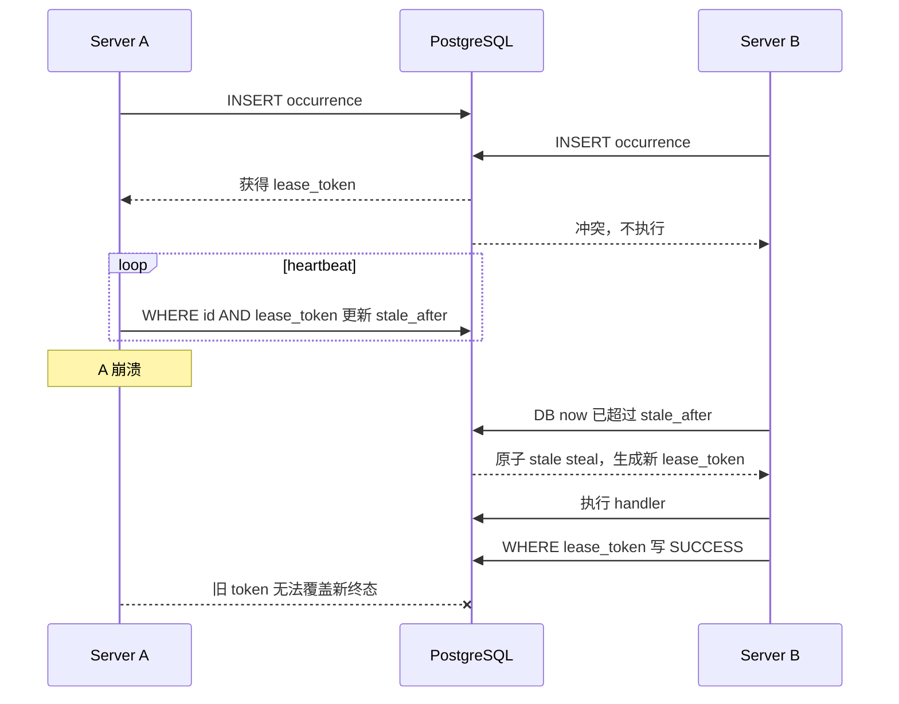

# 调度器与后台任务

活跃贡献者：Bohan Jiang、Naiyuan Qing、Jiayuan Zhang

Multica 的周期性工作使用 PostgreSQL 支持的通用调度器。每个 server 进程都可以运行同一套 manager；数据库中的 occurrence、租约和终态决定谁真正执行，而不是依赖“只启动一个 cron pod”的部署约定。

Webhook delivery 和 agent `task` 也使用数据库队列与租约，但它们不是 `JobSpec` 调度任务。本文把三者放在一起，是为了说明多节点、崩溃恢复和幂等边界。

## 通用调度器

核心接口在 [`server/internal/scheduler/spec.go`](https://github.com/oldwinter/multica/blob/685cf788777e24724b0d82ffe88c56459341fb2a/server/internal/scheduler/spec.go)。一个 `JobSpec` 定义：

- 稳定的 job 名称。
- scope 枚举；同一 job 可按全局、工作区、触发器等维度独立调度。
- 固定 cadence，或自定义 `PlansForScope`。
- `latest_only` / `every_plan` catch-up 策略、窗口和每 tick 上限。
- handler 超时、heartbeat 周期、stale 超时。
- 是否允许 stale reentry、最大尝试数和退避表。

manager 默认每 30 秒 tick，并在启动后立即执行第一次 tick。它用 PostgreSQL `now()` 作为规范时钟，所以主机时钟有偏差的副本仍会对同一个 `plan_time` 达成一致。实现见：

- [`server/internal/scheduler/manager.go`](https://github.com/oldwinter/multica/blob/685cf788777e24724b0d82ffe88c56459341fb2a/server/internal/scheduler/manager.go)
- [`server/internal/scheduler/db_ops.go`](https://github.com/oldwinter/multica/blob/685cf788777e24724b0d82ffe88c56459341fb2a/server/internal/scheduler/db_ops.go)
- [`server/migrations/113_sys_cron_executions.up.sql`](https://github.com/oldwinter/multica/blob/685cf788777e24724b0d82ffe88c56459341fb2a/server/migrations/113_sys_cron_executions.up.sql)

## 一次 occurrence 的状态机

`sys_cron_executions` 的唯一执行键是：

```text
(job_name, scope_kind, scope_id, plan_time)
```

新 runner 先用 `INSERT ... ON CONFLICT DO NOTHING` 抢占。若 occurrence 已存在，它只能在以下条件之一成立时原子更新同一行：

- 状态为 `FAILED`、仍有尝试预算且 `next_retry_at` 已到。
- 状态为 `RUNNING`、`stale_after` 已过，且 job 允许 stale reentry。



heartbeat 和 `SUCCESS`/`FAILED` 更新都带 `lease_token`。更新 0 行表示租约已丢失；旧 runner 即使稍后恢复，也不能覆盖新 owner 的结果。handler panic 会被转成失败，handler 运行时间受 `RunTimeout` 约束。

这里提供的是“同一 occurrence 由一个有效租约 owner 负责”，不是任意外部副作用的数学意义 exactly-once。handler 仍须使用业务幂等键；定时自动化的 `(trigger_id, planned_at)` 就是这种第二道保护。

## 计划和 catch-up

固定 cadence job 可以选择：

- `latest_only`：只处理窗口内最新计划，适合内部逻辑本身能追上进度的汇总任务。
- `every_plan`：按计划顺序补齐，受 `MaxPlansPerTick` 限制。
- `PlansForScope`：由 job 根据数据库状态计算规范 occurrence；自动化 cron 使用这一模式。

失败重试保留同一个 `plan_time`，增加 `attempt` 并等待 `next_retry_at`；它不是一条新的 occurrence。历史执行行同时承担审计作用，因此 job 名称和 scope 语义不能随意重命名。

## 启动时注册的任务

server 在 [`server/cmd/server/main.go`](https://github.com/oldwinter/multica/blob/685cf788777e24724b0d82ffe88c56459341fb2a/server/cmd/server/main.go) 注册以下 `JobSpec`：

| job 名称 | 作用 | 实现 |
| --- | --- | --- |
| `skill_evolution` | 工作区技能演进协调 | server 启动处构造的 skill evolution job |
| `rollup_task_usage_hourly` | 把原始 task 用量汇总到小时桶 | [`server/internal/scheduler/jobs_task_usage.go`](https://github.com/oldwinter/multica/blob/685cf788777e24724b0d82ffe88c56459341fb2a/server/internal/scheduler/jobs_task_usage.go) |
| `autopilot_schedule_dispatch` | 按每个 schedule trigger 的 cron 分派自动化 | [`server/internal/scheduler/jobs_autopilot.go`](https://github.com/oldwinter/multica/blob/685cf788777e24724b0d82ffe88c56459341fb2a/server/internal/scheduler/jobs_autopilot.go) |
| `lm_wiki_daily_reconcile` | 每日协调 LM Wiki 修订 | [`server/internal/scheduler/jobs_lm_wiki.go`](https://github.com/oldwinter/multica/blob/685cf788777e24724b0d82ffe88c56459341fb2a/server/internal/scheduler/jobs_lm_wiki.go) |
| `room_maintenance` | 房间维护 | [`server/internal/scheduler/jobs_room.go`](https://github.com/oldwinter/multica/blob/685cf788777e24724b0d82ffe88c56459341fb2a/server/internal/scheduler/jobs_room.go) |
| `plugin_hook_schedule_dispatch` | 分派插件 manifest 声明的 schedule hook | [`server/internal/scheduler/jobs_plugin_hook.go`](https://github.com/oldwinter/multica/blob/685cf788777e24724b0d82ffe88c56459341fb2a/server/internal/scheduler/jobs_plugin_hook.go) |

`plugin_hook_schedule_dispatch` 在 `plugins_v1` 关闭时保持惰性。这个默认关闭的旗标定义在 [`server/internal/featureflags/keys.go`](https://github.com/oldwinter/multica/blob/685cf788777e24724b0d82ffe88c56459341fb2a/server/internal/featureflags/keys.go)。它不控制自动化 schedule。

### 自动化 schedule job

每个启用的 schedule trigger 是独立 scope，scope ID 是 trigger UUID。job 用五字段 cron 和 IANA 时区计算 UTC `plan_time`：

- 最多查看 24 小时 catch-up 窗口。
- 错过多个 occurrence 时只保留最新一个。
- 最新 occurrence 若已迟到超过 5 分钟，也不再补跑。
- handler 超时 2 分钟，stale 超时 5 分钟，每 30 秒 heartbeat。
- 最多 3 次尝试，退避 1、5、15 分钟。

即使第一次分派已建立 `autopilot_run` 后进程崩溃，stale reentry 也会通过 `(trigger_id, planned_at)` 找回原运行，不会重复创建任务。细节见 [`server/internal/scheduler/jobs_autopilot.go`](https://github.com/oldwinter/multica/blob/685cf788777e24724b0d82ffe88c56459341fb2a/server/internal/scheduler/jobs_autopilot.go)。

### 用量汇总 job

`rollup_task_usage_hourly` 每 5 分钟计划一次，并设置 5 分钟 schedule delay，避免仍在变化的最新桶。SQL 函数内部持有 advisory lock `4246`，所以应用内 scheduler、遗留 `pg_cron` 或人工调用并发时也不会双写。见：

- [`server/internal/scheduler/jobs_task_usage.go`](https://github.com/oldwinter/multica/blob/685cf788777e24724b0d82ffe88c56459341fb2a/server/internal/scheduler/jobs_task_usage.go)
- [`server/migrations/102_task_usage_hourly_pipeline.up.sql`](https://github.com/oldwinter/multica/blob/685cf788777e24724b0d82ffe88c56459341fb2a/server/migrations/102_task_usage_hourly_pipeline.up.sql)
- [`server/migrations/272_rollup_task_usage_hourly_xact_lock.up.sql`](https://github.com/oldwinter/multica/blob/685cf788777e24724b0d82ffe88c56459341fb2a/server/migrations/272_rollup_task_usage_hourly_xact_lock.up.sql)

## Webhook delivery worker

Webhook ingress 先把 delivery 持久化。后台 worker 每个进程启动 4 个 goroutine，默认每秒轮询：

1. `FOR UPDATE SKIP LOCKED` 领取一条到期 delivery。
2. 写入随机 `lease_token`，租约为 2 分钟。
3. 再次检查 trigger、自动化状态、限流和准入。
4. 分派并以 token 条件写终态；暂时错误释放租约并设置指数退避。
5. 最多尝试 5 次，之后标为失败。

多进程 worker 自然通过 `SKIP LOCKED` 分摊。租约只是调度优化；若慢 worker 超过 2 分钟，`webhook_delivery_id` 上的运行唯一约束仍会阻止第二份下游工作。实现见：

- [`server/internal/handler/webhook_delivery_worker.go`](https://github.com/oldwinter/multica/blob/685cf788777e24724b0d82ffe88c56459341fb2a/server/internal/handler/webhook_delivery_worker.go)
- [`server/pkg/db/queries/webhook_delivery.sql`](https://github.com/oldwinter/multica/blob/685cf788777e24724b0d82ffe88c56459341fb2a/server/pkg/db/queries/webhook_delivery.sql)

内存通知只负责降低新 delivery 的等待时间，进程重启不会丢失数据库队列。

## Agent task queue

`agent_task_queue` 是 daemon 领取实际 agent 工作的队列，不使用 `sys_cron_executions`：

- claim 在单条 SQL 中选择并更新，使用 `FOR UPDATE SKIP LOCKED`。
- SQL 验证运行时在线且心跳新鲜、agent 仍绑定该运行时，以及 private runtime owner。
- 同一 agent 对同一任务、聊天或房间串行；候选按 priority 降序、创建时间和 ID 升序。
- 成功 claim 把状态设为 `dispatched`，并建立默认 45 秒 prepare lease。
- daemon 在准备期间续租；`StartTask` 后进入 `running` 并清除 prepare lease。
- 如果 claim 响应丢失，未开始的 dispatched 行约 90 秒后可被同一运行时 reclaim。
- claim payload finalization 失败时，服务用 `task_id + runtime_id + dispatched_at` compare-and-swap 立即 requeue，迟到请求不能回滚更新一代 claim。

SQL 见 [`server/pkg/db/queries/agent.sql`](https://github.com/oldwinter/multica/blob/685cf788777e24724b0d82ffe88c56459341fb2a/server/pkg/db/queries/agent.sql)，服务封装见 [`server/internal/service/task.go`](https://github.com/oldwinter/multica/blob/685cf788777e24724b0d82ffe88c56459341fb2a/server/internal/service/task.go)，prepare lease schema 见 [`server/migrations/124_task_prepare_lease.up.sql`](https://github.com/oldwinter/multica/blob/685cf788777e24724b0d82ffe88c56459341fb2a/server/migrations/124_task_prepare_lease.up.sql)。

普通 task 默认最多 2 次尝试。可重试基础设施失败会创建新的队列行并保留 `retry_of_task_id`、归因、评论批次和必要会话上下文；provider network 错误可把上限扩到 3 次，并在最后一次前等待约 5 秒。人工 rerun 是新的直接人类动作，不应伪装成系统 retry。

## 其他后台循环

并非所有后台工作都适合 `JobSpec`。server 还启动运行时/任务清理器、自动化失败监视器、quota reconciler、数据库统计、Webhook delivery worker、seat capacity worker、PR refresh 和各类集成 supervisor。注册和关闭顺序以 [`server/cmd/server/main.go`](https://github.com/oldwinter/multica/blob/685cf788777e24724b0d82ffe88c56459341fb2a/server/cmd/server/main.go) 为准。

选择机制时遵循：

- 需要规范 occurrence、审计行、跨节点互斥与 catch-up：使用 scheduler。
- 外部事件已形成独立持久队列：使用队列 worker。
- 高频、可重复扫描且数据库更新本身为 CAS：可使用简单 sweeper。
- 内存 channel 或通知不能成为唯一事实来源。

## 多节点不变量

部署多个 server 时应保持以下不变量：

1. 所有时限判断尽量使用数据库时间。
2. claim 和状态转换在一条 SQL 或一个事务内完成。
3. 每次租约所有权都由不可复用 token 表示。
4. 业务副作用有独立幂等键，不能只依赖 lease。
5. worker 崩溃后，数据库行仍能被新节点发现。
6. 旧 owner 的终态更新必须匹配 0 行，而不是覆盖新 owner。
7. 工作区删除与 workspace-scoped claim 使用显式行锁协议，不能在删除后遗留执行行。

## 如何修改

新增 scheduler job 时：

1. 选择稳定且不会重用的 `Name`。
2. 明确 scope；工作区 scope 应复用删除/claim 锁协议。
3. 决定 `latest_only`、`every_plan` 或 `PlansForScope`。
4. 设置真实的 `RunTimeout`、heartbeat、stale timeout、重试预算和 backoff。
5. 让 handler 以 `PlanTime` 构造业务幂等键。
6. 在 `server/cmd/server/main.go` 注册，并补充关停行为。
7. 为并发 claim、失败重试、stale steal、崩溃后重入和工作区删除写数据库测试。

不要把长网络调用放在持锁事务中；claim 事务只负责短小的所有权转换，handler 在事务外运行并靠 token heartbeat 保持租约。

## 如何测试

调度器数据库测试集中在 [`server/internal/scheduler/`](https://github.com/oldwinter/multica/tree/685cf788777e24724b0d82ffe88c56459341fb2a/server/internal/scheduler)：

```bash
cd server
go test ./internal/scheduler -count=1
go test ./cmd/server -run 'TestAutopilot' -count=1
go test ./internal/handler -run 'TestWebhookDelivery' -count=1
```

高价值用例已有独立文件：

- [`server/internal/scheduler/concurrent_claim_test.go`](https://github.com/oldwinter/multica/blob/685cf788777e24724b0d82ffe88c56459341fb2a/server/internal/scheduler/concurrent_claim_test.go)：两个 runner 抢同一 occurrence。
- [`server/internal/scheduler/stale_steal_test.go`](https://github.com/oldwinter/multica/blob/685cf788777e24724b0d82ffe88c56459341fb2a/server/internal/scheduler/stale_steal_test.go)：租约过期和旧 token fencing。
- [`server/internal/scheduler/every_plan_retry_test.go`](https://github.com/oldwinter/multica/blob/685cf788777e24724b0d82ffe88c56459341fb2a/server/internal/scheduler/every_plan_retry_test.go)：同一 `plan_time` 的失败重试。
- [`server/internal/scheduler/workspace_scope_claim_test.go`](https://github.com/oldwinter/multica/blob/685cf788777e24724b0d82ffe88c56459341fb2a/server/internal/scheduler/workspace_scope_claim_test.go)：工作区删除竞态。
- [`server/internal/scheduler/jobs_autopilot_test.go`](https://github.com/oldwinter/multica/blob/685cf788777e24724b0d82ffe88c56459341fb2a/server/internal/scheduler/jobs_autopilot_test.go)：cron occurrence、catch-up 和迟到窗口。
- [`server/internal/scheduler/pgcron_concurrent_test.go`](https://github.com/oldwinter/multica/blob/685cf788777e24724b0d82ffe88c56459341fb2a/server/internal/scheduler/pgcron_concurrent_test.go)：应用 scheduler 与旧 SQL 入口并跑。

测试可靠性时应主动注入“副作用完成后、终态写回前”的崩溃，而不只测试 handler 返回 error。

## 相关页面

- [规则与触发器](rules-and-triggers.md)
- [自动化](autopilots.md)
