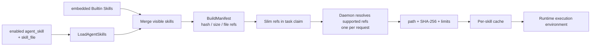
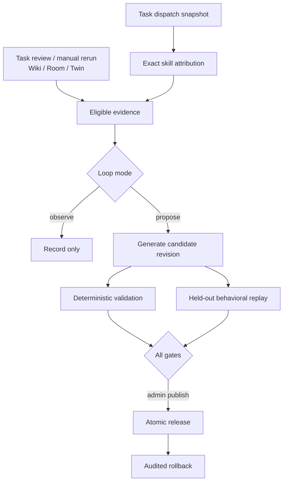
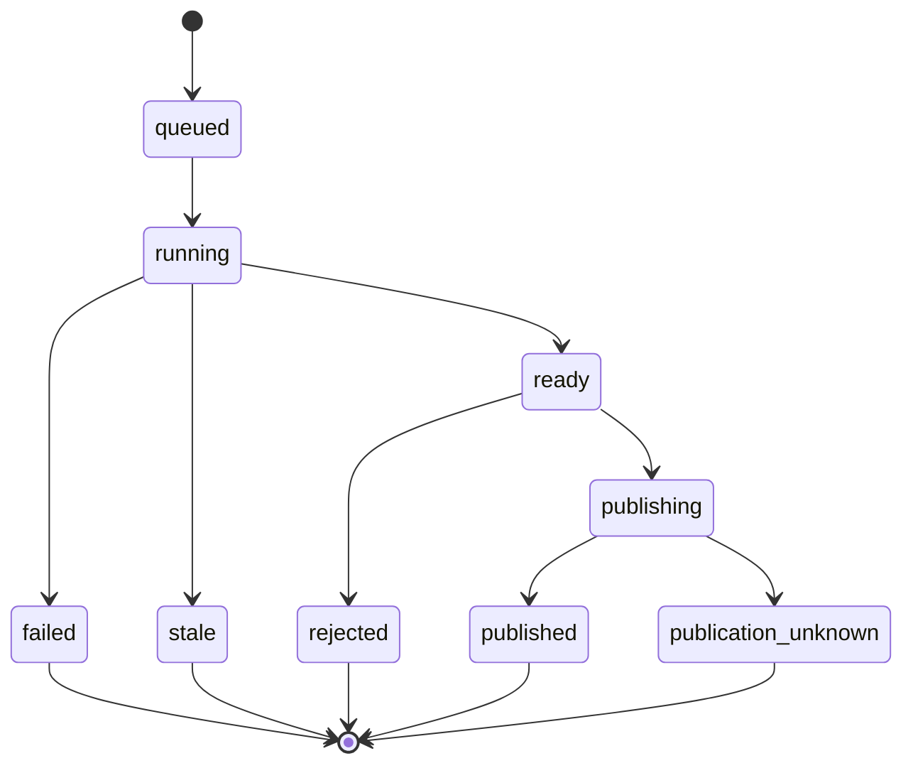

# Skills 与 Skill Evolution

活跃贡献者：Bohan Jiang、Naiyuan Qing、Multica Eve

Skills 定义智能体执行 task 时可用的操作说明和 supporting files；Skill Evolution 则把真实执行反馈、Wiki/Room/Twin signal 和受控 replay 转成可审核的候选 revision。两条链共享 skill identity 与 bundle hash，但职责不同：前者负责存储、选择和安全分发，后者负责证据驱动的改进、发布与回滚。

## Skill 的来源与所有权

工作区 skill 的 HTTP 实现在 [`server/internal/handler/skill.go`](../../server/internal/handler/skill.go)，远程刷新在 [`server/internal/handler/skill_refresh.go`](../../server/internal/handler/skill_refresh.go)。结构化存储由 [`server/migrations/008_structured_skills.up.sql`](../../server/migrations/008_structured_skills.up.sql) 和 [`server/pkg/db/queries/skill.sql`](../../server/pkg/db/queries/skill.sql) 定义。

| 来源 | 存储形态 | 更新方式 | 执行时 source |
| --- | --- | --- | --- |
| 手工 Workspace skill | `skill` + `skill_file` | creator 或管理员在应用/API 编辑 | `workspace` |
| GitHub / skills.sh / ClawHub import | 普通工作区 row，`config.origin` 记录 provenance | 从已固定 origin refresh | `workspace` |
| `.skill` / `.zip` archive | 导入后为普通工作区 row | 无远程 origin，不能 refresh | `workspace` |
| runtime-local skill | 守护进程扫描本机 provider roots；可复制进工作区 | 本地来源自行变化；重新导入受 creator 限制 | 本地运行时或导入后的 `workspace` |
| plugin skill | 普通工作区 row，带 `plugin_installation_id` | plugin installation 生命周期管理 | `plugin` |
| Builtin Skill | 编译期 `embed.FS`，没有 DB row | 随 server 版本发布 | `builtin` |

Builtin Skills 位于 [`server/internal/service/builtin_skills`](../../server/internal/service/builtin_skills/)，由 [`server/internal/service/builtin_skills.go`](../../server/internal/service/builtin_skills.go) 嵌入，名称使用 `multica-` 前缀。它们自动加入每个智能体的执行集合，不需要 `agent_skill` row。

Runtime-local discovery 在 [`server/internal/daemon/local_skills.go`](../../server/internal/daemon/local_skills.go) 扫描各 provider 目录、`~/.agents/skills` 和 Claude plugin roots；API 通过 [`server/internal/handler/runtime_local_skills.go`](../../server/internal/handler/runtime_local_skills.go) 发起异步 list/import 请求。每个智能体还可保存 disabled runtime skills，相关策略在 [`server/internal/daemon/execenv/runtime_skill_policy.go`](../../server/internal/daemon/execenv/runtime_skill_policy.go)。

## 持久化与 API

| 表 | 作用 |
| --- | --- |
| `skill` | name、description、主 `SKILL.md` content、config/provenance、creator、plugin ownership |
| `skill_file` | references/scripts/assets 等 supporting files；`SKILL.md` 路径保留给主 content |
| `agent_skill` | 智能体与工作区 skill 的绑定及 `enabled` 开关 |
| agent runtime skill policy | 每个智能体对当前运行时本地 skill 的启停覆盖 |

`GET /api/skills/{id}?include=metadata` 可以只取主 content 和 supporting files 的 size/hash，不下载大正文。完整 detail 使用 `include=content`；缺省值为兼容旧客户端仍返回 content。

基础 API 都挂在工作区成员路由下：

| 方法与路径 | 用途 |
| --- | --- |
| `GET /api/skills`、`GET /api/skills/search` | 工作区列表与远程 catalog 搜索 |
| `POST /api/skills` | 创建手工 skill |
| `POST /api/skills/import` | 从 URL、archive 或 runtime-local import |
| `GET/PUT/DELETE /api/skills/{id}` | 读取、更新、删除 |
| `POST /api/skills/{id}/refresh` | 从可信 `config.origin` 重新抓取 |
| `GET/PUT/DELETE /api/skills/{id}/files...` | supporting file 管理 |
| `GET/POST/DELETE /api/skills/{id}/labels...` | label 管理 |
| `GET/PUT/POST/DELETE /api/agents/{id}/skills...` | 智能体绑定、批量设置与 enabled |
| `PUT /api/agents/{id}/runtime-skills/enabled` | runtime-local skill 启停覆盖 |
| `POST/GET /api/agent-runtimes/{id}/local-skills...` | 守护进程本地发现与导入请求 |

创建和 import 要求可解析的 human user。更新、删除、文件、label 与 refresh 使用“原 creator 或工作区 `owner`/`admin`”规则；其中 runtime-local re-import 的 overwrite 更窄，只有原 creator 能覆盖，管理员若不是 creator 应在应用内编辑。Agent 绑定还要经过 [`server/internal/handler/agent_runtime_skills.go`](../../server/internal/handler/agent_runtime_skills.go) 的 agent management 权限和 runtime assignment 检查。

## 从工作区到 task 的 bundle 分发

[`server/internal/service/task.go`](../../server/internal/service/task.go) 的 `LoadAgentSkillBundles` 合并 enabled `agent_skill` 与所有 Builtin Skills，再为每个 skill 构建确定性 manifest。

关键约束：

1. **完整读取或失败**：工作区 skill 列表或 supporting file 查询失败时，Service fail closed，不会把“读取失败”伪装成“智能体没有 skill”。
2. **确定性 identity**：[`server/pkg/skillbundle/hash.go`](../../server/pkg/skillbundle/hash.go) 以 source、ID、主 content 与排序后的 files 计算 manifest hash、size、file count 和每文件 SHA-256。
3. **Slim claim**：task claim 可只携带 refs；Builtin 用 `builtin:<name>` 作为无 DB row 的稳定 ID。
4. **按需 resolve**：守护进程对 server 支持的 ref 每个 skill 单独调用 `/skill-bundles/resolve`。Workspace ref 由 agent-skill junction 授权并只加载请求项，Builtin ref 直接从嵌入集合解析，避免 N 次请求都重算全部 N 个 skill。
5. **独立 cache**：[`server/internal/daemon/skill_cache.go`](../../server/internal/daemon/skill_cache.go) 按 bundle identity 缓存并检查路径、hash、size 和 file count。任一验证或写入失败都会中止 task 准备。
6. **可见性**：[`server/internal/daemon/execenv/skill_visibility.go`](../../server/internal/daemon/execenv/skill_visibility.go) 根据 provider 与 runtime policy 安装/隐藏 skill，不能依赖目录碰巧存在。

Plugin row 在服务端 source classification 中标为 `plugin`。当前按需 resolve endpoint 只有 `workspace` 与 `builtin` producer；`plugin` 或其他没有 server-side producer 的 source 会返回 not found，而不会悄悄按 workspace ref 解析。Workspace ref 不属于智能体、已 disabled、跨工作区或 ID 非法时也统一返回 not found，不暴露租户外 identity。

## Skill Evolution 架构

Skill Evolution 是可选模块，通过 [`server/internal/skillevolution/module.go`](../../server/internal/skillevolution/module.go) 的单一 registration hook 挂到 server router。它复用工作区 skill repository，但把 revision、evidence、evaluation、review、release、task attribution 和 dispatch snapshot 放在独立表中。

### Loop 配置

每个 skill 可有一个 `skill_evolution_loop`：

| 字段/状态 | 含义 |
| --- | --- |
| `enabled` | scheduler 是否考虑此 loop |
| `mode=observe` | 收集 signal，不自动生成 proposal |
| `mode=propose` | 满足 cooldown 与最小 signal 数后可生成候选 |
| `mode=paused` | 暂停观察/提案 |
| `cooldown_seconds` | 两次 proposal 的最短间隔 |
| `minimum_signals` | 触发所需 eligible signal 数 |
| `max_evidence_refs` / `max_replay_samples` / `max_cost_usd_ticks` | evidence、replay 与成本上限 |
| `policy_version` | 生成与评估 policy identity |

配置、状态转换和 scheduler 分别在 [`server/internal/skillevolution/lifecycle.go`](../../server/internal/skillevolution/lifecycle.go)、[`server/internal/skillevolution/state.go`](../../server/internal/skillevolution/state.go) 和 [`server/internal/skillevolution/scheduler.go`](../../server/internal/skillevolution/scheduler.go)。

### Evidence 来源与角色

`skill_evolution_evidence.kind` 支持：

- `task_review`；
- `manual_rerun`；
- `wiki_proposal_review`；
- `room_accepted_outcome`；
- `twin_run_feedback`；
- `twin_accepted_deposition`。

每条 evidence 带 source identity/revision、digest、observed time、target skill 与 eligibility。[`server/migrations/526_skill_evolution_evidence_role.up.sql`](../../server/migrations/526_skill_evolution_evidence_role.up.sql) 进一步区分 `synthesis` 和 `held_out_replay`：用于生成候选的 signal 不能又作为证明候选有效的独立 replay 样本，避免训练与评估数据混用。

Task 反馈的来源 API 是 `POST /api/tasks/{taskId}/review`，outcome 为 `helpful` 或 `needs_correction`，target 可为 `knowledge`、`twin_assertion`、`skill_procedure` 或 `product_defect`。只有 `skill_procedure` 指向具体 skill；dispatch snapshot 与 exact attribution 用于证明该 task 实际加载了哪个 bundle revision，而不是仅凭“智能体绑定过这个 skill”推断。

### Proposal 与 evaluation

Proposal 状态机为：

Candidate 以 immutable `skill_evolution_revision` 和 `skill_evolution_revision_file` 保存，proposal 同时固定 `base_hash`、candidate hash、generation idempotency key 与 rationale digest。Evaluation 有两类：

- `deterministic_validation`：frontmatter、保留路径、bundle 大小/hash、diff 与 policy 等机械规则；
- `behavioral_replay`：在授权、限量、held-out 样本上比较行为，结果为 `passed`、`failed`、`inconclusive` 或 `unknown`。

生成器和评估器分别在 [`server/internal/skillevolution/improver.go`](../../server/internal/skillevolution/improver.go)、[`server/internal/skillevolution/validation.go`](../../server/internal/skillevolution/validation.go) 与 [`server/internal/skillevolution/behavioral_replay.go`](../../server/internal/skillevolution/behavioral_replay.go)。没有足够 evidence、base hash 已变化、ownership 不允许原地更新或评估未通过时，proposal 不进入可发布路径。

### Publish、rollback 与 ownership

发布只允许 human `owner`/`admin`。[`server/internal/skillevolution/publisher.go`](../../server/internal/skillevolution/publisher.go) 使用 expected base hash 和 idempotency key，防止在审核期间 skill 已被手工更新后仍覆盖新版本。Release outcome 为 `pending`、`succeeded`、`failed` 或 `publication_unknown`；数据库提交结果无法确认时进入 `publication_unknown`，不能盲目重试一次写出第二个 release。

Rollback 不是删除 release，而是以已知 release 为 source 创建新的、可审计的 `rollback` release。Plugin、external、runtime-local、Builtin 或 ownership 不明确的 skill 可能要求先 fork 成工作区自有 skill；[`server/internal/skillevolution/fork_adapter.go`](../../server/internal/skillevolution/fork_adapter.go) 处理 identity 与 supporting files 的复制。

## Skill Evolution API 与权限

模块挂载在 `/api/skill-evolution`，并强制 human actor。所有路由还继承外层工作区成员检查。

| 方法与路径 | 用途 | 权限 |
| --- | --- | --- |
| `GET /api/skill-evolution/skills/{skillId}` | overview、loop、proposal、release、permissions | member |
| `PUT /api/skill-evolution/skills/{skillId}/loop` | 配置 loop | creator 或 `owner`/`admin` |
| `POST /api/skill-evolution/skills/{skillId}/pause` | 暂停 loop | creator 或 `owner`/`admin` |
| `POST /api/skill-evolution/skills/{skillId}/proposals` | 手动请求 proposal | creator 或 `owner`/`admin` |
| `POST /api/skill-evolution/skills/{skillId}/fork` | fork 非工作区 ownership | `owner`/`admin` |
| `GET /api/skill-evolution/proposals/{proposalId}` | proposal/evidence/evaluation detail | member |
| `POST /api/skill-evolution/proposals/{proposalId}/reject` | 拒绝候选 | creator 或 `owner`/`admin` |
| `POST /api/skill-evolution/proposals/{proposalId}/publish` | 发布候选 | `owner`/`admin` |
| `POST /api/skill-evolution/skills/{skillId}/releases/{releaseId}/rollback` | 审计式回滚 | `owner`/`admin` |
| `POST /api/tasks/{taskId}/review` | 提交 task run review | human；受 task access 检查 |
| `GET /api/task-run-reviews...` | review/manual rerun evidence 查询 | workspace access |

Room recommendation target、task dispatch/completion contributor 与 workspace cleanup contributor 都在 [`server/internal/skillevolution/module.go`](../../server/internal/skillevolution/module.go) 注册，是把新 signal 或生命周期接入现有模块的扩展点。

## 数据模型

主表由 [`server/migrations/482_skill_evolution_tables.up.sql`](../../server/migrations/482_skill_evolution_tables.up.sql) 创建：

| 表 | 作用 |
| --- | --- |
| `skill_evolution_loop` | 配置、调度 checkpoint、最近 observation/proposal |
| `skill_evolution_revision` / `_file` | immutable base/candidate/release bundle |
| `skill_evolution_proposal` | 生命周期、base/candidate identity、rationale 与失败/stale 原因 |
| `skill_evolution_evidence` | signal lineage、eligibility、role |
| `skill_evolution_evaluation` | deterministic/replay 结果、adapter/policy version、安全指标与成本 |
| `skill_evolution_review` | `rejected`/`publish` 人工决定 |
| `skill_evolution_release` | publish/rollback、expected/pre/post hash、outcome |
| `skill_evolution_task_attribution` | task、runtime、skill revision 与 manifest identity |
| `skill_evolution_task_dispatch_snapshot` | dispatch 时完整 skill refs，支持 exact coverage |
| `task_run_review` | human feedback 与 correction |

Dispatch snapshot、proposal rationale、exact coverage/loop state 和 evidence role 分别由 [`server/migrations/515_skill_evolution_task_dispatch_snapshot.up.sql`](../../server/migrations/515_skill_evolution_task_dispatch_snapshot.up.sql)、[`server/migrations/519_skill_evolution_proposal_rationale.up.sql`](../../server/migrations/519_skill_evolution_proposal_rationale.up.sql)、[`server/migrations/525_skill_evolution_exact_coverage_and_loop_state.up.sql`](../../server/migrations/525_skill_evolution_exact_coverage_and_loop_state.up.sql) 和 migration 526 扩展。

## Web、Desktop 与 Mobile

Web/Desktop 的 Skills 列表、详情、创建、import、refresh、supporting files 与 runtime-local import UI 位于 [`packages/views/skills`](../../packages/views/skills/)。Skill Evolution 使用 [`packages/views/skill-evolution/skill-evolution-page.tsx`](../../packages/views/skill-evolution/skill-evolution-page.tsx)，展示 loop configuration、bundle diff、evidence/evaluation、proposal review 和 release history；协议层在 [`packages/core/skill-evolution`](../../packages/core/skill-evolution/)。

Web 路由为 `/{workspaceSlug}/skills` 与 `/{workspaceSlug}/skills/{id}/evolution`；Desktop 在 [`apps/desktop/src/renderer/src/routes.tsx`](../../apps/desktop/src/renderer/src/routes.tsx) 复用相同页面。

当前 Mobile 没有独立 Skills library、runtime-local import 或 Skill Evolution 页面。Agent payload 可能包含 skill 相关状态，但这不等于 Mobile 提供编辑、发布或回滚能力。

## 扩展规则

- 新 import source 必须写入可验证 `config.origin`、设置网络/文件数量与大小上限，并决定是否可 refresh。
- 新 skill source classification 必须同步 bundle manifest、resolve authorization、daemon cache、Evolution ownership 和 UI schema。
- 新 evidence adapter 要实现稳定 source revision、digest、授权、eligibility 与 role；不要只传自然语言摘要。
- 新 evaluator 要记录 adapter/version、policy version、result digest、安全指标、成本和 idempotency identity。
- 修改 manifest 规范时要版本化 execution manifest，并保留旧 task attribution 的可解释性。
- 发布路径始终校验 expected base hash；遇到 `publication_unknown` 先 reconciliation，不能自动再发一次写请求。

## 测试入口

### Skills 与分发

- [`server/internal/handler/skill_test.go`](../../server/internal/handler/skill_test.go)：CRUD、权限、files 与 agent binding。
- [`server/internal/handler/skill_import_archive_test.go`](../../server/internal/handler/skill_import_archive_test.go)、[`server/internal/handler/skill_refresh_test.go`](../../server/internal/handler/skill_refresh_test.go)：import/refresh/provenance。
- [`server/internal/service/builtin_skills_test.go`](../../server/internal/service/builtin_skills_test.go)：embedded Builtin Skills。
- [`server/internal/service/task_agent_skills_test.go`](../../server/internal/service/task_agent_skills_test.go)、[`server/internal/service/skill_bundle_test.go`](../../server/internal/service/skill_bundle_test.go)：合并、hash/ref 与 fail-closed。
- [`server/internal/daemon/skill_cache_test.go`](../../server/internal/daemon/skill_cache_test.go)、[`server/internal/daemon/skill_bundle_resolve_test.go`](../../server/internal/daemon/skill_bundle_resolve_test.go)：resolve、校验与 cache。

### Skill Evolution

- [`server/internal/skillevolution/state_test.go`](../../server/internal/skillevolution/state_test.go)、[`server/internal/skillevolution/scheduler_test.go`](../../server/internal/skillevolution/scheduler_test.go)：状态机和调度。
- [`server/internal/skillevolution/evidence_test.go`](../../server/internal/skillevolution/evidence_test.go)、[`server/internal/skillevolution/evidence_lineage_test.go`](../../server/internal/skillevolution/evidence_lineage_test.go)：evidence identity/lineage。
- [`server/internal/skillevolution/heldout_replay_test.go`](../../server/internal/skillevolution/heldout_replay_test.go)、[`server/internal/skillevolution/validation_test.go`](../../server/internal/skillevolution/validation_test.go)：评估隔离与确定性 gate。
- [`server/internal/skillevolution/publisher_test.go`](../../server/internal/skillevolution/publisher_test.go)：publish、rollback、base hash 与 unknown outcome。
- [`server/internal/skillevolution/attribution_worker_test.go`](../../server/internal/skillevolution/attribution_worker_test.go)、[`server/internal/skillevolution/coverage_concurrency_test.go`](../../server/internal/skillevolution/coverage_concurrency_test.go)：dispatch attribution 与 exact coverage 并发。
- [`server/internal/skillevolution/http_test.go`](../../server/internal/skillevolution/http_test.go) 和 [`packages/views/skill-evolution/skill-evolution-page.test.tsx`](../../packages/views/skill-evolution/skill-evolution-page.test.tsx)：API 权限与共享 UI。

## 关键源文件

| 文件 | 用途 |
| --- | --- |
| [`server/internal/handler/skill.go`](../../server/internal/handler/skill.go) | Skills CRUD、import、files 与 agent bindings |
| [`server/internal/service/task.go`](../../server/internal/service/task.go) | 可见 skill 加载、manifest/ref 构建与按需 resolve |
| [`server/pkg/skillbundle/hash.go`](../../server/pkg/skillbundle/hash.go) | 确定性 bundle manifest |
| [`server/internal/daemon/local_skills.go`](../../server/internal/daemon/local_skills.go) | runtime-local discovery |
| [`server/internal/daemon/skill_cache.go`](../../server/internal/daemon/skill_cache.go) | daemon bundle cache 与校验 |
| [`server/internal/skillevolution/lifecycle.go`](../../server/internal/skillevolution/lifecycle.go) | Evolution lifecycle 编排 |
| [`server/internal/skillevolution/evidence.go`](../../server/internal/skillevolution/evidence.go) | evidence 采集与 eligibility |
| [`server/internal/skillevolution/evaluation.go`](../../server/internal/skillevolution/evaluation.go) | validation/replay evaluation |
| [`server/internal/skillevolution/publisher.go`](../../server/internal/skillevolution/publisher.go) | publish/rollback 与 publication safety |
| [`server/internal/skillevolution/module.go`](../../server/internal/skillevolution/module.go) | HTTP、Room、task worker 与 cleanup 组合入口 |

## 相关页面

- [Room 人工审核与晋升](room-review-and-promotion.md)
- [守护进程与运行时](../systems/daemon-and-runtime.md)
