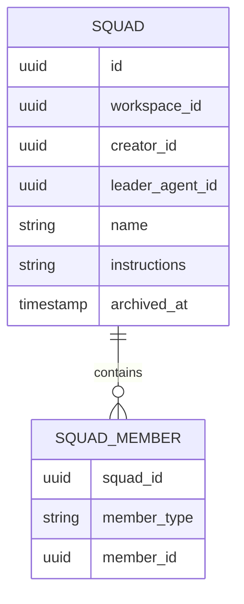
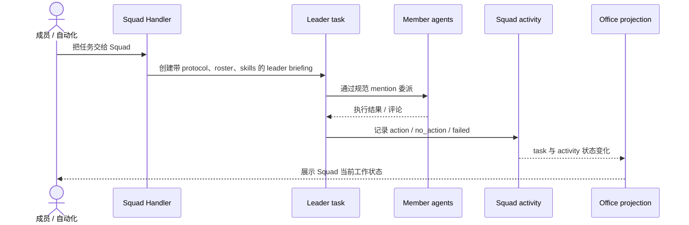
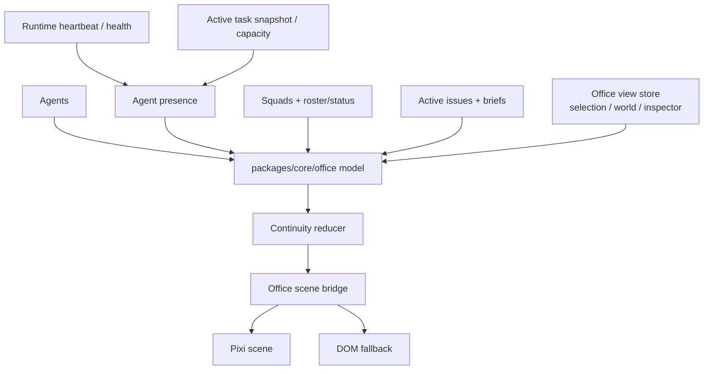
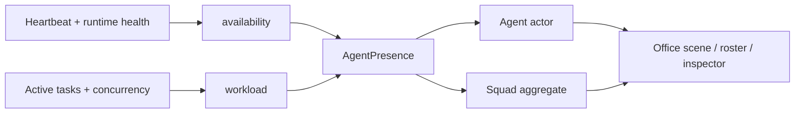

# Squads 与 Office

活跃贡献者：Bohan Jiang、Naiyuan Qing、Jiayuan Zhang

Squad 是可被分配和调用的协作单元：它有 leader、成员、instructions 和管理权限。Office 则是前端根据智能体、运行时、task、Squad 和任务数据计算出的实时工作场景。两者会在 UI 中同时出现，但持久化模型完全不同：Squad 是后端资源，Office 没有独立后端表。

## Squad 数据模型



`squad_member` 可以指向智能体或工作区成员。数据库不使用外键，创建、更新、删除和归档时的关系完整性由应用事务维护。基础 schema 位于 [`server/migrations/084_squad.up.sql`](https://github.com/oldwinter/multica/blob/685cf788777e24724b0d82ffe88c56459341fb2a/server/migrations/084_squad.up.sql)，当前 SQL 在 [`server/pkg/db/queries/squad.sql`](https://github.com/oldwinter/multica/blob/685cf788777e24724b0d82ffe88c56459341fb2a/server/pkg/db/queries/squad.sql)。

## 创建与管理权限

任意工作区成员都可以创建 Squad，但管理范围不同：

| 操作者 | 创建 | 更新/归档任意 Squad | 管理自己创建的 Squad | 可选择的智能体 |
| --- | --- | --- | --- | --- |
| `owner` / `admin` | 是 | 是 | 是 | 工作区权限允许的智能体 |
| `member` | 是 | 否 | 是 | 仅自己有 invoke 权限的智能体 |

关键规则：

- leader 必须是智能体，且创建时自动加入成员列表。
- leader 不能通过普通的成员移除操作删掉；应先执行合法的 leader 变更。
- 服务端按主体类型验证每个成员真实存在且属于同一工作区。
- 普通成员知道某个私有智能体 ID，不代表可以把它加入 Squad。
- UI 隐藏按钮只是体验优化，真正的 creator scope 和 invoke gate 在 [`server/internal/handler/squad.go`](https://github.com/oldwinter/multica/blob/685cf788777e24724b0d82ffe88c56459341fb2a/server/internal/handler/squad.go)。

### 归档

归档不会只设置一个列表过滤字段。若任务或自动化当前把该 Squad 作为负责人，服务端会把 Squad assignee 转移到 leader 智能体，避免留下无法执行的引用。新增其他 polymorphic assignee 时，也要同步考虑这个清理/迁移事务。

## Leader 如何协调执行

分配给 Squad 的工作以 leader 为入口。leader 的 task briefing 会注入：

- Squad operating protocol。
- leader 与成员 roster。
- 成员可用 skills。
- Squad 自定义 instructions。
- 当前任务上下文和委派要求。

leader 使用规范 mention 委派给成员，并通过 CLI 记录协调结果：

```text
multica squad activity ... action
multica squad activity ... no_action
multica squad activity ... failed
```

`action` 表示确实发生了委派/协调，`no_action` 表示 leader 判断不需要分派，`failed` 表示协调尝试失败。这些值是可观测的执行协议，不是纯日志文案。briefing 生成和 claim 边界见 [`server/internal/handler/squad_briefing.go`](https://github.com/oldwinter/multica/blob/685cf788777e24724b0d82ffe88c56459341fb2a/server/internal/handler/squad_briefing.go)。



成员评论或子任务结果可以再次唤醒 leader。防重复、来源归属和 leader/private-agent 权限分别有独立测试，修改触发条件时不要只测首次分配。

## Squad 状态

列表中的 Squad 状态不是 `squad` 表的一列，而是成员运行时和 task 快照的聚合：

| 状态 | 典型含义 |
| --- | --- |
| `working` | leader 或成员存在正在执行的 task |
| `idle` | 可用但当前没有工作 |
| `unstable` | 运行时可见但健康/心跳不稳定 |
| `offline` | 没有可用运行时 |
| `archived` | Squad 已归档 |

服务端成员状态投影在 [`server/internal/handler/squad.go`](https://github.com/oldwinter/multica/blob/685cf788777e24724b0d82ffe88c56459341fb2a/server/internal/handler/squad.go)，合同测试见 [`server/internal/handler/squad_member_status_test.go`](https://github.com/oldwinter/multica/blob/685cf788777e24724b0d82ffe88c56459341fb2a/server/internal/handler/squad_member_status_test.go)。不要让前端仅凭 leader 一个智能体覆盖整个 Squad 的状态。

## Office 是聚合投影

Office 没有 `office` 表，也没有专用 `/office` 领域资源。它组合现有 Query 的结果：

- 智能体与归档状态。
- 运行时 heartbeat、health 和 capability。
- 活跃 task 快照与并发容量。
- Squads 及其 roster/status。
- 活跃任务和 issue brief。
- 当前选中 Squad、视图模式与 inspector 状态。



Query 聚合在 [`packages/core/office/queries.ts`](https://github.com/oldwinter/multica/blob/685cf788777e24724b0d82ffe88c56459341fb2a/packages/core/office/queries.ts)，规范化模型在 [`model.ts`](https://github.com/oldwinter/multica/blob/685cf788777e24724b0d82ffe88c56459341fb2a/packages/core/office/model.ts)，页面消费的是计算结果而不是另一份 Office server cache。

## Presence 的两个维度

Presence 把"能不能联系到"与"正在做什么"分开：

### Availability

`online` / `unstable` / `offline` 来自运行时 heartbeat 和 health。它描述基础设施可用性，不代表智能体一定空闲。

### Workload

`idle` / `queued` / `working` 来自活跃 task 状态和运行时并发容量。一个 online 智能体可以 working，也可以因容量已满而 queued；offline 与 idle 也不是同义词。

共享推导见 [`packages/core/agents/derive-presence.ts`](https://github.com/oldwinter/multica/blob/685cf788777e24724b0d82ffe88c56459341fb2a/packages/core/agents/derive-presence.ts) 和 [`use-agent-presence.ts`](https://github.com/oldwinter/multica/blob/685cf788777e24724b0d82ffe88c56459341fb2a/packages/core/agents/use-agent-presence.ts)。



状态颜色或动画可以把两个维度组合展示，但领域类型应保持正交，否则无法表达 "在线且正在工作"、"不稳定但仍有 task" 等真实情况。

## Continuity：只播放可信过渡

Office 为 queued、start、finish 等变化提供短暂过渡，但不能把断线期间未知的历史伪装成实时动画。[`packages/core/office/continuity.ts`](https://github.com/oldwinter/multica/blob/685cf788777e24724b0d82ffe88c56459341fb2a/packages/core/office/continuity.ts) 只在可靠的前台连续观测窗口内生成过渡；以下情况会 rebase：

- 切换工作区或 Office world。
- WebSocket 重连。
- 当前数据超过 stale 边界。
- 页面不在可靠前台观测状态。
- 用户启用 reduced motion。

rebase 直接接受最新快照，不补演中间过程。这个规则同时保护正确性和可访问性。

## Office 视图

Web/Desktop 共享 [`OfficePage`](https://github.com/oldwinter/multica/blob/685cf788777e24724b0d82ffe88c56459341fb2a/packages/views/office/office-page.tsx)，包含：

- Agents、Squads 和活跃任务的工作场景。
- roster 与 inspector。
- Studio/Expedition 等 world 切换。
- Pixi scene。
- 在渲染能力不足或降级条件下使用的 DOM fallback。

scene 的命令式边界在 [`packages/views/office/office-scene-bridge.tsx`](https://github.com/oldwinter/multica/blob/685cf788777e24724b0d82ffe88c56459341fb2a/packages/views/office/office-scene-bridge.tsx)，Pixi 实现在 [`scene/office-scene.tsx`](https://github.com/oldwinter/multica/blob/685cf788777e24724b0d82ffe88c56459341fb2a/packages/views/office/scene/office-scene.tsx)，fallback 在 [`packages/views/office/office-fallback.tsx`](https://github.com/oldwinter/multica/blob/685cf788777e24724b0d82ffe88c56459341fb2a/packages/views/office/office-fallback.tsx)。业务状态应先进入 core model，再通过 bridge 传给渲染器；不要在 Pixi actor 内重新请求 API。

## 平台差异

| 能力 | Web | Desktop | Mobile |
| --- | --- | --- | --- |
| Squad 列表/详情/创建 | 共享 `packages/views/squads` | 同一共享页面 | 目前只有 Squad 列表 query，未发现完整管理页面 |
| Office 页面 | 共享 `packages/views/office` | 同一共享页面 | 未实现 |
| Presence 语义 | core 聚合 | core 聚合 | 需要独立实现时仍应保持 availability/workload 语义 |
| Scene | Pixi + DOM fallback | Pixi + DOM fallback | 无 |

Web 路由见 [`squads/page.tsx`](https://github.com/oldwinter/multica/blob/685cf788777e24724b0d82ffe88c56459341fb2a/apps/web/app/%5BworkspaceSlug%5D/%28dashboard%29/squads/page.tsx) 和 [`office/page.tsx`](https://github.com/oldwinter/multica/blob/685cf788777e24724b0d82ffe88c56459341fb2a/apps/web/app/%5BworkspaceSlug%5D/%28dashboard%29/office/page.tsx)；Desktop 在 [`apps/desktop/src/renderer/src/routes.tsx`](https://github.com/oldwinter/multica/blob/685cf788777e24724b0d82ffe88c56459341fb2a/apps/desktop/src/renderer/src/routes.tsx) 挂载共享页面。Mobile 当前可见的数据入口是 [`apps/mobile/data/queries/squads.ts`](https://github.com/oldwinter/multica/blob/685cf788777e24724b0d82ffe88c56459341fb2a/apps/mobile/data/queries/squads.ts)。

## API 操作面

具体 Squad URL 以 [`server/cmd/server/router.go`](https://github.com/oldwinter/multica/blob/685cf788777e24724b0d82ffe88c56459341fb2a/server/cmd/server/router.go) 为准：

| 方法与路径 | 行为 |
| --- | --- |
| `GET/POST /api/squads` | 列表 / 创建 |
| `GET/PUT/DELETE /api/squads/{id}` | 详情 / 更新 / 归档 |
| `GET/POST/DELETE /api/squads/{id}/members` | roster / 增加 / 移除成员 |
| `GET /api/squads/{id}/members/status` | 成员运行时/task 状态 |
| `PATCH /api/squads/{id}/members/role` | 变更成员角色，包括合法的 leader 迁移 |
| `POST /api/issues/{id}/squad-evaluated` | 记录 leader 的 action/no_action/failed 评估 |
| Office | 无专用 CRUD API；消费 agents/runtimes/tasks/squads/issues 等现有查询 |

## 修改入口

| 变更 | 首选入口 |
| --- | --- |
| Squad CRUD、权限与归档 | [`server/internal/handler/squad.go`](https://github.com/oldwinter/multica/blob/685cf788777e24724b0d82ffe88c56459341fb2a/server/internal/handler/squad.go) |
| leader briefing/protocol | [`server/internal/handler/squad_briefing.go`](https://github.com/oldwinter/multica/blob/685cf788777e24724b0d82ffe88c56459341fb2a/server/internal/handler/squad_briefing.go) |
| Squad SQL | [`server/pkg/db/queries/squad.sql`](https://github.com/oldwinter/multica/blob/685cf788777e24724b0d82ffe88c56459341fb2a/server/pkg/db/queries/squad.sql) + 新 migration |
| 共享 Squad 页面 | [`packages/views/squads/`](https://github.com/oldwinter/multica/tree/685cf788777e24724b0d82ffe88c56459341fb2a/packages/views/squads) |
| Office Query/model | [`packages/core/office/`](https://github.com/oldwinter/multica/tree/685cf788777e24724b0d82ffe88c56459341fb2a/packages/core/office) |
| Presence | [`packages/core/agents/derive-presence.ts`](https://github.com/oldwinter/multica/blob/685cf788777e24724b0d82ffe88c56459341fb2a/packages/core/agents/derive-presence.ts) |
| Office UI/scene | [`packages/views/office/`](https://github.com/oldwinter/multica/tree/685cf788777e24724b0d82ffe88c56459341fb2a/packages/views/office) |

## 测试入口

Squad：

- [`server/internal/handler/squad_creator_scope_test.go`](https://github.com/oldwinter/multica/blob/685cf788777e24724b0d82ffe88c56459341fb2a/server/internal/handler/squad_creator_scope_test.go)：创建者管理范围。
- [`server/internal/handler/squad_private_leader_test.go`](https://github.com/oldwinter/multica/blob/685cf788777e24724b0d82ffe88c56459341fb2a/server/internal/handler/squad_private_leader_test.go)：私有 leader 权限。
- [`server/internal/handler/squad_briefing_test.go`](https://github.com/oldwinter/multica/blob/685cf788777e24724b0d82ffe88c56459341fb2a/server/internal/handler/squad_briefing_test.go) 与 [`server/internal/handler/squad_briefing_claim_test.go`](https://github.com/oldwinter/multica/blob/685cf788777e24724b0d82ffe88c56459341fb2a/server/internal/handler/squad_briefing_claim_test.go)：leader 协议和领取。
- [`server/internal/handler/squad_worker_comment_wakes_leader_test.go`](https://github.com/oldwinter/multica/blob/685cf788777e24724b0d82ffe88c56459341fb2a/server/internal/handler/squad_worker_comment_wakes_leader_test.go)：成员结果再次唤醒 leader。
- [`server/internal/handler/squad_no_action_test.go`](https://github.com/oldwinter/multica/blob/685cf788777e24724b0d82ffe88c56459341fb2a/server/internal/handler/squad_no_action_test.go)：`no_action` 合同。

Office：

- [`packages/core/office/continuity.test.ts`](https://github.com/oldwinter/multica/blob/685cf788777e24724b0d82ffe88c56459341fb2a/packages/core/office/continuity.test.ts)：可靠过渡与 rebase。
- [`packages/core/office/model.test.ts`](https://github.com/oldwinter/multica/blob/685cf788777e24724b0d82ffe88c56459341fb2a/packages/core/office/model.test.ts)：聚合模型。
- [`packages/views/office/office-page.test.tsx`](https://github.com/oldwinter/multica/blob/685cf788777e24724b0d82ffe88c56459341fb2a/packages/views/office/office-page.test.tsx)：共享页面。
- [`packages/views/office/office-scene-bridge.test.tsx`](https://github.com/oldwinter/multica/blob/685cf788777e24724b0d82ffe88c56459341fb2a/packages/views/office/office-scene-bridge.test.tsx)：bridge。
- [`scene/office-scene.test.tsx`](https://github.com/oldwinter/multica/blob/685cf788777e24724b0d82ffe88c56459341fb2a/packages/views/office/scene/office-scene.test.tsx)：Pixi scene。

```bash
(cd server && go test ./internal/handler -run 'Test.*Squad' -count=1)
pnpm --filter @multica/core exec vitest run office
pnpm --filter @multica/views exec vitest run office squads
```

## 相关页面

- [Rooms](rooms.md)
- [任务与 task 执行](issues-and-tasks.md)
