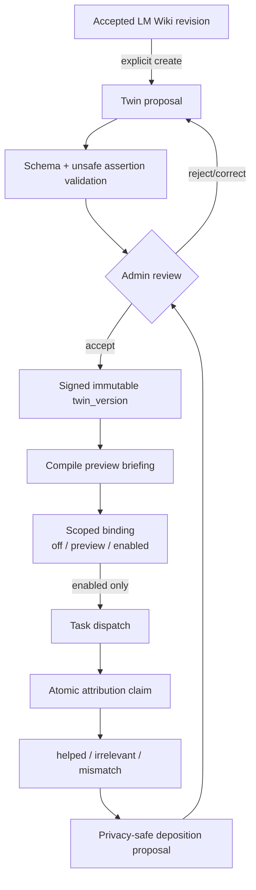

# Twin

活跃贡献者：Naiyuan Qing、oldwinter

Twin 是从已接受 LM Wiki evidence 生成、由人签署并按作用域注入智能体 task 的执行上下文。它不是用户身份的自动复制，也不会因 LM Wiki 被接受而自动启用；从 proposal 到 binding、task attribution、feedback 和 deposition，每一步都有独立的审核或可追踪状态。

## 端到端闭环

核心领域代码位于 [`server/internal/service/twin.go`](../../server/internal/service/twin.go)、[`server/internal/service/twin_domain.go`](../../server/internal/service/twin_domain.go)、[`server/internal/service/twin_proposal.go`](../../server/internal/service/twin_proposal.go) 和 [`server/internal/service/twin_activation.go`](../../server/internal/service/twin_activation.go)。HTTP 分为 [`server/internal/handler/twin.go`](../../server/internal/handler/twin.go) 的 proposal/version API 与 [`server/internal/handler/twin_execution.go`](../../server/internal/handler/twin_execution.go) 的执行控制 API。

### 1. Proposal

`POST /api/twins/proposals` 必须显式指定一个已接受的 LM Wiki revision。接受 LM Wiki 本身只改变 knowledge review，不会隐式生成 Twin。Service 根据当前是否已有 signed version 产生 `initial` 或 `evolution` proposal；反馈修正与经验沉淀还可产生 `correction`、`deposition` proposal。

### 2. 人工签署

管理员读取 proposal 的 assertion、citation 与 diff 后接受或拒绝。接受动作创建 immutable `twin_version`，记录 `signed_off_by_id`、签署时间、来源 LM Wiki revision、prior version 和 content digest。签署不等于运行时启用。

### 3. Preview 与 binding

管理员先编译 preview，检查将要注入的 briefing。Binding 的状态为：

- `off`：明确禁用；
- `preview`：可以编译和展示，但不注入 task；
- `enabled`：task dispatch 才能选择并注入。

默认行为是 `off`。Binding 的解析优先级为 `one_off > issue > project > agent > workspace`；较具体作用域覆盖较宽作用域。持久化 `twin_binding` 支持 `workspace`、`agent`、`project`、`issue`，`one_off` 是单次 task 的执行决策，不是长期工作区 binding。

### 4. Task attribution

当有效决策为 `enabled` 时，[`server/internal/service/twin_briefing.go`](../../server/internal/service/twin_briefing.go) 编译最多 8 KiB、约 2K tokens 的 briefing。它明确声明 Twin 内容低于 system safety、工作区权限和当前用户请求，不能覆盖更高优先级指令。

Dispatch claim 在同一原子记录中冻结：

- `twin_version_id`；
- briefing 与 SHA-256 digest；
-实际使用的 assertion IDs 与 citation keys；
- policy scope/type/id 与 `enabled` state；
- compiler version、agent、runtime 和 dispatched-at identity。

因此事后即使 binding 或最新 Twin 改变，也能解释某次 task 当时实际拿到了什么。Daemon 只消费 claim 中的 briefing，不自行查询“现在最新”的 Twin。

### 5. Feedback 与 deposition

已归因 task 可记录 `helped`、`irrelevant` 或 `mismatch`，并附可选 note。管理员可以从 task attribution 与 feedback 生成 privacy-safe deposition：系统只带出允许的事实、citation identity 和 digest，不把原始 prompt、secret、本机路径或 profile 泄漏到 proposal。Deposition 仍须走 proposal review；接受后才成为新的 signed Twin version。

## Assertion schema 与安全边界

当前 Twin schema v2 的 assertion 包含稳定 ID、type、text、applicability、evidence citations、confidence 与 provenance。生成与解析分别在 [`server/internal/service/twin_generator.go`](../../server/internal/service/twin_generator.go) 和 [`server/internal/service/twin_domain.go`](../../server/internal/service/twin_domain.go)。

Service 会拒绝或过滤不安全 assertion，包括：

- 把 Twin 描述成人类/用户身份或身份声明；
- secret、token、credential 与认证材料；
- 本机绝对路径、home 目录和 repository 私有位置；
- daemon/runtime/profile 等不应跨边界泄漏的环境信息；
- 没有可验证 evidence citation 的高风险断言；
- 试图覆盖 system safety、权限或当前用户指令的文本。

模型输出先经过严格 JSON/schema adapter，再经过领域验证。无法解析、citation 不一致或 safety 校验失败时 proposal 生成失败，不会退化成“尽量使用”的未签署文本。相关 wiring 在 [`server/internal/service/twin_model_adapter.go`](../../server/internal/service/twin_model_adapter.go)。

## 数据模型

基础 proposal/version 表由 [`server/migrations/275_twin_tables.up.sql`](../../server/migrations/275_twin_tables.up.sql) 引入，schema v2、deposition 与 correction 由 [`server/migrations/435_twin_schema_v2_and_deposition.up.sql`](../../server/migrations/435_twin_schema_v2_and_deposition.up.sql) 和 [`server/migrations/442_twin_proposal_correction.up.sql`](../../server/migrations/442_twin_proposal_correction.up.sql) 扩展。执行闭环位于 [`server/migrations/424_twin_execution_tables.up.sql`](../../server/migrations/424_twin_execution_tables.up.sql)。

| 表 | 作用 |
| --- | --- |
| `twin_proposal` | kind、来源 LM revision、base version、schema/content/digest、替换或 correction 关系 |
| `twin_proposal_review` | accepted/rejected、reviewer、reason |
| `twin_version` | version number、proposal、source LM revision、prior version、signed-off identity |
| `twin_binding` | scope、scope ID、`off`/`preview`/`enabled`、目标 version |
| `twin_task_attribution` | task dispatch 时实际注入的 briefing 与证据快照 |
| `twin_run_feedback` | task 级 `helped`/`irrelevant`/`mismatch` |
| `twin_deposition` | task evidence、base version、proposal、pending/accepted/rejected |
| `twin_activation_preview_checkpoint` | preview 已完成及其 freshness checkpoint |

Repository 分成 [`server/pkg/db/queries/twin.sql`](../../server/pkg/db/queries/twin.sql) 和 [`server/pkg/db/queries/twin_execution.sql`](../../server/pkg/db/queries/twin_execution.sql)，前者负责 proposal/version，后者负责 binding、attribution、feedback、deposition 和 metrics。

## Activation readiness

[`server/internal/service/twin_activation.go`](../../server/internal/service/twin_activation.go) 不返回一个模糊布尔值，而是逐项报告 activation facts：

1. source policy 已配置且 LM Wiki evidence current；
2. 存在 accepted LM Wiki revision；
3. 存在基于该 evidence 的 signed Twin version；
4. 当前 version 已完成 preview checkpoint；
5. 至少一个目标 binding 为 `enabled`；
6. 有使用该 version 的 attributed run；
7. run 已收到 feedback；
8. 需要时已形成并审核 deposition。

这让 UI 能指出缺的是“policy stale”“尚未 preview”还是“没有 attributed run”。Wiki 层的 source readiness 见 [LM Wiki 与 evidence](lm-wiki-and-evidence.md)。

## HTTP API 与权限

所有 Twin API 先要求工作区成员。读取、preview、task context 和 metrics 对成员开放；改变 signed knowledge 或执行 policy 的动作要求 human `owner`/`admin`。Task feedback 要求 human actor，并由服务确认 task 属于当前工作区及调用者可访问的上下文。

| 方法与路径 | 用途 | 权限 |
| --- | --- | --- |
| `GET /api/twin/overview` | 聚合旧入口所需概览 | member |
| `GET /api/twins` | versions/proposals 概览 | member |
| `GET /api/twins/proposals/{proposalId}` | proposal 与 review spine | member |
| `GET /api/twins/versions/{versionId}` | immutable signed version | member |
| `GET /api/twins/activation` | activation readiness | member |
| `GET /api/twins/bindings` | 列出执行 binding | member |
| `POST /api/twins/briefings/preview` | 编译但不注入 briefing | member |
| `GET /api/twins/tasks/{taskId}/context` | 查看 task attribution 与 feedback | member，受 task access 检查 |
| `GET /api/twins/metrics` | 使用、feedback 与维护指标 | member |
| `PUT /api/twins/tasks/{taskId}/feedback` | upsert run feedback | human actor |
| `POST /api/twins/proposals` | 从 accepted LM revision 生成 proposal | human `owner`/`admin` |
| `POST /api/twins/proposals/{id}/{action}`，其中 `action` 为 `accept`、`reject` 或 `correct` | 签署、拒绝或修正 | human `owner`/`admin` |
| `POST /api/twins/bindings` | upsert binding | human `owner`/`admin` |
| `DELETE /api/twins/bindings/{bindingId}` | 删除 binding | human `owner`/`admin` |
| `POST /api/twins/pause` | 暂停执行 policy | human `owner`/`admin` |
| `POST /api/twins/tasks/{taskId}/depositions` | 从反馈创建 deposition | human `owner`/`admin` |

## Web、Desktop 与 Mobile

Web 与 Desktop 都挂载 [`packages/views/twins/index.tsx`](../../packages/views/twins/index.tsx)。共享页面以 Wiki、Twin、Use 三个 tab 组织 source evidence、proposal/version review、binding/preview、activation readiness、metrics 和 maintenance；headless Query/mutation/schema 位于 [`packages/core/twins`](../../packages/core/twins/)。

Web 路由为 [`apps/web/app/[workspaceSlug]/(dashboard)/twins/page.tsx`](../../apps/web/app/[workspaceSlug]/(dashboard)/twins/page.tsx)，Desktop 在 [`apps/desktop/src/renderer/src/routes.tsx`](../../apps/desktop/src/renderer/src/routes.tsx) 直接复用 `TwinsPage`。

当前 `apps/mobile/` 没有 Twin 页面、binding editor 或 task feedback UI。Mobile 的 Wiki 支持不代表 Twin parity；新增 Mobile Twin 时应复用协议类型/纯函数，但需要独立实现原生页面、缓存和 realtime。

## 扩展入口

- 增加 assertion type：更新 schema adapter、领域 allowlist、briefing compiler、projection UI 和 v2 fixture；不能只放宽 JSON。
- 增加 binding scope：同时定义 precedence、scope ownership、唯一性、teardown、activation facts 和 attribution snapshot。
- 修改 briefing：保持 8 KiB 上限、确定性输出、compiler version 和 digest；已有 attribution 必须继续可解释。
- 增加 feedback/deposition source：先定义 privacy-safe egress，再接 proposal；不要把原始 task transcript 作为通用 evidence。
- 接入新的生成模型：实现 [`server/internal/service/twin_model_adapter.go`](../../server/internal/service/twin_model_adapter.go) 的严格边界，并保留 validation fail-closed。

## 测试入口

| 测试 | 覆盖重点 |
| --- | --- |
| [`server/internal/service/twin_domain_test.go`](../../server/internal/service/twin_domain_test.go) | schema v2 与 unsafe assertion |
| [`server/internal/service/twin_service_test.go`](../../server/internal/service/twin_service_test.go) | proposal、review、signed version |
| [`server/internal/service/twin_service_concurrent_test.go`](../../server/internal/service/twin_service_concurrent_test.go) | 并发 accept 与 version 序号 |
| [`server/internal/service/twin_activation_test.go`](../../server/internal/service/twin_activation_test.go) | activation facts |
| [`server/internal/service/twin_briefing_test.go`](../../server/internal/service/twin_briefing_test.go) | briefing 上限、优先级声明与确定性 |
| [`server/internal/service/twin_execution_control_test.go`](../../server/internal/service/twin_execution_control_test.go) | binding precedence 与 pause |
| [`server/internal/service/twin_deposition_test.go`](../../server/internal/service/twin_deposition_test.go) | feedback/deposition 隐私闭环 |
| [`server/internal/handler/twin_http_test.go`](../../server/internal/handler/twin_http_test.go) | HTTP contract 与权限 |
| [`server/internal/handler/twin_execution_contract_test.go`](../../server/internal/handler/twin_execution_contract_test.go) | task attribution/feedback API |
| [`packages/views/twins`](../../packages/views/twins/) | Web/Desktop review、Use panel 与 readiness |

## 关键源文件

| 文件 | 用途 |
| --- | --- |
| [`server/internal/service/twin.go`](../../server/internal/service/twin.go) | Twin service 与 review 事务 |
| [`server/internal/service/twin_domain.go`](../../server/internal/service/twin_domain.go) | assertion schema 与验证 |
| [`server/internal/service/twin_activation.go`](../../server/internal/service/twin_activation.go) | activation readiness |
| [`server/internal/service/twin_execution_control.go`](../../server/internal/service/twin_execution_control.go) | binding、pause 与 precedence |
| [`server/internal/service/twin_briefing.go`](../../server/internal/service/twin_briefing.go) | briefing compiler |
| [`server/internal/service/twin_attribution.go`](../../server/internal/service/twin_attribution.go) | task attribution claim |
| [`server/internal/service/twin_deposition.go`](../../server/internal/service/twin_deposition.go) | feedback 到 deposition |
| [`packages/views/twins/components/twin-workspace-view.tsx`](../../packages/views/twins/components/twin-workspace-view.tsx) | Web/Desktop Twin workspace UI |
