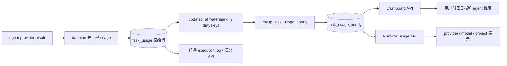
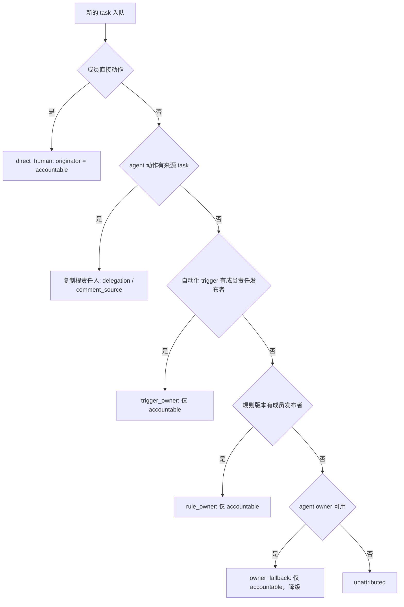

# 用量与归因

活跃贡献者：Bohan Jiang、Naiyuan Qing、Jiayuan Zhang

Multica 把两个问题分开处理：

1. **用量**：一次 agent `task` 消耗了多少 token、provider 是否给出权威成本、汇总后如何展示。
2. **归因**：哪个人授权了这次运行，哪个人应为审计、可见性和成本负责。

二者通过 `agent_task_queue` 的 task ID 和 `accountable_user_id` 汇合，但归因绝不参与价格计算，也不能被反过来当作权限授予。

## 两类 usage 不要混淆

本页讨论的是 `task_usage`：agent 执行产生的 token 和成本。

仓库还有 `client_usage_daily`，它只做 Web/Desktop 客户端每日活跃和 Desktop 运行时探测遥测。客户端按用户、平台、安装 ID、UTC 日期最多刷新一行，失败是 best-effort，不应阻断启动。它既不表示 agent token，也不进入 task 成本：

- [`packages/core/client-usage/reporter.tsx`](https://github.com/oldwinter/multica/blob/685cf788777e24724b0d82ffe88c56459341fb2a/packages/core/client-usage/reporter.tsx)
- [`server/internal/handler/client_usage.go`](https://github.com/oldwinter/multica/blob/685cf788777e24724b0d82ffe88c56459341fb2a/server/internal/handler/client_usage.go)
- [`server/pkg/db/queries/client_usage.sql`](https://github.com/oldwinter/multica/blob/685cf788777e24724b0d82ffe88c56459341fb2a/server/pkg/db/queries/client_usage.sql)

## Task 用量采集

agent provider 返回的每条 usage 包含：

- provider 和 model。
- input/output token。
- cache read/write token。
- 可选 `cost_usd_ticks`。

daemon 在判断完成、失败或取消分支之前先调用用量上报。这样即使运行随后失败，已经消耗的 token 也不会因只走失败回调而丢失。上报是独立接口，不依赖 complete/fail 成功。daemon 调用见：

- [`server/internal/daemon/daemon.go`](https://github.com/oldwinter/multica/blob/685cf788777e24724b0d82ffe88c56459341fb2a/server/internal/daemon/daemon.go)
- [`server/internal/daemon/client.go`](https://github.com/oldwinter/multica/blob/685cf788777e24724b0d82ffe88c56459341fb2a/server/internal/daemon/client.go)
- [`server/internal/handler/daemon.go`](https://github.com/oldwinter/multica/blob/685cf788777e24724b0d82ffe88c56459341fb2a/server/internal/handler/daemon.go)

server 验证 daemon 对 task 所在工作区的访问后，按：

```text
(task_id, provider, model)
```

upsert 到 `task_usage`。重报会覆盖该 provider/model 的完整计数和成本，而不是再次累加，因此 daemon 网络重试不会双计。`updated_at` 每次都会刷新，让小时汇总重新计算受影响桶。SQL 见 [`server/pkg/db/queries/task_usage.sql`](https://github.com/oldwinter/multica/blob/685cf788777e24724b0d82ffe88c56459341fb2a/server/pkg/db/queries/task_usage.sql)。

## 权威成本和估算成本

正数 `cost_usd_ticks` 表示 provider 给出的权威成本，单位为：

```text
1 tick = 1e-10 USD
```

0 或缺失保存为 `NULL`，含义是“provider 没有报价”，不是“本次免费”。这一区分避免旧 daemon 或尚未支持报价的 provider 被错误显示为精确 `$0`。

读取时把成本分成两部分：

- 已有 provider 权威成本的 token：直接使用 ticks。
- `uncosted_*` token：前端根据 provider/model 静态价格表或用户自定义费率估算。

前端绝不能再对已经权威计价的 token 加一次整行估算。兼容旧 server 时，如果只有权威成本而没有 `uncosted_*` 拆分，则权威值单独成立；如果两者都没有，则回退到按全部 token 估算。

定价、model 规范化、自定义费率和未映射诊断在 [`packages/views/runtimes/utils.ts`](https://github.com/oldwinter/multica/blob/685cf788777e24724b0d82ffe88c56459341fb2a/packages/views/runtimes/utils.ts)。provider 权威成本 schema 来自 [`server/migrations/213_task_usage_authoritative_cost.up.sql`](https://github.com/oldwinter/multica/blob/685cf788777e24724b0d82ffe88c56459341fb2a/server/migrations/213_task_usage_authoritative_cost.up.sql)。

## 小时汇总



小时桶固定为 UTC，保留以下维度：

- workspace
- runtime
- agent
- project，可为 `NULL`
- provider
- model

`rollup_task_usage_hourly` 每 5 分钟由 DB scheduler 驱动，并延迟 5 分钟。它利用 watermark 和 dirty-key 队列从原始数据重新计算受影响桶，因此 task 的 runtime/任务项目变更或原始行删除也能收敛。SQL advisory lock `4246` 让多个 server、旧 `pg_cron` 和人工调用安全并发。

实现见：

- [`server/internal/scheduler/jobs_task_usage.go`](https://github.com/oldwinter/multica/blob/685cf788777e24724b0d82ffe88c56459341fb2a/server/internal/scheduler/jobs_task_usage.go)
- [`server/migrations/101_task_usage_hourly_schema.up.sql`](https://github.com/oldwinter/multica/blob/685cf788777e24724b0d82ffe88c56459341fb2a/server/migrations/101_task_usage_hourly_schema.up.sql)
- [`server/migrations/102_task_usage_hourly_pipeline.up.sql`](https://github.com/oldwinter/multica/blob/685cf788777e24724b0d82ffe88c56459341fb2a/server/migrations/102_task_usage_hourly_pipeline.up.sql)
- [`server/migrations/272_rollup_task_usage_hourly_xact_lock.up.sql`](https://github.com/oldwinter/multica/blob/685cf788777e24724b0d82ffe88c56459341fb2a/server/migrations/272_rollup_task_usage_hourly_xact_lock.up.sql)

日报不是预先按某个固定地区切桶。查询在 UTC 小时汇总上应用 viewer 提供的时区，因此“今天”的边界跟随阅读者。

## 展示入口

用量出现在三个主要表面：

- Runtime 用量页：[`packages/views/runtimes/components/usage-section.tsx`](https://github.com/oldwinter/multica/blob/685cf788777e24724b0d82ffe88c56459341fb2a/packages/views/runtimes/components/usage-section.tsx)
- Dashboard 的日期和 agent 汇总：查询位于 [`server/pkg/db/queries/task_usage.sql`](https://github.com/oldwinter/multica/blob/685cf788777e24724b0d82ffe88c56459341fb2a/server/pkg/db/queries/task_usage.sql)
- 单个任务的 execution log 和任务总计：[`packages/views/issues/components/issue-usage-dialog.tsx`](https://github.com/oldwinter/multica/blob/685cf788777e24724b0d82ffe88c56459341fb2a/packages/views/issues/components/issue-usage-dialog.tsx)

execution log 用一次 query 取回该任务下所有 task usage，再在内存按 task ID 关联，避免 N+1。读取失败只让 usage 留空，不应让任务执行日志整体失败。

## 授权人和责任人

task 队列保存两个不同字段：

| 字段 | 含义 | 可否用于授权 |
| --- | --- | --- |
| `originator_user_id` | 这条执行链代表哪个人行动 | 是，已有调用权限和 connected-app 逻辑读取它 |
| `accountable_user_id` | 审计、可见性和成本应归到哪个人 | 否，绝不能据此扩大权限 |

不变量是：只要 `originator_user_id` 非空，`accountable_user_id` 必须与它相同。自主 schedule/Webhook 没有当下授权人，因此 originator 可以为空，但 accountable 仍可指向 trigger/rule 责任发布者。

schema 注释见：

- [`server/migrations/184_agent_task_attribution.up.sql`](https://github.com/oldwinter/multica/blob/685cf788777e24724b0d82ffe88c56459341fb2a/server/migrations/184_agent_task_attribution.up.sql)
- [`server/migrations/185_agent_task_accountable_user.up.sql`](https://github.com/oldwinter/multica/blob/685cf788777e24724b0d82ffe88c56459341fb2a/server/migrations/185_agent_task_accountable_user.up.sql)
- [`server/migrations/190_agent_task_attribution_invariant_check.up.sql`](https://github.com/oldwinter/multica/blob/685cf788777e24724b0d82ffe88c56459341fb2a/server/migrations/190_agent_task_attribution_invariant_check.up.sql)

## 归因来源

[`server/internal/attribution/attribution.go`](https://github.com/oldwinter/multica/blob/685cf788777e24724b0d82ffe88c56459341fb2a/server/internal/attribution/attribution.go) 定义来源词汇：

| `source` | 何时使用 | 精确归因 |
| --- | --- | --- |
| `direct_human` | 成员评论、mention、分配、推进状态、立即运行、人工 rerun | 是 |
| `delegation` | agent 代表已有责任人创建子任务、mention 另一 agent 或继续协调 | 是 |
| `comment_source` | standing assignee 响应 agent/system 评论，并从 `source_task_id` 继承 | 是 |
| `trigger_owner` | schedule/Webhook 当前 trigger 的责任发布者 | 是 |
| `rule_owner` | trigger 责任人不可恢复时，使用当前规则版本发布者 | 是，但粒度较粗 |
| `owner_fallback` | 以上都无法解析，降级到 agent owner | 否 |
| `backfill` | 历史任务事后补写 | 否 |
| `unattributed` | 已执行解析但找不到任何人 | 否 |

`NULL source` 只代表迁移前旧行；新代码应显式写 `unattributed`，不能把“已经找过但没有结果”和“从未分类”混为一谈。

### 解析瀑布



自动化的 manual 来源由点击者直接归因。schedule/Webhook 的两种输出模式使用同一解析顺序：

1. firing trigger 当前责任发布者。
2. 自动化最新 `rule_version` 发布者。
3. 执行 agent 的 owner fallback。
4. 无法解析则 unattributed。

因此 `create_issue` 不会因为先经过任务表就丢失 trigger 级责任人，`run_only` 也不会使用另一套规则。

系统 retry 原样复制父 task 的 originator、accountable、source、evidence 和 rule version；人工 rerun 则创建新的 `direct_human` 归因，并用 `rerun_of_task_id` 保留历史关系。

## Evidence 和不可变链路

除人和来源外，task 还保存：

- `delegated_from_task_id`
- `retry_of_task_id`
- `rerun_of_task_id`
- `rule_version_id`
- `trigger_evidence_kind`
- `trigger_evidence_ref_id`

evidence kind 可以是 comment、issue assignment、autopilot run、rule version、rerun 等。它是开放字符串，新增触发路径无需仅为枚举增加迁移，但新写路径必须同时写可解析的引用。

委派采用“复制根责任人”而不是每次递归追链。这样链条任意深度仍指向同一个人，也不会因 agent 互相委派形成归因环。

## Fail-closed

工作区可设置 `attribution_fail_closed=true`。启用后，无法得到**精确**归因的运行不应入队；`owner_fallback`、`backfill` 和 `unattributed` 都不满足要求。

这个策略在队列写边界执行，而不是把 `accountable_user_id` 塞回授权逻辑。schedule/Webhook 即使 originator 为空，只要 trigger/rule owner 精确，也可通过；反之，退化到 `owner_fallback` 或 `unattributed` 的运行会被阻止。schema 见 [`server/migrations/188_workspace_attribution_fail_closed.up.sql`](https://github.com/oldwinter/multica/blob/685cf788777e24724b0d82ffe88c56459341fb2a/server/migrations/188_workspace_attribution_fail_closed.up.sql)。

## 前端如何表达归因

execution log 的 “on behalf of” badge 使用 accountable member，并在 tooltip 中显示来源。`owner_fallback` 是猜测，应使用警示语气；`backfill` 虽不是实时、合规级归因，但不表示姓名本身一定错误；`unattributed` 没有可显示成员时不渲染空头像。

组件见 [`packages/views/issues/components/attribution-badge.tsx`](https://github.com/oldwinter/multica/blob/685cf788777e24724b0d82ffe88c56459341fb2a/packages/views/issues/components/attribution-badge.tsx)。前端对未知 source 保留原始 label 和保守提示，避免新 server 枚举使旧客户端崩溃。

## 用量、额度与归因的边界

三者容易混淆，但职责不同：

- `task_usage` 记录实际执行消耗；失败 task 也可能有用量。
- 自动化 quota 计算被准入的运行次数，不等于 token 或美元。
- attribution 决定审计和成本“归到谁”，不改变总 token/成本，也不提供调用权限。

一次 `skipped` 自动化通常没有 task usage，但可能留下 quota 的 blocked/释放记录和归因失败原因。一次失败 task 可能有完整 usage，并保留原责任人。

## 多节点与幂等

- usage upsert 键使 daemon 重报不会累加。
- 小时 rollup 从原始数据重算，并由 advisory lock 串行化多入口。
- quota reservation 用事务和 CAS 结算，多 reconciler 不会重复计数。
- attribution 在 enqueue 时与 task 同行持久化，retry 复制完整快照。
- 评论合并必须原子替换整套归因字段，不能只改 `accountable_user_id` 留下旧 evidence。

## 如何修改

### 新增 provider/model 用量

1. 让 provider adapter 返回规范 token 和可选权威 ticks。
2. 保持 daemon 在所有终态分支之前上报。
3. 如 provider 不报价，保持 `NULL`，不要写假 `$0`。
4. 更新 [`packages/views/runtimes/utils.ts`](https://github.com/oldwinter/multica/blob/685cf788777e24724b0d82ffe88c56459341fb2a/packages/views/runtimes/utils.ts) 的精确 model 映射和来源注释。
5. 验证未映射诊断、自定义费率、权威成本与未定价 token 不会双计。

### 新增触发/委派路径

1. 在 service 层收集事实，在纯 attribution 包中分类。
2. 指定 source、evidence kind/ref 和必要 lineage ID。
3. 明确 originator 是否真的代表人类授权；不确定时保持空，不能借 accountable 提权。
4. 在 enqueue 边界应用 owner fallback 和工作区 fail-closed。
5. retry 复制，人工 rerun 重建 direct-human 归因。
6. 更新 API schema 和 badge 对未知枚举的 fallback。

## 如何测试

```bash
cd server
go test ./internal/attribution -count=1
go test ./internal/service -run 'Test.*Attribution|TestAutopilot' -count=1
go test ./internal/handler -run 'Test(TaskUsage|Attribution|ClientUsage)' -count=1
go test ./internal/scheduler -run 'Test.*Rollup|TestPgCron' -count=1
```

重点测试文件：

- [`server/internal/attribution/attribution_test.go`](https://github.com/oldwinter/multica/blob/685cf788777e24724b0d82ffe88c56459341fb2a/server/internal/attribution/attribution_test.go)
- [`server/internal/service/attribution_stamp_test.go`](https://github.com/oldwinter/multica/blob/685cf788777e24724b0d82ffe88c56459341fb2a/server/internal/service/attribution_stamp_test.go)
- [`server/internal/handler/autopilot_attribution_transfer_test.go`](https://github.com/oldwinter/multica/blob/685cf788777e24724b0d82ffe88c56459341fb2a/server/internal/handler/autopilot_attribution_transfer_test.go)
- [`server/internal/handler/task_usage_response_test.go`](https://github.com/oldwinter/multica/blob/685cf788777e24724b0d82ffe88c56459341fb2a/server/internal/handler/task_usage_response_test.go)
- [`server/internal/scheduler/rollup_advisory_lock_test.go`](https://github.com/oldwinter/multica/blob/685cf788777e24724b0d82ffe88c56459341fb2a/server/internal/scheduler/rollup_advisory_lock_test.go)
- [`server/internal/scheduler/pgcron_concurrent_test.go`](https://github.com/oldwinter/multica/blob/685cf788777e24724b0d82ffe88c56459341fb2a/server/internal/scheduler/pgcron_concurrent_test.go)

前端定价变化应运行 `packages/views/runtimes` 下的 utils 测试和任务 usage 对话框测试。覆盖矩阵至少包含：重复上报、失败 task 有用量、权威与估算混合、未知 model、自定义费率、viewer 时区边界、深层委派、自动化两种输出模式、retry/rerun 差异和 fail-closed。

## 相关页面

- [task 生命周期](../systems/agent-task-lifecycle.md)
- [计费、支付与功能开关](../integrations/billing-and-payments.md)
