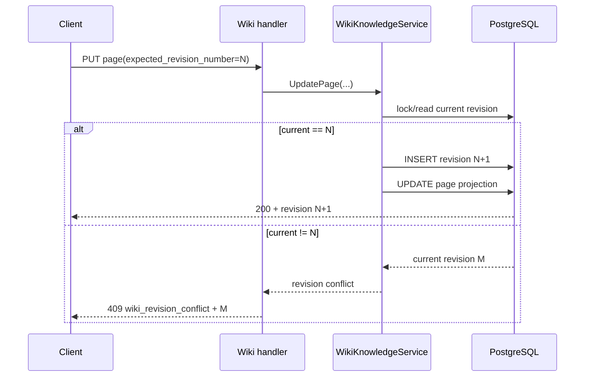
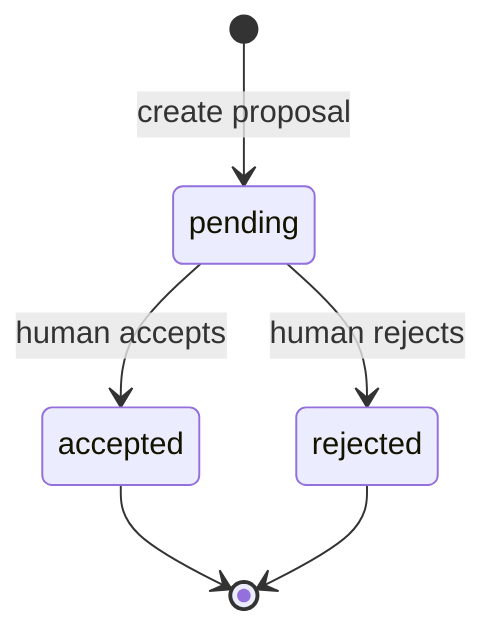

# Wiki 修订与提案

活跃贡献者：oldwinter

Wiki 的当前页面只是投影，真实变更历史保存在 append-only revision 中。人工编辑、历史恢复和接受智能体或 Room proposal 都会创建新 revision；调用者不能静默覆盖别人刚提交的内容。

## 核心对象

[`server/internal/service/wiki_knowledge.go`](../../server/internal/service/wiki_knowledge.go) 实现 revision/proposal 事务，[`server/pkg/db/queries/wiki_page.sql`](../../server/pkg/db/queries/wiki_page.sql) 提供原子写入与列表查询。表结构由 [`server/migrations/414_wiki_knowledge_loop.up.sql`](../../server/migrations/414_wiki_knowledge_loop.up.sql) 引入，并由后续 index 与 proposal source migration 补强。

| 表 | 角色 | 关键不变量 |
| --- | --- | --- |
| `wiki_page` | 当前页面投影 | `current_revision_number` 指向当前内容版本 |
| `wiki_page_revision` | 不可变历史 | 同一 page 的 revision number 单调递增；正文和 provenance 固化 |
| `wiki_page_edit_proposal` | 待审核改动 | source、状态、建议内容、evidence 与 idempotency identity 固化 |

revision 不只是正文备份。它保存 path、title、content 以及作者/来源信息，因此页面后来改名或移动后，稳定 revision URL 仍能解释当时的完整状态。Proposal 被接受时，revision 记录实际审核后写入的内容，而不是假定它与最初建议完全相同。

## Revision 生命周期与并发

### 会创建 revision 的动作

- 创建页面时写入初始 revision。
- 普通 `PUT` 更新 path、title 或 content 时追加 revision。
- 从历史 revision 恢复时，把旧快照复制成一个新的当前 revision；旧历史本身不变。
- 接受 edit proposal 时，把 reviewer 最终确认的 path、title 和 content 写成新 revision。

这些动作都更新 `wiki_page` 当前投影，但不修改旧 `wiki_page_revision`。Revision ID 因此可以被 LM Wiki citation 稳定引用，详见 [LM Wiki 与 evidence](lm-wiki-and-evidence.md)。

### 乐观并发

写请求携带 `expected_revision_number`。Service 在事务内比较期望值和当前值，失配时不写任何 revision，handler 返回 HTTP 409、机器码 `wiki_revision_conflict` 和服务端当前 revision number。客户端应保留本地草稿，展示差异或要求用户重新确认，不能直接用新 revision number 自动重试并覆盖远端。

共享 Web/Desktop 的冲突归一化位于 [`packages/views/wiki/wiki-conflict.ts`](../../packages/views/wiki/wiki-conflict.ts)；Mobile 使用 [`apps/mobile/data/wiki-edit-conflict.ts`](../../apps/mobile/data/wiki-edit-conflict.ts) 表达相同分支。

## Proposal 生命周期

Proposal 的来源有两类：

| source | 产生方式 | 可信上下文 |
| --- | --- | --- |
| `agent` | 智能体 task 通过 page proposal HTTP 入口提议修改 | 已认证 agent run；`agent_id` 与 actor 相符；`X-Task-ID` 有效 |
| `room` | Room 工作流通过后端 proposal target 提交讨论结果 | 已验证的 Room outcome 与工作区归属 |

来源字段由 [`server/migrations/520_wiki_page_proposal_source.up.sql`](../../server/migrations/520_wiki_page_proposal_source.up.sql) 与 [`server/migrations/522_wiki_page_proposal_source_validate.up.sql`](../../server/migrations/522_wiki_page_proposal_source_validate.up.sql) 约束。Proposal 创建使用 idempotency key；同一受信任来源重试不会产生多份待审核记录，Room identity 的唯一索引在 [`server/migrations/521_wiki_page_room_proposal_idempotency_index.up.sql`](../../server/migrations/521_wiki_page_room_proposal_idempotency_index.up.sql)。

Proposal 只提出变更，不直接编辑页面：

1. producer 提交目标 page、建议 path/title/content、base revision 与 evidence refs。
2. Service 校验 producer 身份、工作区、base revision、evidence 格式和 idempotency identity。
3. Proposal 进入 `pending`，页面当前投影保持不变。
4. human member 可在 review 时修改 path、title、content。
5. accept 在事务中重新检查当前 revision。检查通过后追加 revision，并把 proposal 标为 `accepted`。
6. reject 只记录决定与原因，不创建 revision。

如果页面在 proposal 创建后已前进，接受动作按当前 revision 规则冲突，而不是把旧建议硬套到新正文上。

## Evidence 与 provenance

Proposal evidence 不是任意 URL。服务只接受已在当前工作区验证的：

- `task:<uuid>`：指向一次智能体执行；
- `room:<uuid>`：指向一个 Room。

单个 proposal 最多 100 个 evidence refs。Service 会解析类型、验证 UUID、确认对象属于当前工作区，并拒绝未知前缀或跨租户引用。这样可以保留“为什么提出这次修改”的审计线索，同时避免把外部正文复制进 proposal。

接受 proposal 后，新 revision 的 provenance 能回到 proposal、producer 和 evidence；恢复历史时则记录 restore 来源。消费者应读取这些显式字段，不要根据 revision 作者名称猜测来源。

## HTTP API

共享 revision/proposal API 位于工作区成员路由下：

| 方法与路径 | 用途 | 写入 |
| --- | --- | --- |
| `GET /api/wiki/pages/{id}/revisions` | 列出页面 revision | 否 |
| `GET /api/wiki/pages/{id}/revisions/{revisionId}` | 在 page 上下文读取 revision | 否 |
| `GET /api/wiki/revisions/{revisionId}` | 通过稳定 ID 读取共享 revision | 否 |
| `POST /api/wiki/pages/{id}/revisions/{revisionId}/restore` | 将历史快照恢复为新 revision | human actor |
| `GET /api/wiki/pages/{id}/proposals` | 列出 edit proposal | 否 |
| `POST /api/wiki/pages/{id}/proposals` | 创建 agent proposal | 仅受信任 agent run；Room source 走内部 proposal target |
| `POST /api/wiki/pages/{id}/proposals/{proposalId}/accept` | 审核、可编辑并接受 | human actor |
| `POST /api/wiki/pages/{id}/proposals/{proposalId}/reject` | 拒绝 proposal | human actor |
| `GET /api/personal-wiki/pages/{id}/revisions` | 列出自己的个人 revision | human owner |
| `GET /api/personal-wiki/revisions/{revisionId}` | 稳定读取自己的个人 revision | human owner |
| `POST /api/personal-wiki/pages/{id}/revisions/{revisionId}/restore` | 恢复个人页面 | human owner |

Personal Wiki 没有智能体 proposal 入口。完整页面 CRUD 与 scope 规则见 [Wiki 系统](wiki-system.md)。

## 权限与信任边界

| 行为 | human workspace member | 智能体 | machine credential |
| --- | --- | --- | --- |
| 读取共享 revision/proposal | 允许 | 工作区内允许读取共享资源 | 受工作区成员与 actor policy 限制 |
| 创建共享 proposal | 不通过 agent proposal HTTP 入口 | 仅受信任 agent run，且 task header/agent identity 匹配 | Room 由受信任后端集成创建；其他 machine actor 拒绝 |
| 接受、拒绝、恢复 | 允许 | 拒绝 | 拒绝 |
| 访问 Personal Wiki 历史 | 仅 owner | 拒绝 | 拒绝 |

基础 proposal review 没有额外要求 `owner`/`admin`；审核者必须是 human member。更高风险的 LM Wiki policy、LM revision review 和 Twin signing 才限制到管理员。

## 客户端行为

Web/Desktop 共用 [`packages/views/wiki/wiki-history-dialog.tsx`](../../packages/views/wiki/wiki-history-dialog.tsx)、[`packages/views/wiki/wiki-revision-view.tsx`](../../packages/views/wiki/wiki-revision-view.tsx) 与 [`packages/views/wiki/wiki-proposals-panel.tsx`](../../packages/views/wiki/wiki-proposals-panel.tsx)。API 边界由 [`packages/core/wiki/schemas.ts`](../../packages/core/wiki/schemas.ts) 解析，mutation 成功后按工作区和 page identity 更新 React Query。

Mobile 在 [`apps/mobile/app/(app)/[workspace]/wiki/[id]/history.tsx`](../../apps/mobile/app/(app)/[workspace]/wiki/[id]/history.tsx)、[`apps/mobile/app/(app)/[workspace]/wiki/[id]/proposals.tsx`](../../apps/mobile/app/(app)/[workspace]/wiki/[id]/proposals.tsx) 和 [`apps/mobile/app/(app)/[workspace]/wiki/[id]/proposal/[proposalId].tsx`](../../apps/mobile/app/(app)/[workspace]/wiki/[id]/proposal/[proposalId].tsx) 提供原生历史与审核流程。Realtime updater 位于 [`apps/mobile/data/realtime/wiki-ws-updaters.ts`](../../apps/mobile/data/realtime/wiki-ws-updaters.ts)，用于让其他设备上的 accept/reject/update 及时反映到列表和详情。

## 扩展规则

- 新 producer 类型需要稳定 source identity、工作区授权、idempotency 规则和 migration check，不能只在请求 DTO 中加一个字符串。
- 新 evidence 类型需要同时定义解析、tenant authorization、不可变 identity 和隐私 egress 规则。
- 新 mutation 如果改变页面状态，必须追加 revision；不要绕过 Service 直接更新 `wiki_page.content`。
- 新客户端冲突 UI 必须保留用户草稿，并展示服务端 current revision；自动重放只适用于可证明交换律的字段。
- 任何供外部系统长期引用的历史页面都应使用 stable revision endpoint，而不是 live page URL。

## 测试入口

| 测试 | 覆盖重点 |
| --- | --- |
| [`server/internal/service/wiki_knowledge_test.go`](../../server/internal/service/wiki_knowledge_test.go) | append-only revision、restore、proposal review、evidence 与并发 |
| [`server/internal/handler/wiki_test.go`](../../server/internal/handler/wiki_test.go) | HTTP DTO、409 conflict、稳定 revision 路由 |
| [`server/internal/handler/wiki_security_test.go`](../../server/internal/handler/wiki_security_test.go) | actor、Personal Wiki 与跨工作区隔离 |
| [`server/internal/service/wiki_evolution_signals_test.go`](../../server/internal/service/wiki_evolution_signals_test.go) | reviewed proposal 到后续学习 signal 的适配 |
| [`packages/views/wiki/wiki-history-dialog.test.tsx`](../../packages/views/wiki/wiki-history-dialog.test.tsx) | Web/Desktop 历史交互 |
| [`packages/views/wiki/wiki-proposals-panel.test.tsx`](../../packages/views/wiki/wiki-proposals-panel.test.tsx) | proposal review 与缓存更新 |
| [`apps/mobile/data/wiki-edit-conflict.test.ts`](../../apps/mobile/data/wiki-edit-conflict.test.ts) | Mobile 冲突归一化 |

## 关键源文件

| 文件 | 用途 |
| --- | --- |
| [`server/internal/service/wiki_knowledge.go`](../../server/internal/service/wiki_knowledge.go) | revision、proposal、evidence 与事务规则 |
| [`server/internal/handler/wiki.go`](../../server/internal/handler/wiki.go) | revision/proposal HTTP 边界 |
| [`server/pkg/db/queries/wiki_page.sql`](../../server/pkg/db/queries/wiki_page.sql) | revision/proposal sqlc 查询 |
| [`server/migrations/414_wiki_knowledge_loop.up.sql`](../../server/migrations/414_wiki_knowledge_loop.up.sql) | revision、proposal 与知识循环基础表 |
| [`packages/views/wiki/wiki-conflict.ts`](../../packages/views/wiki/wiki-conflict.ts) | Web/Desktop conflict 解析 |
| [`apps/mobile/data/wiki-edit-conflict.ts`](../../apps/mobile/data/wiki-edit-conflict.ts) | Mobile conflict 解析 |
