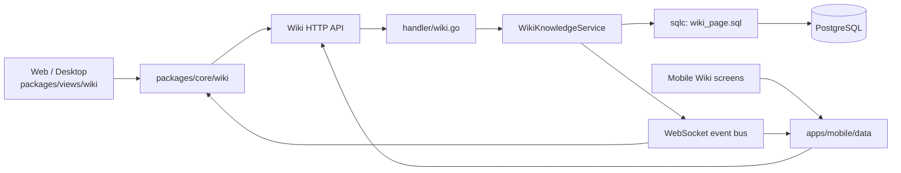
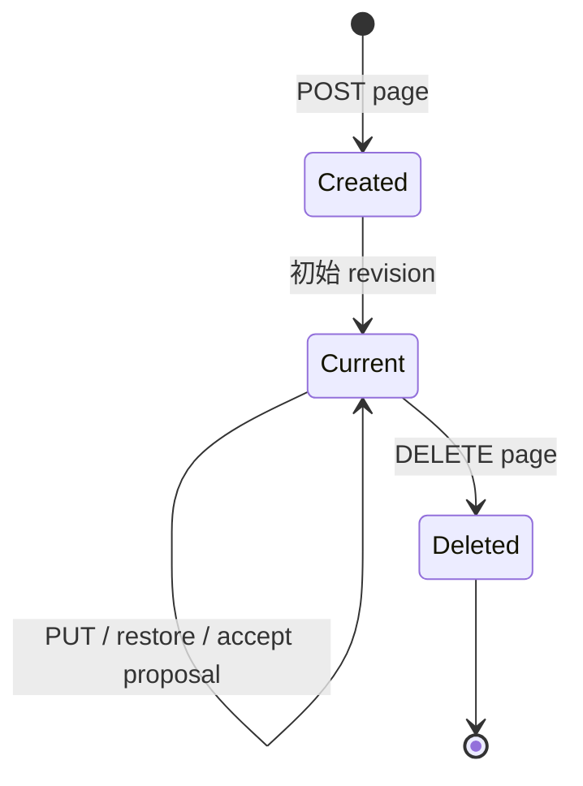

# Wiki 系统

活跃贡献者：Bohan Jiang、Jiayuan Zhang、Naiyuan Qing

Wiki 是 Multica 的 Markdown 知识层。它把工作区共享知识、项目知识和个人私有知识放进同一套页面模型，但在租户边界、可见性和后续 evidence 使用上保持明确隔离。修订历史与智能体提案见 [Wiki 修订与提案](wiki-revisions-and-proposals.md)，从共享知识生成模型可消费快照的流程见 [LM Wiki 与 evidence](lm-wiki-and-evidence.md)。

## 架构位置

HTTP 路由在 [`server/cmd/server/router.go`](../../server/cmd/server/router.go) 注册。请求先经过 actor 与工作区成员中间件，再由 [`server/internal/handler/wiki.go`](../../server/internal/handler/wiki.go) 解析 `scope`、UUID 和请求体；跨表事务、路径校验、revision 写入与事件发布由 [`server/internal/service/wiki_knowledge.go`](../../server/internal/service/wiki_knowledge.go) 处理；持久化语句集中在 [`server/pkg/db/queries/wiki_page.sql`](../../server/pkg/db/queries/wiki_page.sql)。

这条链路遵循仓库通用的 `handler → service → sqlc → PostgreSQL` 分层；Web 和 Desktop 共享 `packages/core` 与 `packages/views`，Mobile 有独立 Query、mutation 和 realtime 实现。整体分层可参阅[系统架构](../overview/architecture.md)。

## 三种知识作用域

基础表由 [`server/migrations/255_wiki_page.up.sql`](../../server/migrations/255_wiki_page.up.sql) 引入，`wiki_page.scope` 只接受 `workspace`、`project`、`user`。

| 产品概念 | `scope` | 归属键 | 可见范围 | 典型用途 |
| --- | --- | --- | --- | --- |
| Workspace Wiki | `workspace` | `workspace_id` | 当前工作区成员 | 团队规范、长期决策、跨项目说明 |
| Project Wiki | `project` | `workspace_id` + `project_id` | 项目所在工作区成员 | 项目架构、交付约束、项目术语 |
| Personal Wiki | `user` | `owner_user_id`，`workspace_id IS NULL` | 页面所有者本人 | 私人笔记、尚未共享的草稿 |

数据库的 scope check 保证三个键组合互斥。Project Wiki 的 handler 还会确认 `project_id` 属于当前工作区，不能借一个合法 UUID 越界读取别的工作区。Workspace 与 Project 页面是共享知识；Personal Wiki 则是跨工作区的全局私人库，不因当前路由中的工作区变化而复制一份。相关唯一性规则经历了 [`server/migrations/258_wiki_page_workspace_path_unique.up.sql`](../../server/migrations/258_wiki_page_workspace_path_unique.up.sql)、[`server/migrations/259_wiki_page_project_path_unique.up.sql`](../../server/migrations/259_wiki_page_project_path_unique.up.sql) 和 [`server/migrations/264_wiki_page_user_path_global_unique.up.sql`](../../server/migrations/264_wiki_page_user_path_global_unique.up.sql) 的拆分。

Personal Wiki 不进入共享 LM Wiki evidence。它的 API 也不挂在工作区成员组下，而是使用独立的 `/api/personal-wiki` 路由并强制 human actor；machine credential 和智能体不能读取或修改个人页面。

## 页面模型与不变量

`wiki_page` 保存当前投影，主要字段包括：

| 字段 | 含义 |
| --- | --- |
| `id` | 页面稳定标识；revision 变化不会改变它 |
| `workspace_id` / `project_id` / `owner_user_id` | 由 scope 决定的归属键 |
| `scope` | `workspace`、`project` 或 `user` |
| `path` | 库内相对 Markdown 路径 |
| `title` | 用户可见标题 |
| `content` | 当前 Markdown 内容 |
| `current_revision_number` | 当前投影对应的 revision 序号 |
| `created_at` / `updated_at` | 页面时间戳 |

路径不是操作系统路径。服务只接受相对 `.md` 路径，拒绝绝对路径、反斜杠和 `..` traversal；同一知识库内路径必须唯一。`SKILL.md` 等 skill 文件不属于这套模型，二者的持久化和执行语义见 [Skills 与 Skill Evolution](skills-and-evolution.md)。

页面列表按 scope 查询；Project Wiki 还要求 `project_id`。搜索查询匹配标题、路径和正文，`q` 必须为 1–500 个字符。共享搜索可限定 `workspace`、`project` 或 `all`，Personal Wiki 使用独立搜索端点，避免把私人结果混入共享工作区结果。搜索索引由 [`server/migrations/418_wiki_page_search_index.up.sql`](../../server/migrations/418_wiki_page_search_index.up.sql) 提供。

## CRUD 生命周期

1. **创建**：human member 提交 scope、path、title 和 content。Service 在一个事务中创建 `wiki_page` 与初始 revision。
2. **读取**：列表返回当前投影；详情返回当前正文与 revision 元数据。稳定 revision URL 可在页面后来变化后继续读取旧内容。
3. **更新**：调用者携带期望 revision number。Service 只在期望值仍为当前值时更新投影并追加 revision。
4. **删除**：共享页面只能由 human member 删除；Personal Wiki 只能由所有者删除。依赖清理由应用层显式完成，数据库没有 foreign key cascade。
5. **事件**：事务提交后发布 Wiki 页面或 proposal 事件。Web/Desktop 的 React Query cache 与 Mobile 自有 cache 据此 patch 或 invalidate。

更新不是原地覆盖历史。详细的 append-only revision、冲突响应与恢复流程见 [Wiki 修订与提案](wiki-revisions-and-proposals.md)。

## HTTP API

所有共享端点都要求有效 `X-Workspace-ID` 和工作区成员身份。下表只列页面与搜索入口；revision/proposal 子资源在下一页单独说明。

| 方法与路径 | 用途 | 额外约束 |
| --- | --- | --- |
| `GET /api/wiki/pages?scope=...&project_id=...` | 列出 Workspace 或 Project 页面 | Project scope 校验项目归属 |
| `POST /api/wiki/pages` | 创建共享页面 | human actor |
| `GET /api/wiki/pages/{id}` | 读取共享页面 | 页面必须属于当前工作区 |
| `PUT /api/wiki/pages/{id}` | 更新共享页面 | human actor；乐观并发 |
| `DELETE /api/wiki/pages/{id}` | 删除共享页面 | human actor |
| `GET /api/wiki/search?q=...` | 搜索共享页面 | 可传 `scope` 和 `project_id` |
| `GET /api/personal-wiki/pages` | 列出自己的个人页面 | human actor；不依赖工作区 |
| `POST /api/personal-wiki/pages` | 创建个人页面 | human actor；owner 为当前用户 |
| `GET/PUT/DELETE /api/personal-wiki/pages/{id}` | 读取、更新或删除个人页面 | 只允许 owner |
| `GET /api/personal-wiki/search?q=...` | 搜索自己的个人页面 | 结果不会进入共享搜索 |

TypeScript 客户端的类型、Zod response schema、Query 和 mutation 分别位于 [`packages/core/wiki/types.ts`](../../packages/core/wiki/types.ts)、[`packages/core/wiki/schemas.ts`](../../packages/core/wiki/schemas.ts)、[`packages/core/wiki/queries.ts`](../../packages/core/wiki/queries.ts) 和 [`packages/core/wiki/mutations.ts`](../../packages/core/wiki/mutations.ts)。

## 权限边界

| 操作 | `owner` / `admin` | `member` | 智能体或 machine credential |
| --- | --- | --- | --- |
| 读取、列出、搜索共享 Wiki | 允许 | 允许 | 允许，但仍受工作区与 scope 过滤 |
| 创建、更新、恢复、删除共享页面 | 允许 | 允许 | 拒绝，必须为 human actor |
| 读取或修改 Personal Wiki | 仅自己的页面 | 仅自己的页面 | 全部拒绝 |
| 创建 edit proposal | 不通过 agent proposal HTTP 入口 | 不通过 agent proposal HTTP 入口 | 仅受信任 agent run；Room 由内部集成创建 |
| 审核 proposal | 允许 | 允许 | 拒绝 |
| 修改 LM Wiki source policy | 允许 | 拒绝 | 拒绝 |

共享 Wiki 的基础编辑权限是“human member”，不是只有管理员。管理员限制从 LM Wiki policy 和 Twin activation 开始收紧，见 [LM Wiki 与 evidence](lm-wiki-and-evidence.md) 和 [Twin](twin.md)。

## Web、Desktop 与 Mobile

| 客户端 | 实现 | 当前能力 |
| --- | --- | --- |
| Web | [`apps/web/app/[workspaceSlug]/(dashboard)/wiki`](../../apps/web/app/[workspaceSlug]/(dashboard)/wiki/) 与 [`apps/web/app/personal-wiki`](../../apps/web/app/personal-wiki/) | Workspace/Project/Personal 列表、搜索、CRUD、稳定 revision、proposal 与 LM Wiki 管理界面 |
| Desktop | [`apps/desktop/src/renderer/src/pages/wiki-page.tsx`](../../apps/desktop/src/renderer/src/pages/wiki-page.tsx) | 复用共享 `packages/views/wiki`，只在 React Router 路由和 Personal Wiki alias 上做平台 wiring |
| Mobile | [`apps/mobile/app/(app)/[workspace]/more/wiki.tsx`](../../apps/mobile/app/(app)/[workspace]/more/wiki.tsx) 与 [`apps/mobile/app/(app)/[workspace]/wiki`](../../apps/mobile/app/(app)/[workspace]/wiki/) | 自有原生列表、scope 切换、项目选择、创建、详情、编辑、历史和 proposal review |

Web/Desktop 的业务页面在 [`packages/views/wiki/index.tsx`](../../packages/views/wiki/index.tsx)；Mobile 不导入这个页面，而是通过 [`apps/mobile/data/queries/wiki.ts`](../../apps/mobile/data/queries/wiki.ts)、[`apps/mobile/data/mutations/wiki.ts`](../../apps/mobile/data/mutations/wiki.ts) 和 [`apps/mobile/data/realtime/use-wiki-realtime.ts`](../../apps/mobile/data/realtime/use-wiki-realtime.ts) 复现相同协议语义。Mobile 的交互布局可以不同，但 scope、权限、revision identity 与冲突处理必须一致。

## 修改与扩展入口

- 增加 scope 或路径规则时，先改 [`server/internal/service/wiki_knowledge.go`](../../server/internal/service/wiki_knowledge.go) 的领域校验，再同步 migration、sqlc、handler DTO、Core schema 和 Mobile schema。仅改 UI 会留下越权或不一致写入。
- 增加搜索字段时，从 [`server/pkg/db/queries/wiki_page.sql`](../../server/pkg/db/queries/wiki_page.sql) 与索引 migration 开始，并验证 Workspace、Project、Personal 三种租户条件。
- 增加 realtime payload 时，同步 [`server/pkg/protocol/events.go`](../../server/pkg/protocol/events.go)、Core cache updater 与 [`apps/mobile/data/realtime/wiki-ws-updaters.ts`](../../apps/mobile/data/realtime/wiki-ws-updaters.ts)。
- 让新知识源进入模型 evidence 前，先定义可冻结的 revision identity；不要直接引用会变化的 live page。

## 测试入口

后端的 CRUD、scope、越权、路径和 machine actor 回归在 [`server/internal/handler/wiki_test.go`](../../server/internal/handler/wiki_test.go)、[`server/internal/handler/wiki_security_test.go`](../../server/internal/handler/wiki_security_test.go) 与 [`server/internal/service/wiki_knowledge_test.go`](../../server/internal/service/wiki_knowledge_test.go)。共享客户端 schema/API 与页面行为在 [`packages/core/wiki`](../../packages/core/wiki/) 和 [`packages/views/wiki`](../../packages/views/wiki/) 的同目录测试中。Mobile 的 schema、导航、冲突与 realtime updater 测试位于 [`apps/mobile/data`](../../apps/mobile/data/)。

仓库级测试约定与命令见[测试指南](../how-to-contribute/testing.md)。

## 关键源文件

| 文件 | 用途 |
| --- | --- |
| [`server/internal/handler/wiki.go`](../../server/internal/handler/wiki.go) | HTTP DTO、scope/actor/UUID 边界和错误响应 |
| [`server/internal/service/wiki_knowledge.go`](../../server/internal/service/wiki_knowledge.go) | 页面、revision、proposal 事务和领域规则 |
| [`server/pkg/db/queries/wiki_page.sql`](../../server/pkg/db/queries/wiki_page.sql) | Wiki sqlc repository |
| [`server/migrations/255_wiki_page.up.sql`](../../server/migrations/255_wiki_page.up.sql) | 基础页面表与 scope check |
| [`packages/core/wiki`](../../packages/core/wiki/) | Web/Desktop API schema、Query 与 mutation |
| [`packages/views/wiki`](../../packages/views/wiki/) | Web/Desktop 共享 Wiki 页面 |
| [`apps/mobile/data/queries/wiki.ts`](../../apps/mobile/data/queries/wiki.ts) | Mobile 自有 Wiki Query |
