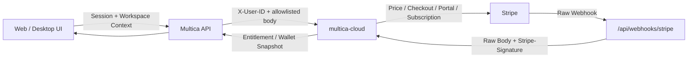

# 计费、支付与功能开关

活跃贡献者：Bohan Jiang、Xichang(Seacen) Zhao、YYClaw

本提交中的计费代码不是本地 Stripe 实现。Multica 主仓库负责认证、租户解析、输入收窄、前端契约和代理；`multica-cloud` 负责账本、价格、权限、Stripe API 写入和 Webhook 权威验签。

当前可见的支付 Provider 只有 **Stripe**。代码中没有通用 `PaymentProvider` 接口，也没有第二家支付渠道；Hosted Checkout、Billing Portal、Session ID 和 Webhook Header 都包含 Stripe 语义。

# 架构边界



职责分配：

| 组件 | 负责 | 不负责 |
| --- | --- | --- |
| Multica API | Session、Human Actor、工作区成员/角色、Body 上限、Idempotency Key、受控代理 | 不持有 Stripe Webhook Secret，不计算价格，不直接更新 Stripe |
| `multica-cloud` | Wallet/Subscription 数据、权威价格、Seat Count、授权、幂等、Stripe 写入、Webhook 验签 | 不信任浏览器传入的 User/Workspace |
| Stripe | Checkout、Portal、支付与订阅 Provider 状态 | 不知道 Multica 的成员角色 |
| 前端 | Schema 验证、显示、重定向、状态轮询、Query Cache | 不硬编码权威金额，不把缺失 Summary 当作 Free |

Cloud Runtime 未配置或不可用时，代理返回 Service Unavailable；主仓库没有本地降级账本。

# 两个独立的计费域

## 账户钱包与充值

`/api/cloud-billing/*` 是**用户级**而非工作区级。路由虽然可能显示在工作区 Shell 下，React Query Key 和服务端 Owner 都不包含 Workspace。

| 方法与路径 | 用途 |
| --- | --- |
| `GET /balance` | 当前 Wallet Balance |
| `GET /transactions` | 分页 Ledger Transaction |
| `GET /batches` | 购买、赠送或调整形成的 Credit Batch |
| `GET /topups` | Top-up Order 与状态 |
| `GET /price-tiers` | Cloud 配置的可购买 Tier |
| `POST /checkout-sessions` | 按 `tier_id` 创建 Stripe Checkout |
| `GET /checkout-sessions/{sessionId}` | 查询 Checkout 对应 Top-up 状态 |
| `POST /portal-sessions` | 创建 Account Billing Portal |

共同边界：

- 需要 Multica Auth，且 `RequireHumanActor` 阻止 Task Token/Cloud PAT 代表 Owner 查看余额或创建支付；
- API 从认证 Context 注入 `X-User-ID`，不接受客户端指定 Owner；
- Endpoint 不要求当前工作区成员身份；
- Price Tier 来自 Cloud，客户端不能用自报金额创建 Checkout；
- Session ID 进入 Upstream Path 前必须符合 `[A-Za-z0-9_]+`；
- 主仓库只验证 Checkout Body 是 JSON；Tier、金额和订单幂等的最终规则属于 Cloud。

金额单位同时存在：

- `micro-credit` 是整数内部单位，`1 credit = 1,000,000 micro-credit`；
- 用户展示使用 `*_credit`；
- 需要计算时使用 `*_micro`，避免浮点漂移；
- 当前 Cloud 契约定义 `1 USD = 1000 credit`。

Top-up 状态通常从 `pending` 经过 `paid` 到 `credited`，也可能终止为 `failed` 或 `canceled`。返回 Stripe 后，前端每两秒轮询 Session，达到终态即停止，然后失效 Balance、Transaction、Batch 和 Top-up Cache。当前 Account Query 没有总时限，Webhook 永久缺失时会持续到页面卸载。

## 工作区订阅

`/api/cloud-subscriptions/*` 是真正的**工作区级**接口，并由 `billing_workspace_subscriptions` 控制，默认关闭。

| 方法与路径 | 最低本地权限 | 用途 |
| --- | --- | --- |
| `GET /summary` | Member | Entitlement、订阅、Human Member 和 Seat Capacity 快照 |
| `GET /prices` | Member | 已验证的月付/年付单 Seat 展示价格 |
| `POST /checkout-sessions` | Owner / Admin | 创建工作区订阅 Checkout |
| `POST /seats/purchase-preview` | Owner / Admin | 获取追加 Seat 的权威 Proration Quote |
| `POST /seats/purchases` | Owner / Admin | 确认 Quote 并追加 Seat |
| `POST /seats/reconcile` | Owner / Admin | 要求 Cloud 重新统计 Human Member |
| `POST /portal-sessions` | Owner / Admin | 创建工作区 Billing Portal |

所有路由要求 Human Actor。Router Middleware 和 Handler 都检查工作区与角色；Cloud 在实际支付写入前再次执行权威授权。

### Summary 与 Entitlement

Summary 读取 Cloud 自己的数据库，而不是每次同步调用 Stripe，因此 Stripe 降级时仍可读取最近快照。它包括：

- 开放字符串形式的 Plan 与 Status；
- Issue Count 和 Autopilot Runs Limit；
- Billing Interval、Current Period End、Cancellation 与 Grace 状态；
- 当前 Human Member 数；
- Purchased、Used、Reserved、Available、Pending Quantity 和 Overcommitted Seat；
- 当前调用者可执行的 `checkout`、`portal` 和 `purchase_seats` Action。

Agent 不占 Human Seat。客户端不得以 `has_stripe_customer` 自行决定授权，必须使用 Cloud 返回的 `available_actions`。

前端对 Summary 不提供“Free”Fallback：404、503 或 Schema 不匹配都显示 Unavailable。这样旧 Cloud 或上游故障不会看起来像付费工作区被静默降级。

### Checkout 创建

客户端只提交：

- `interval`: `month` 或 `year`；
- Idempotency Key（Body 或 Header）。

API 丢弃未知字段，并注入：

- Middleware 解析的 Workspace UUID；
- 已认证 User ID；
- 从本地 User Row 读取并 Trim 的付款人 Email。

Cloud 决定 Stripe Customer、Price、初始 Quantity 和最终 Checkout 内容。工作区 ID、Payer ID、Email、金额或 Price ID 不能由客户端替换。

### Seat Reconcile 与追加购买

Reconcile 请求不携带目标 Quantity；Cloud 使用最小权限产品数据库连接重新统计 Human Member。

追加购买分两步：

1. Preview 只接受正数 `additional_seats`，Cloud 根据当前 Stripe/订阅状态返回 Proration；
2. Confirm 回传同一意图的：
   - `additional_seats`；
   - `expected_current_seats`；
   - `expected_purchase_version`；
   - `accepted_proration_amount`；
   - 三字符 Currency；
   - Idempotency Key。

API 不接受绝对目标 Seat 数。Cloud 重新 Quote，并负责并发冲突、版本检查、幂等和 Stripe 写入。这样陈旧浏览器不能用旧报价覆盖新 Quantity。

Checkout、Seat Purchase 和 Portal 都要求 Idempotency Key；Seat Preview 与 Reconcile 不创建对应的支付意图，因此没有该要求。

# Stripe Webhook 处理

公开入口是 `POST /api/webhooks/stripe`，位于普通 Auth Group 之外。主仓库没有 `STRIPE_WEBHOOK_SECRET`，不能在本地完成权威验签。

API 执行：

1. 确认 Cloud Runtime 可用；
2. 在读取 Body 前按 IP 限流；
3. 要求至少一个 `Stripe-Signature` Header；
4. 使用 `MaxBytesReader` 将 Body 限制为 1 MiB；
5. 不解析、不 Trim、不重新 Marshal；
6. 原样转发 Body、所有 Signature Header 和原始 Content-Type；
7. 透传 Cloud 的协议响应。

Cloud 使用真正的 Stripe Webhook Secret 验签，并更新相应的 Top-up、Credit Ledger、Subscription 或 Entitlement。反向代理改写 JSON 空白也会破坏签名。

# 前端一致性与异步完成

支付成功页不能把“浏览器从 Stripe 返回”当作“Webhook 已处理完成”。

- Account Checkout 按 Session ID 每两秒轮询，直到 `credited`、`failed` 或 `canceled`；当前没有总时限。
- Workspace Checkout 返回后每两秒 Refetch Summary，最多同步 30 秒。
- Seat Purchase 按 Summary 中的 Active Purchase Refetch，最长两分钟。
- Query Mutation 成功后失效相应 Summary；窗口重新获得 Focus 时也会刷新短期 Summary。
- Account Billing Key 不含 Workspace ID，因为 Owner Wallet 不随工作区变化。
- Workspace Subscription Key 必须含 `wsId`，避免切换工作区时显示上一工作区的付费状态。
- Price 是部署配置，成功解析后缓存更久；`null` 不缓存为稳定价格，允许后续恢复。
- Workspace Checkout/Portal URL Schema 至少限制为 HTTPS；新增 Provider 时还应评估是否需要更窄的 Host Allowlist。

# 功能开关

## 配置模型

服务端通过 `featureflag.Service` 隔离 Toggle Point 与 Provider。标准接线的优先级为：

1. `FF_<UPPER_SNAKE_KEY>` 环境变量；
2. `MULTICA_FEATURE_FLAGS_FILE` 指向的 YAML；
3. 调用点提供的默认值。

例如：

```yaml
billing_workspace_subscriptions:
  default: true

plugins_v1:
  default: false
  percent:
    percent: 10
    by: user_id
```

环境变量可写为：

```bash
FF_BILLING_WORKSPACE_SUBSCRIPTIONS=true
FF_PLUGINS_V1=false
```

Env Provider 支持 `true/on/1/yes`、`false/off/0/no`、确定性百分比（如 `10%`）和 Variant String。YAML 还支持 Allow、Deny、按字段匹配和百分比 Rollout。

YAML 路径未设置时服务端仍可启动；设置后文件无法读取或解析失败会报错，而不是静默忽略。未知 Flag 或无 Provider 时返回调用点的 Default。

## 对外公开的集成开关

`/api/config` 只向前端发布受控 Allowlist，而不是暴露所有内部 Flag：

| Key | 默认值 | 边界 |
| --- | --- | --- |
| `billing_workspace_subscriptions` | `false` | Workspace Subscription Summary、Checkout、Seat 与 Portal；Handler 再次检查 |
| `composio_mcp_apps` | `false` | Composio 管理 UI/API、Agent Sharing Picker 和 Task MCP Overlay |
| `plugins_v1` | `false` | Plugin Catalog、生命周期管理和新事件派发；不改变已固定的 Task/Run Manifest |

前端开关只负责可见性和 UX，不能代替后端 Toggle Point、权限或 Cloud 授权。尤其是 Workspace Billing，即使有人手工调用隐藏路由，Handler 仍会返回 503。

启用 Flag 也不能补齐缺失配置：

- Billing 仍要求 Cloud Runtime 及 Cloud 侧 Subscription 能力；
- Composio 仍要求 API Key，且其 Service 是否构建在 Server 启动阶段决定；
- Plugin 仍要求 Public/Plugin URL、Key 与 Capability 配置。

# 如何新增支付 Provider

当前没有可插入的 Provider 接口，因此“新增 Provider”不是只注册一个 Factory。应先决定是让 Cloud 对外维持 Provider-neutral Contract，还是显式扩展 Stripe-specific Contract。

1. 在 `multica-cloud` 实现 Provider Secret、Customer/Order 映射、幂等 Ledger Write、Refund 和 Webhook Verification。
2. 定义 Provider-neutral 的 Money Minor Unit、Currency、Checkout/Portal Result 和状态机；不要让前端猜测状态对应关系。
3. 保持 Price 和 Quantity 由 Cloud 权威计算，客户端仍只提交 Tier/Interval/追加数量。
4. 为新 Webhook 建独立公开 Route、Body Cap、Rate Limit 和 Provider 验签边界；若由 Cloud 验签，必须像 Stripe 一样保留原始 Body/Header。
5. 不把 Provider Credential、Price ID 或绝对 Seat Quantity 暴露给浏览器。
6. 更新 API Zod Schema：外链必须为 HTTPS，未知 Provider 状态需要显式 Fallback。
7. 保留 Account Owner 与 Workspace Subscription 两套 Cache/租户 Key，不能因 URL 相同而合并。
8. 定义返回页轮询终态与最长时间，处理 Webhook 丢失和重复投递。
9. 对支付 Mutation 统一要求 Idempotency Key，并测试同 Key/异 Body、并发请求与超时重试。
10. 端到端测试价格篡改、跨租户、机器凭据、角色不足、签名失败、Body 改写和 Cloud 不可用。

# 测试入口

- API 代理、角色、Human Actor、幂等、Seat Quote 和 Stripe Webhook：`server/internal/handler/cloud_billing_test.go`。
- Feature Flag Provider 与优先级：`server/pkg/featureflag/config_test.go`、`server/pkg/featureflag/env_provider_test.go`、`server/pkg/featureflag/static_provider_test.go`、`server/pkg/featureflag/chain_provider_test.go`、`server/pkg/featureflag/service_test.go`。
- 前端 Cloud Contract：`packages/core/api/schema.test.ts`。
- Workspace Query Key 与价格缓存：`packages/core/billing/workspace-subscription-queries.test.ts`。
- Workspace Billing 返回路由：`packages/views/billing/billing-return-page.test.tsx`。
- Workspace Billing UX：`packages/views/settings/components/billing-tab.test.tsx`。

# 源码索引

- [Billing 与 Subscription Handler](https://github.com/oldwinter/multica/blob/685cf788777e24724b0d82ffe88c56459341fb2a/server/internal/handler/cloud_billing.go)
- [Billing 路由与权限接线](https://github.com/oldwinter/multica/blob/685cf788777e24724b0d82ffe88c56459341fb2a/server/cmd/server/router.go)
- [Feature Flag Key 与前端 Allowlist](https://github.com/oldwinter/multica/blob/685cf788777e24724b0d82ffe88c56459341fb2a/server/internal/featureflags/keys.go)
- [Feature Flag 配置优先级](https://github.com/oldwinter/multica/blob/685cf788777e24724b0d82ffe88c56459341fb2a/server/pkg/featureflag/config.go)
- [Environment Flag Provider](https://github.com/oldwinter/multica/blob/685cf788777e24724b0d82ffe88c56459341fb2a/server/pkg/featureflag/env_provider.go)
- [Billing Type Contract](https://github.com/oldwinter/multica/blob/685cf788777e24724b0d82ffe88c56459341fb2a/packages/core/types/billing.ts)
- [Billing API Client](https://github.com/oldwinter/multica/blob/685cf788777e24724b0d82ffe88c56459341fb2a/packages/core/api/client.ts)
- [Billing Response Schema](https://github.com/oldwinter/multica/blob/685cf788777e24724b0d82ffe88c56459341fb2a/packages/core/api/schemas.ts)
- [Account Billing Query](https://github.com/oldwinter/multica/blob/685cf788777e24724b0d82ffe88c56459341fb2a/packages/core/billing/queries.ts)
- [Workspace Subscription Query](https://github.com/oldwinter/multica/blob/685cf788777e24724b0d82ffe88c56459341fb2a/packages/core/billing/workspace-subscription-queries.ts)
- [Workspace Subscription Mutation](https://github.com/oldwinter/multica/blob/685cf788777e24724b0d82ffe88c56459341fb2a/packages/core/billing/workspace-subscription-mutations.ts)
- [Workspace Billing UI](https://github.com/oldwinter/multica/blob/685cf788777e24724b0d82ffe88c56459341fb2a/packages/views/settings/components/billing-tab.tsx)

## 相关页面

- [集成索引](index.md)
- [用量与归因](../features/usage-and-attribution.md)
