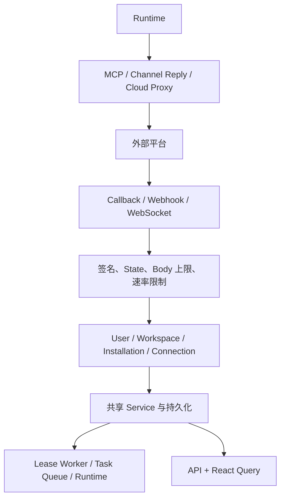

# 集成索引

活跃贡献者：Bohan Jiang、Xichang(Seacen) Zhao、YYClaw

本目录说明 Multica 在提交 `685cf788777e24724b0d82ffe88c56459341fb2a` 中已经接线的外部集成、共享扩展边界与尚未完成的基础设施。

# 主题导航

| 页面 | 内容 |
| --- | --- |
| [消息渠道](./messaging-channels.md) | 飞书/Lark、Slack、DingTalk、WeCom、Telegram，以及 Channel、Router、Supervisor、绑定与媒体 |
| [Plugin SDK 与 MCP](./plugins-and-mcp.md) | Manifest、Capabilities、Surface、Hook、Skill、Agent Hook MCP、Remote MCP Broker 与审批 |
| [OAuth 回调与 Webhook](./oauth-and-webhooks.md) | GitHub、Composio、Google、安装流程、Remote MCP OAuth 缺口，以及 Autopilot/GitHub/VCS/Stripe Webhook |
| [计费、支付与功能开关](./billing-and-payments.md) | Account Wallet、Workspace Subscription、Stripe/Cloud 边界、Seat、Webhook 和 Feature Flag |

# 集成状态总览

| 领域 | 集成 | 当前状态 | 关键边界 |
| --- | --- | --- | --- |
| 消息 | 飞书 / Lark | 已实现 | 区域化设备授权、每安装 WebSocket |
| 消息 | Slack | 已实现 | BYO Bot/App Token、每安装 Socket Mode；没有 OAuth Callback |
| 消息 | DingTalk | 已实现 | BYO AppKey/Secret、Stream WebSocket |
| 消息 | WeCom | 已实现 | Bot ID/Secret Proof-of-Control、WebSocket、跨副本 Relay |
| 消息 | Telegram | 已实现 | Bot Token、拒绝已配置 Webhook、Long Polling |
| Plugin | Manifest / SDK / Surface / Hook | 已实现，管理面默认关闭 | `plugins_v1=false`；Surface 隔离与 Callback Token |
| MCP | Agent Hook MCP | 已实现 | Task-local Loopback MCP，将 Tool Call 路由回 Server |
| MCP | Remote MCP Broker | 已实现 | Admin Approval 固定 Tool/Schema；仅支持受控 Runtime |
| MCP OAuth | Discovery / PKCE / Exchange / Schema | 仅基础组件 | 没有端到端 Handler、Service、Route 或 sqlc State Query |
| OAuth | GitHub App Setup | 已实现 | HMAC State；当前没有 State 过期或单次消费 |
| OAuth | Composio Hosted Auth | 已实现，默认关闭 | 五分钟 HMAC State 与 Upstream Account 归属验证；没有服务端单次消费 |
| Auth | Google Code Exchange | 已实现 | 前端取得 Code 后调用 Multica API，不是 Redirect Callback |
| Webhook | Autopilot | 已实现 | 秘密 URL Token、可选 HMAC、Persist-first、数据库租约 Worker |
| Webhook | GitHub App | 已实现 | 原始 Body HMAC-SHA256 |
| Webhook | Forgejo / Gitea / GitLab | 已实现 | Provider 验签后归一化为共享 PR/CI 模型 |
| 支付 | Stripe Account Wallet/Top-up | 已实现的 Cloud Proxy | 用户级、Human Actor、Cloud 权威账本与价格 |
| 支付 | Stripe Workspace Subscription | 已实现，默认关闭 | `billing_workspace_subscriptions=false`；成员/角色、幂等与 Quote 确认 |
| Webhook | Stripe | 已实现的 Raw Proxy | Cloud 持有 Secret 并权威验签 |

“已实现”表示本提交有可到达的路由、启动接线或运行时调用链，不表示部署时一定启用。环境 Secret、Cloud Capability、管理员安装与功能开关仍可能使它不可用。

# 共享架构

各子系统实现不同，但共同遵守：

1. **租户从受信边界解析**：Workspace Context、已验签 State、Installation、Connection 或秘密 Trigger Token；不信任裸 Payload 中的 Workspace ID。
2. **权限在执行时重查**：安装、绑定、Plugin Action、MCP Approval 和计费写入都不能只依赖创建时权限。
3. **Secret 不明文回显**：绑定 Token 只存 Hash，长期凭据使用专用 Secretbox；日志不包含 Token。
4. **异步流程可恢复**：消息 Supervisor 使用 Fenced Lease，Autopilot 使用持久 Delivery/Lease Worker，支付在 Webhook 后按终态或时限轮询。
5. **重复投递幂等**：Message ID、Webhook Delivery ID、Callback Upsert、Billing Idempotency Key 各自在对应边界去重。
6. **主仓库与外部权威分工**：Multica 收窄输入和确定租户；GitHub/Composio/Stripe/Cloud 等上游仍需验证其拥有的数据。
7. **代码接线胜过注释**：只有 Utility、Migration、Schema 或过时注释的能力不标记为可用。

# 功能开关速查

三项集成 Flag 通过 `/api/config` 发布给前端，默认都为 `false`：

| Key | 控制 |
| --- | --- |
| `plugins_v1` | Plugin Catalog、管理 API、新 Event Hook 派发与用户界面 |
| `composio_mcp_apps` | Composio App 管理、Sharing Picker 与 Task MCP Overlay |
| `billing_workspace_subscriptions` | Workspace Subscription、Seat、Checkout 与 Portal |

服务端配置来源为 `MULTICA_FEATURE_FLAGS_FILE` YAML，`FF_<UPPER_SNAKE_KEY>` 环境变量优先。前端 Flag 只控制呈现；Handler/Service 仍必须执行相同 Toggle、租户和权限检查。

# 选择扩展点

## 新增消息平台

实现 `channel.Channel`、注册 Factory 和 Capabilities，复用 Router/Supervisor、Installation Secret、绑定 Service 和共享 SQL。不要为新平台复制另一套消息持久化或任务调度器。

详见[消息渠道：如何新增消息渠道](./messaging-channels.md#如何新增消息渠道)。

## 新增 Plugin 能力

先扩展不可变 Manifest Contract 与 Host Capabilities，再实现 Surface/Hook/Skill Host。网络、Callback、MCP Tool 都需显式 Scope 或 Admin Approval。

详见[Plugin SDK 与 MCP：如何扩展插件贡献](./plugins-and-mcp.md#如何扩展插件贡献)。

## 新增 OAuth 或 Webhook

OAuth State 应具备签名、短期过期和服务端单次消费；Webhook 应保留原始 Body、先验签再解析、限制大小、去重，并按延迟决定同步或 Persist-first Worker。

详见[OAuth 回调与 Webhook](./oauth-and-webhooks.md#如何新增-oauth-provider)。

## 新增支付 Provider

当前没有通用 Provider Factory。应先在 Cloud 定义权威价格、账本、幂等和 Webhook，再有意扩展主仓库的代理与前端契约，不能只替换一个 Stripe URL。

详见[计费、支付与功能开关：如何新增支付 Provider](./billing-and-payments.md#如何新增支付-provider)。

# 审查集成时的检查项

- 路由是否真的注册，启动条件是否满足？
- 浏览器、Webhook、WebSocket 和 Agent Runtime 分别使用什么认证？
- User/Workspace/Installation 从哪里解析，是否会串租户？
- Secret 如何加密、轮换、撤销，Response 与日志是否会泄露？
- Body、响应、并发、调用次数和超时是否有上限？
- Delivery、Callback、Message 和付款重试如何幂等？
- 长任务是否先持久化，再由可租约 Worker 处理？
- 前端 Query Key 是否包含正确的 Workspace ID？
- 关闭 Flag 后，后端执行点是否也停止，而不只是隐藏 UI？
- 测试是否覆盖篡改、重放、跨租户、重复投递、权限撤销和上游故障？

# 核心源码入口

- [Server Router](https://github.com/oldwinter/multica/blob/685cf788777e24724b0d82ffe88c56459341fb2a/server/cmd/server/router.go)
- [Channel Contract](https://github.com/oldwinter/multica/blob/685cf788777e24724b0d82ffe88c56459341fb2a/server/internal/integrations/channel/channel.go)
- [Plugin Manifest Contract](https://github.com/oldwinter/multica/blob/685cf788777e24724b0d82ffe88c56459341fb2a/server/pkg/plugincontract/manifest.go)
- [Plugin SDK](https://github.com/oldwinter/multica/blob/685cf788777e24724b0d82ffe88c56459341fb2a/packages/plugin-sdk/index.ts)
- [Remote MCP Broker](https://github.com/oldwinter/multica/blob/685cf788777e24724b0d82ffe88c56459341fb2a/server/internal/daemon/remote_mcp_broker.go)
- [OAuth 与 Webhook 路由](https://github.com/oldwinter/multica/blob/685cf788777e24724b0d82ffe88c56459341fb2a/server/cmd/server/router.go)
- [Billing Proxy](https://github.com/oldwinter/multica/blob/685cf788777e24724b0d82ffe88c56459341fb2a/server/internal/handler/cloud_billing.go)
- [Feature Flag Key](https://github.com/oldwinter/multica/blob/685cf788777e24724b0d82ffe88c56459341fb2a/server/internal/featureflags/keys.go)
