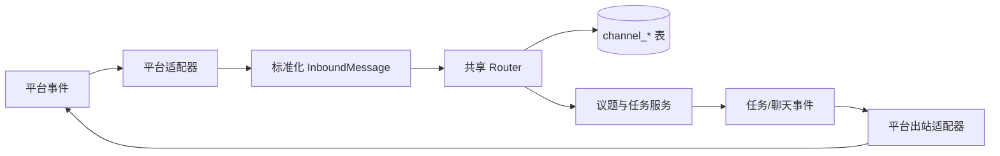

# 消息渠道与共享渠道引擎

活跃贡献者：Bohan Jiang、Xichang(Seacen) Zhao、YYClaw

消息渠道把外部即时通信平台中的消息转换为 Multica 的聊天、议题和智能体任务。当前服务端实际接入了飞书/Lark、Slack、钉钉、企业微信和 Telegram。它们共享同一套路由、去重、身份、会话和任务调度逻辑，平台差异被限制在适配器内部。

> 本页描述提交 `685cf788777e24724b0d82ffe88c56459341fb2a` 中已经接线的行为。源码中少量旧注释仍提到 Slack 的部署级连接或 OAuth 回调；当前可执行接线是每个安装一条 Socket Mode 连接，并采用 BYO Token 安装。

# 已接入平台

| 平台 | 安装方式与凭据校验 | 入站传输 | 重要限制 |
| --- | --- | --- | --- |
| 飞书 / Lark | 类 RFC 8628 的设备授权；安装级 `region` 决定中国大陆飞书或国际版 Lark；应用密钥加密保存 | 每个安装一条 WebSocket 长连接 | 不使用浏览器重定向回调；同一个适配器服务两个区域 |
| Slack | 管理员粘贴同一 Slack App 的 `xoxb-` Bot Token 和 `xapp-` App-level Token；通过 `auth.test`、`bots.info` 和 `apps.connections.open` 实时校验并核对 App | 每个安装一条 Socket Mode 连接 | 当前没有 Slack OAuth 回调路由；斜杠命令需在 Slack App 中单独注册 |
| 钉钉 | 管理员粘贴 Stream 模式机器人的 AppKey/AppSecret；通过实时换取 `access_token` 校验，AppSecret 加密保存 | 每个安装一条 Stream WebSocket 连接 | 出站短期 Access Token 按 AppKey 缓存 |
| 企业微信 | 管理员提供智能机器人 Bot ID/Secret；安装或接管路由槽位前执行真实订阅握手，证明对机器人的控制权 | 每个安装一条智能机器人 WebSocket 长连接 | 不需要公网回调；消息发送也依赖持有该连接的副本 |
| Telegram | 管理员粘贴 BotFather Token；调用 `getMe` 校验，并拒绝已经配置 Webhook 的机器人 | 每个安装一个 `getUpdates` 长轮询循环 | 同一 Token 只能有一个轮询消费者；检测到 409 时会明确报错 |

平台安装数据统一写入 `channel_installation`。平台自己的路由键、密文和区域等字段放在该行的 `config` JSONB 中，不进入共享引擎的类型定义。

# 核心抽象

## Channel 接口

每个平台实现五个方法：

- `Type()`：返回稳定的持久化平台标识。
- `Connect(ctx)`：建立连接并阻塞运行接收循环；取消上下文表示正常退出，其他错误交给 Supervisor 退避重连。
- `Disconnect(ctx)`：幂等释放资源。
- `Send(ctx, OutboundMessage)`：发送一个标准化文本回复。
- `Capabilities()`：声明支持的能力位，不在核心包中实现平台降级分支。

入站消息没有 `Receive` 方法。适配器在构造时获得共享 `InboundHandler`，在自己的接收循环中把平台事件转换为 `InboundMessage` 后主动调用它。

能力位包括纯文本、富卡片、线程回复、引用回复、附件、语音、输入状态和消息编辑。能力是声明，不等于所有通用发送路径都会自动使用该能力；例如企业微信附件能力当前主要覆盖入站处理。

## 标准消息信封

`InboundMessage` 只保留跨平台成立的字段：

- 事件 ID、消息 ID；
- 平台类型、会话 ID、私聊/群聊、发送者 ID、可选稳定身份和线程 ID；
- 标准化文本、原始命令文本、媒体引用、回复上下文；
- 群聊中是否明确提及机器人；
- `/new`、`/clear` 等会话控制标记；
- 平台原始负载 `Raw`。

平台原生字段只能放入 `Raw`，并由同一适配器读取。共享 Router 不解释 Slack、Lark 或其他平台的原始事件格式。

# 入站处理流水线

共享 Router 通过平台注册的 `ResolverSet` 执行以下顺序。这个顺序是安全和幂等语义的一部分：

1. **解析安装**：使用适配器写入标准消息的路由键找到安装，拒绝不存在或已撤销的安装。
2. **两阶段去重**：以安装和平台消息 ID 申请带所有者 Token 的 claim。重连重放只会被一个处理者消费；基础设施失败可释放 claim，终态则标记完成。
3. **群聊提及过滤**：群聊消息若既没有提及机器人，也不是对机器人消息的回复，会在身份解析前丢弃，避免给未绑定用户发送无意义的绑定提示。
4. **身份和当前成员资格**：把安装内的平台用户 ID 映射到 Multica 用户，并重新检查其当前工作区成员资格。绑定记录不是永久授权。
5. **选择聊天路由**：解析当前 `channel_chat_session_binding`；`/new` 创建下一代路由，`/clear` 请求新上下文，其余消息追加到当前会话。
6. **持久化消息与媒体意图**：先保存可读消息和媒体待处理状态，再异步下载、上传和绑定媒体，避免平台 ACK 被大文件处理阻塞。
7. **处理 `/issue`**：通过共享议题服务创建议题，复用编号、去重、项目边界、广播和智能体入队规则。
8. **调度智能体任务**：同一会话的短时间消息突发由持久化语义的 debounce/batcher 合并，减少“一条消息一个任务”。
9. **分离式反馈**：绑定提示、离线/归档提示、已创建议题提示和输入状态在独立、受超时约束的路径中发送，不延长平台接收确认路径。

基础设施错误返回适配器并可能触发重连；“重复”“未提及”“需要绑定”“不是工作区成员”等产品结果不是连接错误。

# 连接生命周期与多副本

`engine.Supervisor` 为每个活动安装维护一个运行实例：

- 通过 Registry 按 `channel_type` 构造适配器；
- 使用安装级、Token fencing 的租约保证同一安装最多由一个服务副本消费；
- 租约元数据可留在 PostgreSQL，也可将低变更租约放入 Redis；
- 定期续约，失去租约时主动断开，而不是继续与新所有者并行工作；
- 对连接错误执行有上下界的指数退避；
- 对安装配置计算不透明 fingerprint，凭据或区域改变时取消旧连接并重建；
- 撤销安装时停止连接；
- 关闭时对断连、租约释放和 goroutine 等待设置上限。

默认租约 TTL 为 180 秒，默认扫描间隔为 30 秒，默认整体关闭等待为 15 秒。部署覆盖这些值时必须满足 `poll <= renew < ttl`，并保留租约过期安全余量。

企业微信出站只能经 WebSocket。代码包含跨副本 relay 和结果归属逻辑，用于把完成事件转发到真正持有连接的副本；没有可用 relay 的部署不能把“本副本没有连接”误判为平台已收到。

# 身份绑定与租户边界

## 单次绑定链接

五个平台都使用同一类安全模型：

- 随机生成 32 字节、URL-safe 的原始 Token；
- 链接有效期固定为 15 分钟；
- 原始 Token 只返回一次，数据库只保存 SHA-256 哈希；
- 消费 Token、复查工作区成员资格、写入平台用户绑定在同一事务中完成；
- 非成员或绑定冲突会回滚 Token 消费；
- 兑换端点检查 Token 的 `channel_type`，不能拿 Slack Token 去企业微信端点兑换；
- “不存在、已过期、已消费”统一返回无效，避免暴露重放时序。

企业微信额外限制同一用户一分钟内重复铸造绑定链接：如果已有仍有效的链接，只提示用户回到上一条消息，不再写入新 Token。

## 安装级身份

平台用户 ID 只在一个安装内比较。可用时适配器会附带跨安装稳定 ID，但共享引擎不据此自动合并身份。聊天绑定、任务投递快照和出站记录都带安装 ID，防止同一平台中的多个机器人互相串线。

所有读写仍以 `workspace_id` 和成员身份为边界。由于仓库规则不使用数据库外键，成员移除、工作区删除和安装撤销的依赖清理由应用查询显式完成。

# 持久化模型

共享查询集中在 `server/pkg/db/queries/channel.sql`，主要表包括：

| 表 | 作用 |
| --- | --- |
| `channel_installation` | 工作区、智能体、平台类型、安装配置、状态及 WS 租约 |
| `channel_user_binding` | 平台用户与 Multica 成员的安装级绑定 |
| `channel_chat_session_binding` | 外部会话到 Chat Session 的当前路由、路由修订和上下文代次 |
| `channel_task_delivery` | 任务开始时冻结的回复目标，避免后续路由变化影响旧任务 |
| `channel_outbound_message` / `channel_outbound_card_message` | 已发送平台消息和卡片状态 |
| `channel_inbound_message_dedup` | 带 claim Token 的两阶段入站去重 |
| `channel_inbound_audit` | 丢弃原因和运行审计 |
| `channel_binding_token` | 单次、短期、只存哈希的身份绑定 Token |
| 渠道媒体 pending-object 表 | 上传前登记意图，绑定失败后由 reconciler 回收或结算 |

这些关系由应用事务和清理查询维护，不依赖外键或级联删除。

# 如何新增消息渠道

新增适配器时应沿现有边界扩展，而不是在 Router 中添加平台判断：

1. 在适配器包中定义稳定的 `channel.Type`；不要为了新增平台修改共享类型常量。
2. 实现 `Channel`，并把平台负载严格转换为 `InboundMessage`；平台字段保留在 `Raw`。
3. 提供 Factory 并注册到 `channel.Registry`。
4. 实现完整 `ResolverSet`：安装、身份、去重、会话和审计为必需项；回复、输入状态、媒体按能力添加。
5. 设计安装服务：实时验证凭据、使用专用 secretbox 加密敏感值、确保平台路由键不会被活动安装抢占。
6. 复用 `channel_binding_token` 的 15 分钟、哈希存储和事务兑换模式。
7. 接入聊天完成/失败事件的出站路径；若只能经长连接发送，必须处理多副本路由。
8. 在 `server/cmd/server/router.go` 同时注册 Factory 和 ResolverSet；只注册其中一个会造成“能连接但不能路由”或“有路由但无接收循环”。
9. 优先复用 `channel_*` 表。确需新状态时遵守“无外键、应用显式清理、索引并发创建”的仓库规则。
10. 补齐单元、连接生命周期、重放去重、绑定事务、凭据轮换、群聊提及、媒体和多副本测试。

# 测试入口

以下测试能覆盖最重要的边界：

- 共享流水线与租约：`server/internal/integrations/channel/engine/router_test.go`、`server/internal/integrations/channel/engine/supervisor_test.go`、`server/internal/integrations/channel/engine/session_db_test.go`、`server/internal/integrations/channel/engine/redis_lease_store_test.go`。
- 注册表与标准类型：`server/internal/integrations/channel/registry_test.go`、`server/internal/integrations/channel/message_test.go`、`server/internal/integrations/channel/capability_test.go`。
- 飞书/Lark：`server/internal/integrations/lark/registration_test.go`、`server/internal/integrations/lark/binding_token_test.go`、`server/internal/integrations/lark/ws_connector_test.go`、`server/internal/integrations/lark/channel_cleanup_test.go`。
- Slack：`slack/byo_install_test.go`、`slack/channel_test.go`、`slack/binding_test.go`、`slack/slash_command_test.go`。
- 钉钉：`dingtalk/byo_install_test.go`、`dingtalk/ws_connector_test.go`、`dingtalk/binding_test.go`。
- 企业微信：`wecom/credential_probe_test.go`、`wecom/binding_test.go`、`wecom/outbound_two_replica_db_test.go`、`wecom/inbound_media_bind_db_test.go`。
- Telegram：`telegram/install_test.go`、`telegram/telegram_test.go`、`telegram/binding_test.go`、`telegram/outbound_test.go`。

# 源码索引

- [Channel 接口](https://github.com/oldwinter/multica/blob/685cf788777e24724b0d82ffe88c56459341fb2a/server/internal/integrations/channel/channel.go)
- [标准消息信封](https://github.com/oldwinter/multica/blob/685cf788777e24724b0d82ffe88c56459341fb2a/server/internal/integrations/channel/message.go)
- [能力位](https://github.com/oldwinter/multica/blob/685cf788777e24724b0d82ffe88c56459341fb2a/server/internal/integrations/channel/capability.go)
- [Factory Registry](https://github.com/oldwinter/multica/blob/685cf788777e24724b0d82ffe88c56459341fb2a/server/internal/integrations/channel/registry.go)
- [共享 Router](https://github.com/oldwinter/multica/blob/685cf788777e24724b0d82ffe88c56459341fb2a/server/internal/integrations/channel/engine/router.go)
- [连接 Supervisor](https://github.com/oldwinter/multica/blob/685cf788777e24724b0d82ffe88c56459341fb2a/server/internal/integrations/channel/engine/supervisor.go)
- [共享 SQL 查询](https://github.com/oldwinter/multica/blob/685cf788777e24724b0d82ffe88c56459341fb2a/server/pkg/db/queries/channel.sql)
- [服务端接线](https://github.com/oldwinter/multica/blob/685cf788777e24724b0d82ffe88c56459341fb2a/server/cmd/server/router.go)
- [飞书/Lark 适配器](https://github.com/oldwinter/multica/tree/685cf788777e24724b0d82ffe88c56459341fb2a/server/internal/integrations/lark)
- [Slack 适配器](https://github.com/oldwinter/multica/tree/685cf788777e24724b0d82ffe88c56459341fb2a/server/internal/integrations/slack)
- [钉钉适配器](https://github.com/oldwinter/multica/tree/685cf788777e24724b0d82ffe88c56459341fb2a/server/internal/integrations/dingtalk)
- [企业微信适配器](https://github.com/oldwinter/multica/tree/685cf788777e24724b0d82ffe88c56459341fb2a/server/internal/integrations/wecom)
- [Telegram 适配器](https://github.com/oldwinter/multica/tree/685cf788777e24724b0d82ffe88c56459341fb2a/server/internal/integrations/telegram)

## 相关页面

- [集成索引](index.md)
- [Chat 与执行会话](../features/chat-and-sessions.md)
