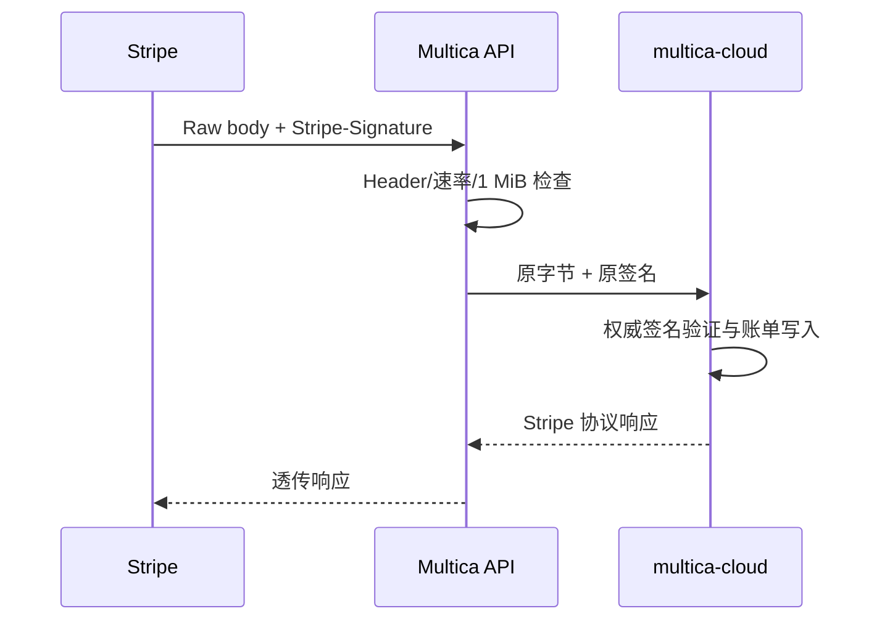

# OAuth 回调与 Webhook

活跃贡献者：Bohan Jiang、Xichang(Seacen) Zhao、YYClaw

本页区分三种容易混淆的 HTTP 入口：

- **OAuth/安装回调**：第三方把浏览器重定向回 Multica；
- **授权码交换 API**：浏览器先取得 Code，再调用 Multica 的 API；
- **Webhook**：第三方服务器主动发送事件，不依赖浏览器会话。

公开路由不等于无认证。它们必须使用签名、短期 State、秘密路径 Token 或第三方协议规定的凭据建立自己的信任边界。

# 当前实现状态

| 集成 | 入口 | 状态 |
| --- | --- | --- |
| GitHub App 安装 | `GET /api/github/setup` | 已接线的公开安装回调 |
| Composio Hosted Auth | `GET /api/integrations/composio/callback` | 已接线的公开回调 |
| Google 登录 | `POST /auth/google` | 已接线，但这是 Code Exchange API，不是 Google 直接调用的 Redirect URI |
| 飞书 / Lark 安装 | 设备授权开始与轮询 API | 已接线，不使用浏览器回调 |
| Slack 安装 | BYO `xoxb-` + `xapp-` | 已接线，没有 OAuth Code Callback |
| Remote MCP OAuth | Discovery、PKCE、Token 函数和迁移 | 仅基础组件，未找到 Handler/Service/路由接线 |

源码中的 Slack OAuth 回调注释后面没有对应 `r.Get` 或 `r.Post` 注册，不应据此配置回调 URL。

# OAuth 与安装流程

## Composio 集成

管理端 `POST /api/integrations/composio/connect/init` 需要用户 Session，并由 `composio_mcp_apps` 功能开关控制。服务端：

1. 从 Composio 当前启用的 Auth Config 中解析 Toolkit；
2. 将 Multica User ID 原样作为 Composio User ID；
3. 生成 HMAC-SHA256 签名 State；
4. State 包含 User ID、Toolkit、精确 Auth Config ID 和过期时间；
5. 默认有效期为五分钟；
6. 返回 Composio Hosted Connect Link。

公开 Callback 不依赖 Cookie，身份只来自已验证 State。成功状态下，服务端还会向 Composio 查询 `connected_account_id`，确认：

- Account 确实属于 State 中的用户；
- Account 使用的 Auth Config 与 State 中固定的 ID 完全一致；
- 空 Auth Config、未知 Account、跨用户或跨 Toolkit Account 都失败关闭。

本地 Upsert 以用户和 Connected Account 为幂等键，重复成功回调不会创建第二行。当前 State 没有服务端单次消费记录；HMAC 和五分钟过期限制篡改与重放窗口，幂等 Upsert 限制重复写入，但不要把它描述为一次性 State。

## GitHub App 安装

工作区成员从 `GET /api/workspaces/{id}/github/connect` 获取安装 URL。服务端生成：

```text
workspace_id.[return_to.]nonce.hmac_sha256
```

State 绑定工作区和受 allowlist 限制的返回页，Nonce 为随机值，签名使用 `GITHUB_WEBHOOK_SECRET`。公开 Setup Callback：

1. 验证 State HMAC；
2. 解析 GitHub `installation_id`；
3. 使用 State 中的工作区，而不是信任额外查询参数；
4. 尝试通过 GitHub App API 读取展示信息；
5. Upsert 工作区与 Installation ID 的映射；
6. 跳回固定的 Settings 页面。

该实现没有在 State 中加入过期时间，也没有服务端单次消费/Nonce 表。随机 Nonce 防止预计算，不会自行阻止一个已捕获有效 State 被再次提交。新增或修改此流程时，应补上短期过期和消费记录，而不是假设现有 State 已具备这些性质。

## Google 登录

前端先从 Google 获得 Authorization Code，再向 `POST /auth/google` 提交：

```json
{
  "code": "...",
  "redirect_uri": "..."
}
```

服务端使用 `GOOGLE_CLIENT_ID`、`GOOGLE_CLIENT_SECRET` 和 Redirect URI 调用 Google Token Endpoint，再使用 Access Token 请求 UserInfo，最后创建/更新用户并签发 Multica Session。

因此 `/auth/google` 是受速率限制的 Multica API，不是 Google 直接 302 到达的公开 Callback。Redirect URI 必须与前端发起流程及 Google Client 配置一致。

## 飞书 / Lark 与 Slack

- 飞书/Lark 使用设备授权开始、用户扫码和轮询完成流程；区域保存在安装中，并决定飞书中国大陆或 Lark 国际端点。
- Slack 当前使用管理员粘贴 Token 的 BYO 模式。服务端实时验证两个 Token 属于同一个 App，并为每个安装建立自己的 Socket Mode 连接。

# Remote MCP OAuth：仅基础设施

`server/pkg/remotemcp/oauth.go` 已实现：

- Protected Resource Metadata（RFC 9728）；
- OAuth Authorization Server Metadata（RFC 8414），兼容 OIDC Discovery；
- PKCE S256 Authorization URL；
- 动态客户端注册（RFC 7591）；
- Authorization Code 和 Refresh Token 交换；
- Access Token 必须为 Bearer；
- 所有 Discovery、Registration 和 Token URL 都必须为公开 HTTPS；
- 禁用代理、限制跨主机重定向并在拨号时重新验证地址；
- 1 MiB 响应上限。

迁移 `server/migrations/325_plugin_remote_mcp_oauth.up.sql` 还增加了 `oauth` Auth Type、短期 State 表和密文 Secret 字段。但是本提交中没有：

- 调用 `DiscoverOAuth`、`RegisterOAuthClient`、`BuildAuthorizationURL`、`ExchangeOAuthCode` 或 `RefreshOAuthToken` 的产品 Service；
- Remote MCP OAuth Callback 路由；
- 读写 `plugin_remote_mcp_oauth_state` 的 sqlc 查询。

所以这些组件不能作为可用产品流程发布说明。端到端启用至少还需要 State 创建/单次消费、Callback、Token 密文生命周期、Refresh、撤销和 UI 接线。

# Webhook 路由矩阵

| 路由 | 认证与完整性 | Body 上限 | 处理模型 |
| --- | --- | --- | --- |
| `POST /api/webhooks/autopilots/{token}` | 高熵秘密 URL Token；可选 GitHub 风格 `X-Hub-Signature-256` HMAC | 256 KiB | Persist-first，去重后由数据库租约 Worker 异步派发 |
| `POST /api/webhooks/github` | `X-Hub-Signature-256: sha256=<hex>`，原始 Body 上的 HMAC-SHA256 | 10 MiB 读取边界 | 同步分类并更新 GitHub Installation、PR 和 CI 镜像 |
| `POST /api/webhooks/vcs/{connectionId}` | Connection 选择 Provider 与密文 Secret；Provider 自行验签 | 10 MiB 读取边界 | 同步标准化 PR/CI 事件并写入共享镜像 |
| `POST /api/webhooks/stripe` | 本地要求 `Stripe-Signature`；Cloud 使用 Stripe Secret 做权威验签 | 1 MiB | 原始 Body 和 Header 原样代理到 `multica-cloud` |

# Autopilot Webhook 处理

Autopilot Trigger 的 URL Token 是凭据，不从 `X-Workspace-ID` 或其他请求 Header 推断租户。流程为：

1. 请求读取和数据库查询前执行每 IP 绝对上限与错误凭据债务限流；
2. 按 URL Token 查 Trigger，未知 Token 统一返回 404；
3. 通过 `MaxBytesReader` 限制 Body；
4. 只接受 JSON Object 或 Array，标准化为稳定 `WebhookEnvelope`；
5. GitHub Provider 优先使用 `X-GitHub-Delivery`，通用请求使用 `Idempotency-Key` 做去重；
6. 如果 Trigger 配置了 Secret，校验原始 Body 的 HMAC；没有 Secret 时明确记录 `not_required`，由 URL Token 独立认证；
7. 先插入 `webhook_delivery`，再处理签名、启停状态和任务创建；
8. 签名缺失/错误的投递也会记录为 `rejected`，然后返回 401；
9. Trigger Disabled 或 Autopilot 暂停/归档时记录 `ignored`；
10. 成功接纳后唤醒数据库租约 Worker，Worker 重新检查状态和过滤范围，并幂等派发。

异步 Worker 让第三方重试与 Agent Runtime 是否在线解耦。重复 Delivery 不创建新行，而是增加已有记录的 Attempt Count 并返回原 Delivery/Run 引用。

# GitHub 与 VCS Webhook

## GitHub 处理

GitHub App Webhook 必须配置 `GITHUB_WEBHOOK_SECRET`；缺少 Secret 时整个入口返回 503，而不是把空 Secret 当成合法签名。验签使用常量时间比较。

当前明确处理：

- `ping`；
- `installation`；
- `pull_request`；
- `check_suite`、`check_run`、`status`。

其他 Event 会被确认但忽略。PR 和 Check 数据进入共享镜像、自动关联议题，并在符合条件时触发状态更新。

## Forgejo、Gitea 与 GitLab

这三个 Token 型 Git Provider 共享 `vcs.Provider` 抽象：

- Forgejo/Gitea：`X-Gitea-Signature` 中的原始 Body HMAC-SHA256，兼容可选 `sha256=` 前缀；
- GitLab：常量时间比较明文 `X-Gitlab-Token`；
- Provider 负责 Header 分类和 Payload 归一化；
- 共享 Handler 负责 Connection、工作区、PR/CI 存储、自动关联和广播。

GitHub 不实现该 Provider 接口，因为 GitHub App Installation 和 `check_suite` 模型与 Token 型 Provider 不同。

# Stripe Webhook 处理

Stripe Webhook 位于 Multica Auth 之外。主仓库不知道 Stripe Webhook Secret，因此只执行代理边界：

- Cloud Runtime 未配置时返回 503；
- 读取 Body 前执行每 IP 限流；
- 缺少 `Stripe-Signature` 时本地返回 401；
- `MaxBytesReader` 限制为 1 MiB；
- 不解析、不 Trim、不重新 Marshal Body；
- 原样转发所有 `Stripe-Signature` 值和原始 Content-Type；
- `multica-cloud` 使用真正的 Stripe Secret 做权威验签和事件处理。

任何会改变原始 Body 字节的反向代理或中间件都会破坏 Stripe 签名。



# 安全与租户规则

- 公开 Callback 的租户只能来自已验证 State，不能来自裸查询参数。
- Webhook 的租户只能来自验签后选中的 Installation、Connection 或 Trigger 行。
- HMAC 必须覆盖读取到的原始 Body，比较使用常量时间函数。
- 为每个公开入口设置 Body 上限和速率限制。
- Unknown Token/Connection 使用不泄露存在性的统一错误。
- OAuth State 应同时具备签名、短期过期和服务端单次消费；现有 GitHub/Composio 流程的差异必须如实记录。
- 浏览器返回目标使用固定 allowlist 或在服务端重建，不能把任意 `return_to` 变成开放重定向。
- 第三方 Account ID 不应仅因它出现在 Callback Query 中就被信任；Composio 流程展示了回查所有权的做法。

# 如何新增 OAuth Provider

1. 明确它是浏览器 Callback、前端 Code Exchange，还是设备授权，不要混用路由模型。
2. 为 State 生成至少 256 bit 随机值或签名 Claim，并加入短期过期与数据库单次消费。
3. 将用户、工作区、Provider 和固定 Redirect Target 绑定进 State。
4. Callback 不依赖可能丢失的 Session Cookie；但 State 消费时重新检查发起者当前权限。
5. Token Exchange 设置请求超时、Body 上限和严格响应 Schema。
6. Access/Refresh Token 使用专用 Secretbox 密文保存，读取 API 永不回显。
7. 对远程 Metadata、Token URL 和 UserInfo URL 应用 Public HTTPS/SSRF 防护。
8. 将成功持久化设计为幂等操作，并实现撤销与 Refresh 生命周期。
9. 注册实际路由并补 Router Test；只有注释或工具函数不算已接入。
10. 测试篡改、过期、重放、跨租户 State、开放重定向、Account ID 替换和上游超时。

# 如何新增 Webhook Provider

1. 选择稳定的租户定位：秘密 URL、Connection ID 或 Provider Installation ID。
2. 在读取 Body 前做速率限制和 `MaxBytesReader`；不要只使用 `io.LimitReader` 后假设能区分超限。
3. 保留原始 Body，按 Provider 协议验签后再解析。
4. 使用 Provider Delivery ID 或明确 `Idempotency-Key` 去重。
5. 对会触发慢任务的入口采用 Persist-first + Worker；仅在确实需要即时状态镜像时同步处理。
6. 将签名结果、Delivery ID、尝试次数和终态记录到审计数据中，但不保存签名 Secret。
7. Provider 特有解析放在适配器，共享业务更新消费标准事件。
8. 定义可重试响应：临时数据库/上游错误不能伪装成 404 或 2xx。
9. 测试原始 Body、Header 大小写、多 Header、重复 Delivery、签名失败、Body 超限、限流和租户串线。

# 测试入口

- Composio State 与 Account 归属：`server/internal/integrations/composio/state_test.go`、`server/internal/integrations/composio/service_test.go`、`server/internal/handler/integrations_composio_test.go`、`server/cmd/server/composio_callback_public_test.go`。
- GitHub 安装与 Webhook：`server/internal/handler/github_test.go`。
- Remote MCP OAuth 基础组件：`server/pkg/remotemcp/oauth_test.go`。
- Autopilot：`server/internal/handler/autopilot_webhook_test.go`、`server/internal/handler/autopilot_webhook_handler_test.go`、`server/internal/handler/webhook_delivery_test.go`、`server/internal/handler/autopilot_webhook_iprl_test.go`。
- VCS：`server/internal/integrations/vcs/vcs_test.go`、`server/internal/handler/vcs_webhook_test.go`。
- Stripe 代理：`server/internal/handler/cloud_billing_test.go` 中的 Stripe Webhook 测试。

# 源码索引

- [公开路由接线](https://github.com/oldwinter/multica/blob/685cf788777e24724b0d82ffe88c56459341fb2a/server/cmd/server/router.go)
- [Composio Service](https://github.com/oldwinter/multica/blob/685cf788777e24724b0d82ffe88c56459341fb2a/server/internal/integrations/composio/service.go)
- [Composio Signed State](https://github.com/oldwinter/multica/blob/685cf788777e24724b0d82ffe88c56459341fb2a/server/internal/integrations/composio/state.go)
- [Composio Callback Handler](https://github.com/oldwinter/multica/blob/685cf788777e24724b0d82ffe88c56459341fb2a/server/internal/handler/integrations_composio.go)
- [GitHub 安装与 Webhook](https://github.com/oldwinter/multica/blob/685cf788777e24724b0d82ffe88c56459341fb2a/server/internal/handler/github.go)
- [Google Code Exchange](https://github.com/oldwinter/multica/blob/685cf788777e24724b0d82ffe88c56459341fb2a/server/internal/handler/auth.go)
- [Autopilot Webhook](https://github.com/oldwinter/multica/blob/685cf788777e24724b0d82ffe88c56459341fb2a/server/internal/handler/autopilot_webhook.go)
- [VCS Provider Contract](https://github.com/oldwinter/multica/blob/685cf788777e24724b0d82ffe88c56459341fb2a/server/internal/integrations/vcs/vcs.go)
- [Forgejo/Gitea 适配器](https://github.com/oldwinter/multica/blob/685cf788777e24724b0d82ffe88c56459341fb2a/server/internal/integrations/vcs/forgejo.go)
- [GitLab 适配器](https://github.com/oldwinter/multica/blob/685cf788777e24724b0d82ffe88c56459341fb2a/server/internal/integrations/vcs/gitlab.go)
- [VCS Webhook Handler](https://github.com/oldwinter/multica/blob/685cf788777e24724b0d82ffe88c56459341fb2a/server/internal/handler/vcs_webhook.go)
- [Stripe Webhook 代理](https://github.com/oldwinter/multica/blob/685cf788777e24724b0d82ffe88c56459341fb2a/server/internal/handler/cloud_billing.go)
- [Remote MCP OAuth 组件](https://github.com/oldwinter/multica/blob/685cf788777e24724b0d82ffe88c56459341fb2a/server/pkg/remotemcp/oauth.go)
- [Remote MCP OAuth 迁移](https://github.com/oldwinter/multica/blob/685cf788777e24724b0d82ffe88c56459341fb2a/server/migrations/325_plugin_remote_mcp_oauth.up.sql)

## 相关页面

- [集成索引](index.md)
- [HTTP API 与中间件](../backend/http-api-and-middleware.md)
