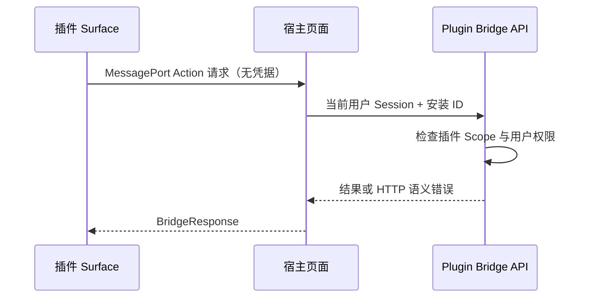

# 插件 SDK 与 MCP 桥接

活跃贡献者：Bohan Jiang、Xichang(Seacen) Zhao、YYClaw

Multica 的插件系统把第三方扩展分成三类关系：

- **Action**：插件调用 Multica，由宿主执行。
- **Hook**：Multica 调用插件提供的能力。
- **Resource**：不发生调用的静态贡献，例如 Skill 文本。

插件不是任意服务端代码加载器。已发布版本是不可变制品；宿主解析严格 Manifest、保存管理员同意的快照，并在沙箱、Scope、用户授权和网络边界内运行其贡献。

# 当前能力状态

Manifest 版本固定为 `manifest_version: 1`。当前宿主能力如下：

| 类别 | 已启用 | 已声明但未启用 |
| --- | --- | --- |
| Surface | `issue_panel`、`modal` | `sidebar_panel` |
| Hook Trigger | `ui`、`manual`、`agent`、`event`、`schedule` | 无 |
| Hook Transport | `http`、`mcp` | 无 |
| Resource | `skill` | 无 |

`sidebar_panel` 虽然是 v1 Schema 中的合法值，但当前没有宿主挂载位置，因此能力检查会让安装明确失败，而不是“安装成功但永不显示”。

插件管理和发现由 `plugins_v1` 功能开关控制，默认关闭。开关关闭不会改写已经进入执行中的不可变任务快照。

# Manifest 与发布模型

约定文件名为 `multica.plugin.json`。解析器会：

- 限制 Manifest 大小；
- 拒绝未知字段和尾随 JSON；
- 校验插件 Key、SemVer、相对路径、HTTPS URL；
- 使用封闭的 Scope 集合，仅允许合法的 `net:<domain>` 参数化 Scope；
- 校验 Surface、Hook、Trigger、事件、调度和 Resource；
- 生成并持久化规范化 Manifest 字节，作为安装时的同意快照。

常用 Scope 包括：

```text
issues:read        issues:write
comments:read      comments:write
tasks:read         tasks:write
agents:read        members:read
storage:user       storage:workspace
net:api.example.com
```

`net:` 是精确主机授权。`net:example.com` 不自动包含 `api.example.com`。

发布后的版本不可变。安装分为 Preview 和 Install 两步：Preview 读取同一版本的 Manifest 供管理员检查 Scope，Install 再把该版本、Manifest 快照和授权 Scope 绑定到工作区。发布新版本不会自动替换已有安装。

# Surface 与 Plugin SDK

## 运行边界

Surface 是宿主固定位置中的单脚本 iframe：

- iframe 使用 `sandbox="allow-scripts"`，不使用 `allow-same-origin`；
- 插件代码运行于专用、无应用凭据的内容域；
- 内容域只开放 `/plugin-surfaces/{token}`，不会暴露登录、API、上传或重定向路由；
- 请求若携带 Cookie 或 `Authorization` 会被拒绝；
- 启动 URL 中是 AES-GCM 加密、认证、两分钟有效的 claim；
- claim 绑定工作区、安装、不可变版本、Surface Key、代码 Digest 和一次桥接 Challenge；
- 响应使用 `no-store`、`no-referrer`、`nosniff` 和受限 Permissions Policy；
- CSP 的 `connect-src` 只来自管理员授予的精确 `net:` Scope；没有 `net:` 时为 `none`。

由于 iframe 是 opaque origin，宿主不能依赖 `event.origin` 识别插件。生成的启动脚本创建私有 `MessageChannel`，宿主校验 frame 来源、协议版本和一次 Challenge 后只接受该端口。不同 Surface 的身份由私有端口决定。

## 无凭据 Action API

Surface 中没有 Session Cookie、PAT、安装 Token 或 Hook 签名密钥。SDK 的调用通过 `MessagePort` 发送给宿主页面，宿主再使用当前查看者的会话调用桥接 API。

每个操作同时受两层限制：

1. 安装时管理员授予的 Scope；
2. 当前用户本来拥有的资源权限。

因此，插件 Surface 不能借管理员安装行为越过当前成员的权限。写入仍归属当前用户，并记录 `via_plugin_id` 便于审计。

SDK 当前提供：

- `multica.context.get()`：工作区、用户、可选议题、非密钥配置和已授权网络域；
- `multica.issue.get/update/comments/comment()`；
- `multica.storage.workspace` 与 `multica.storage.user`；
- `multica.hooks.invoke()`：只调用 Manifest 声明了 `ui` Trigger 的本插件 Hook；
- `multica.ui.resize()` 和主题 Token 订阅。

秘密配置字段永远不会进入 Surface 或 Context。iframe 也没有可依赖的 `localStorage`、`sessionStorage` 或 Cookie，应使用宿主存储 API。



# Hook 执行

## Trigger 语义

- `ui`：Surface 主动调用。
- `manual`：用户通过宿主操作触发。
- `agent`：该 Hook 被呈现为任务本地 MCP Tool，智能体自行选择是否调用。
- `event`：订阅 Manifest 列出的产品事件。
- `schedule`：按 Cron 计划执行；最低间隔五分钟，当前只支持 HTTP Transport。

`ui` 和 `manual` 的写入归属触发用户；`event` 和 `schedule` 没有自然人触发者，写入归属插件安装。`agent` 调用通过任务权限与服务端执行链路约束。

## HTTP Transport 的安全边界

服务端是唯一向插件 Hook 端点发请求的组件。每次调用会：

- 从安装时同意的 Manifest 快照读取 URL；
- 检查 URL 主机在已授予的 `net:` 列表中；
- 只允许公开 HTTPS 地址，并在实际拨号时重新解析，阻止 DNS rebinding 和私网 SSRF；
- 应用 Manifest 超时或默认十秒超时；
- 将响应限制在 1 MiB，并要求成功响应为 JSON；
- 使用安装级派生密钥签名 `timestamp.body`，发送 `X-Multica-Timestamp` 和 `X-Multica-Signature: v1=...`；
- 将可接受时间偏差限制为五分钟；
- 按 Hook 记录调用结果，执行每分钟 120 次的调用上限；
- 在五分钟窗口内连续失败达到阈值后对后台投递打开熔断器；
- 仅发送非秘密配置。

Hook 请求可携带短期 Callback Token。它绑定当前调用、工作区、Actor、Scope 和可选议题；调用结束后服务端主动撤销，Token 在使用时还会重新检查当前成员资格。Callback API 使用 `mpi_`/`mpc_` Bearer 边界，与浏览器 Session 路由分开。

## 异步事件与调度

产品事件总线是同步的，因此 `event` Hook 不在发布请求中访问第三方服务。Dispatcher 使用容量 512、4 个 Worker 的有界队列：

- 入队后立即返回，不阻塞创建议题等主路径；
- 队列满时丢弃并记录计数，而不是无限占用内存；
- 后台投递最多三次，按固定退避重试；
- 调用记录保留七天并定期清理；
- 每次投递重新读取 `plugins_v1`，关闭开关可立即停止新的事件外呼。

`schedule` 由持久化调度器和租约驱动，不应把 Cron 当作高频 Timer。

# Agent Hook 的本地 MCP 桥

HTTP Hook 声明 `agent` Trigger 后，Daemon 会为一个任务启动随机回环地址的 MCP Server：

1. Hook 描述和 `input_schema` 被转换为 MCP Tool 描述；
2. 智能体调用本地 Tool；
3. 本地 Server 把任务 ID、安装 ID、Hook Key 和参数发回 Multica Server；
4. Server 执行同一套 Scope、SSRF、签名、限流、熔断和审计逻辑；
5. 结果转换回 MCP Tool Result。

签名密钥不会下发到 Daemon。插件端点不可达时返回 Tool Error，智能体任务本身仍可继续。

# MCP Transport 与 Remote MCP Broker

## 发现不等于授权

`mcp` Transport 指向插件作者运行的外部 MCP Server。运行时 Tool 列表可能随时变化，因此“安装插件”不授予任何 Tool：

1. 管理员执行只读 Discovery；
2. 服务端从当前 `tools/list` 展示 Tool；
3. 管理员选择并批准；
4. 系统按 Tool Name 和输入 Schema Digest 固定批准集合；
5. Daemon 启动 Broker 时重新 Discovery；
6. 已批准 Tool 缺失或 Schema 漂移时拒绝启动/列出，新增 Tool 不会自动采用。

秘密凭据使用插件 Manifest 中约定的 `<hook_key>_credential` Secret 配置字段，密文存储；任务记录只保存贡献引用，Daemon 在启动或调用时向服务端解析凭据。

## Broker 限制

Remote MCP Broker 只对 `codex`、`claude`、`hermes`、`qoder`、`mcode` 启用。每个任务：

- 监听随机 `127.0.0.1` 端口和 24 字节随机路径；
- 只代理初始化、Ping、`tools/list`、`tools/call` 等必要方法；
- 只允许已批准 Tool；
- 每任务最多 256 次调用、最多 8 个并发调用、请求体最多 1 MiB；
- 每次连接和调用重新应用公开 HTTPS/主机 allowlist；
- 过滤 `tools/list` 响应并再次核对 Schema Digest；
- 不把远程凭据写进 Agent 配置或日志；
- 可选连接失败只形成诊断，不应让整个任务失败。

# 工作区 MCP、Agent 配置与任务 Overlay

MCP Server 有三个服务端合并层级：

```text
显式绑定且启用的工作区 MCP Server
    < Agent 自有 mcp_config
    < 每任务 Overlay
```

同名时右侧覆盖左侧。工作区 MCP 条目只是 Library：创建条目不会自动赋给任何 Agent，必须显式绑定。其 URL、命令、参数、Header 和环境变量都是只写秘密，不出现在列表响应。

Daemon 随后可把本机 Runtime MCP 配置作为更底层来源并与接收到的 Agent 配置合并；Agent 条目在同名冲突时覆盖 Runtime 条目。这个本机合并不会把本地秘密上传回服务端。

每任务 Overlay 用于实时、用户范围的连接（例如 Composio 会话），在同名冲突时优先，以避免使用旧的占位连接。

# Remote MCP OAuth 的实现状态

仓库包含 Remote MCP OAuth 2.1 基础组件：

- RFC 9728 Protected Resource Metadata；
- RFC 8414 / OIDC Discovery；
- PKCE S256；
- RFC 7591 动态客户端注册；
- 授权码交换、Refresh Token；
- Public HTTPS、禁代理和跨主机重定向限制；
- 用于短期 State、密文 PKCE Verifier/Token 的数据库迁移。

但是在本提交中，没有找到调用这些函数的 Handler、Service 或路由，也没有 `plugin_remote_mcp_oauth_state` 的查询实现。因此这只是基础设施，**不能视为可从 UI 完成的端到端 Remote MCP OAuth 功能**。当前可用的 MCP 凭据路径是已接线的 Secret 配置和服务端按任务解析。

# 如何扩展插件贡献

## 新增 Surface 类型

1. 在 v1 Contract 中定义并严格校验类型与字段。
2. 在宿主实现实际挂载位置、生命周期和无凭据 Bridge。
3. 复用专用内容域、不可变 Digest、短期启动 Claim、沙箱和 CSP。
4. 在 `HostCapabilities()` 中启用；Runtime 未落地前保持关闭。
5. 为导航、重载、重复握手、Scope 拒绝和 Cookie 泄露保护补测试。

## 新增 Hook Trigger 或 Transport

1. 明确 Actor、同步/异步和失败语义。
2. 在 Manifest 中校验该 Trigger/Transport 的组合。
3. 将外呼集中到服务端，复用精确 `net:`、SSRF、超时、响应上限和审计。
4. 若外部能力可动态变化，像 MCP 一样增加显式批准和 Schema 固定，不能把 Discovery 当授权。
5. 先实现 Runtime，再打开 Host Capability。
6. 对限流、重放、熔断、凭据撤销、Schema 漂移和多租户访问编写测试。

## 新增 MCP Runtime

1. 证明目标 Agent Provider 能消费任务本地 HTTP MCP 配置。
2. 在 `providerSupportsRemoteMCPBroker` 中显式加入 Provider。
3. 适配 Provider 配置格式，但保持随机回环 Broker、Tool allowlist 和凭据解析不变。
4. 测试启动失败策略、任务取消关闭、方法过滤、并发/调用上限和 Schema 漂移。

# 测试入口

- Manifest 与生命周期：`server/internal/service/plugin_test.go`、`server/internal/handler/plugin_package_test.go`、`server/internal/handler/plugin_test.go`。
- Surface 边界：`server/internal/handler/plugin_surface_test.go`、`packages/views/plugins/plugin-sdk-handshake.test.ts`、`packages/views/plugins/plugin-sdk-protocol.test.ts`、`packages/views/plugins/plugin-modal-surface.test.ts`。
- Action/Callback：`server/internal/handler/plugin_action_test.go`、`server/internal/handler/plugin_callback_test.go`。
- Hook 网络与异步：`server/internal/service/plugin_hook_test.go`、`server/internal/service/plugin_event_dispatch_test.go`、`server/internal/scheduler/jobs_plugin_hook_test.go`。
- Agent Hook MCP：`server/internal/daemon/plugin_hook_mcp_test.go`、`server/internal/service/plugin_agent_tools_test.go`。
- MCP 批准与 Broker：`server/internal/service/plugin_mcp_transport_test.go`、`server/internal/handler/plugin_mcp_test.go`、`server/internal/daemon/remote_mcp_broker_test.go`、`server/internal/daemon/remote_mcp_startup_test.go`。
- 工作区合并：`server/internal/handler/workspace_mcp_test.go`、`server/internal/handler/mcp_overlay_test.go`、`server/internal/daemon/runtime_mcp_workspace_test.go`。
- Remote MCP OAuth 基础组件：`server/pkg/remotemcp/oauth_test.go`。

# 源码索引

- [严格 Manifest Contract](https://github.com/oldwinter/multica/blob/685cf788777e24724b0d82ffe88c56459341fb2a/server/pkg/plugincontract/manifest.go)
- [宿主能力门](https://github.com/oldwinter/multica/blob/685cf788777e24724b0d82ffe88c56459341fb2a/server/pkg/plugincontract/capabilities.go)
- [Plugin SDK](https://github.com/oldwinter/multica/blob/685cf788777e24724b0d82ffe88c56459341fb2a/packages/plugin-sdk/index.ts)
- [Bridge 协议](https://github.com/oldwinter/multica/blob/685cf788777e24724b0d82ffe88c56459341fb2a/packages/plugin-sdk/protocol.ts)
- [Surface 内容域与启动 Claim](https://github.com/oldwinter/multica/blob/685cf788777e24724b0d82ffe88c56459341fb2a/server/internal/handler/plugin_surface.go)
- [Hook 执行引擎](https://github.com/oldwinter/multica/blob/685cf788777e24724b0d82ffe88c56459341fb2a/server/internal/service/plugin_hook.go)
- [事件 Hook Dispatcher](https://github.com/oldwinter/multica/blob/685cf788777e24724b0d82ffe88c56459341fb2a/server/internal/service/plugin_event_dispatch.go)
- [MCP Tool 批准](https://github.com/oldwinter/multica/blob/685cf788777e24724b0d82ffe88c56459341fb2a/server/internal/service/plugin_mcp_transport.go)
- [Agent Hook 本地 MCP](https://github.com/oldwinter/multica/blob/685cf788777e24724b0d82ffe88c56459341fb2a/server/internal/daemon/plugin_hook_mcp.go)
- [Remote MCP Broker](https://github.com/oldwinter/multica/blob/685cf788777e24724b0d82ffe88c56459341fb2a/server/internal/daemon/remote_mcp_broker.go)
- [工作区 MCP 合并](https://github.com/oldwinter/multica/blob/685cf788777e24724b0d82ffe88c56459341fb2a/server/internal/handler/workspace_mcp.go)
- [任务 Overlay 合并](https://github.com/oldwinter/multica/blob/685cf788777e24724b0d82ffe88c56459341fb2a/server/internal/handler/mcp_overlay.go)
- [Remote MCP OAuth 基础组件](https://github.com/oldwinter/multica/blob/685cf788777e24724b0d82ffe88c56459341fb2a/server/pkg/remotemcp/oauth.go)
- [插件与 MCP 路由接线](https://github.com/oldwinter/multica/blob/685cf788777e24724b0d82ffe88c56459341fb2a/server/cmd/server/router.go)

## 相关页面

- [集成索引](index.md)
- [智能体适配器与 CLI](../systems/agent-adapters-and-cli.md)
