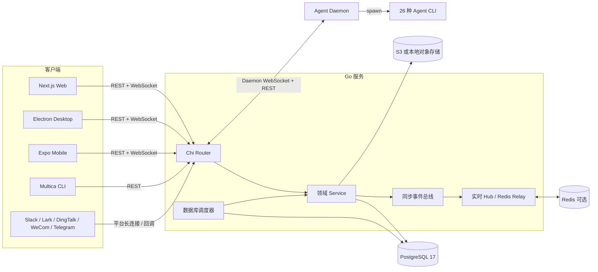
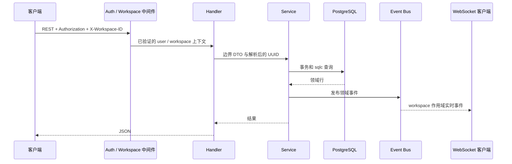
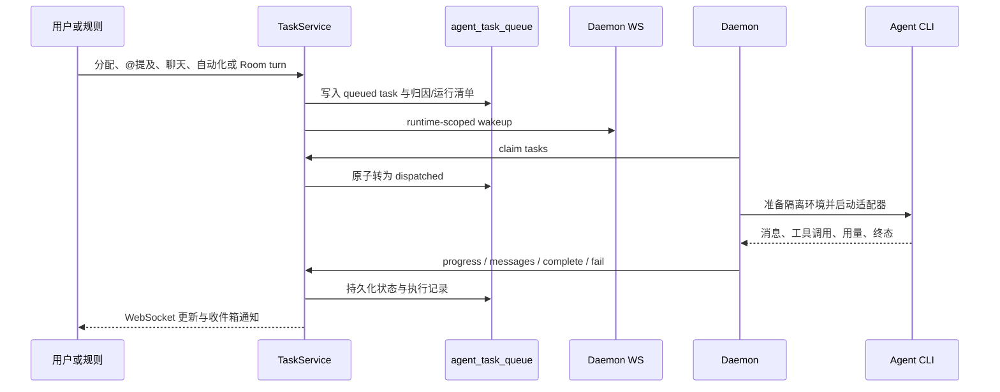
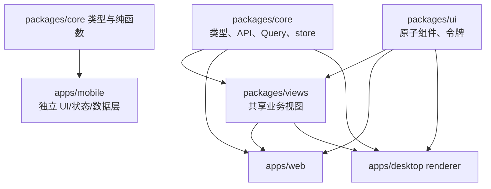

# 系统架构

Multica 由一个 Go API、PostgreSQL、可选 Redis、四个前端应用和运行在用户机器上的守护进程组成。API 保存协作事实，守护进程拥有代码与智能体 CLI 的执行边界，客户端通过 REST 与 WebSocket 观察同一工作区状态。

## 总体结构

服务启动和运行期资源装配在 `server/cmd/server/main.go`，完整路由与可选集成装配在 `server/cmd/server/router.go`。API 进程启动实时 Hub、Redis relay、指标服务器、pprof、运行时清理、来源上下文清理、自动化失败监视、渠道 supervisor、媒体对账、GitHub PR 快照和数据库调度器。

## 请求路径

标准 REST 请求经过 Chi 中间件，进入 `server/internal/handler/` 的领域 handler。Handler 负责边界解析、成员与权限检查、HTTP 状态和 DTO；跨表事务和业务生命周期通常交给 `server/internal/service/` 或专门的领域包，例如 `server/internal/room/`。

数据库访问源写在 `server/pkg/db/queries/*.sql`，生成代码位于 `server/pkg/db/generated/`。生成文件不能手工合并，修改 SQL 后运行 `make sqlc`。迁移由 `server/cmd/migrate/main.go` 执行，索引必须通过独立迁移使用 `CREATE INDEX CONCURRENTLY`。

## task 执行路径

任务、聊天、自动化、Room 和插件都可以创建 task，但最终汇聚到 `server/internal/service/task.go` 与 `agent_task_queue`。守护进程同时保留 WebSocket 优先和定期轮询兜底，协议在 `server/pkg/protocol/` 与 `server/internal/daemonws/` 中定义。

守护进程按运行时适配器调用 Claude Code、Codex、Cursor、Hermes、Qwen 等 CLI。适配器在 `server/pkg/agent/`，工作目录、skill、MCP、会话恢复和本地缓存准备在 `server/internal/daemon/execenv/`、`server/internal/daemon/repocache/` 与 `server/internal/daemon/` 其他文件中。详细流程见[守护进程与运行时](../systems/daemon-and-runtime.md)。

## 前端共享边界

依赖方向是 `views -> core + ui`，`core` 和 `ui` 彼此独立。`packages/views/` 不能导入 Next.js 或 React Router；导航由 `packages/core/navigation/` 和平台 adapter 注入。Web adapter 在 `apps/web/platform/navigation.tsx`，Desktop adapter 在 `apps/desktop/src/renderer/src/platform/navigation.tsx`。

`packages/core/realtime/use-realtime-sync.ts` 是 Web/Desktop 的集中式事件协调器。它按事件内容直接 patch TanStack Query cache，或在无法可靠预测投影时 invalidate。Mobile 不复用这个 Hook，而是在 `apps/mobile/data/realtime/` 与 `apps/mobile/lib/use-ws-subscriptions.ts` 中按列表和单记录拆分订阅，减少蜂窝网络下的无效请求。

## 事件与多节点运行

进程内领域事件总线位于 `server/internal/events/`，监听器在 `server/cmd/server/listeners.go` 及同目录领域文件中注册。面向客户端的实时 Hub 位于 `server/internal/realtime/hub.go`。未配置 Redis 时，广播只在单节点内工作；配置 `REDIS_URL` 或 `REALTIME_RELAY_REDIS_URL` 后，`server/internal/realtime/sharded_stream_relay.go` 通过分片 Redis Stream 转发事件和守护进程唤醒。

渠道集成使用 `server/internal/integrations/channel/engine/` 的通用 Supervisor 和 Router。每个安装持有租约，多副本部署可选择 PostgreSQL 或 Redis 租约后端。平台 adapter 将 Slack、飞书/国际 Lark、钉钉、企业微信和 Telegram 的消息转成同一聊天会话、任务与回复流程。

## 数据与外部依赖

| 依赖 | 用途 | 主要代码 |
| --- | --- | --- |
| PostgreSQL 17 | 权威业务数据、任务队列、调度租约、迁移账本 | `server/pkg/db/queries/` |
| Redis，可选 | 多节点广播、认证缓存、空领取缓存、请求状态、渠道租约 | `server/cmd/server/main.go` |
| S3 或本地存储 | 附件、渠道媒体、来源上下文 | `server/internal/storage/` |
| Agent CLI | 真正执行智能体任务 | `server/pkg/agent/` |
| GitHub / GitLab / Gitea / Forgejo | 仓库、Webhook 与 PR 快照 | `server/internal/integrations/vcs/`、`server/internal/integrations/ghsnapshot/` |
| 聊天平台 | 外部消息入口与回复 | `server/internal/integrations/` |
| Composio | 每次 task 的 MCP 应用连接覆盖层 | `server/internal/integrations/composio/` |

## 规模

当前跟踪文件中约有 73 万行 Go、50 万行 TypeScript/TSX、3.2 万行 SQL。后端是最大单体，`packages/views/` 是最大前端工作区。完整快照和口径见[代码库数据](../by-the-numbers.md)。

## 关键源文件

| 文件 | 用途 |
| --- | --- |
| `server/cmd/server/main.go` | 进程装配、worker 与关闭顺序 |
| `server/cmd/server/router.go` | 路由、中间件和集成装配 |
| `server/internal/handler/handler.go` | Handler 依赖容器与边界 helper |
| `server/internal/service/task.go` | task 生命周期与归因 |
| `server/internal/realtime/hub.go` | 客户端实时 Hub |
| `server/internal/daemonws/hub.go` | 守护进程 WebSocket |
| `packages/core/realtime/use-realtime-sync.ts` | Web/Desktop cache 同步 |
| `apps/mobile/data/realtime/` | Mobile 事件同步 |

关于端点和协议，请继续阅读[后端与 API](../backend/index.md)；关于认证、租户隔离和执行边界，请阅读[安全模型](../security/index.md)。
