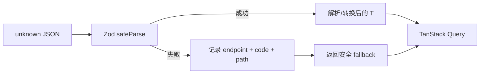

# Core API 客户端与响应 schema

活跃贡献者：Bohan Jiang、Naiyuan Qing、Jiayuan Zhang

`packages/core/api` 是 Web/Desktop 的 HTTP 与 WebSocket 边界。它负责认证和工作区 header、统一错误、客户端 identity、响应解析与版本漂移降级；Query、mutation 和 UI 不应各自重新实现这些规则。

## 公开入口

[`packages/core/api/index.ts`](../../packages/core/api/index.ts) 公开：

| 导出 | 用途 |
| --- | --- |
| `ApiClient` | REST 客户端 |
| `ApiError` | 带 `status`、`statusText` 与结构化 `body` 的错误 |
| `api`、`getApi`、`setApiInstance` | 应用启动时注册、领域查询共享的 API 单例 |
| `parseWithFallback`、`setSchemaLogger` | Zod 安全解析与无敏感内容日志 |
| `errorCode`、`dispatchReasonCode`、`clientErrorMessage` | 从错误体提取稳定代码，限制可展示的服务端消息 |
| `WSClient` | WebSocket 连接、订阅与重连 |

`@multica/core/api/client`、`@multica/core/api/schema`、`@multica/core/api/schemas` 和 `@multica/core/api/ws-client` 也都是 [`package.json`](../../packages/core/package.json) 中的公开窄入口。

## `ApiClient` 请求路径

[`ApiClient`](../../packages/core/api/client.ts) 的 `fetchRaw` 统一完成：

- 拼接 `baseUrl`；
- 附加 `Authorization`、`X-Workspace-Slug`、CSRF、`X-Request-ID`；
- 附加 `X-Client-Platform`、`X-Client-Version`、`X-Client-OS`；
- 使用 `credentials: "include"`；
- 对 401 清理内存 token 并调用 `onUnauthorized`；
- 读取一次错误 body，构造 `ApiError`；
- 让 401、404 与其他错误使用不同日志级别。

普通 JSON 请求再由私有 `fetch<T>` 解码；204 返回 `undefined`。工作区 header 默认来自 [`getCurrentSlug`](../../packages/core/platform/workspace-storage.ts)，跨工作区操作必须显式覆盖，不能让当前路由的 slug 把写操作送往错误工作区。

`CoreProvider` 在启动时创建实例并调用 `setApiInstance`，因此领域 query 可以使用 `api.listIssues(...)`，而不需要各自传递客户端。初始化位置见 [`platform/core-provider.tsx`](../../packages/core/platform/core-provider.tsx)。

## `parseWithFallback`

核心实现位于 [`api/schema.ts`](../../packages/core/api/schema.ts)：

```ts
parseWithFallback<T>(
  data: unknown,
  schema: ZodType,
  fallback: T,
  { endpoint }: { endpoint: string },
): T
```

执行规则：

1. 调用 `schema.safeParse(data)`。
2. 成功时返回 schema 解析/转换后的值。
3. 失败时不向 React 抛出 ZodError，而是原样返回调用者提供的 fallback。
4. 日志只记录 endpoint、issue 数量、错误 code 与字段 path，不记录原始 payload，避免把评论、提案或密钥写入遥测。

返回类型由 fallback 的 `T` 锚定，而不是强迫 schema 等同于严格 TypeScript 类型。这样 schema 可以把服务端枚举保留为 `z.string()`，下游仍以已知联合类型工作，并通过 `default` 分支处理新值。



## Schema 的兼容策略

大部分共享 schema 位于 [`api/schemas.ts`](../../packages/core/api/schemas.ts)，较大的独立领域也可在自己的目录保存 schema。已安装的 Desktop 可能连接更旧或更新的后端，因此“严格验证已知形状”和“容忍可加字段”必须同时成立。

### 1. 对象通常使用 `.loose()`

Zod 4 默认剥离未知字段；`.loose()` 保留新后端增加的字段，使旧客户端不会因加字段失败，也避免类型后来采用该字段时被旧 schema 静默删掉。时间线、任务、插件、聊天等对象都采用这个模式。

例外必须有边界理由。例如 [`WorkspaceMcpServerSchema`](../../packages/core/api/schemas.ts) 故意不使用 `.loose()`，因为读取接口只能缓存安全摘要；若服务端误回 `url` 或 `headers`，未知字段应被剥离，不能进入 Query cache。

### 2. 服务端可增长枚举使用 `z.string()`

状态、provider、资源类型等会随服务端增长的值通常保持开放字符串。旧客户端仍保留这一行，UI 的 `switch default` 或中性展示负责降级。把它们写成封闭 `z.enum(...)` 往往会让一个新值击穿整张列表。

只有客户端必须拒绝未知值时才固定枚举或字面量。例如重复任务错误体的 `code` 使用 `z.literal("active_duplicate_issue")`；未知错误代码应退回普通错误提示，而不是渲染半成品专用 UI。

### 3. 可加字段独立降级

使用 `.optional()`、`.default()`、`.catch()`、`z.preprocess` 或局部 `safeParse`，让一个损坏的可选字段只消失自身，不拖垮主实体。例如：

- 缺失数组常降级为 `[]`；
- 早期服务端返回的 `null` 附件数组归一化为 `[]`；
- 未知形状的自定义属性值逐项丢弃，保留任务和其他属性；
- 聊天列表逐项过滤损坏会话；
- `UserSchema` 对损坏的可加外观字段恢复为 `null`。

### 4. Fallback 必须表达产品语义

| 响应类型 | 常见 fallback | 原因 |
| --- | --- | --- |
| 列表/集合 | `[]` 或 `{ items: [], total: 0 }` | 页面可降级为空态 |
| 可选能力 | `false`、`null` 或 “unsupported” | 默认 fail closed |
| 执行状态 | 明确失败态 | 不能把不可读响应显示为成功或无限 pending |
| 单实体读/创建 | `null` 后抛普通 Error | 空 ID 不能伪装为成功 |
| 付费权益 | `null`/unknown | 不能把不可读 Pro 订阅伪装成 Free |
| 外部跳转 URL | schema 拒绝非 HTTPS | 不把不可信 scheme 交给 `location.assign` |

例如 [`getIssue`](../../packages/core/api/client.ts) 和 `createIssue` 都以 `null` 作为解析失败值，再拒绝调用；列表接口则可以返回显式空集合。Cron 预览使用 `{ next_runs: null }` 区分“响应不可读”和合法的“没有下一次运行”。

### 5. 在边界转换 wire 形状

请求体按服务端契约发送 `snake_case`；应用公开类型需要 `camelCase` 时，在 schema `.transform()` 或客户端序列化处完成转换。例如 `UserSchema` 把 `appearance_updated_at` 转为 `appearanceUpdatedAt`，云订阅 schema 把 seat、价格和请求字段转换为 camelCase。不要在组件里重复改名或直接断言 JSON。

## 错误展示边界

[`ApiError`](../../packages/core/api/client.ts) 保留结构化 body，UI 应优先读取稳定 `code`/`reason_code` 并本地化：

- `errorCode(err)`：普通机器可读错误代码；
- `dispatchReasonCode(err)`：任务触发拒绝原因；
- `clientErrorMessage(err)`：只允许 4xx 人类可操作消息进入 UI，5xx 和网络错误返回 `undefined`，避免泄露 Go 错误链、数据库名或内部 ID。

不要通过字符串匹配服务端英文消息决定业务分支。

## 新增或修改端点

1. 定义请求与返回类型；网络输入先视为 `unknown`。
2. 在领域 schema 或 [`api/schemas.ts`](../../packages/core/api/schemas.ts) 定义已知最小形状。
3. 明确新字段是必需、可选、可默认还是必须 fail closed。
4. 为服务端可增长枚举保留开放字符串；为安全/结算/跳转边界收紧约束。
5. 定义有业务含义的 `EMPTY_*`、`MALFORMED_*` 或 `null` fallback。
6. 在 [`ApiClient`](../../packages/core/api/client.ts) 中先 `fetch<unknown>`，再 `parseWithFallback`；单实体写入若无安全空形状，应在解析失败后抛错。
7. 若请求或响应需要命名转换，只在边界转换一次。
8. 从领域入口和 [`package.json`](../../packages/core/package.json) 的公开子路径导出需要给消费方的 API。
9. 增加正常、字段缺失、字段错型、未知枚举、加字段和错误状态测试。

## 常见陷阱

- `return this.fetch<MyType>(...)` 后把网络值当成已验证对象；旧方法中仍有这种遗留模式，新端点不要复制。
- 使用 `as T` 绕过解析，或在组件内才检查关键字段。
- 给所有枚举使用 `z.enum`，导致新服务端值清空整张列表。
- 给所有错误使用空对象 fallback，使“失败”看起来像“成功但无内容”。
- `.default([])` 抹掉“合法空集合”和“响应不可读”的产品差异。
- 在 schema 日志里附带原始 payload。
- 认为 HTTP 2xx 就等于 mutation 成功；创建接口返回空 ID 仍必须拒绝。
- 把 5xx body 的内部错误原文显示给用户。

## 测试位置

- [`api/schema.test.ts`](../../packages/core/api/schema.test.ts)：helper 成功/fallback、无原始内容日志。
- [`api/schemas.test.ts`](../../packages/core/api/schemas.test.ts)：字段缺失、局部降级、未知枚举、转换与 fallback。
- [`api/client.test.ts`](../../packages/core/api/client.test.ts)：header、序列化、HTTP 错误与具体端点兼容。
- [`api/ws-client.test.ts`](../../packages/core/api/ws-client.test.ts)：WebSocket 鉴权、坏帧与重连。
- 领域 schema 测试：如 [`wiki/schemas.test.ts`](../../packages/core/wiki/schemas.test.ts)、[`twins/execution-schemas.test.ts`](../../packages/core/twins/execution-schemas.test.ts)。

## 相关页面

- [共享核心层](index.md)
- [Query 与 mutation](core-query-and-mutations.md)
- [实时同步](core-realtime.md)
- [前端共享](../how-to-contribute/frontend-sharing.md)
- [模式与约定](../how-to-contribute/patterns-and-conventions.md)
