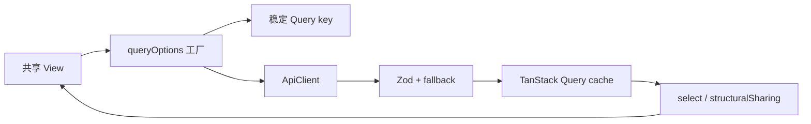

# Core Query 与 mutation

活跃贡献者：Naiyuan Qing、Bohan Jiang、Jiayuan Zhang

`packages/core` 使用 TanStack Query 持有全部服务端状态。每个领域的 `queries.ts` 定义 key factory 与 `queryOptions`，`mutations.ts` 定义写操作和缓存协调；Zustand 不保存任务、成员、智能体、项目或收件箱等服务端实体。

## 全局 QueryClient

[`createQueryClient`](../../packages/core/query-client.ts) 的默认值是：

| 选项 | 值 | 含义 |
| --- | --- | --- |
| `queries.staleTime` | `Infinity` | 默认依赖 mutation/WebSocket 主动维护新鲜度 |
| `queries.gcTime` | 10 分钟 | 无 observer 的缓存保留时间 |
| `refetchOnWindowFocus` | `false` | 聚焦窗口不自动刷新 |
| `refetchOnReconnect` | `true` | 网络恢复时 Query 可刷新 |
| `queries.retry` | `1` | 读请求重试一次 |
| `mutations.retry` | `false` | 写请求默认不自动重试 |

`QueryProvider` 在 [`provider.tsx`](../../packages/core/provider.tsx) 中通过惰性 `useState(createQueryClient)` 为应用实例创建一个 QueryClient。由于默认 `staleTime: Infinity`，漏掉 invalidation 不是短暂延迟，而可能一直陈旧到重载；这也是实时同步与 mutation cache contract 必须精确的原因。

## Query key 工厂

领域 key 由 `<domain>/queries.ts` 的工厂生成，而不是在组件内拼数组：

```ts
export const workspaceKeys = {
  all: (wsId: string) => ["workspaces", wsId] as const,
  members: (wsId: string) => ["workspaces", wsId, "members"] as const,
};
```

完整示例见 [`workspace/queries.ts`](../../packages/core/workspace/queries.ts) 与 [`issues/queries.ts`](../../packages/core/issues/queries.ts)。

### 规则

1. 工作区服务端状态的 key 必须包含 `wsId`。
2. 同时提供树前缀和完整 key，例如 `issueKeys.list(wsId)` 用于批量失效，`issueKeys.listSorted(wsId, sort)` 用于实际查询。
3. 所有影响结果的 filter、sort、cursor contract 都必须进入 key；不能拉一页数据后在客户端补服务端筛选。
4. 数组型输入先排序、去重，再进入 key。`childrenByParents` 明确要求稳定的 parent ID 列表。
5. 不要把不同 cache shape 放进同一个“可随意扫描”的前缀后直接强转。任务缓存协调器会先检查 `byStatus`、`pages`、`rows` 等形状。

少数 per-entity key 出于历史或跨工作区唯一 ID 设计不含 `wsId`，例如 `issueKeys.timeline(issueId)`、`chatKeys.messages(sessionId)`。这类 key 必须提供 `timelineAll()`、`messagesAll()` 等全局前缀，并在重连恢复时单独 invalidate；`issueKeys.all(wsId)` 无法覆盖它们。实现说明见 [`issues/queries.ts`](../../packages/core/issues/queries.ts) 和 [`chat/queries.ts`](../../packages/core/chat/queries.ts)。

## Query options 封装

消费方应复用 `queryOptions`/`infiniteQueryOptions` 工厂：

- `workspaceListOptions()`、`workspaceBySlugOptions(slug)`
- `issueListOptions(wsId, sort)`、`issueDetailOptions(wsId, id)`
- `issueTableGroupsOptions(...)`、`issueTableRowPageOptions(...)`
- `chatMessagesPageOptions(sessionId)`
- `roomDetailOptions(wsId, roomId)`

工厂把 key、queryFn、`enabled`、分页游标、`select`、局部 staleTime 和错误重试契约放在一起。组件只负责提供参数和渲染状态。

例如 [`issueListOptions`](../../packages/core/issues/queries.ts) 的原始 cache 是按状态类别分桶的 `ListIssuesCache`，`select` 才扁平为 `Issue[]`。mutation 和 realtime updater 必须写回原始 `byStatus` 形状，不能按组件看到的 `Issue[]` 修改。



## Mutation 的三种缓存策略

### 1. 等待服务端，再写权威结果

适合创建、确认、导航、跨资源生命周期以及无法安全预测的结果。例：

- [`useCreateWorkspace`](../../packages/core/workspace/mutations.ts) 等服务端返回后把新工作区写入列表，调用者之后再导航；
- [`useDeleteWorkspace`](../../packages/core/workspace/mutations.ts) 不先移除列表，DELETE 成功后才清理该工作区持久化命名空间；
- MCP、Room、Wiki 等复杂写入通常只在 `onSettled` invalidate 权威 query tree。

导航或确认流程必须先 `await mutateAsync`，再导航/关闭/清理，不能让失败请求把用户带离当前状态。

### 2. 精确 optimistic patch + rollback + reconcile

只在以下条件全部成立时使用：

- 结果可由本地确定；
- 用户仍留在当前界面；
- 失败罕见；
- 回滚简单；
- 能列出所有受影响 cache。

典型流程：

```ts
onMutate: async (vars) => {
  await queryClient.cancelQueries({ queryKey });
  const previous = queryClient.getQueryData(queryKey);
  queryClient.setQueryData(queryKey, (old) => patch(old, vars));
  return { previous };
},
onError: (_error, _vars, context) => {
  queryClient.setQueryData(queryKey, context?.previous);
},
onSettled: () => {
  queryClient.invalidateQueries({ queryKey });
},
```

适合状态、负责人、pin、已读、toggle 等字段。任务更新更复杂：[`useUpdateIssue`](../../packages/core/issues/mutations.ts) 调用 [`applyIssueChange`](../../packages/core/issues/cache-coordinator.ts)，在 board、flat list、detail、table、children 和 inbox 投影间统一 patch/移除/回滚规则；服务端响应到达后按 revision 再协调，只有无法判断的投影才失效。

mutation 的 optimistic 阶段不要立即 refetch。服务端尚未提交时返回的旧快照会覆盖本地 patch；`IssueCacheCoordinator` 因此先记录 `staleKeys`，mutation 在 settle 后失效，而 WebSocket 路径因为事件已代表服务端提交，可以立即失效。

### 3. 只 invalidate

当 payload 不完整、列表成员关系由服务端权限/筛选决定、聚合值无法从一个实体计算，或写入会改变分页边界时，直接失效最安全。例如：

- Room/Wiki 生命周期事件；
- 项目指标与分组计数；
- 收件箱新消息在主列表和归档列表之间的归属；
- 当前用户跨会话 pending task 聚合，其权限过滤只能由服务端决定。

## “确定则 patch，不确定则 invalidate”

[`issues/surface/membership.ts`](../../packages/core/issues/surface/membership.ts) 把任务对筛选列表的归属判定为 `true | false | "unknown"`：

| 判定 | 操作 |
| --- | --- |
| `true` | 在现有 cache 中精确 patch/rebucket |
| `false` | 从该投影精确移除并更新可确定计数 |
| `"unknown"` | 可先 patch 已加载实体，但把该 key 标为 stale |
| 实体不在已加载窗口且可能进入 | 不硬插入；invalidate 让服务端决定页和位置 |

这套规则同时供单任务更新、批量更新和 `issue:updated` WebSocket 使用，避免“我自己的写入”和“别人写入”走两套缓存语义。

## 聊天不是静默 optimism

聊天发送采用 pending-message 模式：立即显示已接受/待执行的消息与 pending task，但保留可见的运行、失败和恢复状态。核心 helper 包括：

- [`upsertChatMessageToCaches`](../../packages/core/chat/message-cache.ts)：按 `message.id` 幂等合并 flat 与 paged 两套缓存；
- [`enqueuePendingChatTask`](../../packages/core/chat/pending.ts)、`promotePendingChatTask`、`removePendingChatTask`：维护会话内队列；
- [`chatKeys.pendingTask`](../../packages/core/chat/queries.ts)：会话内进行中状态；
- realtime 的 `chat:done`/`task:*` handler：先落消息，再清 pending，并继续 authoritative invalidate。

实际发送控制器位于 [`packages/views/chat/components/use-chat-controller.ts`](../../packages/views/chat/components/use-chat-controller.ts)，但缓存归并与队列状态机在 core 中保持单一实现。

## 扩展一个 Query/Mutation

1. 在领域 `queries.ts` 增加 key factory；工作区数据从 `wsId` 开始。
2. 把所有影响结果的参数放进 key，并保持引用/顺序稳定。
3. 使用 `queryOptions` 或 `infiniteQueryOptions` 封装 API、分页、enabled 与 selector。
4. 列出写入影响的 detail、list、group、aggregate、parent/child 和跨领域投影。
5. 按决策条件选择“服务端确认”“optimistic patch”或“只 invalidate”。
6. optimistic 时先 cancel，保存完整回滚上下文；`onError` 恢复，`onSuccess` 合并权威返回，`onSettled` 只失效不能安全 patch 的部分。
7. 确认对应 WebSocket 事件与本地 mutation 幂等，不因同一用户另一标签页而过滤 actor。
8. 为 key 隔离、cache shape、失败回滚、部分窗口和乱序响应增加测试。

## 常见陷阱

- 工作区 key 不含 `wsId`，或 key 漏掉筛选/排序参数。
- selector 每次返回新 `Map`/数组，造成无关 cache 更新时重复渲染。
- 对 prefix 扫描结果直接断言统一 shape；同一前缀可能包含 list、facet、infinite page。
- optimistic 写了 detail，却漏掉 list、children、inbox 或 table 投影。
- 在 `onMutate` 中 invalidate/refetch，旧数据覆盖 optimistic 状态。
- 硬插入未加载窗口中的实体；服务端才知道分页位置和筛选成员关系。
- `staleTime: Infinity` 下只 patch 当前 observer，忘记让未挂载 cache 变 stale。
- 将创建/删除/离开后的导航当成 optimistic 操作。
- 聊天失败时静默删掉用户消息，而不是保留可见失败与重试路径。

## 测试位置

- [`issues/queries.test.ts`](../../packages/core/issues/queries.test.ts)
- [`issues/mutations.test.tsx`](../../packages/core/issues/mutations.test.tsx)
- [`issues/cache-coordinator.test.ts`](../../packages/core/issues/cache-coordinator.test.ts)
- [`issues/surface/membership.test.ts`](../../packages/core/issues/surface/membership.test.ts)
- [`workspace/queries.test.ts`](../../packages/core/workspace/queries.test.ts)
- [`workspace/mutations.test.tsx`](../../packages/core/workspace/mutations.test.tsx)
- [`chat/queries.test.ts`](../../packages/core/chat/queries.test.ts)
- [`chat/mutations.test.tsx`](../../packages/core/chat/mutations.test.tsx)
- [`chat/message-cache.test.ts`](../../packages/core/chat/message-cache.test.ts)
- [`chat/pending.test.ts`](../../packages/core/chat/pending.test.ts)

## 相关页面

- [共享核心层](index.md)
- [API 客户端与响应 schema](core-api-and-schema.md)
- [客户端状态与平台 adapter](core-state-and-platform.md)
- [实时同步](core-realtime.md)
- [测试指南](../how-to-contribute/testing.md)
