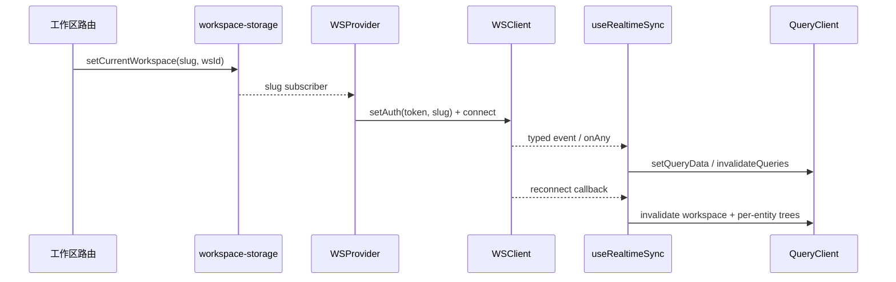

# Core 实时同步

活跃贡献者：Naiyuan Qing、Bohan Jiang、Jiayuan Zhang

Web/Desktop 的实时链路集中在 `packages/core/realtime`。WebSocket 不是第二个服务端状态仓库，而是“精确 cache patch + 权威 query invalidation”的信号通道；所有持久服务端数据最终仍归 TanStack Query 所有。

## 公开入口

[`realtime/index.ts`](../../packages/core/realtime/index.ts) 导出：

- `WSProvider`、`useWS`
- `useWSEvent`
- `useWSReconnect`
- `useRealtimeSync`
- `removeChatMessageFromCaches`
- `RealtimeSyncStores`

传输客户端 `WSClient` 由 `@multica/core/api/ws-client` 公开，实现位于 [`api/ws-client.ts`](../../packages/core/api/ws-client.ts)。

## 连接生命周期

[`WSProvider`](../../packages/core/realtime/provider.tsx) 读取：

- 已认证用户；
- URL 驱动的当前工作区 slug；
- token/cookie 认证模式；
- storage 与客户端 identity。

只有用户、slug 和认证材料就绪时才创建 `WSClient`。工作区 slug 变化会销毁旧连接并建立新连接；identity 使用 primitive 依赖，避免父组件重建对象导致无意义重连。

### 认证与连接安全

[`WSClient`](../../packages/core/api/ws-client.ts) 不把 token 放进 URL，避免进入代理/CDN 日志或历史：

- cookie 模式依赖 upgrade 自动携带 HttpOnly cookie；
- token 模式在 socket open 后先发送 `{ type: "auth", payload: { token } }`；
- `workspace_slug` 与 `client_platform/version/os` 作为握手 query 参数。

收到 frame 后先 JSON.parse，再验证它是带字符串 `type` 的对象。坏 JSON 被截断后记录；缺少字符串 type 的 frame 每条连接只记录一次并丢弃，不能进入 downstream handler。

断线使用指数退避，起点 1 秒、上限 30 秒、±20% jitter，并持续重试。只有恢复过的连接才调用 `onReconnect`，首次连接不触发恢复失效。

## 集中协调器

[`useRealtimeSync`](../../packages/core/realtime/use-realtime-sync.ts) 由 `WSProvider` 挂载一次，负责：

1. `onAny` 按事件前缀做通用 invalidation。
2. 每个前缀使用 100 ms debounce，合并批量变化。
3. `specificEvents` 跳过通用路径，改用精确 handler。
4. 任务、聊天、Wiki、Twin、Room、收件箱与工作区生命周期使用各自缓存规则。
5. 重连或新 `WSClient` 实例出现时，恢复可能漏掉的事件。

页面级功能可以通过 [`useWSEvent`](../../packages/core/realtime/hooks.ts) 注册局部 handler，或通过 `useWSReconnect` 补拉组件本地数据；cleanup 会自动退订。集中 handler 与页面 handler 必须幂等。

## Patch 还是 invalidate

| 条件 | 策略 | 示例 |
| --- | --- | --- |
| payload 是完整权威实体，目标 cache 可枚举 | 精确 patch | `workspace:updated`、聊天会话 rename/pin/archive |
| payload 是完整字段快照且顺序可校验 | 跨投影 patch | 任务 labels/metadata/properties |
| payload 只说明“发生变化” | invalidate | Wiki/LM Wiki/Twin 生命周期 |
| 列表归属、权限或分页位置由服务端决定 | invalidate | 收件箱新项、跨会话 pending 聚合 |
| 活跃界面需要即时连续反馈 | patch 活跃 cache，再 invalidate 其他投影 | `chat:done`、task pending |
| 高频流式事件 | 限定已持有 cache、批处理 patch | `task:message` |
| 未挂载 cache 只需下次打开恢复 | 标 stale，不立即 refetch | timeline 全局 fallback |

规则可概括为：payload 足够且投影确定时 patch；不能安全推导时 invalidate。

## 任务缓存同步

任务实时 helper 位于 [`issues/ws-updaters.ts`](../../packages/core/issues/ws-updaters.ts)：

- `onIssueCreated`：只在可确定状态桶中插入，其他列表失效；
- `onIssueUpdated`：调用与 mutation 共用的 `applyIssueChange`；
- `onIssueDeleted`：清理 detail、list、parent/child 与依赖投影；
- `onIssueLabelsChanged`、`onIssueMetadataChanged`、`onIssuePropertiesChanged`：把完整快照 patch 到已加载投影；
- `onIssueAuxiliaryRevision`：记录辅助事件 revision，不伪造完整实体 revision。

乱序防护很重要：较旧 revision 不得覆盖新 cache；无 revision 的旧服务端事件在已有 versioned 快照时退化为 authoritative refetch。一个辅助事件只证明 owner 有更新版本，但没有完整任务字段，因此只能标记旧投影 stale，不能提前把 `Issue.revision` 推进到并不存在的完整快照。

筛选、排序、分组或分页归属无法从单任务推导时，updater 只 patch 确定部分并失效 server-owned projection。详情见 [`issues/cache-coordinator.ts`](../../packages/core/issues/cache-coordinator.ts)。

## 时间线与评论

评论、activity、reaction 和 subscriber 事件有两层处理：

1. 挂载中的任务详情可做 granular `setQueryData`，保持引用稳定；
2. 全局 fallback 对未挂载时间线调用 `invalidateQueries({ refetchType: "none" })`。

`refetchType: "none"` 是关键：它让未挂载 cache 下次打开时刷新，却不会在 AI 流式输出期间每条评论事件都重拉整个活动时间线、替换所有引用。创建评论还会失效按 `updated_at`/last activity 排序的任务列表，因为服务端会推进 owner 时间。

## 聊天与 task 流

聊天实时路径只写 Query cache，不把消息镜像到 Zustand：

- `chat:message`：按 ID upsert 用户消息，再刷新消息/附件权威形状；
- `chat:done`：先插入 assistant 消息，再移除对应 pending task，避免完成瞬间闪烁；
- `chat:quick_actions`：取消可能覆盖它的旧 refetch，patch 两种消息 cache，再重新失效做权威收敛；
- `chat:cancel_finalized`：按 outcome 插入 “Stopped.” 或移除被恢复的用户消息；
- `chat:session_updated`：patch title/project/pin/status，并在 archive 时清 unread；
- `chat:session_deleted`：清消息/pending cache，并仅在活动指针指向该会话时清理 Zustand `activeSessionId`。

[`upsertChatMessageToCaches`](../../packages/core/chat/message-cache.ts) 同时维护 flat 与 infinite cache，以 `message.id` 去重；已有行字段优先，较薄的 WebSocket echo 只能补缺失字段，不能覆盖带 attachments 的发送响应。

### 高频 `task:message`

`task:message` 是工作区广播。协调器先检查本客户端是否已经持有该 task 的 timeline cache；未打开过的 task 直接丢弃，避免每个客户端积累整个工作区所有执行记录。保留的 frame 按 task 分组，每 100 ms 固定窗口合并一次；flush 前再次确认 cache 仍存在，防止 observer 离开后重建一个不完整但 `Infinity` fresh 的 timeline。

## 权限敏感的 invalidation

跨会话 pending chat aggregate 只能 invalidate，不能根据 `task:*` 广播 optimistic 写入。事件是工作区 fanout，payload 不含 creator/agent visibility；直接写入会让成员 A 的任务点亮成员 B 的 FAB，绕过服务端权限过滤。

[`refetchPendingChatAggregate`](../../packages/core/realtime/use-realtime-sync.ts) 因此只失效 `chatKeys.pendingTasks(wsId)`，由 `/api/chat/pending-tasks` 系列端点按当前用户重新计算。会话内 `pendingTask(sessionId)` 可以 patch，因为只有已被服务端授权打开的会话才会渲染。

同理，`inbox:new` 使用 item 自己的 `workspace_id`，不能用当前活动工作区。通知 deep link 先从工作区列表解析来源 slug；解析失败时显示无链接通知，也不猜当前 slug。

## 重连恢复

重连后 `invalidateWorkspaceScopedQueries` 会失效当前工作区的任务、收件箱、成员、智能体、项目、运行时、自动化、聊天、Room、Wiki、标签、属性和状态目录。

另外显式失效不含 `wsId` 的树：

- `issueKeys.timelineAll/reactionsAll/subscribersAll/usageAll/attachmentsAll/tasksAll`
- `chatKeys.messagesAll/messagesPageAll/pendingTaskAll/taskMessagesAll/draftRestoresAll`
- 工作区列表与跨工作区收件箱摘要

新 `WSClient` 实例通常表示切换工作区，也执行同一恢复；首次实例跳过，避免冷启动重复请求。

## Zustand 写入的严格例外

实时 handler 默认不得写 Zustand。允许的例外是清除客户端拥有的指针，而且必须有单一 responder 与自发事件 guard：

- 已删除聊天会话清理 `activeSessionId`；
- 当前工作区被删除/移除后做 storage 清理与重新定位；
- 自己发起的工作区删除由 `pending-delete` guard 阻止 realtime handler 与 mutation 同时导航。

不要把 `issue`、`workspace`、`agent` 或消息 payload 存入 store。

## 扩展一个事件

1. 在 [`types/events.ts`](../../packages/core/types/events.ts) 定义 event type 与 payload。
2. 确认事件是完整快照、局部 patch，还是纯 invalidation hint。
3. 确认工作区来源应使用当前 `wsId` 还是 payload 自带 `workspace_id`。
4. 能确定目标和 revision 时写幂等 updater；不能确定权限、列表归属、分页或聚合时 invalidate。
5. 高频事件加入 specific path，避免通用前缀造成 refetch storm；需要时批处理。
6. 为不含 `wsId` 的 key 提供 `*All` 恢复前缀，并加入重连失效。
7. 不按 `actor_id` 过滤同一用户事件；另一个标签页也可能是来源。通过 ID/revision 去重保证幂等。
8. 只有清理客户端指针时才触碰 Zustand，并处理自发事件竞态。
9. 增加首次事件、重放、乱序、损坏 payload、未挂载 cache、重连和工作区切换测试。

## 常见陷阱

- 每个 WebSocket 事件都 invalidate 整个工作区，造成 refetch storm。
- 对只有 ID 的事件猜测完整实体或列表位置。
- `staleTime: Infinity` 下只更新当前组件，未挂载 cache 永远不恢复。
- 用当前工作区处理 payload 明确属于另一工作区的收件箱/通知。
- 按当前用户 `actor_id` 过滤事件，导致同账号其他标签页不同步。
- 把 token 放进 WebSocket URL。
- `task:message` 为未查看 task 创建 cache，造成内存无界增长。
- cancel refetch 后不重新 reconcile，旧 snapshot 或 rollback 留下缓存洞。
- 把 WebSocket payload 镜像进 Zustand，形成 cache/store 竞态。

## 测试位置

- [`api/ws-client.test.ts`](../../packages/core/api/ws-client.test.ts)
- [`realtime/use-realtime-sync.test.ts`](../../packages/core/realtime/use-realtime-sync.test.ts)
- [`realtime/use-realtime-sync-comment.test.tsx`](../../packages/core/realtime/use-realtime-sync-comment.test.tsx)
- [`realtime/use-realtime-sync-task-messages.test.tsx`](../../packages/core/realtime/use-realtime-sync-task-messages.test.tsx)
- [`realtime/use-realtime-sync-wiki.test.ts`](../../packages/core/realtime/use-realtime-sync-wiki.test.ts)
- [`realtime/use-realtime-sync-ws-instance.test.tsx`](../../packages/core/realtime/use-realtime-sync-ws-instance.test.tsx)
- [`realtime/twin-realtime.test.ts`](../../packages/core/realtime/twin-realtime.test.ts)
- [`issues/ws-updaters.test.ts`](../../packages/core/issues/ws-updaters.test.ts)
- [`issues/revision-realtime.test.ts`](../../packages/core/issues/revision-realtime.test.ts)
- [`inbox/ws-updaters.test.ts`](../../packages/core/inbox/ws-updaters.test.ts)
- [`rooms/realtime.test.ts`](../../packages/core/rooms/realtime.test.ts)

## 相关页面

- [共享核心层](index.md)
- [API 客户端与响应 schema](core-api-and-schema.md)
- [Query 与 mutation](core-query-and-mutations.md)
- [客户端状态与平台 adapter](core-state-and-platform.md)
- [系统架构](../overview/architecture.md)
