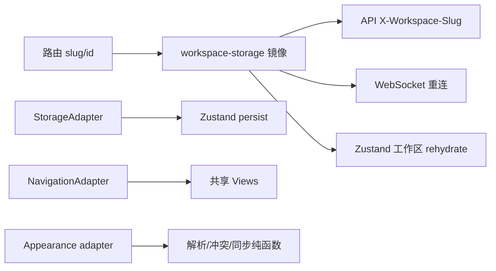

# Core 客户端状态与平台 adapter

活跃贡献者：Naiyuan Qing、Jiayuan Zhang、Bohan Jiang

`packages/core` 同时服务 Next.js Web 与 Electron Desktop，因此客户端状态必须共享，平台能力必须注入。核心原则是：TanStack Query 持有服务端状态，Zustand 只持有客户端/视图状态，平台差异通过小型 adapter 或 provider 穿过边界。

## 状态所有权

| 类型 | 所有者 | 示例 |
| --- | --- | --- |
| 服务端实体与集合 | TanStack Query | 任务、工作区、成员、智能体、收件箱、运行时、聊天消息 |
| 可持久客户端偏好 | Zustand + `StorageAdapter` | 任务视图模式、筛选、列宽、最近访问、快捷键 |
| 可恢复草稿 | Zustand + 工作区命名空间 | 任务草稿、评论草稿、上传占位、Room composer |
| 短期交互状态 | Zustand，不持久化 | 选择、弹窗、展开、当前创建模式 |
| 平台机制 | adapter/Provider | 导航、存储、locale、外观、通知 |
| 当前工作区身份 | URL/路由 | slug 为主，UUID 镜像仅供 key/header/重连 |

认证与工作区 store 是少数允许直接调用 `api.*` 的 store；其他服务端交互应进入 Query/mutation。WebSocket 不得把服务端 payload 镜像到 Zustand。

## Zustand 结构

常用公开 store：

- [`auth/store.ts`](../../packages/core/auth/store.ts)：用户会话、认证状态、token/cookie 模式与外观账号同步；
- [`chat/store.ts`](../../packages/core/chat/store.ts)：聊天窗口几何、草稿和客户端活动会话指针；
- [`issues/stores/index.ts`](../../packages/core/issues/stores/index.ts)：任务筛选、视图、草稿、选择、折叠和最近访问；
- [`modals/store.ts`](../../packages/core/modals/store.ts)：共享业务弹窗；
- [`navigation/store.ts`](../../packages/core/navigation/store.ts)：每个工作区最后访问路径；
- [`inbox/filter-store.ts`](../../packages/core/inbox/filter-store.ts)：收件箱本地筛选；
- [`projects/stores/view-store.ts`](../../packages/core/projects/stores/view-store.ts)、[`agents/stores/view-store.ts`](../../packages/core/agents/stores/view-store.ts) 等领域视图偏好。

### 持久化规则

只持久化能跨重载恢复的偏好、草稿与布局。不要持久化：

- API 返回的服务端实体；
- 每秒变化的运行状态；
- 一次性弹窗或 selection；
- 会在日期翻转后失真的相对日期筛选；
- 需要重新做权限判断的服务端投影。

[`issues/stores/view-store.ts`](../../packages/core/issues/stores/view-store.ts) 展示了完整做法：`partialize` 只保存耐久字段，`agentRunningFilter` 与 `dateFilter` 不持久化；`mergeViewStatePersisted` 验证旧快照形状并补入新默认字段。

### Selector 必须引用稳定

Zustand selector 不得每次创建新数组/对象。评论草稿 store 使用稳定空数组和基于 uploads 引用的 `WeakMap` 派生缓存，见 [`packages/core/issues/stores/comment-draft-store.ts`](../../packages/core/issues/stores/comment-draft-store.ts)。如果必须组合多个字段，使用稳定 helper、浅比较或原子 selector。

## `CoreProvider` 装配

[`CoreProvider`](../../packages/core/platform/core-provider.tsx) 是 Web/Desktop core runtime 的入口。它接收 [`CoreProviderProps`](../../packages/core/platform/types.ts)：

- API 与 WebSocket URL；
- `StorageAdapter`；
- cookie/token 认证模式和登录/退出回调；
- `ClientIdentity`；
- locale、资源与 locale adapter。

它创建 API、认证 store、聊天 store，注册模块级单例，再挂载 Query、认证初始化、WebSocket、i18n 和用量上报。传入参数被视为应用启动配置，只读取一次；运行时不应更换 base URL 或 storage 实例。

## Storage adapter

最小契约位于 [`types/storage.ts`](../../packages/core/types/storage.ts)：

```ts
interface StorageAdapter {
  getItem(key: string): string | null;
  setItem(key: string, value: string): void;
  removeItem(key: string): void;
}
```

相关实现：

| API | 作用 |
| --- | --- |
| [`defaultStorage`](../../packages/core/platform/storage.ts) | SSR-safe 浏览器存储边界；无 `window` 时读 `null`、写入 no-op |
| [`createPersistStorage`](../../packages/core/platform/persist-storage.ts) | 把 `StorageAdapter` 转成 Zustand `StateStorage` |
| [`createWorkspaceAwareStorage`](../../packages/core/platform/workspace-storage.ts) | 动态把 key 变为 `${key}:${slug}` |
| `registerForWorkspaceRehydration` | 工作区切换时让持久化 store 重新 hydrate |
| [`clearWorkspaceStorage`](../../packages/core/platform/storage-cleanup.ts) | 删除/离开工作区后的受控命名空间清理 |

没有活动工作区时，workspace-aware storage 读 `null`、丢弃写入，绝不回退到无命名空间 key；否则草稿和筛选会跨工作区泄漏。

## 当前工作区镜像

[`packages/core/platform/workspace-storage.ts`](../../packages/core/platform/workspace-storage.ts) 保存成对的 `_currentSlug`/`_currentWsId`。路由布局调用：

```ts
setCurrentWorkspace(slug, wsId)
```

slug 变化时，它在 microtask 中：

1. 通知 WebSocket subscriber 重连；
2. 触发所有 workspace-aware Zustand store rehydrate。

同一 slug 的重复调用是 no-op，但允许更新 UUID 镜像。离开工作区上下文必须显式 `setCurrentWorkspace(null, null)`。这只是 URL 真相的同步镜像，不是另一个业务状态源。

## Navigation adapter

导航边界分成两部分，不能混淆：

1. `@multica/core/navigation` 的 [`useNavigationStore`](../../packages/core/navigation/store.ts) 只持久化每个工作区的 `lastPath`，并排除登录、邀请、配对和前置流程。
2. 共享视图真正消费的 `NavigationAdapter` 位于 [`packages/views/navigation/types.ts`](../../packages/views/navigation/types.ts)，由 [`NavigationProvider`](../../packages/views/navigation/context.tsx) 注入。

`NavigationAdapter` 提供 `push`、`replace`、`back`、当前位置、hash、可分享 URL，以及可选的 `openInNewTab`、`prefetch`、`canGoBack`、`forward`。共享组件调用 `useNavigation()` 或 `<AppLink>`，不导入 Next.js/React Router。

平台实现：

- Web：[`apps/web/platform/navigation.tsx`](../../apps/web/platform/navigation.tsx)，映射到 Next.js router、浏览器 history/hash 和 prefetch。
- Desktop：[`apps/desktop/src/renderer/src/platform/navigation.tsx`](../../apps/desktop/src/renderer/src/platform/navigation.tsx)，映射到 tab session、虚拟 history、transition overlay 与跨工作区 `switchWorkspace`。

Desktop 的 `window.location` 是打包后的 `file://` 页面，因此当前 hash 和路径必须来自活动 tab URL；跨工作区导航也必须由 adapter 处理，不能在共享 View 中自己拼路由器调用。

## Appearance adapter

外观的纯领域契约位于 [`appearance/adapter.ts`](../../packages/core/appearance/adapter.ts)。`AppearancePreferenceAdapter` 负责：

- 从不可信本地存储 `load`/`loadForAccount`；
- `persist`/`persistForAccount`；
- 把偏好 `apply` 到平台；
- 报告 system appearance、reduced motion、forced colors、online；
- 订阅系统外观、跨窗口存储、网络和存储错误；
- 声明平台来源与是否支持服务端同步。

核心不信任 adapter 返回值。调用方必须使用 [`parseAppearancePreferences`](../../packages/core/appearance/preferences.ts)，再通过同文件中的 `changeAppearancePreferences`、`reconcileAppearancePreferences`、`undoAppearancePreferences`、`markAppearanceSynced` 等纯函数处理版本、时间戳、冲突和同步状态。

平台实现与协调：

- 浏览器实现：[`packages/views/appearance/browser-appearance-adapter.ts`](../../packages/views/appearance/browser-appearance-adapter.ts)，处理 DOM、`localStorage`、matchMedia、跨标签页和首屏前应用；
- 同步协调：[`packages/views/appearance/appearance-sync-bridge.tsx`](../../packages/views/appearance/appearance-sync-bridge.tsx)，连接 core 算法、账号 API 与 UI theme provider；
- Mobile 实现：[`apps/mobile/lib/appearance-preferences.ts`](../../apps/mobile/lib/appearance-preferences.ts)；
- 跨平台行为契约：[`appearance/conformance.ts`](../../packages/core/appearance/conformance.ts)。



## 新增客户端状态或平台能力

### 新 Zustand store

1. 先确认状态不属于服务端；若来自 API，使用 Query。
2. 将 store 放在对应 `packages/core/<domain>/`，按 `<feature>-store.ts` 命名。
3. 明确哪些字段持久化，使用 `partialize`；默认保持 ephemeral。
4. 工作区相关持久化使用 `createWorkspaceAwareStorage`，并注册 rehydrate。
5. 为旧快照新增字段时提供安全 merge/normalize。
6. selector 返回稳定引用。
7. 从领域入口和 `packages/core/package.json` 公开子路径导出。

### 新平台能力

1. 在 core 或 views 的正确边界定义最小 adapter interface，不引用具体框架。
2. Web 与 Desktop 分别实现；若 Mobile 需要，独立实现并只共享纯契约。
3. 共享逻辑只调用 adapter，不探测 `next/*`、React Router 或 Electron。
4. 为每个平台运行同一 conformance suite；外观 adapter 可直接复用 `defineAppearancePreferenceAdapterConformanceSuite`。

## 常见陷阱

- 把服务端列表放进 Zustand，形成 Query/store 双真相。
- 在 `packages/views` 或 app 目录创建 Web/Desktop 共用 store。
- 持久化运行状态、selection、相对日期或 API payload。
- selector 返回新 `[]`、`{}`、`Map`，导致每次 store touch 都重渲染。
- 未设置工作区时写入裸 key，造成跨工作区草稿泄漏。
- 把 `setCurrentWorkspace` 当作用户可编辑工作区状态，而不是路由镜像。
- 在共享 View 直接用 Next.js、React Router 或 `window.location` 导航。
- 信任 appearance adapter 的 `unknown` 返回值，跳过版本和字段解析。
- 新 adapter 只实现 happy path，没有跨标签页、离线、存储错误和 unsubscribe 测试。

## 测试位置

- [`auth/store.test.ts`](../../packages/core/auth/store.test.ts)
- [`chat/store.test.ts`](../../packages/core/chat/store.test.ts)
- [`navigation/store.test.ts`](../../packages/core/navigation/store.test.ts)
- [`platform/persist-storage.test.ts`](../../packages/core/platform/persist-storage.test.ts)
- [`platform/workspace-storage.test.ts`](../../packages/core/platform/workspace-storage.test.ts)
- [`platform/storage-cleanup.test.ts`](../../packages/core/platform/storage-cleanup.test.ts)
- [`issues/stores/comment-draft-store.test.ts`](../../packages/core/issues/stores/comment-draft-store.test.ts)
- [`issues/stores/view-store-status.test.ts`](../../packages/core/issues/stores/view-store-status.test.ts)
- [`appearance/preferences.test.ts`](../../packages/core/appearance/preferences.test.ts)
- [`appearance/adapter-conformance.test.ts`](../../packages/core/appearance/adapter-conformance.test.ts)
- [`packages/views/appearance/browser-appearance-adapter.test.ts`](../../packages/views/appearance/browser-appearance-adapter.test.ts)

## 相关页面

- [共享核心层](index.md)
- [Query 与 mutation](core-query-and-mutations.md)
- [实时同步](core-realtime.md)
- [前端共享](../how-to-contribute/frontend-sharing.md)
- [模式与约定](../how-to-contribute/patterns-and-conventions.md)
