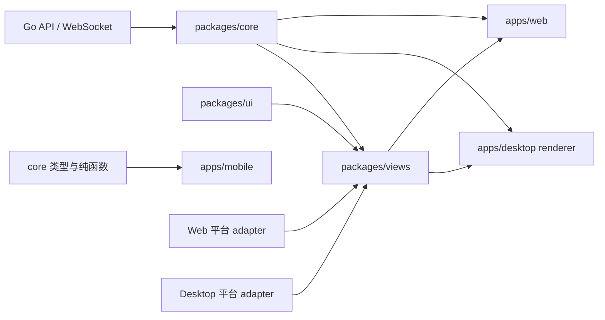
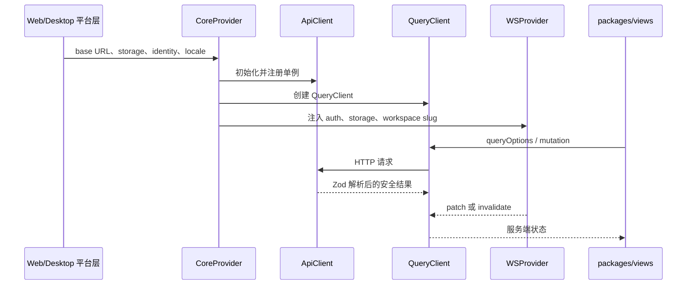

# 共享包

活跃贡献者：Naiyuan Qing、Jiayuan Zhang、Bohan Jiang

本节解释 `packages/` 中的六个 workspace 包，并从共享层的核心 `packages/core` 开始。Core 集中放置类型、API 客户端、Zod 响应边界、TanStack Query 查询与变更、Zustand 客户端状态、平台契约以及 WebSocket 到缓存的同步逻辑；业务页面位于 `packages/views`，原子组件位于 `packages/ui`。Mobile 只复用 Core 中的类型和纯函数，不复用 React Query、Zustand 或实时 Hook。

## 依赖位置



依赖方向固定为 `views -> core + ui`。`core` 与 `ui` 彼此独立，`core` 不得导入 UI 库、`react-dom`、Next.js、React Router 或 Electron API。平台访问应收敛到 adapter 或 `packages/core/platform/` 边界，领域代码不能直接读取 `process.env` 或散落调用 `localStorage`。完整约束见 [`CLAUDE.md`](../../CLAUDE.md#package-boundaries)。

[`packages/core/package.json`](../../packages/core/package.json) 声明的运行时依赖包括 TanStack Query、Zod、Zustand、i18next、PostHog、YAML 与 locale matcher；React 是 peer dependency。共享包导出原始 `.ts`/`.tsx`，由消费应用编译。

## 入口与子路径

根入口 [`packages/core/index.ts`](../../packages/core/index.ts) 很小，只导出：

- `useWorkspaceId`
- `createQueryClient`
- `QueryProvider`

其余能力必须从 [`package.json` 的 `exports`](../../packages/core/package.json) 所声明子路径导入。常用入口如下：

| 子路径 | 关键导出 | 主要实现 |
| --- | --- | --- |
| `@multica/core/api` | `ApiClient`、`ApiError`、`api`、`parseWithFallback`、`WSClient` | [`api/index.ts`](../../packages/core/api/index.ts) |
| `@multica/core/types` | 领域类型与 `StorageAdapter` | [`types/index.ts`](../../packages/core/types/index.ts) |
| `@multica/core/issues` | `issueKeys`、query options、mutation Hooks、cache updater、任务视图 stores | [`issues/index.ts`](../../packages/core/issues/index.ts) |
| `@multica/core/workspace` | `workspaceKeys`、工作区 query/mutation/hooks | [`workspace/index.ts`](../../packages/core/workspace/index.ts) |
| `@multica/core/platform` | `CoreProvider`、存储与工作区镜像 API | [`platform/index.ts`](../../packages/core/platform/index.ts) |
| `@multica/core/realtime` | `WSProvider`、`useWSEvent`、`useRealtimeSync` | [`realtime/index.ts`](../../packages/core/realtime/index.ts) |
| `@multica/core/appearance` | 外观偏好模型、adapter 契约、诊断与同步算法 | [`appearance/index.ts`](../../packages/core/appearance/index.ts) |
| `@multica/core/navigation` | `useNavigationStore`，仅保存最近路径 | [`navigation/index.ts`](../../packages/core/navigation/index.ts) |

领域通常采用同一布局：

```text
packages/core/<domain>/
├── index.ts
├── queries.ts
├── mutations.ts
├── types.ts / schemas.ts / api.ts（按需）
├── *-store.ts（仅客户端状态）
└── *.test.ts(x)
```

并非每个领域都拥有所有文件。包级 `exports` 还允许直接导入 `./issues/queries`、`./workspace/mutations` 等窄入口，避免消费方依赖未公开内部文件。

## 状态所有权

| 数据 | 所有者 | 示例 |
| --- | --- | --- |
| API 服务端状态 | TanStack Query | 任务、成员、智能体、项目、收件箱、聊天会话 |
| 客户端/视图状态 | Zustand | 筛选、草稿、弹窗、选择、最近访问、布局 |
| 平台机制 | adapter 或 Context | 导航、存储、locale、外观、工作区路由上下文 |
| 当前工作区 | URL/路由 | slug 为主；UUID 只作为 Query key 和平台 header 的镜像 |

不要把服务端实体复制进 Zustand。实时事件直接 patch 或 invalidate Query cache；Zustand 只可清理客户端拥有的指针，例如已删除聊天会话的 `activeSessionId`。

## 启动与数据流

[`CoreProvider`](../../packages/core/platform/core-provider.tsx) 在应用启动时完成共享层装配：

1. 创建 `ApiClient`，注入 logger、认证回调和客户端 identity。
2. 通过 `setApiInstance` 注册 API 单例，通过 `setSchemaLogger` 注册 schema 日志。
3. 创建并注册认证、聊天 Zustand store。
4. 挂载 `QueryProvider`、`AuthInitializer`、`WSProvider`、i18n 与客户端用量上报。
5. `WSProvider` 根据 URL 驱动的工作区 slug 建立连接，并把事件交给集中式实时协调器。



## 扩展一个领域

1. 在 `packages/core/types/` 或领域目录定义类型和纯函数。
2. 在 API 边界为 UI 消费的响应增加 Zod schema、语义明确的 fallback 与 malformed-response 测试。
3. 在 `<domain>/queries.ts` 增加包含 `wsId` 的 key factory 和 `queryOptions`。
4. 在 `<domain>/mutations.ts` 决定使用服务端确认、精确 optimistic patch，还是只在完成后 invalidate。
5. 若有客户端状态，再增加 Zustand store；不要把 Query 数据搬进去。
6. 若服务端会广播变化，在集中式 realtime 中接入 patch/invalidate，并覆盖重放、乱序或重连场景。
7. 从领域 `index.ts` 和 [`package.json`](../../packages/core/package.json) 的公开子路径导出。
8. 在 `packages/views` 组合业务 UI，在 Web 与 Desktop 平台层完成 wiring。

## 常见陷阱

- 从 `@multica/core` 根入口猜测所有导出；大多数能力只存在于显式子路径。
- 在 `packages/views` 新建 store，或把 Query 服务端状态镜像进 Zustand。
- 工作区 Query key 缺少 `wsId`，导致同名实体跨工作区串缓存。
- 直接把网络 JSON `as T`，绕过 schema 和兼容 fallback。
- 在 optimistic 写入期间立即 refetch，旧服务端快照会覆盖本地 patch。
- 在 `core` 里导入平台路由或 UI 库，而不是定义/消费 adapter。
- 忘记更新 `packages/core/package.json` 的 `exports`，导致源码存在但消费应用无法通过包子路径导入。

## 测试与验证

测试与实现同目录，包脚本见 [`packages/core/package.json`](../../packages/core/package.json)：

```bash
pnpm -C packages/core test
pnpm -C packages/core typecheck
pnpm -C packages/core lint
```

纯逻辑测试应使用 node 环境；只有 Hook、Provider 或 DOM 行为才需要 `.test.tsx`/jsdom。重点测试入口包括 [`api/schema.test.ts`](../../packages/core/api/schema.test.ts)、[`issues/mutations.test.tsx`](../../packages/core/issues/mutations.test.tsx)、[`platform/workspace-storage.test.ts`](../../packages/core/platform/workspace-storage.test.ts) 与 [`realtime/use-realtime-sync.test.ts`](../../packages/core/realtime/use-realtime-sync.test.ts)。

## 相关页面

- [API 客户端与响应 schema](core-api-and-schema.md)
- [Query 与 mutation](core-query-and-mutations.md)
- [客户端状态与平台 adapter](core-state-and-platform.md)
- [实时同步](core-realtime.md)
- [系统架构](../overview/architecture.md)
- [前端共享](../how-to-contribute/frontend-sharing.md)
- [测试指南](../how-to-contribute/testing.md)
