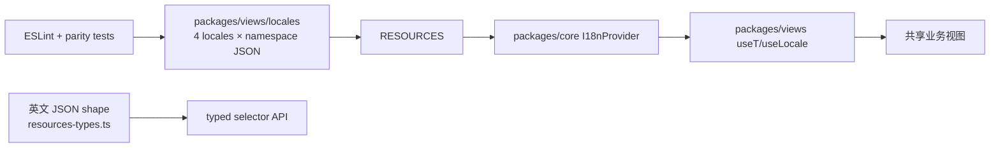

# 本地化与中文内容

活跃贡献者：Bohan Jiang、Jiayuan Zhang、Naiyuan Qing

Multica 的 Web/Desktop 本地化资源集中在 [`packages/views/locales/`](../../packages/views/locales/)，代码命名、翻译术语和中文产品语气的唯一权威来源是 [`apps/docs/content/docs/developers/conventions.zh.mdx`](../../apps/docs/content/docs/developers/conventions.zh.mdx)。本页说明实现路径；若本页与规范源冲突，以规范源为准。

## 运行时结构

当前支持 `en`、`zh-Hans`、`ko`、`ja`，定义见 [`packages/core/i18n/types.ts`](../../packages/core/i18n/types.ts)。英文是默认和 fallback locale。



[`locales/index.ts`](../../packages/views/locales/index.ts) 是资源 bundle 的单一装配点，Web 与 Desktop 都从这里加载。当前每种语言包含 30 个 namespace，包括 `common`、`auth`、`settings`、`issues`、`agents`、`editor`、`onboarding`、`invite`、`labels`、`members`、`my-issues`、`search`、`inbox`、`workspace`、`projects`、`autopilots`、`skills`、`chat`、`modals`、`runtimes`、`layout`、`usage`、`ui`、`squads`、`billing`、`twins`、`wiki`、`rooms`、`office` 和 `skill-evolution`。

组件从 [`packages/views/i18n`](../../packages/views/i18n/index.ts) 使用：

```ts
const { t } = useT("issues");
const title = t(($) => $.detail.title);
```

[`packages/views/i18n/resources-types.ts`](../../packages/views/i18n/resources-types.ts) 从英文 JSON 推导 selector 类型并通过 i18next module augmentation 向整个 monorepo 提供 key 自动补全。`ui` namespace 由 [`packages/ui/types/i18next.ts`](../../packages/ui/types/i18next.ts) 单独参与 declaration merging，使 `packages/ui` 不必反向依赖 `packages/views`。

日期、月份和相对时间不能直接使用 `navigator.language`。[`useLocale`](../../packages/views/i18n/use-locale.ts) 返回 i18next 实际渲染的语言，保证中文 UI 不混入英文日期。

## 中文术语

完整术语表见 [`apps/docs/content/docs/developers/conventions.zh.mdx`](../../apps/docs/content/docs/developers/conventions.zh.mdx)。最容易写错的边界如下：

| 英文概念 | 简体中文 |
| --- | --- |
| Issue（提交的一件工作） | **任务** |
| Task（智能体一次执行） | **task**，保留英文以与任务区分 |
| Agent | **智能体** |
| Workspace | **工作区** |
| Project | **项目** |
| Autopilot | **自动化** |
| Runtime | **运行时** |
| Daemon | **守护进程** |
| Skill | **skill**，正文保留小写英文 |
| Inbox / Member / Label | **收件箱 / 成员 / 标签** |

不要因为数据库/API 使用 `issue` 就在中文 UI 保留 “Issue”。代码、命令、API 与 DB 字段仍保持 `issue` / `task` / `skill`，例如 `issue_status`、`task_id`、`multica issue ...`。表示运行时“异常”的普通英文 `issues` 也不能误译为任务。

角色 `owner` / `admin` / `member`，以及 schema 状态 `backlog` / `todo` / `in_progress` / `in_review` / `done` / `blocked` / `cancelled` 在中文 UI 中保持小写英文。品牌名和 API、CLI、URL、SDK、OAuth、JSON 等缩写不翻译。

## 中文产品语气

- 使用全角中文标点 `，。：；！？`；引号使用与英文源一致的直双引号 `"..."`。
- 省略号使用三个点 `...`，不要用单字符 `…`。
- 中文与保留的英文词、品牌、缩写之间加一个半角空格，例如“配置 MCP 服务”“添加一个 skill”。
- 文案简短直接，避免“对于 X 来说”“作为 X”“我们的”等翻译腔。
- 错误信息温和但明确，如“无法保存修改”；不要堆叹号。
- 按钮以动词开头，通常 2–4 字；tooltip 使用完整短句；placeholder 给出示例性提示。
- 代码注释一律英文，中文规范只约束面向用户和文档的文字。

术语表未覆盖时，依次参考：

1. [`apps/docs/content/docs/*.zh.mdx`](../../apps/docs/content/docs/) 的既有中文语气；
2. [`zh-Hans/auth.json`](../../packages/views/locales/zh-Hans/auth.json) 与 [`zh-Hans/editor.json`](../../packages/views/locales/zh-Hans/editor.json) 的资源结构；
3. [`auth/login-page.tsx`](../../packages/views/auth/login-page.tsx) 的 selector 调用；
4. [`packages/views/settings/components/preferences-tab.tsx`](../../packages/views/settings/components/preferences-tab.tsx) 的语言切换实现。

## 新增或修改文案

### 修改现有 key

1. 在对应 namespace 的英文 JSON 确认语义和插值变量。
2. 同步修改 `zh-Hans`、`ko`、`ja`；不要依赖英文 fallback 掩盖缺失翻译。
3. JSX 文本、`placeholder`、`title`、`aria-label` 与 toast 都通过 `useT()`。
4. 插值使用 `{{var}}`；中文可调整变量位置以符合语序。
5. 英文复数使用 `_one` / `_other`；中文、日文、韩文没有 `one` 类别，只写 `_other`。

翻译 key 推荐三层语义：`feature.component.action`。共享文案位于 namespace 顶层，Web-only 放 `web` 段，Desktop-only 放 `desktop` 段；[`auth.json`](../../packages/views/locales/en/auth.json) 的 `web` 段是参考。

### 新增 namespace

1. 在 `en`、`zh-Hans`、`ko`、`ja` 四个目录各新增同名 JSON。
2. 在 [`locales/index.ts`](../../packages/views/locales/index.ts) 导入并登记每个 locale 的资源。
3. 在 [`packages/views/i18n/resources-types.ts`](../../packages/views/i18n/resources-types.ts) 导入英文 shape 并扩展 `I18nResources`。
4. 如果 namespace 由另一独立包拥有，使用 declaration merging，不能通过反向包依赖取得类型。
5. 运行 parity、typecheck 和 lint。

### 修改术语规则

术语契约只在 [`apps/docs/content/docs/developers/conventions.zh.mdx`](../../apps/docs/content/docs/developers/conventions.zh.mdx) 修改。更改规则时还要同步相关 locale JSON、根 [`CLAUDE.md`](../../CLAUDE.md) 或文档，并在变更说明中列出需要检查的下游范围；其他 Wiki 页面不能覆盖该契约。

## 自动防线与测试

[`packages/views/eslint.config.mjs`](../../packages/views/eslint.config.mjs) 启用两层保护：

- `i18next/no-literal-string` 阻止生产 `.tsx` 中未经翻译的 JSX 文本；
- [`packages/views/eslint-i18n-guard.mjs`](../../packages/views/eslint-i18n-guard.mjs) 额外拦截 `placeholder` / `title` / `aria-label` 和 toast 中的英文字面量，包括 template 与 fallback 分支。

技术值、URL 或 CLI 命令确实需要字面量时，使用带理由的局部 eslint disable，不能扩大整文件豁免。

[`locales/parity.test.ts`](../../packages/views/locales/parity.test.ts) 会：

- 从磁盘发现 JSON namespace，防止文件存在却漏登 `RESOURCES`；
- 双向比较英文与每种翻译的 key；
- 归一化英文 `_one` / `_other` 与无单复数语言的 `_other`；
- 禁止 zh-Hans/ja/ko 留下永远不会被 i18next 使用的 `_one`。

推荐验证：

```bash
pnpm --filter @multica/views exec vitest run locales/parity.test.ts
pnpm --filter @multica/views exec vitest run eslint-i18n-guard.test.ts
pnpm --filter @multica/views typecheck
pnpm --filter @multica/views lint
```

组件测试使用 [`renderWithI18n`](../../packages/views/test/i18n.tsx)，它挂载生产 `RESOURCES`，默认英文，也可指定 `locale: "zh-Hans"`。不要在每个测试手写容易漏 namespace 的资源切片。

## 常见陷阱

- 只加英文 key，让生产环境靠 fallback 显示英文；parity test 应阻止这种漂移。
- 在可见 JSX、accessible name 或 toast 中留下字面量，尤其是错误 fallback。
- 把 Issue 与 task 都译成“任务”，使提交单元和执行 run 无法区分。
- 把 skill、角色名或 schema 状态擅自汉化，导致 UI 与命令/API 无法对照。
- 中文仍保留无必要的英文产品名词，如 `workspace`、`agent`、`project`。
- 使用 `navigator.language` 格式化日期，造成用户选择中文后月份仍为英文。
- 给 zh-Hans/ja/ko 添加 `_one`，或修改 JSON 后忘记 `RESOURCES` / 类型 augmentation。
- 只翻视觉文本，漏掉屏幕阅读器读取的 `aria-label`。
- 把中文注释放进 TypeScript/Go 源码；代码注释必须使用英文。

## 相关页面

- [共享业务视图](views-business-ui.md)
- [UI 原语与设计令牌](ui-primitives.md)
- [其他工作区工具包](other-workspace-packages.md)
- [术语表](../overview/glossary.md)
- [模式与约定](../how-to-contribute/patterns-and-conventions.md)
- [中文开发规范（权威来源）](../../apps/docs/content/docs/developers/conventions.zh.mdx)
