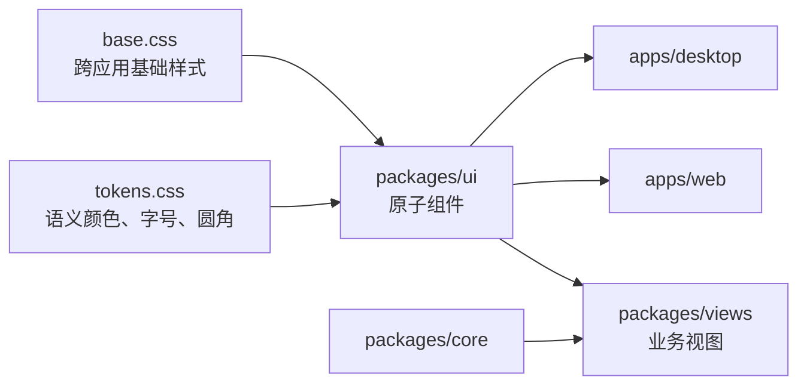

# UI 原语与设计令牌

活跃贡献者：Naiyuan Qing、Jiayuan Zhang、Bohan Jiang

`@multica/ui` 是 Web 与 Desktop 共用的最底层视觉包。它提供原子组件、少量无业务语义的组合件、Markdown 渲染基础、Hook、工具函数和全局样式；不读取 Multica 领域实体，也不能导入 `@multica/core`。业务页面应位于 [`packages/views`](views-business-ui.md)，无头状态与 API 逻辑应位于 `packages/core`。



## 包结构与公开入口

公开子路径以 [`packages/ui/package.json`](../../packages/ui/package.json) 的 `exports` 为准，消费方直接编译原始 `.ts` / `.tsx`：

| 目录或入口 | 职责 | 示例 |
| --- | --- | --- |
| `components/ui/` | Base UI / shadcn 风格原语，无领域词汇 | [`button.tsx`](../../packages/ui/components/ui/button.tsx)、[`packages/ui/components/ui/dialog.tsx`](../../packages/ui/components/ui/dialog.tsx)、[`packages/ui/components/ui/data-table.tsx`](../../packages/ui/components/ui/data-table.tsx)、[`packages/ui/components/ui/sidebar.tsx`](../../packages/ui/components/ui/sidebar.tsx) |
| `components/common/` | 仍然无业务归属、但比单一原语稍高一层的复用件 | [`packages/ui/components/common/error-boundary.tsx`](../../packages/ui/components/common/error-boundary.tsx)、[`packages/ui/components/common/submit-button.tsx`](../../packages/ui/components/common/submit-button.tsx)、[`theme-provider.tsx`](../../packages/ui/components/common/theme-provider.tsx) |
| `markdown/` | 安全 Markdown、流式渲染、代码块、链接化与 mention 解析基础 | [`index.ts`](../../packages/ui/markdown/index.ts)、[`packages/ui/markdown/sanitize.ts`](../../packages/ui/markdown/sanitize.ts) |
| `hooks/` | 纯 UI Hook | [`packages/ui/hooks/use-mobile.ts`](../../packages/ui/hooks/use-mobile.ts)、[`packages/ui/hooks/use-scroll-fade.ts`](../../packages/ui/hooks/use-scroll-fade.ts) |
| `lib/` | class 合并、头像尺寸、表格、剪贴板、动效等工具 | [`utils.ts`](../../packages/ui/lib/utils.ts)、[`motion.ts`](../../packages/ui/lib/motion.ts) |
| `styles/` | 语义令牌、基础样式与自动审计 | [`packages/ui/styles/tokens.css`](../../packages/ui/styles/tokens.css)、[`packages/ui/styles/base.css`](../../packages/ui/styles/base.css) |

`components/ui/` 已覆盖按钮、输入框、选择器、复选框、单选框、开关、标签页、菜单、弹窗、Sheet、Tooltip、Popover、表格、数据表、日历、图表、进度、空状态、骨架屏和可调整面板等常见原语。新增前先查现有目录，避免平行实现。

## 零业务逻辑边界

[`CLAUDE.md`](../../CLAUDE.md) 将以下约束定义为硬边界：

- `packages/ui` 不导入 `@multica/core`，也不持有任务、智能体、工作区、权限或 API 等业务逻辑。
- 原语接收已准备好的 `children`、label、回调和状态；平台检测、翻译选择、Query/mutation 等由调用方完成。比如 [`SubmitButton`](../../packages/ui/components/common/submit-button.tsx) 接收 tooltip 和 accessible name，而不自行读取平台快捷键或业务文案。
- `packages/ui` 不能反向依赖 `packages/views`。依赖方向只能是 `views -> ui`。
- Web 与 Desktop 完全相同的原语放这里；带领域语义的页面、表单、弹窗和组合件放 `packages/views/<domain>/`。

主题和可访问性基础设施不是业务逻辑。[`ThemeProvider`](../../packages/ui/components/common/theme-provider.tsx) 组合 `next-themes`、`SkinProvider` 与 `TooltipProvider`，管理 `tension`、`relay`、`field` 三种皮肤及浅色、深色、跟随系统三种外观；它没有导入 Next.js API。

## 设计令牌与共享样式

[`packages/ui/styles/tokens.css`](../../packages/ui/styles/tokens.css) 是 Web/Desktop 的视觉实现源，核心层的 [`packages/core/constants/semantic-token-schema.ts`](../../packages/core/constants/semantic-token-schema.ts) 则定义跨平台角色和对比度契约。

### 语义颜色

组件只使用语义类或变量，例如 `bg-background`、`bg-surface`、`text-foreground`、`text-muted-foreground`、`border-border`、`text-destructive`。令牌覆盖：

- app shell、page canvas、surface、raised/hover/selected surface；
- foreground、muted/faint/disabled foreground；
- primary、brand、destructive、success、warning、info；
- sidebar、focus ring、control border、code/editor、platform chrome；
- 任务状态色与五组 chart 色。

浅色/深色模式先定义基础值，`relay` 与 `field` 再只覆盖需要改变的语义角色。产品组件不能根据皮肤名分支，也不能引入硬编码产品色。第三方品牌色、用户自定义标签色等少数许可集中在 [`packages/ui/styles/raw-color-policy.mjs`](../../packages/ui/styles/raw-color-policy.mjs)。

### 角色字号

产品 UI 只能使用 [`packages/ui/styles/tokens.css`](../../packages/ui/styles/tokens.css) 的角色字号：

`text-micro`、`text-caption`、`text-label`、`text-body`、`text-body-lg`、`text-title-sm`、`text-title`、`text-title-lg`、`text-display-sm`、`text-display`。

角色名描述用途而不是大小。不要新增 Tailwind 默认的 `text-sm` / `text-base` 层级，也不要用任意像素值填补层级。

### 基础样式

[`packages/ui/styles/base.css`](../../packages/ui/styles/base.css) 集中处理：

- 滚动条、Shiki 双主题、Sonner、侧栏与 resize/drag 状态；
- onboarding、聊天、导航进度和主题切换动效；
- `prefers-reduced-motion` 降级；
- Windows `forced-colors` 高对比模式；
- CJK 换行、`text-autospace`、字体合成和 iOS 输入框防缩放；
- View Transition API 的主题揭示动画。

Desktop 在 [`globals.css`](../../apps/desktop/src/renderer/src/globals.css) 中直接导入 `packages/ui/styles/tokens.css` 和 `packages/ui/styles/base.css`；Web 在 [`app/globals.css`](../../apps/web/app/globals.css) 中导入同一对文件，Web 专属补丁保留在 [`apps/web/app/custom.css`](../../apps/web/app/custom.css)。

## 修改入口

### 新增或调整原语

1. 优先执行 `pnpm ui:add <component>`，让 shadcn/Base UI 源码进入 [`components/ui/`](../../packages/ui/components/ui/)。
2. 使用 ReUI 时执行 `pnpm ui:add @reui/<name>`，对覆盖提示全部回答 `n`；registry 配置见 [`components.json`](../../packages/ui/components.json)。不得把 `REUI_LICENSE_KEY` 写入仓库。
3. 将 vendored 源码改写为本仓库的语义 token、角色字号、可访问状态和导入路径。
4. 如果它已经包含任务、智能体等业务语义，移动到 `packages/views/<domain>/`，不要继续扩张 UI 原语。
5. 新公开 helper 需同步修改 [`package.json`](../../packages/ui/package.json) 的 `exports`；现有 `components/ui/*` 和 `components/common/*` 已使用通配子路径。

### 修改令牌

按照 [`packages/ui/styles/TOKEN_CONTRACT.md`](../../packages/ui/styles/TOKEN_CONTRACT.md) 同步：

1. 更新跨平台语义 schema、CSS role mapping 和 Mobile mapping。
2. 在 `:root` 定义角色，只在深色模式或特定皮肤确有语义差异时覆盖。
3. 仅在产品代码需要 Tailwind utility 时添加 `@theme inline` 映射。
4. 角色改名、删除或语义变化时评估并递增契约版本，协调迁移所有平台。

## 测试与验证

`@multica/ui` 当前的 `test` 脚本重点验证样式契约：

```bash
pnpm --filter @multica/ui test
pnpm --filter @multica/ui check:tokens
pnpm --filter @multica/ui typecheck
pnpm --filter @multica/ui lint
```

[`packages/ui/styles/token-contract.test.mjs`](../../packages/ui/styles/token-contract.test.mjs) 与 [`packages/ui/styles/check-token-contract.mjs`](../../packages/ui/styles/check-token-contract.mjs) 会检查令牌缺失、引用环、对比度、状态色冲突、硬编码颜色债务、按皮肤分支以及 reduced-motion / forced-colors guard。涉及共享业务组合件的交互测试通常与组件同域放在 `packages/views/*.test.tsx`，不要在 Web 与 Desktop app 层重复测同一共享行为。

## 常见陷阱

- 把“多个页面都会用”误当作“无业务语义”。只要组件理解任务、智能体或权限，它就属于 `packages/views`。
- 为单个状态写 `#hex`、`rgb()` 或任意 Tailwind 色，而不是补充/复用语义角色。
- 使用默认字号或任意字号，导致角色字号再次漂移。
- 选中行 hover 后退化成普通 hover。选中态必须在 hover 时仍通过字重、文字色或显式 compound selector 可识别。
- 忽略长文本、滚动容器、键盘焦点、loading/error/empty/disabled 状态及 200% 缩放。
- 直接覆盖 ReUI 已有本地修改，或把 registry license key 写入配置文件。
- 只改 Web 全局 CSS，造成 Desktop 视觉分叉；真正共享的规则应回到 `packages/ui/styles/`。

## 相关页面

- [共享业务视图](views-business-ui.md)
- [本地化与中文内容](localization-and-content.md)
- [其他工作区工具包](other-workspace-packages.md)
- [系统架构](../overview/architecture.md)
- [模式与约定](../how-to-contribute/patterns-and-conventions.md)
- [Tension Map 设计系统](../../DESIGN.md)
