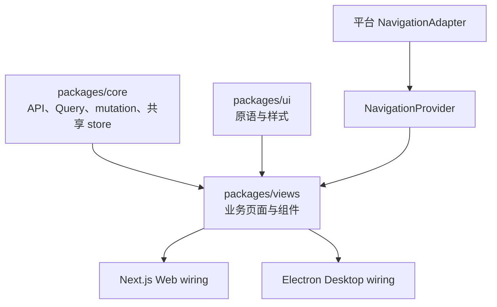

# 共享业务视图

活跃贡献者：Naiyuan Qing、Bohan Jiang、Jiayuan Zhang

`@multica/views` 是 Web 与 Desktop 的共享业务 UI 层。它把 [`@multica/core`](../../packages/core/package.json) 的查询、mutation、类型与客户端状态，组合成可直接挂载的页面、弹窗、编辑器和领域组件，再用 [`@multica/ui`](ui-primitives.md) 的原语完成呈现。Mobile 不消费这些 React 页面，而是保持独立 UI 与数据层。



## 业务域地图

[`packages/views/package.json`](../../packages/views/package.json) 的 `exports` 是公开入口，目录则按业务域组织：

| 分组 | 目录 | 主要职责 |
| --- | --- | --- |
| 工作管理 | [`issues/`](../../packages/views/issues/)、[`my-issues/`](../../packages/views/my-issues/)、[`projects/`](../../packages/views/projects/)、[`autopilots/`](../../packages/views/autopilots/)、[`inbox/`](../../packages/views/inbox/) | 任务列表/看板/表格/详情、项目、自动化、个人任务和注意力队列 |
| 智能体执行 | [`agents/`](../../packages/views/agents/)、[`runtimes/`](../../packages/views/runtimes/)、[`skills/`](../../packages/views/skills/)、[`squads/`](../../packages/views/squads/)、[`task-run-reviews/`](../../packages/views/task-run-reviews/) | 智能体创建与配置、运行时机器、skill、Squad 和 task 复盘 |
| 协作与知识 | [`chat/`](../../packages/views/chat/)、[`rooms/`](../../packages/views/rooms/)、[`office/`](../../packages/views/office/)、[`wiki/`](../../packages/views/wiki/)、[`twins/`](../../packages/views/twins/)、[`skill-evolution/`](../../packages/views/skill-evolution/) | 对话、Room、Office 场景、Wiki、Twin 与 skill 演进 |
| 账户与工作区 | [`auth/`](../../packages/views/auth/)、[`onboarding/`](../../packages/views/onboarding/)、[`workspace/`](../../packages/views/workspace/)、[`members/`](../../packages/views/members/)、[`invite/`](../../packages/views/invite/)、[`invitations/`](../../packages/views/invitations/)、[`settings/`](../../packages/views/settings/)、[`billing/`](../../packages/views/billing/) | 登录、上手引导、工作区生命周期、成员/邀请、设置和账单 |
| 集成 | [`plugins/`](../../packages/views/plugins/)、[`slack/`](../../packages/views/slack/)、[`lark/`](../../packages/views/lark/)、[`dingtalk/`](../../packages/views/dingtalk/)、[`wecom/`](../../packages/views/wecom/)、[`telegram/`](../../packages/views/telegram/) | 插件 surface/审批与渠道绑定 |
| 共享支撑 | [`layout/`](../../packages/views/layout/)、[`navigation/`](../../packages/views/navigation/)、[`appearance/`](../../packages/views/appearance/)、[`editor/`](../../packages/views/editor/)、[`rich-content/`](../../packages/views/rich-content/)、[`attachments/`](../../packages/views/attachments/)、[`modals/`](../../packages/views/modals/)、[`common/`](../../packages/views/common/)、[`i18n/`](../../packages/views/i18n/)、[`locales/`](../../packages/views/locales/) | Shell、导航协议、富文本、附件、弹窗、翻译和跨域组合件 |

包按子路径导出，而不是提供一个巨型 barrel。新增对外页面时，在本域 `index.ts` 汇总，再显式加入 [`package.json`](../../packages/views/package.json)；平台 app 不应越过公开入口深挖内部文件。

## 导航抽象

共享视图严禁直接导入 `next/*` 或 `react-router-dom`。平台差异收敛到 [`NavigationAdapter`](../../packages/views/navigation/types.ts)：

- 必需能力：`push`、`replace`、`back`、当前 `pathname` / `searchParams` / `hash`、`getShareableUrl`；
- 可选能力：Desktop 新标签页 `openInNewTab`、Web route `prefetch`、`canGoBack`、`forward`；
- 读取完整当前位置时使用 `currentPath()`，不要在各处自行拼 pathname、query 与 fragment。

Web 在 [`apps/web/platform/navigation.tsx`](../../apps/web/platform/navigation.tsx) 用 Next Router 实现 adapter；Desktop 在 [`apps/desktop/src/renderer/src/platform/navigation.tsx`](../../apps/desktop/src/renderer/src/platform/navigation.tsx) 把同一调用映射为 session tab、跨工作区切换或 `WindowOverlay`。平台把 adapter 注入 [`NavigationProvider`](../../packages/views/navigation/context.tsx)，业务组件只调用 `useNavigation()`。

### `AppLink`

内部链接优先使用 [`AppLink`](../../packages/views/navigation/app-link.tsx)，而不是把 `onClick={() => push(...)}` 绑到任意元素。它保留真实 `<a>` 的键盘与浏览器语义，同时统一：

- 普通点击的应用内 `push`；
- Web 的原生 modifier/middle-click，新窗口及 `target="_blank"`；
- Desktop 的前景/背景 app tab；
- Desktop `file://` 环境中的可分享 URL；
- hover/focus 预取和调用方 `preventDefault()` 取消入口。

表格行等复杂点击面使用 [`packages/views/navigation/use-row-link.ts`](../../packages/views/navigation/use-row-link.ts)，不要重复实现 modifier-key 判定。

## Provider、guard 与平台组合

共享 Context 只用于平台 plumbing 或局部组合，不用来复制服务端状态。

- [`NavigationProvider`](../../packages/views/navigation/context.tsx) 注入 adapter，并统一 `startTransition` 与页面内内容切换的 pending 信号。
- [`DashboardGuard`](../../packages/views/layout/dashboard-guard.tsx) 组合 [`useDashboardGuard`](../../packages/views/layout/use-dashboard-guard.ts)：等待认证与工作区列表，未登录时跳转 `/login`，slug 无法解析时选择登录后的安全目的地；它只负责 gate，不拥有平台 shell。
- [`WorkspaceLoader`](../../packages/views/layout/workspace-loader.tsx) 是切工作区时替代 dashboard 的完整 gate，不是覆盖在旧工作区内容上的 overlay。
- [`DashboardLayout`](../../packages/views/layout/dashboard-layout.tsx)、[`AppSidebar`](../../packages/views/layout/app-sidebar.tsx) 和 [`GlobalShortcuts`](../../packages/views/layout/global-shortcuts.tsx) 提供 Web/Desktop 共用 shell 能力，平台仍负责最外层路由和窗口结构。
- 富文本滚动根等只服务局部树的 Context 留在对应域，例如 [`rich-content/scroll-root.tsx`](../../packages/views/rich-content/scroll-root.tsx)。

`WorkspaceIdProvider` 已从 dashboard guard 移除；当前工作区从 URL slug 解析。需要工作区的 Hook 应优先显式接收 `wsId`，除非能够保证始终位于相应 provider 下。

## 包边界与状态所有权

权威规则见 [`CLAUDE.md`](../../CLAUDE.md)：

- 禁止 `next/*` 与 `react-router-dom`；相关 wiring 只在 Web/Desktop 平台目录。
- 禁止依赖 app 内部 store。共享 Zustand store 的实现和持久化必须位于 `packages/core`；视图通过 core 提供的 selector/Hook 消费状态。
- 服务端数据由 TanStack Query 管理；视图不能把 API 实体镜像进本地 Zustand。
- React Context 只承载导航、局部选择面和 provider wiring，不建立第二份工作区、任务或成员事实。
- `packages/views` 可以依赖 `@multica/core` 与 `@multica/ui`，反向依赖不允许。

仓库仍可见历史性局部 store 文件或对 core store 的深层导入，例如 [`search/search-store.ts`](../../packages/views/search/search-store.ts)。它们不是新增 store 的先例；新共享状态应进入 `packages/core`，新代码也不应依赖 Web/Desktop app 的 store。

## 修改入口

新增 Web/Desktop 共用页面时：

1. 把 API schema、Query、mutation、纯状态转换和共享 Zustand 放在 `packages/core/<domain>/`。
2. 把页面和业务组件放在 `packages/views/<domain>/`，复用 `@multica/ui` 原语。
3. 导航调用 `useNavigation()` / `AppLink`，平台能力通过 props、slot 或 adapter 注入。
4. 在本域 `index.ts` 和 [`packages/views/package.json`](../../packages/views/package.json) 暴露稳定入口。
5. 在 Web App Router 和 Desktop router/session wiring 两端接入；Desktop 前工作区一次性流程应注册 `WindowOverlay`，而不是添加普通 route。
6. 用户可见文案同时更新所有 locale，并遵循[本地化与中文内容](localization-and-content.md)。
7. 全窗口 Desktop 页面若不在 dashboard shell 内，第一项挂载 [`DragStrip`](../../packages/views/platform/drag-strip.tsx)。

共享页面还要按可调整大小的 Desktop 窗口验证窄屏，而不是把 `packages/views` 当成只服务宽浏览器。以 [`packages/views/rooms/`](../../packages/views/rooms/) 为例，`lg` 以下的列表/详情切换、44px 触控目标和短视口对话框由共享组件负责；设置中的 skin 网格则用 [`packages/views/settings/components/preferences-tab.tsx`](../../packages/views/settings/components/preferences-tab.tsx) 的 `pe-chat-launcher` 为窄屏浮动聊天入口预留空间。

## 测试

`packages/views` 使用 Vitest + jsdom，配置见 [`vitest.config.ts`](../../packages/views/vitest.config.ts)：

```bash
pnpm --filter @multica/views test
pnpm --filter @multica/views typecheck
pnpm --filter @multica/views lint
```

规则：

- 页面、表单、弹窗和共享交互的测试与源码同域，命名 `*.test.ts(x)`。
- 不需要 DOM 的纯逻辑测试首行添加 `// @vitest-environment node`；不要给依赖 `window`/`document` 分支的测试错误套用 node 环境。
- 测试共享视图时使用真实 [`NavigationProvider`](../../packages/views/navigation/context.tsx) 或最小 adapter，不 mock `next/*` / `react-router-dom`。参考 [`packages/views/navigation/app-link.test.tsx`](../../packages/views/navigation/app-link.test.tsx)。
- 统一 i18n wrapper 是 [`renderWithI18n`](../../packages/views/test/i18n.tsx)。
- core store mock 必须保持 Zustand callable-store 形状：selector 函数加 `getState`；API 调用 mock `@multica/core/api`。
- 纯 helper 的边界矩阵只测一次；组件层保留 happy path、wiring、可访问性和命名回归，不把同一矩阵重新跑一遍 DOM。

## 常见陷阱

- 在共享页面里导入 `next/navigation` 或 `react-router-dom`，导致另一平台无法编译。
- 用 `<div onClick>` 替代 `AppLink`，丢失 middle-click、modifier、键盘、分享链接和 Desktop tab 语义。
- 在 `packages/views` 新建 Zustand store，或把 Query 数据复制进 Context/store。
- 只接 Web route，忘记 Desktop；或把 Desktop transition flow 错建成 session route。
- 让共享 Hook 隐式读取当前工作区，导致它在 provider 外或切换期间取错 workspace。
- 在 app 层重复测试共享组件，形成两套相互漂移的断言。
- 直接深导入未公开文件，使后续域内重构变成跨应用破坏性变更。
- 在 Desktop 顶部 48px 放交互控件却没有 `no-drag`，或全窗口视图漏掉 `DragStrip`。

## 相关页面

- [UI 原语与设计令牌](ui-primitives.md)
- [本地化与中文内容](localization-and-content.md)
- [其他工作区工具包](other-workspace-packages.md)
- [系统架构](../overview/architecture.md)
- [模式与约定](../how-to-contribute/patterns-and-conventions.md)
- [术语表](../overview/glossary.md)
