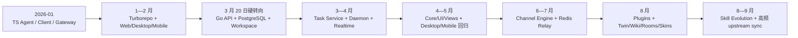

# 架构演进

当前架构不是从最初目录自然长大，而是经历过一次替换式产品转向、两次共享层重建和多个运行边界的逐层加固。本页用“首次出现—主要变迁—当前形态”的方式追踪关键子系统。

## 架构世代



## 从“智能体框架”到“智能体作为受派主体”

根提交的中心是 TypeScript `src/agent`、`src/client` 和 `src/gateway`。到 2 月，仓库已经包含多客户端和丰富的本地智能体能力，但领域仍围绕原始 agent framework。

[d4f5c5b1](https://github.com/oldwinter/multica/commit/d4f5c5b16fdb75b223b5e77a9948843bd8436554) 的提交说明直接写明“Replace the agent framework codebase”。它同时：

- 建立 `server/` Go 后端、Chi REST、gorilla/websocket、sqlc 和 PostgreSQL；
- 引入 workspace、issue、agent、inbox 等协作实体；
- 把智能体变成与人并列的任务受派主体；
- 删除当时的 Desktop、Mobile、Gateway、旧 `packages/core` 和旧 agent-framework 代码。

因此 3 月 20 日是架构断代点，而不是一次目录移动。当前产品模型可在[代码库概览](../overview/index.md)查看。

## task 执行与守护进程

| 阶段 | 变化 | 证据 |
| --- | --- | --- |
| 03-23 | service 层持有 task 生命周期，守护进程通过 REST 领取与回报 | [5a3a72c4](https://github.com/oldwinter/multica/commit/5a3a72c4110f1512570e45c5295623f11bb8b136) |
| 03-24 | daemon 从独立入口提取为 `internal/daemon`，统一进 Cobra CLI | [707b5ac6](https://github.com/oldwinter/multica/commit/707b5ac6e759e4f1819d1961bd997ecfb085e06c) |
| 03-25 | 每 task 独立执行环境 | [678266ec](https://github.com/oldwinter/multica/commit/678266ec87da8dd01adabb356b9395eb27de36b2) |
| 03-29 | 合并队列、生命周期护栏、同 agent/issue 工作目录复用、bare repo cache | [b112d1f1](https://github.com/oldwinter/multica/commit/b112d1f1aeeda36f4613d6131c843d8cd469fb56)、[cdc1ac70](https://github.com/oldwinter/multica/commit/cdc1ac708e0569ad1bca618cd70f33bfd1704bc0) |
| 04-28 | `server/internal/daemonws` 首次出现，WebSocket 负责低延迟 task wakeup | [9db91e89](https://github.com/oldwinter/multica/commit/9db91e89f55952af14cbafe03d40a8575da2115c) |
| 05 月以后 | claim 回收、终态重试、空闲 watchdog、磁盘 GC 和大量运行时适配器持续加固 | [`server/internal/daemon`](https://github.com/oldwinter/multica/tree/685cf788777e24724b0d82ffe88c56459341fb2a/server/internal/daemon) |
| 08 月 | task 环境进一步按执行 claim 隔离，防止跨智能体和跨 task 污染 | [3622db21](https://github.com/oldwinter/multica/commit/3622db21cf90b87a75089f9444041fe8714fe1a6)、[eb2a94e8](https://github.com/oldwinter/multica/commit/eb2a94e86099101bb60a41bdbf8dfa7885ce5cc9) |

当前主链是 `TaskService -> agent_task_queue -> daemon WebSocket/REST -> Agent CLI -> progress/message/terminal callback`。服务端保存协作与执行事实，用户机器上的 daemon 保持代码和 CLI 执行边界；详见[系统架构](../overview/architecture.md)。

## 实时系统：单进程 Hub 到多节点 relay

`server/internal/realtime` 在 3 月 20 日转向提交中首次出现。随后演进不是简单地“多加一个 WebSocket”：

1. [9127e543](https://github.com/oldwinter/multica/commit/9127e543d5c2a0cdd249b5c508b6df4a2d08ab67) 引入事件总线与 workspace 隔离；
2. [4914f1d5](https://github.com/oldwinter/multica/commit/4914f1d5ddf1cb71090c0b050286c739cd6791fc) 把个人事件只路由给目标用户；
3. [91424752](https://github.com/oldwinter/multica/commit/91424752acb7179b2741a56c44bf12484158d3cd) 抽出 `Broadcaster` 接口并加入指标；
4. [141c294c](https://github.com/oldwinter/multica/commit/141c294cdb98888b574bf7201955011919478cce) 与 [18524d80](https://github.com/oldwinter/multica/commit/18524d80d0edf2ed329a46fec8ae84d27489c0a0) 隔离 Redis 池并实现分片 Stream relay；
5. 后续提交增加有界重放、入站帧大小和 Stream retention 上限。

单节点仍可只使用进程内 Hub；配置 Redis 后，同一领域事件可以跨节点到达 Web、Desktop、Mobile 或 daemon。

## 前端共享边界经过了两次建立

第一代 `packages/core` 在 2 月 10 日出现，却在 3 月 20 日随旧框架一起删除。今天的边界在 4 月 9 日重新建立：

| 包 | 4 月 9 日的意图 | 当前职责 |
| --- | --- | --- |
| `packages/core` | headless business logic | API/schema、TanStack Query、Zustand、实时同步与纯领域逻辑 |
| `packages/ui` | shared atomic UI | 无业务语义的原子组件与设计 token |
| `packages/views` | shared business UI + navigation adapter | Web/Desktop 共用页面与业务组件 |

对应提交为 [e1e7f683](https://github.com/oldwinter/multica/commit/e1e7f68330e9864af36ce63520355239148db6d7)、[35828492](https://github.com/oldwinter/multica/commit/35828492d565f986686590194a748fd5960893d0) 和 [f41a0cf4](https://github.com/oldwinter/multica/commit/f41a0cf4236ccd6fc9896775126e7d41461b2f9d)。

第二代 Desktop 同日回归；第二代 Mobile 到 5 月 22 日才回归，并选择独立 UI、状态、数据层和发布节奏。这个不对称边界解释了为什么当前 `views` 是最大的前端工作区，而 Mobile 只共享 core 中的类型与纯函数。

## 渠道集成从单平台变成引擎

`server/internal/integrations` 由 6 月 3 日的 [Lark MVP](https://github.com/oldwinter/multica/commit/8c98940b797e4cc98ea458ab473b0d8002300a15) 首次建立。6 月 24 日，[平台无关基础](https://github.com/oldwinter/multica/commit/ce28d0aa0edad0e28948c3ea2e34a857cb1d9cbe)和 [Supervisor + Router](https://github.com/oldwinter/multica/commit/3e21e58df03cdb12b98efa471e7d49557bc5079b) 把“一个 Lark bot”提升为通用 Channel：

- Slack：2026-06-25；
- DingTalk：2026-08-06；
- WeCom：2026-08-07；
- Telegram：2026-08-19。

各平台 adapter 处理协议差异，通用引擎负责安装、租约、路由、会话和 task 触发。这是典型的“先有垂直功能，再从真实差异中抽象接口”。

## 插件系统的两代含义

仓库早在 2026-01-30 就有一个“npm package discovery”的早期 plugin system（[8c2f8add](https://github.com/oldwinter/multica/commit/8c2f8add768d1463e50554db16d9fd7d26908d52)），但它属于转向前架构并在 3 月 20 日被移除。

当前 `packages/plugin-sdk` 首次出现于 2026-08-19 的 [97195885](https://github.com/oldwinter/multica/commit/97195885fae5e8a69182380e1a002692047348c6)。这一代是显式的 Action API、Surface、iframe bridge 和 SDK，边界围绕第三方 UI 能做什么，而不是 npm 自动发现。相同名词指向不同架构世代，不能只靠目录名推断连续性。

## 下游模块与同步架构

当前 fork 把本地产品放在上游叶模块旁：

| 子系统 | 首次出现 | 当前边界 |
| --- | --- | --- |
| Twin | [8c5e86ed](https://github.com/oldwinter/multica/commit/8c5e86ed682f8be122570cb9cd866610ebd84528)，08-03 | `packages/core/twins`、`packages/views/twins`、服务端 Twin/Wiki service |
| LM Wiki / Wiki | [99a0fbf6](https://github.com/oldwinter/multica/commit/99a0fbf671e7acc5d840cf3183ba6781b5b6b83d)，08-12 | 版本化知识、来源策略、不可变证据与人工接受 |
| Rooms | [4cbabf31](https://github.com/oldwinter/multica/commit/4cbabf315e474445f3ae6a7ebb2275826dc464a2)，08-15 | `server/internal/room`、core/views Rooms 与薄注册点 |
| Named skins | [f5b275ab](https://github.com/oldwinter/multica/commit/f5b275ab359fe9d3348032b54d8e02f0be8a9fd1)，08-16 | 语义 token 和共享 ThemeProvider |
| Skill Evolution | [c4be0cfc](https://github.com/oldwinter/multica/commit/c4be0cfced8c3fd510d6cf25ae7f50988757c933)，08-28 | `server/internal/skillevolution` sidecar、归因、调度和受治理发布 |

这套架构的另一部分不是运行时代码，而是同步纪律。[`docs/downstream/upstream-sync.md`](https://github.com/oldwinter/multica/blob/685cf788777e24724b0d82ffe88c56459341fb2a/docs/downstream/upstream-sync.md)确立“own a leaf, register at a point”、生成文件重建和已发布迁移身份不可变等规则。8 月 17 日一次同步曾有 40 个冲突文件；到 8 月 28 日 `v0.4.36` 同步为零文本冲突。边界设计在这里直接转化成可测的维护成本。

## 如何复现首次出现时间

目录没有自己的 Git 对象；这里把“首次出现”定义为默认分支历史中第一次新增该路径下任一文件：

```bash
SNAPSHOT=685cf788777e24724b0d82ffe88c56459341fb2a
for path in \
  apps/web apps/desktop apps/mobile apps/docs \
  packages/core packages/ui packages/views packages/plugin-sdk \
  server/internal/daemon server/internal/realtime \
  server/internal/daemonws server/internal/integrations \
  server/internal/room server/internal/skillevolution
do
  printf '%s|' "$path"
  git log --reverse --diff-filter=A \
    --format='%H|%ad|%s' --date=short "$SNAPSHOT" -- "$path" | head -1
done
```

要识别被删后重建的世代，应对稳定 manifest 单独查看 `A/D` 历史：

```bash
git log --reverse --diff-filter=AD \
  --format='%H|%ad|%s' --date=short "$SNAPSHOT" \
  -- apps/desktop/package.json apps/mobile/package.json packages/core/package.json
```
