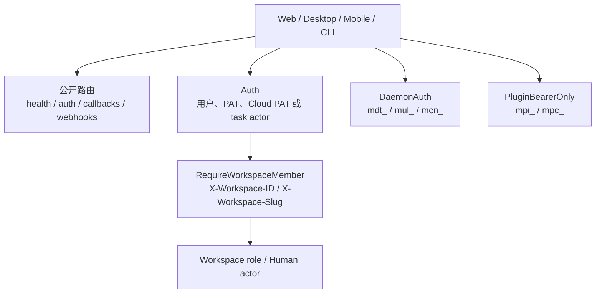

# API 地图

后端使用 Chi，完整组合根是 [server/cmd/server/router.go](../../server/cmd/server/router.go)。本页按鉴权边界和业务域归纳，不逐条复制全部路由；新增、删除或改变 method/path 时必须以该文件为准。

## 请求边界

| 边界 | 识别方式 | 典型路由 | 注意 |
| --- | --- | --- | --- |
| 公开 | 无 Multica session | `/health`、`/auth/*`、OAuth callback、webhook | webhook/能力 URL 自身携带签名或 token |
| 用户鉴权 | [middleware.Auth](../../server/internal/middleware/) | `/api/me`、`/api/workspaces`、`/api/tokens` | 可解析 session/PAT/Cloud PAT/task token；敏感账号操作另加 HumanActor |
| Workspace member | `X-Workspace-ID` 或 `X-Workspace-Slug` + membership | 大多数业务 `/api/*` | 所有查询必须按 `workspace_id` 隔离 |
| Workspace URL 角色 | `RequireWorkspaceMemberFromURL` / `RequireWorkspaceRoleFromURL` | `/api/workspaces/{id}/...` | path 中的 workspace 与 header 型业务路由分开 |
| HumanActor | [handler.RequireHumanActor](../../server/internal/handler/actor_guards.go) | billing、Wiki 人工接受、Room 人工动作 | 阻止 task token 横向执行账号/治理操作 |
| DaemonAuth | daemon token、用户 PAT 或 Cloud PAT | `/api/daemon/*` | daemon claim、任务生命周期、GC 检查 |
| Plugin bearer | `mpi_` / `mpc_` | `/v1/*` | 不接受浏览器 session |
| Plugin bridge | 用户 session + installation header | `/api/plugin-bridge/v1/*` | sandbox iframe 经 host page relay |

全局 middleware 包括 RequestID、请求日志、可选 HTTP metrics、Recoverer、Plugin surface host boundary、CSP 与 CORS。浏览器 workspace 请求会使用 `X-Workspace-ID`/`X-Workspace-Slug`；客户端能力和平台信息使用 `X-Client-*` header。CORS header 清单也在 [router.go](../../server/cmd/server/router.go)。

## 公开与基础设施

| 分组 | 路径族 | 能力 |
| --- | --- | --- |
| 存活/就绪 | `GET /health`、`/readyz`、`/healthz` | 进程与数据库 readiness |
| Realtime 指标 | `GET /health/realtime` | token 保护；无 token 时仅直连 loopback |
| 客户端 WS | `GET /ws` | PAT/session 解析、workspace membership、事件 fan-out |
| 本地上传 | `GET /uploads/*` | 仅启用 LocalStorage 时注册 |
| 能力下载/头像 | `/api/attachments/{id}/signed-download`、`/api/avatars/{sig}/*` | URL 签名是凭据，不依赖 session cookie |
| Plugin 文档 | `GET /plugin-surfaces/{token}` | cookie-free 独立 origin 上的 capability URL |
| 认证 | `/auth/send-code`、`/auth/verify-code`、`/auth/google`、`/auth/logout` | 公开端点按 IP 限流 |
| 公开配置/销售 | `GET /api/config`、`POST /api/contact-sales` | 登录配置与销售表单 |
| Share link 预览 | `GET /api/share-links/{code}` | 加入前预览 workspace |
| Webhooks | `/api/webhooks/autopilots/{token}`、`/github`、`/vcs/{connectionId}`、`/stripe` | 各自用 path token、HMAC 或 provider 签名 |
| OAuth/setup callback | `/api/github/setup`、`/api/integrations/composio/callback` | callback 自带 sealed/signed state |

## Daemon API

统一前缀 `/api/daemon`，使用 `DaemonAuth`。

| 子域 | 代表路径 | 能力 |
| --- | --- | --- |
| 注册/连接 | `/register`、`/deregister`、`/heartbeat`、`/ws` | daemon 注册、心跳、WS RPC |
| Workspace 同步 | `/workspaces`、`/workspaces/{workspaceId}/repos`、`.../runtime-profiles` | daemon 可见 workspace、repo、profile |
| Claim | `/tasks/claim`、`/runtimes/{runtimeId}/tasks/claim`、`.../tasks/pending` | 批量/单 runtime claim；`/claim` 是过渡别名 |
| Prepare/Bundle | `.../prepare-lease`、`.../skill-bundles/resolve` | 延长准备租约、解析任务 skill bundle |
| 任务生命周期 | `/tasks/{taskId}/{status,start,wait-local-directory,progress,complete,fail,usage,messages,cancel-ack}` | daemon 上报状态、结果、用量和 transcript |
| Runtime 请求回执 | `.../update/{updateId}/result`、`.../models/{requestId}/result`、`.../local-skills/.../result` | 更新、模型和本地 Skill 异步结果 |
| Plugin/MCP | `/tasks/{id}/plugin-hooks`、`/tasks/{id}/plugin-mcp/{contributionId}/credential` | agent 发起 hook、按连接时机取临时凭据 |
| GC 与恢复 | `.../gc-check`、`.../recover-orphans`、`/tasks/{taskId}/session` | 本地工作目录存活判断、孤儿恢复、session 固定 |

Daemon WS RPC 与 HTTP handler 共享同一任务语义；相关实现集中在 [server/internal/handler/daemon.go](../../server/internal/handler/daemon.go)、[daemon_rpc.go](../../server/internal/handler/daemon_rpc.go) 和 [server/internal/daemon/](../../server/internal/daemon/)。

## Plugin API

稳定公开契约位于 [server/pkg/publicapi/v1/](../../server/pkg/publicapi/v1/)：

- `/v1/context`：当前 Plugin invocation 上下文。
- `/v1/issue`：读/patch 当前 issue。
- `/v1/issue/comments`：列出/创建评论。
- `/v1/storage` 与 `/v1/storage/{key}`：安装级 KV 列出、读、写、删。

同一组 Action handler 也挂在 `/api/plugin-bridge/v1`，但使用用户 session 和 `X-Multica-Plugin-Installation`；bridge 额外提供 `/hooks/{key}`。Public API 的 OpenAPI 在 [openapi.yaml](../../server/pkg/publicapi/v1/openapi.yaml)。

## 用户级 API

这些 API 需要登录，但不要求当前 workspace header。

| 领域 | 路径族 | 主要操作 |
| --- | --- | --- |
| 当前用户/onboarding | `/api/me`、`/api/me/onboarding/*` | 读改 profile、onboarding、Cloud waitlist；旧 Desktop bootstrap shim 仍在 |
| CLI/上传/反馈/usage | `/api/cli-token`、`/api/upload-file`、`/api/feedback`、`/api/client-usage` | CLI token、通用上传、反馈、客户端用量 |
| 下载 | `/api/attachments/{id}/download` | handler 从 attachment 反查 workspace 并校验 membership |
| Invitations/share link | `/api/invitations/*`、`POST /api/share-links/join` | 我的邀请、接受/拒绝、按 code 加入 |
| PAT | `/api/tokens/*` | 列出、创建、续期当前、撤销 |
| 渠道绑定 | `/api/{lark,slack,dingtalk,wecom,telegram}/binding/redeem` | 登录用户兑换渠道绑定 token |
| Composio | `/api/integrations/composio/*` | connect init、toolkit、connection、断开 |
| Cloud billing | `/api/cloud-billing/*` | 余额、流水、批次、充值、价格、checkout/portal |
| Personal Wiki | `/api/personal-wiki/*` | 搜索、页面 CRUD、revision 列表/读取/restore |

Cloud billing 和 Personal Wiki 写入使用 HumanActor，防止 agent task token 访问账号级资产。

## Workspace 管理 API

`/api/workspaces` 是特殊的 URL-scoped 资源树：

| 权限 | 路径/能力 |
| --- | --- |
| 登录用户 | `GET/POST /api/workspaces`：列出/创建 |
| Member | `/{id}` 读取、members、leave、invitations；读取 GitHub/VCS、runtime profiles、MCP library、Plugin 安装与 surface launch |
| Owner/Admin | 更新 workspace；邀请与成员管理；share link；runtime profile；MCP server；Plugin package/安装/配置/启停/token/MCP approval；GitHub/VCS connect；部分渠道安装管理 |
| Owner | `DELETE /api/workspaces/{id}` |

渠道安装也位于 `/{id}` 下：

- Lark/Feishu：list、device-flow begin/status、revoke；handler 再执行 agent owner/admin 权限。
- Slack、WeCom、Telegram：member 可 list，owner/admin 可 BYO install/revoke。
- DingTalk：当前 list、group、BYO/revoke 在 member middleware 内，最终权限仍应以 handler 为准。

Workspace subscription 单独使用 header-scoped `/api/cloud-subscriptions`：member 可读 summary/prices，owner/admin 可 checkout、席位购买/对账、portal；全部要求 HumanActor。

## Workspace 业务 API

以下分组统一经过 `RequireWorkspaceMember`。

| 领域 | 路径族 | 覆盖能力 |
| --- | --- | --- |
| Wiki | `/api/wiki`、`/api/wiki/pages` | 搜索、knowledge readiness、页面 CRUD、revision、restore、agent edit proposal 接受/拒绝 |
| LM Wiki | `/api/lm-wiki` | 当前 canonical wiki、source policy、revision；owner/admin 更新 policy、refresh、accept/reject |
| Twin | `/api/twin/overview`、`/api/twins` | overview、proposal/version、activation、binding、briefing、task context、metrics、feedback、pause/deposition/correction |
| Rooms | `/api/rooms` | 列表/创建、详情、preflight、usage、message、wake、status、budget、cycle retry/review/cancel、recommendation review、promotion |
| Issues | `/api/issues` | table group/row/facet、搜索/分组/children、CRUD、quick create、trigger preview、batch update/delete、move |
| Issue 子资源 | `/api/issues/{id}/*` | comments/timeline/subscribers、task cancel/rerun、quick action、usage/reaction/attachment/label/metadata/property/PR |
| Issue 配置 | `/api/issue-statuses`、`/api/properties`、`/api/labels`、`/api/quick-actions` | workspace 状态目录、属性定义、标签、快捷动作 |
| Saved views | `/api/issue-views`、`/api/issue-view-preferences` | 视图 CRUD 与用户偏好 |
| Projects | `/api/projects` | 搜索、CRUD、resource CRUD |
| Squads | `/api/squads` | CRUD、成员、角色、成员状态；另有 issue squad evaluation |
| Autopilots | `/api/autopilots` | CRUD、cron preview、quota usage、trigger、run、delivery/replay、webhook secret、collaborator |
| Pins | `/api/pins` | 列表、创建、重排、按 item type/id 删除 |
| Attachments/Comments | `/api/attachments/{id}`、`/api/comments/{commentId}` | metadata/content/delete、评论改删/resolve/reaction/sub-issue |
| Agents | `/api/agents` | CRUD、Mika、归档/恢复/取消任务、Skill/label/MCP 绑定、runtime skill、加密 env |
| Agent Builder | `/api/agent-builder/sessions` | 草稿 session、runtime 切换、autosave |
| Skills | `/api/skills` | CRUD、搜索、导入/刷新、label、文件 |
| Dashboard | `/api/dashboard` | daily usage、by-agent、runtime、failure rollup |
| Runtimes | `/api/runtimes` | 列表、修改/删除、usage/activity、update、model/local-skill request、解绑 agent 后删除 |
| Cloud Runtime | `/api/cloud-runtime` | service health/readiness、node CRUD/start/stop/reboot/status/exec |
| Task reads/actions | `/api/tasks/{taskId}` | 用户取消、读取消息、重试 source context、run review |
| Presence/activity | `/api/agent-task-snapshot`、`/api/working-agents`、`/api/agent-activity-30d`、`/api/agent-run-counts` | workspace agent 状态投影 |
| Chat | `/api/chat/sessions`、`/api/chat/pending-tasks`、`/api/chat/pinned-agents`、`/api/chat/history`、`/api/chat/thread` | session/message、队列优先级、read cursor、draft restore、agent-facing channel history |
| Inbox | `/api/inbox` | 活跃/归档列表、未读数/跨 workspace 摘要、批量 read/archive、单项状态 |
| Notification | `/api/notification-preferences` | 读取、patch、整体更新 |

### Skill Evolution 与 Task Review

该模块通过 `RouterOptions.RegisterSkillEvolution` 注入，不直接展开在主 router 的静态代码块。组合见 [server/internal/skillevolution/module.go](../../server/internal/skillevolution/module.go)：

- `/api/skill-evolution/skills/{skillId}`：overview、loop 配置、pause、proposal、fork、release rollback。
- `/api/skill-evolution/proposals/{proposalId}`：读取、reject、publish。
- `/api/tasks/{taskId}/review` 与 `/api/task-run-reviews*`：创建/读取 run review 和 manual rerun。

## 兼容性与响应解析

前端不能把网络 JSON 直接 cast 成 TypeScript 类型。API client 与 zod schema 位于 [packages/core/api/](../../packages/core/api/)；endpoint 返回给 UI 前应通过 `parseWithFallback`，并为畸形响应补测试。Desktop 可能比服务端旧，因此服务端 enum switch 必须有 default，关键 affordance 不能只依赖单个新 boolean。

## 去哪里改

| 目标 | 位置 |
| --- | --- |
| method/path/middleware | [server/cmd/server/router.go](../../server/cmd/server/router.go) |
| Plugin v1 contract | [server/pkg/publicapi/v1/](../../server/pkg/publicapi/v1/) |
| HTTP 输入、权限、响应 | [server/internal/handler/](../../server/internal/handler/) |
| 业务编排 | [server/internal/service/](../../server/internal/service/) 或独立领域模块 |
| 客户端 API 与 schema | [packages/core/api/](../../packages/core/api/) 和对应领域目录 |
| Mobile API | [apps/mobile/data/api.ts](../../apps/mobile/data/api.ts) 与 `apps/mobile/data/queries` |
| 路由回归测试 | `server/cmd/server/*_test.go`、handler 邻近测试、`packages/core` schema 测试 |

## 相关页面

- [参考资料](index.md)
- [后端与 API](../backend/index.md)
