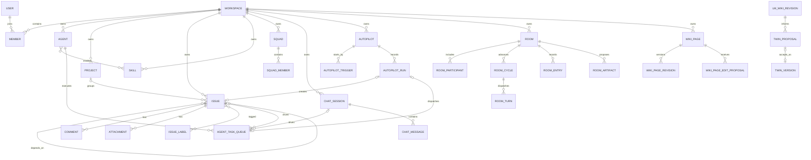
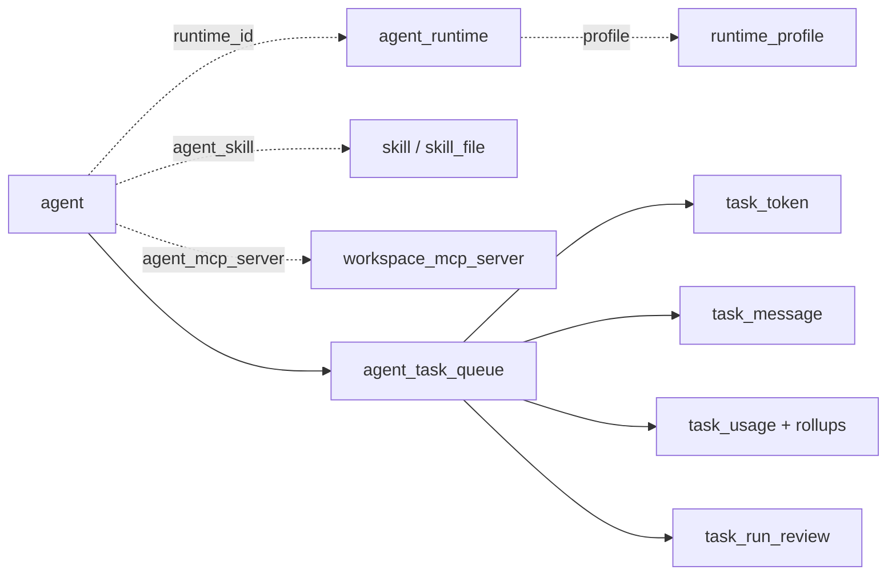

# 数据模型

PostgreSQL schema 由 [server/migrations/](../../server/migrations/) 的有序迁移定义；sqlc 从这些迁移和 [server/pkg/db/queries/](../../server/pkg/db/queries/) 生成 [server/pkg/db/generated/](../../server/pkg/db/generated/)。本页描述逻辑关系，不代表数据库外键。

## 关系与事务规则

> **无 FK 设计方向：** 新增或修改数据库设计不得增加 `FOREIGN KEY`、`REFERENCES`、级联删除或级联更新。关系验证、依赖清理和原子性由应用层显式负责。历史早期迁移仍可看到 `REFERENCES`；当前删除代码把这些 legacy cascade 视为迁移期 safety net，不应作为新实现范式。较新的 Channel、Plugin、VCS、Room、Wiki/Twin/Skill Evolution 表从创建起就是无 FK 的。

具体依据：

- [channel_generalization migration](../../server/migrations/124_channel_generalization.up.sql) 明确把 membership、安装和 chat binding 一致性移到应用层。
- [plugin lifecycle migration](../../server/migrations/285_plugin_lifecycle_v1.up.sql) 明确 Plugin spine 无 FK/级联。
- [VCS migration](../../server/migrations/216_vcs_integration.up.sql) 明确 connect/PR/status 的清理由 handler 事务负责。
- [workspace_delete.sql](../../server/pkg/db/queries/workspace_delete.sql) 是自底向上的显式删除计划。
- [DeleteWorkspace](../../server/internal/handler/workspace.go) 先锁 workspace/任务 owner，再在一个事务里按固定顺序清理。

所有 workspace 业务查询都必须按 `workspace_id` 限定；membership 是访问门。

## 核心逻辑 ER 图

图中的连线都是**应用层逻辑关联**；不要据此新增数据库 FK。

## 租户与身份

| 表/实体 | 关键字段 | 说明 | 查询入口 |
| --- | --- | --- | --- |
| `user` | `id`, `email`, profile/onboarding/appearance | 全局账号 | [user.sql](../../server/pkg/db/queries/user.sql) |
| `workspace` | `id`, `slug`, `settings`, issue prefix/counter | 租户根；slug 用于三端路由 | [workspace.sql](../../server/pkg/db/queries/workspace.sql) |
| `member` | `workspace_id`, `user_id`, `role` | 用户与 workspace 的关联；角色为 owner/admin/member | [member.sql](../../server/pkg/db/queries/member.sql) |
| `workspace_invitation` | workspace、inviter、email/user、status | 邮件邀请 | [invitation.sql](../../server/pkg/db/queries/invitation.sql) |
| `workspace_share_link` | `workspace_id`, `code`, `role`, expiry/use count | 可撤销/限次 share link | [migration 327](../../server/migrations/327_workspace_share_link.up.sql) |
| `personal_access_token` | `user_id`, token hash、expiry/last used | CLI、WS 与 API PAT | [personal_access_token.sql](../../server/pkg/db/queries/personal_access_token.sql) |
| `notification_preference` | workspace + user | per-workspace 通知偏好 | [notification_preference.sql](../../server/pkg/db/queries/notification_preference.sql) |

## 工作项、项目与协作

| 表/实体 | 关键关系与语义 |
| --- | --- |
| `project` | 属于 workspace；lead 是 `lead_type + lead_id` 多态身份；`project_resource` 是外部资源 |
| `issue_status` | workspace 状态目录；issue 以状态 key/id 解析；归档和重排由应用约束 |
| `issue` | 属于 workspace，可选 project/parent；`assignee_type + assignee_id` 支持 member/agent/squad；creator 也为多态身份 |
| `comment` | 属于 issue，并冗余 `workspace_id` 便于租户过滤；支持 parent、system/agent/member author |
| `issue_label` / `issue_to_label` | workspace 标签与 issue 多对多 |
| `issue_dependency` | issue 自关联，表达 blocks/blocked_by/related |
| `issue_property` | workspace 级属性定义；值写在 issue property 数据结构中 |
| `issue_subscriber` | Issue 订阅、delegated/opt-out 语义 |
| `issue_view` / `issue_view_preference` | 保存的表格视图和用户 active view 偏好 |
| `quick_action` | workspace 级 issue/chat 快捷动作定义 |
| `attachment` | 可关联 issue/comment/chat/task/source context；实际对象在 S3 或本地存储 |
| `activity_log` / `inbox_item` | 审计/时间线事件与面向接收者的通知投影 |

Issue 的权威查询在 [issue.sql](../../server/pkg/db/queries/issue.sql)，Project 在 [project.sql](../../server/pkg/db/queries/project.sql)，评论在 [comment.sql](../../server/pkg/db/queries/comment.sql)。

## Agent、Runtime、Skill 与 Task

| 表族 | 用途 |
| --- | --- |
| `agent` | workspace 内一等 assignee；owner、runtime 配置、并发、可见性、归档、系统身份 |
| `agent_runtime` | daemon 上报的机器/runtime 实例；owner、provider、在线心跳、自定义名 |
| `runtime_profile` | workspace 可复用的 runtime/provider 配置模板 |
| `skill`, `skill_file`, `agent_skill` | Skill 定义、支持文件、agent 绑定与 enabled 状态 |
| `workspace_mcp_server`, `agent_mcp_server` | workspace MCP library 与 agent 绑定 |
| `agent_task_queue` | 统一执行队列；可由 issue、chat、autopilot、room turn、twin 等来源触发 |
| `task_token` | task-scoped actor credential，绑定 task/agent/workspace/user |
| `task_message` | daemon transcript/进度消息 |
| `task_usage`、`task_usage_hourly/daily/dashboard_*` | token、成本、耗时与聚合/dirty ledger |
| `task_run_review` | 人工 helpful/needs-correction 反馈，进入知识/Twin/Skill evolution 信号 |

Task owner 可能通过 agent、issue 或 runtime 间接落在 workspace；删除时不能只看单一 `workspace_id`。因此 [workspace_delete.sql](../../server/pkg/db/queries/workspace_delete.sql) 会锁 owner、分页发现任务并批量清理 token/message/usage/channel delivery。

## Chat、渠道与 Inbox

| 表族 | 逻辑 |
| --- | --- |
| `chat_session` / `chat_message` | 用户与 agent 的持久会话及消息；task 可通过 `chat_session_id` 关联 |
| `chat_pinned_agent` | 用户快速发起 chat 的 pinned agents |
| `chat_draft_restore` | 延迟取消后的草稿恢复 ledger |
| `channel_installation` | workspace + agent + channel type 的 BYO 安装；凭据在 JSONB config 中加密保存 |
| `channel_user_binding` | Multica user 与渠道原生 user id 的绑定 |
| `channel_chat_session_binding` | 渠道 conversation 与 chat session 的一一/路由关系 |
| `channel_inbound_message_dedup` / `channel_inbound_audit` | 入站幂等与不保存正文的 drop audit |
| `channel_outbound_message` / `channel_task_delivery` | 跨事件/任务的出站投递 ledger |
| `channel_media_pending_object` | 上传对象与业务 attachment 绑定之间的可恢复意图账本 |
| `inbox_item` | 面向用户/agent 的 workspace 通知；read/archive 分开 |

平台差异通过 `channel_type` 与 config JSONB 表达；Feishu 早期 `lark_*` 表仍在迁移历史中，当前平台无关查询看 [channel.sql](../../server/pkg/db/queries/channel.sql)。

## Autopilot、Room、Wiki、Twin 与 Skill Evolution

| 领域 | 表族 | 生命周期 |
| --- | --- | --- |
| Autopilot | `autopilot`、`autopilot_trigger`、`autopilot_rule_version`、`autopilot_run`、`webhook_delivery`、quota period/reservation | 定义 → trigger/schedule → run → issue/task → delivery/usage |
| Room | `room`、`room_participant`、`room_entry`、`room_cycle`、`room_turn`、`room_artifact`、`room_memory_revision`、recommendation review | message/wake → cycle → per-agent turn → synthesis/artifact → review/promotion |
| Wiki | `wiki_page`、`wiki_page_revision`、`wiki_page_edit_proposal` | workspace/project/user scope → immutable revision → agent proposal → 人工 accept/reject |
| LM Wiki | `lm_wiki_source_policy`、`lm_wiki_source_wiki_page`、`lm_wiki_revision`、`lm_wiki_citation`、`lm_wiki_review` | source policy → canonical revision → review |
| Twin | `twin_profile`、`twin_proposal`、`twin_proposal_review`、`twin_version`、`twin_binding`、`twin_task_attribution`、`twin_deposition`、`twin_run_feedback` | LM Wiki → proposal → signed version → binding/execution → feedback/deposition |
| Skill Evolution | `skill_evolution_loop/revision/revision_file/proposal/evidence/evaluation/review/release/task_attribution/task_dispatch_snapshot` | 观察信号 → candidate → validation/replay → 人工 publish/reject → release/rollback |

关键建表迁移分别见 [Room](../../server/migrations/285_room_tables.up.sql)、[Wiki knowledge loop](../../server/migrations/414_wiki_knowledge_loop.up.sql)、[Twin](../../server/migrations/275_twin_tables.up.sql)、[Skill Evolution](../../server/migrations/482_skill_evolution_tables.up.sql)。

## Plugin 与外部集成

Plugin 数据分为：

1. `plugin_identity` / `plugin_release` / `plugin_contribution`：发布身份、不可变 release 和 contribution。
2. `plugin_package` / `plugin_package_version` / `plugin_package_file` / `plugin_artifact_file`：workspace 发布包与托管 surface 文件。
3. `plugin_installation` / `plugin_grant` / `plugin_binding` / `plugin_installation_config`：安装、授权、scope 绑定和配置 revision。
4. `plugin_secret` / `plugin_storage`：加密 secret 和安装级 KV。
5. `plugin_invocation` / `plugin_hook_schedule` / MCP secret/oauth/approval：执行审计和远端 transport。

VCS 使用 `vcs_connection`、`vcs_pull_request`、`vcs_commit_status`、`issue_vcs_pull_request`；GitHub App 使用独立的 `github_installation`、`github_pull_request`、check suite/run 与 issue link 表。Composio connection 归用户而非 workspace。

## 去哪里改

| 目标 | 位置 |
| --- | --- |
| 表/列/check constraint | 新增 [server/migrations/*.up.sql](../../server/migrations/) 与可逆 `.down.sql` |
| 索引 | 单独迁移文件，且只含 `CREATE [UNIQUE] INDEX CONCURRENTLY` |
| SQL 查询 | [server/pkg/db/queries/](../../server/pkg/db/queries/) |
| 生成代码 | `make sqlc`；检查 [server/pkg/db/generated/](../../server/pkg/db/generated/) diff |
| 跨表校验/清理 | 对应 service/handler 事务；不要补 FK 或 cascade |
| Workspace 删除图 | [workspace_delete.sql](../../server/pkg/db/queries/workspace_delete.sql) 与 [handler/workspace.go](../../server/internal/handler/workspace.go) |
| DB 测试 fixture | [server/internal/testutil/](../../server/internal/testutil/) 的 `dbfx` 与 `testutil.Call` |

## 相关页面

- [参考资料](index.md)
- [数据库与 sqlc](../backend/database-and-sqlc.md)
