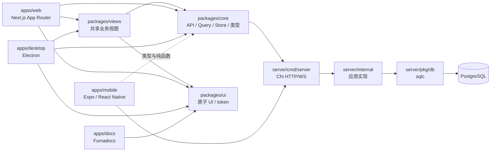

# 仓库地图

Multica 是一个 pnpm/Turborepo 前端工作区加 Go 服务端的单仓库。Web 与 Desktop 共享业务逻辑和视图；Mobile 只选择性共享 `@multica/core` 的类型与纯函数，并保留独立 UI、状态、路由和发布节奏。

依赖约束见 [CLAUDE.md](../../CLAUDE.md)，工作区清单与共享版本目录见 [pnpm-workspace.yaml](../../pnpm-workspace.yaml)，任务图见 [turbo.json](../../turbo.json)。

## 仓库顶层

| 路径 | 职责 | 常见修改场景 |
| --- | --- | --- |
| [apps/](../../apps/) | 可运行的 Web、Desktop、Mobile、Docs 应用 | 路由、平台适配、应用构建 |
| [packages/](../../packages/) | 前端共享包 | 业务逻辑、共享视图、原子 UI、配置 |
| [server/](../../server/) | Go API、CLI、daemon、迁移、sqlc | API、后台任务、数据库、运行时 |
| [e2e/](../../e2e/) | Playwright 端到端规格与 fixture | 跨层用户流程 |
| [scripts/](../../scripts/) | 本地环境、安装、自托管、生成与校验脚本 | 开发环境、构建守卫、代码生成 |
| [.github/workflows/](../../.github/workflows/) | CI、Mobile 校验、发布、Desktop smoke | 自动化门禁与发布 |
| [deploy/helm/](../../deploy/helm/) | Kubernetes Helm chart | 集群部署参数 |
| [docker/](../../docker/) 与根目录 Compose/Dockerfile | 容器入口和自托管镜像 | 镜像、启动顺序、信号处理 |
| [docs/](../../docs/) | 工程/集成文档与 downstream 同步记录 | 实现级说明、运维手册 |
| [examples/plugins/](../../examples/plugins/) | Plugin 示例 | SDK/manifest 示例与手工验证 |
| [artifacts/](../../artifacts/) | 受源码脚本管理的产品资产 | Office 等生成资产 |
| [droid-wiki/](../) | Factory Wiki 源页面 | 架构、参考与贡献说明 |
| [Makefile](../../Makefile) | 本地环境、数据库、构建、测试统一入口 | `make up`、`make test`、`make check` |
| [package.json](../../package.json) | 根 pnpm/Turbo 命令 | Web/Desktop/Docs 构建与测试 |

`.audit/`、`test-results/`、应用内 `.next/`、`out/`、`.turbo/` 等属于本地审计或生成输出，不是产品模块的权威入口。

## server

| 路径 | 职责 |
| --- | --- |
| [server/cmd/server/](../../server/cmd/server/) | API 进程组合根：启动、数据库池、Redis relay、后台 worker、Chi 路由、优雅停机 |
| [server/cmd/multica/](../../server/cmd/multica/) | `multica` CLI：登录、workspace、issue、project、agent、skill、chat、daemon 等命令 |
| [server/cmd/migrate/](../../server/cmd/migrate/) | 迁移 runner |
| [server/cmd/backfill_*](../../server/cmd/) | 一次性/运维回填入口 |
| [server/internal/](../../server/internal/) | 仅服务端内部使用的应用实现 |
| [server/pkg/](../../server/pkg/) | 可被服务端多个边界复用的包和稳定协议 |
| [server/migrations/](../../server/migrations/) | PostgreSQL 增量迁移；sqlc 也把它作为 schema 输入 |
| [server/sqlc.yaml](../../server/sqlc.yaml) | sqlc：`migrations/` + `pkg/db/queries/` → `pkg/db/generated/` |

### server/internal 主要目录

| 路径 | 职责 |
| --- | --- |
| [handler/](../../server/internal/handler/) | HTTP/WS 边界、输入解析、权限复核、响应 DTO；文件按业务域拆分 |
| [service/](../../server/internal/service/) | Issue、Task、Autopilot、Plugin、LM Wiki、Twin 等业务编排；内置 agent/skill 也在此 |
| [room/](../../server/internal/room/) | Room 的周期、预算、参与者、产物、promotion 与生命周期 |
| [skillevolution/](../../server/internal/skillevolution/) | Skill evolution 模块、HTTP mount、证据/评估/发布/归因 worker |
| [daemon/](../../server/internal/daemon/) | 本地 daemon 协调、进程执行环境、repo cache、任务工作目录和 GC |
| [daemonws/](../../server/internal/daemonws/) | API 与 daemon 的 WebSocket hub/RPC |
| [auth/](../../server/internal/auth/) | JWT/PAT/daemon/task/cloud token、缓存、CloudFront 签名 |
| [middleware/](../../server/internal/middleware/) | Auth、workspace membership/role、限流、CSP、日志等 Chi middleware |
| [integrations/](../../server/internal/integrations/) | 第三方集成，见下表 |
| [realtime/](../../server/internal/realtime/) | 客户端 WS hub、Redis stream relay、事件广播与 origin 校验 |
| [events/](../../server/internal/events/) | 进程内事件总线；listener 将领域事件投递到 realtime、通知和集成 |
| [storage/](../../server/internal/storage/) | S3/兼容对象存储和本地文件存储 |
| [cloudruntime/](../../server/internal/cloudruntime/) | 托管 runtime/fleet 代理 |
| [entitlement/](../../server/internal/entitlement/) 与 [seatcapacity/](../../server/internal/seatcapacity/) | Cloud 权益策略、workspace 席位容量及 outbox worker |
| [scheduler/](../../server/internal/scheduler/) | 定时调度 |
| [metrics/](../../server/internal/metrics/) 与 [profiling/](../../server/internal/profiling/) | HTTP/业务指标与 profiling |
| [featureflags/](../../server/internal/featureflags/) | 领域级 feature flag 判断封装 |
| [analytics/](../../server/internal/analytics/) | PostHog/空实现埋点客户端 |
| [dispatch/](../../server/internal/dispatch/) 与 [attribution/](../../server/internal/attribution/) | 任务派发与执行归因 |
| [dbstartup/](../../server/internal/dbstartup/) 与 [migrations/](../../server/internal/migrations/) | 数据库连接重试、迁移基础设施 |
| [issueguard/](../../server/internal/issueguard/)、[issuestatus/](../../server/internal/issuestatus/)、[issueposition/](../../server/internal/issueposition/) | Issue 不变量、状态目录、排序位置 |
| [runtimeapps/](../../server/internal/runtimeapps/) 与 [agentconfig/](../../server/internal/agentconfig/) | runtime app 能力与 agent 配置 |
| [channelmedia/](../../server/internal/channelmedia/) | 渠道附件清理/协调 |
| [testutil/](../../server/internal/testutil/) | DB fixture、handler 调用器等 Go 测试基础设施 |
| [attributionbackfill/](../../server/internal/attributionbackfill/) 与 [taskusagebackfill/](../../server/internal/taskusagebackfill/) | 迁移前的归因约束修复与小时 usage 回填；属于迁移/运维辅助包，分别在[用量与归因](../features/usage-and-attribution.md)和[数据库迁移](../backend/migrations.md)中说明，不单独成页 |
| [chatoriginbackfill/](../../server/internal/chatoriginbackfill/) 与 [issueactivitybackfill/](../../server/internal/issueactivitybackfill/) | 分页、幂等地补齐 Chat origin 和 Issue `last_activity_at`；是一次性数据修复边界，归入 Chat、Issue 与迁移页面 |
| [chattitle/](../../server/internal/chattitle/) | 从首条消息确定性派生 Chat 标题的单文件 Unicode helper；体量小，归入 [Chat 与执行会话](../features/chat-and-sessions.md) |
| [selfexec/](../../server/internal/selfexec/) | 解析当前可执行文件路径并提供 `argv[0]` fallback 的单一辅助包；归入 [CLI 命令](cli-commands.md) |

### server/internal/integrations

| 路径 | 职责 |
| --- | --- |
| [channel/](../../server/internal/integrations/channel/) | 平台无关渠道注册表、连接 supervisor、入站 router、chat session 与媒体 ledger |
| [lark/](../../server/internal/integrations/lark/) | 飞书/Lark 长连接、安装、绑定、媒体、出站卡片 |
| [slack/](../../server/internal/integrations/slack/) | BYO Socket Mode、slash command、绑定与出站 |
| [dingtalk/](../../server/internal/integrations/dingtalk/) | 钉钉 Stream、群路由、绑定与媒体 |
| [wecom/](../../server/internal/integrations/wecom/) | 企业微信智能机器人长连接、跨副本转发、媒体与绑定 |
| [telegram/](../../server/internal/integrations/telegram/) | Bot 安装、long polling、绑定与出站 |
| [vcs/](../../server/internal/integrations/vcs/) | Forgejo/Gitea/GitLab provider 适配 |
| [ghsnapshot/](../../server/internal/integrations/ghsnapshot/) | GitHub PR/check snapshot 刷新 |
| [composio/](../../server/internal/integrations/composio/) | Composio OAuth、toolkit 与 task MCP overlay |

### server/pkg

| 路径 | 职责 |
| --- | --- |
| [agent/](../../server/pkg/agent/) | 各 agent CLI 的启动、协议握手、输出/进程树管理 |
| [db/queries/](../../server/pkg/db/queries/) | 手写 sqlc 查询，按领域拆分 |
| [db/generated/](../../server/pkg/db/generated/) | `make sqlc` 生成的 Go 类型和查询；不要手改 |
| [protocol/](../../server/pkg/protocol/) | API、daemon、realtime 共享的事件/协议常量 |
| [publicapi/v1/](../../server/pkg/publicapi/v1/) | Plugin Public Action API 的路径、类型、Problem Details 与 OpenAPI |
| [llm/](../../server/pkg/llm/) | 服务端内部 OpenAI-compatible LLM 客户端、重试与调用者约束 |
| [featureflag/](../../server/pkg/featureflag/) | YAML + `FF_<KEY>` 环境覆盖的 flag service |
| [plugincontract/](../../server/pkg/plugincontract/) | Plugin manifest/contract |
| [skillbundle/](../../server/pkg/skillbundle/) | Skill bundle 解析与校验 |
| [remotemcp/](../../server/pkg/remotemcp/) | Remote MCP transport |
| [composio/](../../server/pkg/composio/) | Composio SDK 客户端 |
| [redact/](../../server/pkg/redact/) 与 [taskfailure/](../../server/pkg/taskfailure/) | 脱敏和任务失败分类 |
| [dbid/](../../server/pkg/dbid/) | 数据库标识辅助 |

## apps

| 应用 | 技术与职责 | 路由/平台入口 |
| --- | --- | --- |
| [apps/web/](../../apps/web/) | Next.js App Router；浏览器应用、landing、认证、workspace UI | [app/](../../apps/web/app/)、[platform/](../../apps/web/platform/)、[proxy.ts](../../apps/web/proxy.ts) |
| [apps/desktop/](../../apps/desktop/) | Electron main/preload/renderer；多 tab、daemon/更新设置、打包 | [src/main/](../../apps/desktop/src/main/)、[src/preload/](../../apps/desktop/src/preload/)、[renderer routes](../../apps/desktop/src/renderer/src/routes.tsx) |
| [apps/mobile/](../../apps/mobile/) | Expo Router / React Native iOS；独立 native UI 与数据层 | [app/](../../apps/mobile/app/)、[data/](../../apps/mobile/data/)、[components/](../../apps/mobile/components/) |
| [apps/docs/](../../apps/docs/) | Fumadocs 文档站 | [content/](../../apps/docs/content/)、[app/](../../apps/docs/app/) |

Web 的 Next API/导航只能出现在 [apps/web/platform/](../../apps/web/platform/) 等 app 层；Desktop 的 `react-router-dom`  wiring 只留在 renderer 平台层。Mobile 修改前必须先读 [apps/mobile/CLAUDE.md](../../apps/mobile/CLAUDE.md)。

## packages

| 包 | 职责 | 硬边界 |
| --- | --- | --- |
| [packages/core/](../../packages/core/) | API client、zod schema、TanStack Query、mutation、Zustand store、类型、纯业务函数、realtime updater | 无 `react-dom`、`localStorage`、`process.env`、UI 库 |
| [packages/views/](../../packages/views/) | Web/Desktop 共用业务页面、表单、对话框、布局、i18n 文案 | 无 `next/*`、无 `react-router-dom`、无自建 store；使用 NavigationAdapter |
| [packages/ui/](../../packages/ui/) | 原子 UI、markdown primitive、hooks、CSS token/base style | 无 `@multica/core`、无业务逻辑 |
| [packages/plugin-sdk/](../../packages/plugin-sdk/) | sandboxed Plugin surface 客户端 SDK 与 bridge protocol | 保持稳定、轻量、无产品 UI |
| [packages/tsconfig/](../../packages/tsconfig/) | 共享 TypeScript 配置 | 配置包 |
| [packages/eslint-config/](../../packages/eslint-config/) | 共享 ESLint 规则 | 配置包 |

共享包直接导出 `.ts/.tsx`，由消费应用编译。主依赖方向是 `views → core + ui`；`core` 与 `ui` 相互独立。

## 去哪里改

| 变更类型 | 位置 |
| --- | --- |
| 同一业务逻辑在 Web/Desktop 重复 | 提取到 [packages/core/](../../packages/core/) |
| 同一业务组件在 Web/Desktop 相同 | 提取到 [packages/views/](../../packages/views/) |
| 单纯按钮、弹层、输入框、token | [packages/ui/](../../packages/ui/) |
| Next/Electron/Expo 特有能力 | 对应 [apps/](../../apps/) |
| 请求边界/权限/DTO | [server/internal/handler/](../../server/internal/handler/) |
| 多实体业务事务 | [server/internal/service/](../../server/internal/service/) 或领域模块 |
| SQL | [server/pkg/db/queries/](../../server/pkg/db/queries/)；之后 `make sqlc` |
