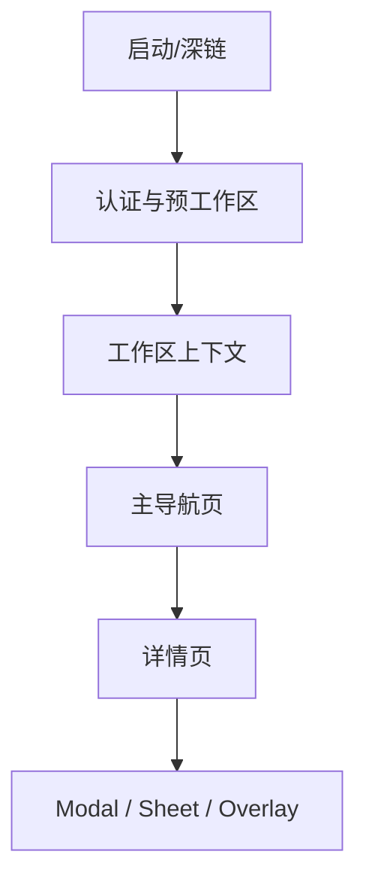

# 路由地图

三端共享业务语义，但不共享同一种路由实现：

- Web 使用 Next.js App Router，文件系统路由位于 [apps/web/app/](../../apps/web/app/)。
- Desktop 使用一个 memory router，权威表位于 [apps/desktop/src/renderer/src/routes.tsx](../../apps/desktop/src/renderer/src/routes.tsx)；每个 tab 都是 workspace-scoped session。
- Mobile 使用 Expo Router，文件系统路由位于 [apps/mobile/app/](../../apps/mobile/app/)；底部主 tab 与 pushed modal/sheet 分开。

## 路由层次

当前 workspace 由 URL/route 驱动；store 只为请求 header、持久化命名空间和重连镜像 slug/id。

## Web 路由

Next 路由组 `(landing)`、`(auth)`、`(dashboard)` 不出现在 URL 中。

### 全局与认证

| URL | 页面 | 源码 |
| --- | --- | --- |
| `/`、`/homepage` | Landing/Homepage | [app/(landing)/page.tsx](../../apps/web/app/(landing)/page.tsx)、[homepage/page.tsx](../../apps/web/app/(landing)/homepage/page.tsx) |
| `/about`、`/download`、`/changelog` | 落地内容 | [app/(landing)/](../../apps/web/app/(landing)/) |
| `/usecases`、`/usecases/[slug]` | Use cases | [usecases/](../../apps/web/app/(landing)/usecases/) |
| `/contact-sales` | 销售联系 | [contact-sales/page.tsx](../../apps/web/app/(landing)/contact-sales/page.tsx) |
| `/login` | 登录 | [app/(auth)/login/page.tsx](../../apps/web/app/(auth)/login/page.tsx) |
| `/auth/callback` | Google/OAuth 回调落地 | [app/auth/callback/page.tsx](../../apps/web/app/auth/callback/page.tsx) |
| `/onboarding` | 新用户 onboarding | [app/(auth)/onboarding/page.tsx](../../apps/web/app/(auth)/onboarding/page.tsx) |
| `/workspaces/new` | 创建 workspace | [app/(auth)/workspaces/new/page.tsx](../../apps/web/app/(auth)/workspaces/new/page.tsx) |
| `/invitations`、`/invite/[id]`、`/join` | 邀请列表、邀请详情、share link 加入 | [app/(auth)/](../../apps/web/app/(auth)/)、[app/join/page.tsx](../../apps/web/app/join/page.tsx) |
| `/billing/return` | Cloud checkout/portal 返回 | [app/billing/return/page.tsx](../../apps/web/app/billing/return/page.tsx) |
| `/lark/bind`、`/slack/bind`、`/dingtalk/bind`、`/wecom/bind`、`/telegram/bind` | 渠道账号绑定 token 兑换页 | 对应 [app/*/bind/](../../apps/web/app/) |
| `/personal-wiki`、`/personal-wiki/[id]`、`/personal-wiki/revisions/[revisionId]` | 个人 Wiki 列表、页面、稳定 revision | [app/personal-wiki/](../../apps/web/app/personal-wiki/) |

### Workspace 页面

所有页面前缀为 `/{workspaceSlug}`，共同 layout 在 [app/[workspaceSlug]/layout.tsx](../../apps/web/app/[workspaceSlug]/layout.tsx)，dashboard 壳在 [app/[workspaceSlug]/(dashboard)/layout.tsx](../../apps/web/app/[workspaceSlug]/(dashboard)/layout.tsx)。

| URL 后缀 | 业务域 | 变体 |
| --- | --- | --- |
| `/issues` | 全部 Issues | `/issues/[id]` |
| `/my-issues` | 我的 Issues | — |
| `/projects` | Projects | `/projects/[id]` |
| `/autopilots` | Autopilots | `/autopilots/[id]` |
| `/agents` | Agents | `/agents/[id]`、`/agents/new`、`/agents/new/manual`、`/agents/new/ai`、`/agents/new/ai/[sessionId]` |
| `/skills` | Skills | `/skills/[id]`、`/skills/[id]/evolution` |
| `/squads` | Squads | `/squads/[id]` |
| `/runtimes` | Runtimes/Machines | `/runtimes/[id]`、`/runtimes/[id]/runtime/[runtimeId]` |
| `/inbox` | Inbox | — |
| `/chat` | Chat | — |
| `/rooms` | Rooms | Room 详情当前由页面内交互承载 |
| `/office` | Office | — |
| `/wiki` | Workspace/Project Wiki | `/wiki/[id]`、`/wiki/revisions/[revisionId]` |
| `/twins` | Twin | — |
| `/members/[id]` | Member 详情 | — |
| `/usage` | Usage Dashboard | — |
| `/billing` | Workspace Billing | — |
| `/settings` | Workspace/Account Settings | tab 由 search/state 控制 |
| `/attachments/[id]/preview` | 附件预览 | 位于 dashboard 壳之外但仍 workspace-scoped |

文件入口可由 [apps/web/app/[workspaceSlug]/](../../apps/web/app/[workspaceSlug]/) 直接定位。

## Desktop 路由

Desktop 的路由形状统一为 `/:workspaceSlug/...`，并由 [WorkspaceRouteLayout](../../apps/desktop/src/renderer/src/components/workspace-route-layout.tsx) 同步 workspace 上下文。裸 `/{slug}` 在进入 router 前会规范为 `/{slug}/issues`。

| Desktop 后缀 | 页面 | 与 Web |
| --- | --- | --- |
| `/issues`、`/issues/:id` | Issues / Issue detail | 同形 |
| `/projects`、`/projects/:id` | Projects / Project detail | 同形 |
| `/autopilots`、`/autopilots/:id` | Autopilots | 同形 |
| `/my-issues` | My Issues | 同形 |
| `/runtimes`、`/runtimes/:id`、`/runtimes/:id/runtime/:runtimeId` | Runtime/Machine | 同形 |
| `/skills`、`/skills/:id`、`/skills/:id/evolution` | Skills | 同形 |
| `/agents`、`/agents/:id`、`/agents/new/*` | Agents 与 builder | 同形 |
| `/squads`、`/squads/:id` | Squads | 同形 |
| `/twins` | Twin | 同形 |
| `/wiki`、`/wiki/:id`、`/wiki/revisions/:revisionId` | Workspace Wiki | 同形 |
| `/personal-wiki`、`/personal-wiki/:id`、`/personal-wiki/revisions/:revisionId` | Personal Wiki | **Desktop 放在 workspace slug 下；Web 是全局路由** |
| `/members/:id` | Member | 同形 |
| `/inbox`、`/chat`、`/rooms`、`/office` | 主业务页 | 同形 |
| `/attachments/:id/preview` | 附件预览 | 同形 |
| `/usage` | Usage | 同形 |
| `/settings` | Settings | Desktop 额外注入 Daemon 与 Updates tab |

Desktop 当前没有单独的 `/billing` session route。登录、workspace 创建、接受邀请等预工作区一次性流程也不放进 `apps/desktop/src/renderer/src/routes.tsx`，而是由 navigation adapter 拦截 transition path 后通过 `WindowOverlay` 呈现。错误/过期 workspace tab 应自动修复或由 [DesktopRouteErrorPage](../../apps/desktop/src/renderer/src/components/route-error-page.tsx) 处理，不新增 Web 风格错误页。

## Mobile 路由

Mobile 的认证 layout 和 workspace layout 分别位于 [app/(auth)/_layout.tsx](../../apps/mobile/app/(auth)/_layout.tsx) 与 [app/(app)/[workspace]/_layout.tsx](../../apps/mobile/app/(app)/[workspace]/_layout.tsx)。

### 认证与工作区选择

| URL | 页面 |
| --- | --- |
| `/` | 根据认证/workspace 状态重定向 |
| `/login`、`/verify` | 登录和验证码 |
| `/select-workspace` | 选择 workspace |

### 底部主导航

底部 Tabs 定义在 [app/(app)/[workspace]/(tabs)/_layout.tsx](../../apps/mobile/app/(app)/[workspace]/(tabs)/_layout.tsx)。

| URL 后缀 | Tab | 说明 |
| --- | --- | --- |
| `/inbox` | Inbox | 带未读 badge |
| `/my-issues` | My Issues | 移动端主要 issue 列表 |
| `/chat` | Chat | 带未读 badge |
| `/more` | More | 不是实际目标；拦截 tab press 后打开 popover |

### Pushed 页面、Modal 与 Sheet

| 路由组 | 代表路径 | 展现方式 |
| --- | --- | --- |
| Issue | `/issue/[id]`、`/issue/[id]/edit`、`/issue/[id]/runs` | detail push、edit modal、runs sheet |
| Issue picker | `/issue/[id]/picker/{status,priority,assignee,label,project,due-date}` | iOS formSheet |
| 新建 Issue | `/new-issue`、`/new-issue-picker/*` | modal + stacked formSheet |
| Project | `/project/[id]`、`/project/[id]/edit`、`/project/new` | detail push / modal |
| Project picker | `/project/[id]/picker/{status,priority,lead}`、`/project/[id]/add-resource` | formSheet |
| 列表入口 | `/more/issues`、`/more/projects`、`/more/agents`、`/more/rooms`、`/more/pins` | 从 More popover push |
| Wiki | `/more/wiki`、`/wiki/new`、`/wiki/[id]`、`/wiki/[id]/{edit,history,proposals}`、`/wiki/[id]/proposal/[proposalId]` | push / modal |
| Room | `/room/[id]`、`/room/[id]/review`、`/room/[id]/promotion` | detail + review/promotion sheet |
| 设置 | `/more/settings`、`/more/settings/profile`、`/more/settings/notifications` | push |
| 辅助流程 | `/issues-filter`、`/chat-sessions`、`/switch-workspace`、`/mention-picker` | formSheet |
| 搜索 | `/search` | modal |
| 评论 reaction | `/issue/[id]/comment/[commentId]/emoji-picker` | formSheet |

Mobile 的 `[workspace]` 是 slug。Workspace layout 先用 workspace list 验证 membership，再把 id/slug 镜像进移动端 store，并在 workspace 切换时重置 issue/project/chat 草稿。

## 三端能力对照

| 领域 | Web | Desktop | Mobile |
| --- | --- | --- | --- |
| Landing/营销 | 完整 | 无 | 无 |
| 登录/邀请/workspace 创建 | 路由页 | 窗口级流程/overlay | 登录与选择 workspace；邀请/创建不完整 |
| Issues/My Issues | 完整 | 完整，共享 views | 原生列表、详情、编辑、picker |
| Projects | 完整 | 完整，共享 views | 原生列表、详情、新建/编辑 |
| Agents | 完整含 builder | 完整含 builder | 列表入口，无完整 builder |
| Skills/Evolution | 完整 | 完整 | 当前无页面 |
| Autopilots | 完整 | 完整 | 当前无页面 |
| Chat/Inbox | 完整 | 完整 | 主 tab |
| Wiki | Workspace + Personal | Workspace + Personal | Workspace/Project Wiki；无 Personal Wiki |
| Rooms | 列表/共享视图 | 列表/共享视图 | 列表、详情、review、promotion |
| Twin/Office/Usage | 有 | 有 | 当前无页面 |
| Billing | 有 | 当前无独立 route | 当前无页面 |
| Settings | 完整 | 额外 Daemon/Updates | Profile/Notifications 子集 |

“当前无页面”不等于后端无 API；以 [API 地图](api-map.md) 为准。

## 去哪里改

| 目标 | 位置 |
| --- | --- |
| 新 Web 路由 | [apps/web/app/](../../apps/web/app/)；共享页面只做薄 wiring |
| 新 Desktop workspace session | [apps/desktop/src/renderer/src/routes.tsx](../../apps/desktop/src/renderer/src/routes.tsx) |
| 新 Desktop 预工作区流程 | Window Overlay store/adapter，不要加进 `apps/desktop/src/renderer/src/routes.tsx` |
| 新 Mobile 页面或 sheet | [apps/mobile/app/](../../apps/mobile/app/) 与 `apps/mobile/app/(app)/[workspace]/_layout.tsx` 的 `Stack.Screen` |
| Web/Desktop 同功能页 | [packages/views/](../../packages/views/)；两端各保留路由适配 |
| 跨 workspace 跳转 | NavigationAdapter；不要在共享 view 直接调用平台 router |
