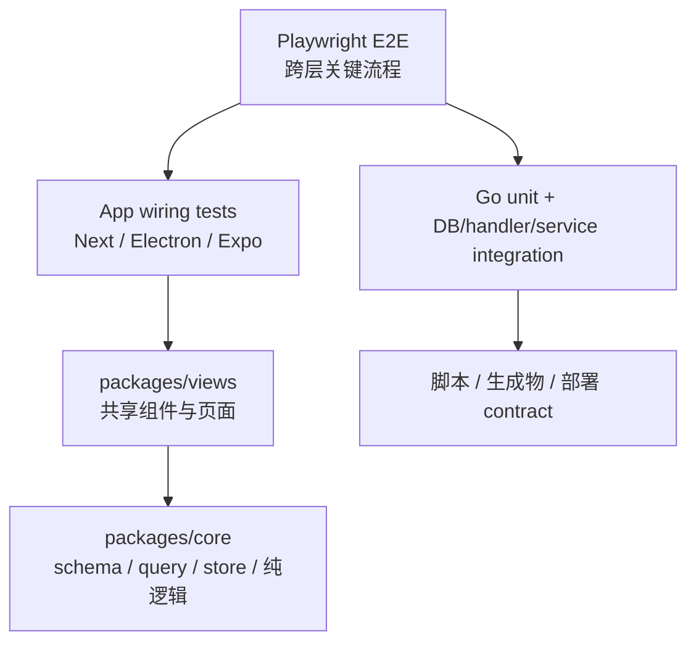

# 测试地图

测试跟随代码边界。一个产品行为只保留一个权威测试层：纯函数/边界矩阵不要再通过组件 DOM 重跑；组件测试覆盖 happy path、wiring、可访问性和命名回归；平台测试只覆盖平台 wiring。

以当前检出树粗略统计：Go `*_test.go` 约 1030 个，apps/packages 下 TS/TSX test/spec 文件约 779 个，Playwright E2E spec 21 个，根脚本级 shell/Node/PowerShell 测试约 14 个。数量会变化，定位应以路径与 package script 为准。

## 测试金字塔



## 按层放置

| 被测内容 | 权威位置 | 工具/环境 |
| --- | --- | --- |
| Go 纯函数、service、middleware | 被测 package 邻近 `*_test.go` | `go test` |
| Go DB query/handler | [server/internal/handler/](../../server/internal/handler/)、service/integration 邻近测试 | PostgreSQL + `internal/testutil` |
| API 路由/启动配置 | [server/cmd/server/*_test.go](../../server/cmd/server/) | Go 单元/集成 |
| API JSON schema、fallback、query/mutation/store | [packages/core/](../../packages/core/) 邻近 `*.test.ts(x)` | Vitest；纯逻辑优先 node |
| 共享业务组件/页面/表单/弹层 | [packages/views/](../../packages/views/) 邻近 `*.test.tsx` | Vitest + Testing Library/jsdom |
| 原子 UI/token/markdown primitive | [packages/ui/](../../packages/ui/) | Node test、token contract |
| Next cookie/redirect/search params/platform adapter | [apps/web/](../../apps/web/) | Vitest |
| Electron main/preload/router/platform wiring | [apps/desktop/](../../apps/desktop/) | Vitest |
| Mobile 纯 helper、API parsing、navigation helper | [apps/mobile/](../../apps/mobile/) | Vitest node；当前不做 RN component render |
| 跨 API/UI 用户流程 | [e2e/](../../e2e/) | Playwright Chromium |
| 安装/环境/生成物/Helm contract | [scripts/](../../scripts/) 与对应工作流 | bash、Node test、PowerShell |

## 前端规则

1. 不需要 DOM 的 `.test.ts` 应以 `// @vitest-environment node` 开头；若代码按 `window/document` 分支则不能错误地强制 node。
2. `packages/views` 测试不得 mock `next/*` 或 `react-router-dom`；共享组件通过 NavigationAdapter 测试。
3. Mock `@multica/core` Zustand store 时保持 callable-store 形状：selector function + `getState`。
4. API 调用 mock `@multica/core/api`。
5. schema/解析、状态机和边界矩阵放在 helper 旁；组件 suite 不重复全矩阵。
6. Mobile 的共享范围有限；移动端测试在 [apps/mobile/vitest.config.ts](../../apps/mobile/vitest.config.ts) 下独立运行。

各工作区命令：

| 范围 | 命令 |
| --- | --- |
| 根 Web/Desktop/Core/Views/UI | `pnpm test` |
| 单包 | `pnpm --filter @multica/core test`、`pnpm --filter @multica/views test` 等 |
| 单 Vitest 文件 | `pnpm --filter @multica/core exec vitest run path/to/file.test.ts` |
| Views 分片 | `pnpm --filter @multica/views test -- --shard=1/2` |
| Mobile | `pnpm --filter @multica/mobile test` |
| UI token | `pnpm --filter @multica/ui check:tokens` |

根 `pnpm test` 先检查 Office 生成资产，再通过 Turbo 运行除 Mobile 外的 workspace `test`；定义见 [package.json](../../package.json)。

## Go 测试规则

DB-backed handler 测试应使用 [server/internal/testutil/](../../server/internal/testutil/)：

- 通过 `dbfx.Issue`、`dbfx.Task`、`dbfx.Insert` 建 fixture，不要重复手写 `INSERT ... RETURNING` + cleanup。
- 通过 `testutil.Call(h, req).Want(status).JSON(&out)` 驱动 handler，不要重复 recorder/status/decode 模板。
- helper 负责插入和执行，不替测试断言产品规则。
- 若循环 case 的断言消息携带 helper 不知道的上下文，保留 case 内断言。

常用命令：

| 范围 | 命令 |
| --- | --- |
| 标准 Go suite（含 DB 准备、迁移、race） | `make test` |
| server 内窄测 | `(cd server && go test ./internal/handler -run 'TestName' -count=1)` |
| 全 Go package 编译/测试 | `(cd server && go test ./...)` |
| SQL 生成一致性 | `make sqlc && git diff --exit-code -- server/pkg/db/generated` |
| 真实 agent smoke | 仅显式授权后：`(cd server && MULTICA_RUN_REAL_AGENT_SMOKE=1 go test -tags=agentintegration ./pkg/agent -run '<test-name>' -count=1 -v)` |

默认测试绝不能解析/运行用户机器上的真实 agent CLI。测试应传入临时 fake executable 或明确不存在的路径；新增默认 agent 命令还要更新 [scripts/agent-cli-command-names.txt](../../scripts/agent-cli-command-names.txt)。

## E2E

[playwright.config.ts](../../playwright.config.ts) 使用：

- `testDir: ./e2e`
- Chromium、headless、单 worker、无 retry
- 单测超时 60 秒
- `PLAYWRIGHT_BASE_URL` → `FRONTEND_ORIGIN` → `http://localhost:3000`
- 不自动启动服务

E2E 覆盖认证、导航、Issues/table、comments、chat attachments、settings、Rooms、Twin、Wiki activation、Skill Evolution、Plugin surface/iframe security 等。测试数据通过 [e2e/fixtures.ts](../../e2e/fixtures.ts)、[e2e/helpers.ts](../../e2e/helpers.ts) 和 `TestApiClient` 准备/清理。

常用命令：

```bash
pnpm exec playwright test
pnpm exec playwright test e2e/issues.spec.ts
PLAYWRIGHT_RECORD_VIDEO=1 pnpm exec playwright test e2e/navigation.spec.ts
```

需要先用 `make up`/`make start` 启动目标环境，或直接运行会自行编排服务的 `make check`。

## 脚本与生成物测试

| Contract | 测试/命令 |
| --- | --- |
| 本地环境 registry/worktree DB | [scripts/dev-env.test.sh](../../scripts/dev-env.test.sh)、[scripts/worktree-db.test.sh](../../scripts/worktree-db.test.sh) |
| 自托管配置推导 | [scripts/selfhost-config.test.sh](../../scripts/selfhost-config.test.sh) |
| Go test wrapper/agent CLI guard | [scripts/test-go.test.sh](../../scripts/test-go.test.sh)、[scripts/go-test-with-agent-cli-guard.sh](../../scripts/go-test-with-agent-cli-guard.sh) |
| Docker entrypoint/信号 | [scripts/entrypoint.test.sh](../../scripts/entrypoint.test.sh) |
| Helm values | [scripts/helm-config.test.sh](../../scripts/helm-config.test.sh) |
| Installer | [scripts/install.test.sh](../../scripts/install.test.sh)、[scripts/install.ps1.test.ps1](../../scripts/install.ps1.test.ps1) |
| UI wildcard exports | [scripts/check-ui-wildcard-exports.test.sh](../../scripts/check-ui-wildcard-exports.test.sh) |
| Office 资产 | [scripts/check-office-assets.test.mjs](../../scripts/check-office-assets.test.mjs) |
| sqlc | `make sqlc` 后检查 generated diff |
| reserved slugs | `pnpm generate:reserved-slugs` 后检查 [reserved-slugs.ts](../../packages/core/paths/reserved-slugs.ts) |

## 完整本地检查

[scripts/check.sh](../../scripts/check.sh) 的顺序是：

1. 确认目标 PostgreSQL。
2. `pnpm typecheck`。
3. `pnpm test`。
4. 迁移后运行 Go tests。
5. 必要时启动 API/Web，运行 `pnpm exec playwright test`。

入口：

```bash
make check
```

`make check` 需要 `.env` 或 `.env.worktree`，且只停止它自己启动的服务。

## CI 门禁

主 CI 在 [.github/workflows/ci.yml](../../.github/workflows/ci.yml)：

| Job | 主要内容 |
| --- | --- |
| `changes` | 按路径决定 frontend/backend/sqlc/image 工作 |
| `sqlc-check` | 运行 `make sqlc` 并检查生成目录无 diff/未跟踪文件 |
| `frontend-build` | Node 22；build、typecheck、lint；自托管/worktree/生成物 contract |
| `frontend-test` | Web/Core/Desktop 测试 |
| `frontend-views-test` | `packages/views` 两分片 |
| `backend-tests` | Go 1.26.x、PostgreSQL 17 + pgvector、Redis 7；build、migration、race tests |
| `go-vulnerability-scan` | `go tool govulncheck ./...` |
| `windows-execenv` | Windows 进程树、argv/stdin、junction、checkout 等平台回归 |
| `image-budget` | PR 位图预算 |
| `installer` | Ubuntu/macOS shell installer 与 Windows PowerShell installer |

Mobile 独立走 [mobile-verify.yml](../../.github/workflows/mobile-verify.yml)，执行 `typecheck lint test --filter=@multica/mobile`。Desktop 安装包的 Linux/Windows 手动 smoke 在 [desktop-smoke.yml](../../.github/workflows/desktop-smoke.yml)。

## 去哪里改

| 新行为属于 | 测试位置 |
| --- | --- |
| 纯 schema/状态转换/query key/store | `packages/core/<domain>/*.test.ts` |
| 共享页面/组件 | `packages/views/<domain>/*.test.tsx` |
| Next/Electron/Expo wiring | 对应 app |
| API/service/SQL | 对应 Go package；DB 行为使用 `internal/testutil` |
| 完整用户旅程 | `e2e/*.spec.ts` |
| 环境/安装/生成物 contract | `scripts/*test*` + CI path filter |

## 相关页面

- [参考资料](index.md)
- [测试](../how-to-contribute/testing.md)
